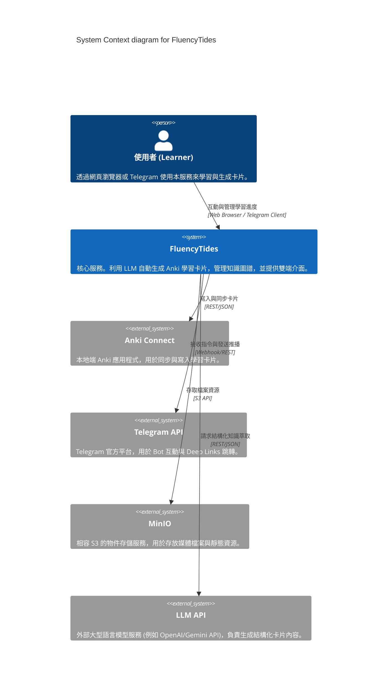
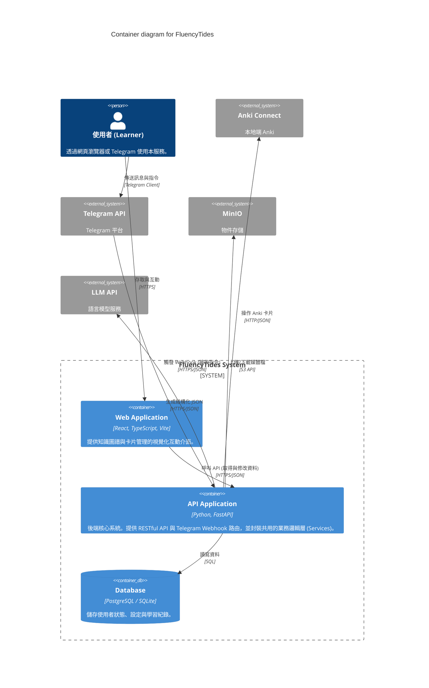
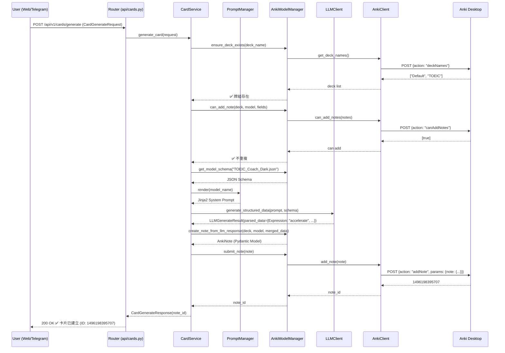
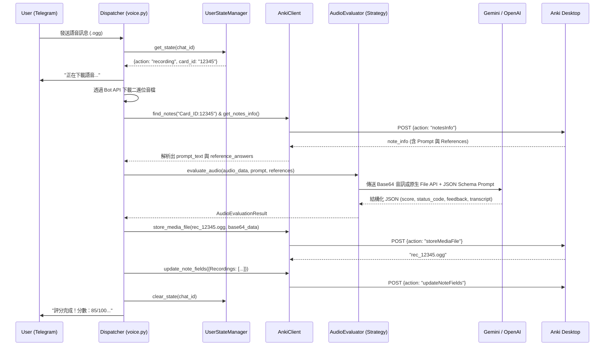

# Architecture and Structure

這份文件定義了 FluencyTides 的系統架構與初始目錄樹狀結構，嚴格遵守 Clean Architecture 與 Domain-Driven Design (DDD) 原則。

## 1. 系統上下文圖 (System Context Diagram)

此圖展示了 FluencyTides 與外部系統以及使用者的互動關係。



## 2. 容器圖 (Container Diagram)

此圖展示了 FluencyTides 內部的子系統劃分，特別凸顯出前後端的職責分離，以及 Web 與 Telegram 如何對接同一套核心服務。



## 3. 卡片生成流程時序圖 (Card Generation Sequence Diagram)

此圖展示了使用者輸入單字到卡片成功寫入 Anki 的完整資料流向。



## 4. Telegram 語音評分流程時序圖 (Audio Evaluation Sequence Diagram)

此圖展示了 `Speaking_Coach_Dark` 卡片中 Workflow B 的完整語音處理與評分流程。



## 5. 目錄結構與解耦設計 (Folder Structure)

為了實踐「Web 與 Telegram 雙端共用核心邏輯」，我們將 Controller 層（負責接收與回應）與 Service 層（負責業務邏輯）徹底分開。

```text
FluencyTides/
├── backend/                          # Python FastAPI 後端
│   ├── app/
│   │   ├── api/                      # [Controller] Web RESTful API 路由 (Routers)
│   │   │   ├── cards.py              # 卡片生成與模型/牌組列表端點
│   │   │   ├── storage.py            # MinIO 媒體存取端點
│   │   │   └── health.py             # Health Check 端點
│   │   ├── bot/                      # [Controller] Telegram Webhook/Polling 處理器
│   │   │   ├── handlers/             # Bot 指令與訊息接收
│   │   │   │   ├── commands.py       # /start, /help 與 Deep Link 處理
│   │   │   │   ├── messages.py       # 單字輸入與卡片生成處理
│   │   │   │   └── voice.py          # 語音接收與評分流程
│   │   │   ├── dependencies.py       # aiogram 白名單與 Service 注入中介層
│   │   │   ├── dispatcher.py         # aiogram Dispatcher 與 Bot 初始化
│   │   │   └── state.py              # In-Memory 使用者狀態機
│   │   ├── core/
│   │   │   ├── auth.py               # API 金鑰認證機制
│   │   │   ├── config.py             # Pydantic V2 Settings (全環境變數集中管理)
│   │   │   ├── dependencies.py       # 依賴注入工廠 (DI Container)
│   │   │   └── exceptions.py         # 全域異常類別階層 (FluencyTidesError)
│   │   ├── domain/                   # [DDD] 領域模型 (Entities, Value Objects)
│   │   ├── services/                 # [Use Case] 核心業務邏輯
│   │   │   ├── prompts/              # Jinja2 Prompt 模板目錄 (*.j2)
│   │   │   ├── anki_model_manager.py # 模型管理、Schema 讀取、防重複檢查
│   │   │   ├── card_service.py       # 卡片生成流程 (LLM → 組裝 → 提交)
│   │   │   ├── prompt_manager.py     # Jinja2 Prompt 模板管理器
│   │   │   └── storage_service.py    # MinIO 物件存儲業務邏輯
│   │   ├── infrastructure/           # 基礎設施實作 (外部服務客戶端)
│   │   │   ├── anki/
│   │   │   │   └── client.py         # 非同步 AnkiConnect v6 完整 CRUD 客戶端
│   │   │   ├── audio_evaluator/      # 語音評分器 (策略模式)
│   │   │   │   ├── base.py           # 抽象基底類別
│   │   │   │   ├── factory.py        # 根據環境變數建立對應的 Evaluator
│   │   │   │   ├── gemini_client.py  # Google 原生 SDK 實作
│   │   │   │   └── openai_client.py  # OpenAI 相容層實作
│   │   │   ├── database/             # 非同步 ORM 資料庫持久化
│   │   │   │   ├── conventions.py    # MetaData 顯式約束命名規範 (MySQL 相容)
│   │   │   │   ├── database.py       # AsyncEngine、Session 工廠、建表/釋放
│   │   │   │   └── models.py         # SQLModel Table Models (CardRelation)
│   │   │   ├── ffmpeg/               # FFmpeg 音訊/影片處理 (獨立子套件)
│   │   │   │   └── ffmpeg_merger.py  # 非同步音訊拼接 (filter_complex concat)
│   │   │   ├── llm/
│   │   │   │   └── client.py         # LLM 結構化輸出客戶端 (OpenAI 相容)
│   │   │   ├── storage/
│   │   │   │   └── minio_client.py   # MinIO 非同步物件存儲客戶端 (完整 CRUD)
│   │   │   └── voice/
│   │   │       └── voicepeak_runner.py # VOICEPEAK 非同步語音合成 (含環境隔離)
│   │   ├── schemas/
│   │   │   ├── anki.py               # Pydantic V2 驗證模型 (Note, Model, Media)
│   │   │   ├── card.py               # 卡片生成 API 請求/回應模型
│   │   │   ├── llm.py                # LLM 內部資料傳遞模型
│   │   │   ├── relation.py           # 卡片關聯 API 請求/回應模型 (DTO)
│   │   │   ├── speaking.py           # Speaking_Coach_Dark 專屬結構 (RecordingItem 等)
│   │   │   ├── storage.py            # MinIO 內部資料傳遞模型
│   │   │   ├── storage_api.py        # 媒體存取 API 請求/回應模型
│   │   │   └── voice.py              # Pydantic V2 驗證模型 (Voicepeak/FFmpeg)

│   │   ├── anki_models/              # Anki 筆記類型模板 (9 套完整模板)
│   │   │   ├── TOEIC_Coach_Dark.json / _front.html / _back.html / _style.css
│   │   │   ├── Conversation_Coach_Dark.json / ...
│   │   │   ├── Contrast_Coach_Dark.json / ...
│   │   │   ├── Voice_Shadowing_Dark.json / ...
│   │   │   ├── Shadowing_Breakdown_Dark.json / ...
│   │   │   ├── Speaking_Coach_Dark.json / ...
│   │   │   ├── AI_QA_Dark.json / ...
│   │   │   ├── Notion_SRS_Dark.json / ...
│   │   │   └── TOEIC_Coach_Dark_v2.json / ...
│   │   └── main.py                   # FastAPI 進入點
│   ├── .env.example                  # 環境變數配置範例
│   ├── tests/                        # 測試案例
│   └── requirements.txt              # Python 依賴管理
│
├── frontend/                         # React + Vite 前端 (Tailwind CSS v4)
│   ├── src/
│   │   ├── lib/
│   │   │   └── utils.ts              # cn() 工具函數 (clsx + tailwind-merge)
│   │   ├── components/               # UI 組件庫 (shadcn/ui 及共用組件)
│   │   ├── index.css                 # Tailwind v4 + shadcn/ui CSS Variables
│   │   ├── main.tsx                  # React 進入點
│   │   └── App.tsx                   # 主頁面 (含 Health Check 狀態)
│   ├── components.json               # shadcn/ui 配置
│   ├── package.json                  # NPM 依賴
│   └── vite.config.ts                # Vite 配置 (含 API Proxy)
│
├── .github/workflows/
│   └── main.yml                      # CI/CD (Ruff Lint + TS Build)
│
└── docs/                             # 專案架構與開發文件
    └── adr/                          # 架構決策記錄 (Architecture Decision Records)
```

**解耦設計說明：**
- `backend/app/api/` (Web) 與 `backend/app/bot/` (Telegram) 內部的程式碼**絕對不能**直接寫入資料庫或呼叫外部 API。
- 它們的職責僅限於：接收請求 -> 透過 `schemas/` 驗證資料 -> 呼叫 `services/` -> 回傳格式化的回應。
- 所有真正的卡片生成、知識萃取、Anki 同步邏輯，全部實作於 `backend/app/services/` 中。
