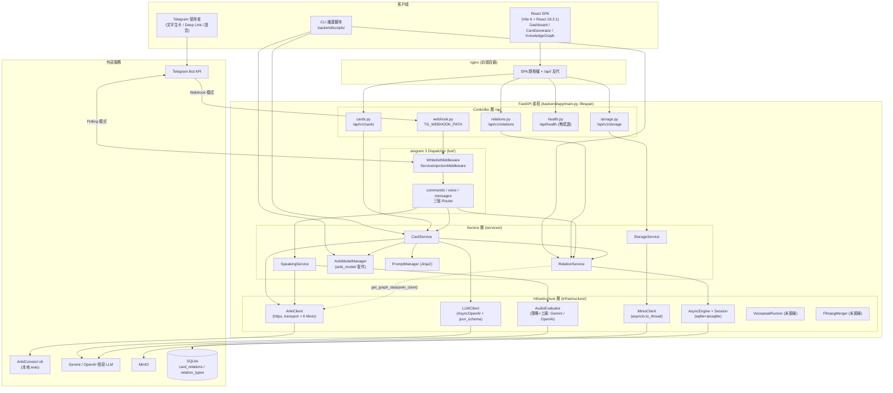
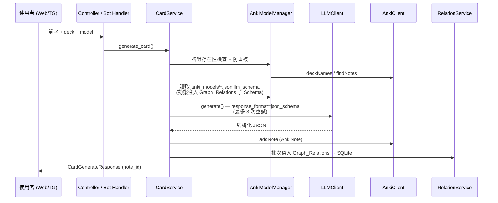

# FluencyTides 項目總覽與現狀評估

本文檔是 FluencyTides 項目的整體概覽與健康度評估，涵蓋項目定位、實際技術棧、系統架構、目錄結構，以及基於全項目代碼審查的風險總評。文中所有論斷均以當前代碼庫實際狀態為準（而非文檔宣稱的理想狀態），引用位置一律採 `路徑:行號` 格式。

> 產生日期：2026-07-07（由 Claude Code 全項目審查產生）
> 最後更新：2026-07-11（第四輪：遺留項收尾——CI 接入測試、F023/F096 完全修復、webhook 原子性，四輪累計 134/141，見 [12_Implementation_Log.md](12_Implementation_Log.md) §9）
> 前次更新：2026-07-09（第三輪：結構與測試現狀同步——空殼 scaffold 已清理、測試基線已建立、目錄樹與死代碼/風險敘述已更新）

---

## 1. 項目定位與功能總覽

FluencyTides 是一套**個人語言學習自動化系統**，核心思路是把「LLM 內容生成 → Anki 間隔重複記憶 → 語音影子跟讀評測」串成閉環。系統以 FastAPI 為中樞，同時服務三類客戶端：React Web 前端、Telegram Bot、CLI 維運腳本。

### 1.1 三大核心功能

| 功能 | 說明 | 主要入口 |
|---|---|---|
| **LLM 生成 Anki 卡片** | 使用者輸入單字/句子，後端依所選模型（`backend/app/anki_models/*.json` 共 9 種模型定義）讀取 LLM Schema 與 Jinja2 System Prompt（`backend/app/services/prompts/*.j2`），呼叫 OpenAI 相容 LLM（實務上為 Gemini 相容層）取得結構化 JSON，經 AnkiConnect 寫入本地 Anki | Web `POST /api/v1/cards/generate`（`backend/app/api/cards.py`）；Telegram 任意文字訊息（`backend/app/bot/handlers/messages.py`）；CLI 批次腳本（`backend/scripts/import_cards_with_llm.py`） |
| **知識圖譜** | LLM 生成卡片時同步輸出 `Graph_Relations` 關聯，寫入 SQLite 的 `card_relations` / `relation_types` 兩張表（`backend/app/infrastructure/database/models.py`）；前端以 react-force-graph-2d 力導向圖呈現，支援連線模式建立/刪除關聯、卡片詳情編輯 | `GET /api/v1/relations/graph`（`backend/app/api/relations.py`）；前端 `frontend/src/pages/KnowledgeGraph.tsx`（459 行，全前端最複雜元件） |
| **Telegram Bot 語音影子跟讀評測** | 卡片內嵌 Deep Link（`rec_` 前綴），使用者點擊後進入錄音狀態（in-memory 狀態機 `backend/app/bot/state.py`），傳送語音後由 AudioEvaluator（Gemini 原生或 OpenAI 相容，策略+工廠模式）進行 AI 評分，結果寫回 Anki 卡片的 Recordings 欄位 | `backend/app/bot/handlers/voice.py` → `SpeakingService.process_voice_evaluation`（`backend/app/services/speaking_service.py`，2026-07-08 自 CardService 拆出） |

### 1.2 輔助能力

- **MinIO 媒體存儲**：`/api/v1/storage` 提供上傳/列表/刪除與預簽名 URL（`backend/app/api/storage.py`），但**尚未接入生卡流程**。
- **VOICEPEAK 語音合成與 FFmpeg 音檔拼接**：`backend/app/infrastructure/voice/voicepeak_runner.py` 與 `backend/app/infrastructure/ffmpeg/ffmpeg_merger.py` 已實作但**目前無任何呼叫者**，屬於從舊專案遷移後尚未接線的模組。
- **CLI 維運腳本**：JSON 批次匯入（`backend/scripts/import_cards_from_json.py`）、LLM 批次生成（`backend/scripts/import_cards_with_llm.py`）、TG Deep Link 批次更新（`backend/scripts/update_tg_bot_links.py`），均直接重用 app 層 Service。

### 1.3 運行形態

單一 FastAPI 進程承載 Web API 與 Telegram Bot（「寄生」架構）：`backend/app/main.py` 的 lifespan 依 `TG_WEBHOOK_DOMAIN` 是否設定，選擇 Webhook 模式（`backend/app/main.py:134` 呼叫 `set_webhook`，由 `backend/app/api/webhook.py` 端點接收更新）或 Long Polling 模式（`backend/app/main.py:155` 以 `asyncio.create_task` 背景執行）。部署目標為家用伺服器（CasaOS + Portainer），CI 推送 GHCR 多架構映像後經 webhook 自動重新部署。

---

## 2. 技術棧一覽表

以下版本均經 `backend/requirements.txt` 與 `frontend/package.json` / `package-lock.json` 核實。注意：**後端依賴全部使用 `>=` 範圍且未鎖版本**，下表為宣告的最低版本；前端另列 lock 檔實際解析版本。

### 2.1 後端（Python 3.11，`backend/requirements.txt`）

| 類別 | 套件 | 宣告版本 | 用途 |
|---|---|---|---|
| Web 框架 | fastapi | >=0.100.0 | API 中樞，lifespan 管理所有 Singleton |
| | uvicorn[standard] | >=0.23.0 | ASGI 伺服器 |
| | python-multipart | >=0.0.6 | 檔案上傳表單解析 |
| 驗證/設定 | pydantic | >=2.0.0 | 全面 v2 語法（model_config、ConfigDict） |
| | pydantic-settings | >=2.0.0 | `backend/app/core/config.py` 集中設定管理 |
| | python-dotenv | >=1.0.0 | .env 載入 |
| 資料庫 | sqlmodel | >=0.0.22 | ORM（SQLAlchemy 2.0 async 風格） |
| | aiosqlite | >=0.20.0 | SQLite async 驅動 |
| | alembic | >=1.13.0 | 遷移（實際 schema 管理以 create_all 為主，見 5.2 F009） |
| AI 整合 | httpx | >=0.24.0 | AnkiConnect 客戶端連線池 |
| | openai | >=1.30.0 | AsyncOpenAI（LLM 生卡 + OpenAI 語音評測供應商） |
| | google-genai | >=0.2.0 | Gemini 原生語音評測（預設供應商） |
| | jinja2 | >=3.1.0 | System Prompt 模板（StrictUndefined） |
| 外部服務 | minio | >=7.2.0 | 媒體存儲（asyncio.to_thread 包裝同步 SDK） |
| | aiogram | >=3.4.0 | Telegram Bot（純 aiogram 3 寫法） |

### 2.2 前端（`frontend/package.json`，括號內為 package-lock 實際解析版本）

| 類別 | 套件 | 宣告 / 實際版本 | 用途 |
|---|---|---|---|
| 核心框架 | react / react-dom | ^18.3.1（18.3.1） | 注意：實際為 React 18.3.1，並非部分項目描述所稱的 React 19 |
| 建置 | vite | ^6.0.3（6.4.3） | 開發伺服器 + 建置，`/api` 代理至 127.0.0.1:8000 |
| | typescript | ~5.6.2（5.6.3） | strict 模式（原 KnowledgeGraph 的大量 `any` 繞過已於 2026-07-08 清零） |
| 樣式 | tailwindcss + @tailwindcss/vite | ^4.0.0（4.3.0） | Tailwind v4，`index.css` 以 `@theme inline` 映射 shadcn 風格 HSL 變數 |
| 資料層 | @tanstack/react-query | ^5.0.0（5.100.14） | 伺服器狀態管理（v5 isPending 現行用法） |
| | axios | ^1.7.2（1.16.1） | 單一 instance，response interceptor 解包 `response.data` |
| 路由 | react-router-dom | ^6.20.0（6.30.4) | BrowserRouter，三條路由 |
| 視覺化 | react-force-graph-2d | ^1.25.4（1.29.1） | 知識圖譜力導向圖 |
| UI | lucide-react / sonner / @radix-ui/react-slot / cva / clsx / tailwind-merge | — | 手動拷貝的 shadcn/ui 元件體系 |
| Lint | eslint | ^9.17.0（9.39.4） | ✅ 第三輪補上 `eslint.config.js`（flat config），`npm run lint` 恢復可用（F054） |

### 2.3 基礎設施與外部服務

| 項目 | 技術 | 位置 |
|---|---|---|
| 資料庫 | SQLite（sqlite+aiosqlite），為 MySQL 遷移預留命名規範 | `backend/app/infrastructure/database/` |
| 卡片後端 | AnkiConnect v6 JSON-RPC（httpx 連線池，支援 Cloudflare Access header） | `backend/app/infrastructure/anki/`（2026-07-08 拆分：transport + 六個領域 Mixin，client.py 為組合類） |
| 對象存儲 | MinIO | `backend/app/infrastructure/storage/minio_client.py` |
| CI/CD | GitHub Actions → GHCR（amd64+arm64）→ Cloudflare Access → Portainer webhook | `.github/workflows/main.yml` |
| 容器 | 後端 python:3.11-slim（非 root apiuser）；前端 node:20-alpine 建置 + nginx:alpine | `backend/Dockerfile`、`frontend/Dockerfile` |
| 反向代理 | nginx：SPA try_files + `/api/` 反代 `fluencytides-backend:8000` | `frontend/nginx.conf` |

---

## 3. 系統架構圖

整體為 Controller → Service → Infrastructure 三層架構，Web API 與 Telegram Bot 共用同一層 Service（依賴注入分兩套：Web 端 `backend/app/core/dependencies.py`，Bot 端 `backend/app/bot/dependencies.py` 的 middleware）。



卡片生成資料流（Workflow A）：



---

## 4. 目錄結構說明

以下為**第三輪重構後**的實際目錄結構（經 `find` 核實）。與 `docs/01_Architecture_and_Structure.md` 中落後 3-4 個 Phase 的目錄樹、以及 `README.md` 中完全虛構的 Flask 目錄樹均不同。第三輪已刪除 `backend/` 根目錄的 `api/ core/ models/ services/ utils/` 五個空殼與 `app/domain/`（F115），並新增 `backend/tests/`、`frontend/tests/` 測試基線（F063/F126）。每個主要節點後附一句模組職責註解。

### 4.1 後端目錄樹（`backend/`）

```
backend/
├── Dockerfile                 # python:3.11-slim 兩階段建置，非 root apiuser 執行
├── docker-compose.yml         # named volume 掛載 /app/data、加入 fluencytides_net（第二輪修 F003/F012）
├── .env.example               # 環境變數樣板（DATABASE_URL 已改四斜線絕對路徑指向掛載卷）
├── alembic.ini                # Alembic 設定（URL 由 env.py 從 Settings 動態注入）
├── requirements.txt           # 執行期依賴（fastapi/sqlmodel/aiogram/openai/google-genai 等，全 >= 範圍）
├── requirements-dev.txt       # 第三輪新增：pytest / pytest-asyncio / httpx 等測試依賴
├── pytest.ini                 # 第三輪新增：pytest 設定（asyncio_mode、testpaths）
├── alembic/
│   ├── env.py                 # async 遷移環境，URL 由 Settings 動態注入
│   └── versions/
│       ├── 7f3d1a2b4c5e_baseline_create_card_relations.py  # 第二輪新增 baseline，建 card_relations 表，全新環境可獨立 upgrade（F009）
│       └── 9bbc72f7c470_add_relation_types_table.py        # 建 relation_types 表並回填
├── scripts/                   # CLI 維運腳本，直接重用 app 層 Service
│   ├── _bootstrap.py          # 共用引導：解析 --db-url、設 sys.path、初始化 Settings
│   ├── import_cards_from_json.py   # 由 JSON 批次匯入卡片
│   ├── import_cards_with_llm.py    # 呼叫 LLM 批次生成卡片
│   ├── update_tg_bot_links.py      # 批次更新 Anki 卡片內的 TG Deep Link
│   └── samples/               # 匯入用範例 JSON
├── tests/                     # 第三輪新增：48 個 pytest 全綠，CI 前置關卡（F063）
│   ├── conftest.py           # 共用 fixture（TestClient、暫存 SQLite、Settings 覆寫）
│   ├── test_api_smoke.py     # /api/health、/cards/models、/relations/graph 端到端 smoke
│   ├── test_config.py        # Settings 與 fail-closed validator（生產模式密鑰為空即拒絕）
│   ├── test_anki_escape.py   # anki/utils.escape_anki_search_value 跳脫正確性
│   ├── test_relation_sync.py # sync_with_anki 空集合防護（F002 回歸鎖）
│   ├── test_llm_client.py    # LLMClient json_schema 與重試邏輯
│   ├── test_schema_composer.py     # schema_composer 純函數組裝
│   └── test_alembic.py       # baseline→head 遷移可獨立執行
└── app/
    ├── main.py               # 進入點：lifespan 管理全部 Singleton 與 Bot 啟停（Webhook / Polling 二擇一）
    ├── __init__.py
    ├── core/                 # 跨切面基礎設施
    │   ├── config.py         # pydantic-settings 集中設定 + is_production + fail-closed validator
    │   ├── auth.py           # verify_api_key（生產模式強制 X-API-Key）
    │   ├── dependencies.py   # Web 端 DI 工廠（Singleton 取用、None 時 raise 503）
    │   └── exceptions.py     # FluencyTidesError 家族 + 全域 handler
    ├── api/                  # Controller 層：五個 APIRouter
    │   ├── cards.py          # /api/v1/cards：生卡 / 模型清單 / 牌組 / 卡片 CRUD
    │   ├── relations.py      # /api/v1/relations：圖譜查詢 / 建立 / 刪除 / 類型 / sync
    │   ├── storage.py        # /api/v1/storage：MinIO 上傳 / 列表 / 刪除 / 預簽名 URL
    │   ├── health.py         # /api/health：無認證健康檢查
    │   └── webhook.py        # TG_WEBHOOK_PATH：接收 Telegram Update（secret token 驗證）
    ├── schemas/              # Pydantic v2 request/response 模型
    │   ├── card.py           # 生卡請求 / 回應 / 卡片詳情
    │   ├── anki.py           # AnkiNote / AnkiModelInfo / AnkiDeckInfo 等
    │   ├── relation.py       # 圖譜節點 / 連線 / 關聯類型
    │   ├── speaking.py       # 語音評測輸入 / 結果
    │   ├── voice.py          # 語音狀態機相關
    │   ├── llm.py            # LLM 生成契約
    │   ├── deep_link.py      # Deep Link 解析結果
    │   ├── storage.py / storage_api.py  # MinIO 內部 / API 層 DTO
    │   └── common.py         # ErrorResponse（第一輪新增；第三輪清掉多個死 schema）
    ├── anki_models/          # 9 種 Anki 模型定義（各含 .json llm_schema + front/back HTML + CSS）
    ├── services/             # Service 層（Web 與 Bot 共用）
    │   ├── card_service.py       # CardService：生卡編排（模型檢查→LLM→addNote→寫關聯）
    │   ├── speaking_service.py   # SpeakingService：語音影子跟讀評測（第二輪自 CardService 拆出）
    │   ├── relation_service.py   # RelationService：card_relations CRUD + get_graph_data + sync
    │   ├── storage_service.py    # StorageService：包裝 MinioClient
    │   ├── prompt_manager.py     # PromptManager：Jinja2 System Prompt 載入（StrictUndefined）
    │   ├── schema_composer.py    # 純函數：動態注入 Graph_Relations 子 Schema
    │   ├── anki_model_manager.py # 相容 shim：re-export anki_model 套件（第一輪拆分後保留）
    │   ├── anki_model/           # AnkiModelManager 拆分後套件（第一輪拆分）
    │   │   ├── repository.py     #   檔案 IO + 快取，讀取 anki_models/*.json
    │   │   ├── manager.py        #   對外門面：list_available_models / 取模型
    │   │   ├── note_builder.py   #   將 LLM JSON 組裝為 AnkiNote 欄位
    │   │   └── __init__.py
    │   └── prompts/              # 5 個 Jinja2 System Prompt 模板（*.j2）
    └── infrastructure/          # Infrastructure 層：外部系統適配
        ├── anki/                # AnkiConnect 客戶端（第一輪拆 transport + 6 領域 Mixin）
        │   ├── client.py        #   AnkiClient 組合類（繼承六個 Mixin）
        │   ├── transport.py     #   httpx 連線池 + JSON-RPC 傳輸（含 Cloudflare Access header）
        │   ├── notes.py / cards.py / decks.py / media.py / models.py / misc.py  # 六個領域 Mixin
        │   ├── utils.py         #   escape_anki_search_value（第二輪 F071 群，防搜尋語法注入）
        │   └── __init__.py
        ├── audio_evaluator/     # 語音評測（策略 + 工廠）
        │   ├── base.py          #   AudioEvaluator ABC
        │   ├── factory.py       #   依設定選 Gemini / OpenAI 供應商
        │   ├── gemini_client.py #   Gemini 原生（預設供應商）
        │   ├── openai_client.py #   OpenAI 相容（含 ffmpeg 轉碼 wav）
        │   ├── prompts.py       #   評測 prompt 常數（第一輪自 client 抽出）
        │   └── __init__.py
        ├── database/            # SQLite 資料層
        │   ├── database.py      #   AsyncEngine + Session + create_all
        │   ├── models.py        #   card_relations / relation_types SQLModel
        │   ├── conventions.py   #   命名規範（為 MySQL 遷移預留）
        │   └── __init__.py
        ├── llm/client.py        # LLMClient：AsyncOpenAI + response_format=json_schema
        ├── storage/minio_client.py     # MinioClient：asyncio.to_thread 包裝同步 SDK
        ├── voice/voicepeak_runner.py   # VoicepeakRunner：VOICEPEAK 合成（目前無呼叫者）
        └── ffmpeg/ffmpeg_merger.py     # FfmpegMerger：音檔拼接（目前無呼叫者）
```

### 4.2 前端目錄樹（`frontend/`）

```
frontend/
├── Dockerfile                 # node:20-alpine 建置 + nginx:alpine 兩階段
├── docker-compose.yml         # 主機 8080→容器 80，加入 fluencytides_net
├── nginx.conf                 # SPA try_files + /api/ 反代（動態 DNS + proxy_read_timeout 300s）
├── eslint.config.js           # 第三輪新增：ESLint 9 flat config，恢復 npm run lint（F054）
├── vite.config.ts             # Vite 設定（port 5173、/api proxy、@ alias）；.js/.d.ts 產物已於第二輪 git rm（F010）
├── vitest.config.ts           # 第三輪新增：vitest 設定（jsdom / testpaths tests/）
├── tsconfig.json / tsconfig.node.json    # TS 專案參照設定
├── components.json            # shadcn/ui CLI 設定
├── package.json               # 依賴與 scripts（dev/build/lint/test/preview）
├── public/favicon.svg         # 第三輪新增：修 favicon 404（F122）
├── tests/                     # 第三輪新增：11 個 vitest（F126）
│   ├── apiError.test.ts       #   ApiError 封裝與 interceptor 錯誤映射
│   ├── useLocalStorage.test.ts#   functional update + 跨 tab 同步 + JSON 防護
│   └── utils.test.ts          #   cn() 合併行為
└── src/
    ├── main.tsx               # createRoot + QueryClientProvider + BrowserRouter
    ├── App.tsx                # 固定側欄佈局 + 三條路由 + 行動版漢堡選單 + Toaster
    ├── index.css              # Tailwind v4 @theme + shadcn HSL 變數（含 .dark）
    ├── vite-env.d.ts          # VITE_* 環境變數型別宣告
    ├── api/client.ts          # 單一 axios instance + FluencyTidesAPI，含 ApiError 類（F124）
    ├── types/api.ts           # 手寫對齊後端 Pydantic；含 GraphNode/RuntimeGraphNode/RuntimeGraphLink（F057）
    ├── pages/
    │   ├── Dashboard.tsx      # 後端健康檢查儀表板
    │   ├── CardGenerator.tsx  # LLM 卡片生成表單
    │   └── KnowledgeGraph.tsx # 力導向知識圖譜與關聯管理（全前端最複雜元件）
    ├── components/
    │   ├── CardDetailModal.tsx# 卡片欄位編輯 / 刪除 Modal
    │   └── ui/                # 手拷 shadcn/ui：button / card / input / select / skeleton / sonner
    │                         #   （select.tsx 第一輪新增，F123）
    ├── hooks/useLocalStorage.ts    # localStorage 持久化 hook（含跨 tab 同步）
    └── lib/utils.ts           # cn() = clsx + tailwind-merge
```

值得註記的結構性事實：

- 第三輪（F115）已刪除 `backend/` 根目錄的 `api/ core/ models/ services/ utils/` 五個空殼與 `app/domain/`——這些原僅含空 `__init__.py`、無任何引用，是與過時 README 對應的 scaffold 殘留，現已不存在於樹中。
- **測試基礎設施已於第三輪建立**：後端 `backend/tests/`（48 個 pytest 全綠，涵蓋 API smoke、config fail-closed、Anki 跳脫、relation sync 空集合防護、Alembic 遷移）、前端 `frontend/tests/`（11 個 vitest，涵蓋 ApiError、useLocalStorage、utils），並接入 CI 作為前置關卡（F063/F126）。`docs/02` 原「基礎單元測試」虛報項現已對齊實況。
- 代碼基底整體相當現代化：無 `@app.on_event`、無 Pydantic v1 遺留、無 `datetime.utcnow()`、無 aiogram 2.x、資料庫為 SQLAlchemy 2.0 風格、前端為 `createRoot` + react-query v5 現行寫法，同步 SDK 的 async 適配（`asyncio.to_thread` / `create_subprocess_exec`）大致正確。

---

## 5. 項目健康度總評

### 5.1 問題統計

本次全項目審查（backend-core / backend-api / backend-services / backend-infra-data / backend-infra-ai / backend-bot / backend-scripts / frontend / devops / deprecated-sweep / docs-consistency 共 11 個子系統維度）合併去重後共發現 **141 條問題**（完整清單見 [06_Issues_and_Risks.md](06_Issues_and_Risks.md)）：

| 嚴重度 | 數量 | 其中已修復（2026-07-08） |
|---|---:|---:|
| Critical | 3 | 1（F001） |
| High | 12 | 0 |
| Medium | 50 | 9 |
| Low | 76 | 23 |
| **合計** | **141** | **33** |

> **2026-07-08 更新**：第一輪重構（巨型模組拆分 + 設計偏離修正）已完成，**141 條發現中 33 條已修復**（1 critical + 9 medium + 23 low，含 critical 的 F001；另 F096 部分完成），淨刪除 1,291 行，後端 25 處 `# type: ignore` 與前端 15 處 `any` 全數歸零。詳見 [10_Implementation_Log.md](10_Implementation_Log.md)。
>
> **2026-07-09 更新（第二輪：階段 0-2 修復 + 回歸驗證）**：第二輪處理了 [09_Action_Plan.md](09_Action_Plan.md) 的階段 0（止血）、階段 1（安全加固）、階段 2（穩定性），並針對兩輪多代理修改交互做了三方對抗式回歸審查與**首次真實環境 runtime 驗證**。本輪修復 41 條原始發現並修復回歸審查揪出的 10 個新 bug（不在原始 141 之列），**與第一輪合計已修復 72 / 141 條**（第一輪 31 + 第二輪 41，另 2 部分修復、5 暫緩）。關鍵成果：
>
> - **§5.2 最關鍵五個風險 F001–F005 均已修復**：F001（`/cards/models` 500）第一輪修方法簽名、本輪 runtime 實測回 200；F002（`/sync` 空集合清空關聯表）加空列表防護；F003+F012+F009（部署資料遺失三重缺陷）以 named volume + baseline 遷移 `7f3d1a2b4c5e` 解決；F004+F005（認證 fail-open）改為 fail-closed。
> - **安全模型從 fail-open 改為 fail-closed（僅生產模式）**：新增 `ENVIRONMENT` 設定與 `is_production`，生產模式下 `API_SECRET_KEY` 或 Webhook `TG_WEBHOOK_SECRET` 為空一律在啟動時拒絕（或 webhook 端點 403）；**開發模式行為完全不變**。
> - **已有臨時 runtime 驗證**：本輪建立 Python 3.11 venv + 完整依賴，透過 `TestClient` 端到端驗證了啟動生命週期、`/api/health`、`/cards/models`、`/relations/graph`、Alembic baseline 遷移、fail-closed validator 與 Anki 查詢跳脫——這是專案首次有超越 `py_compile` 的執行期佐證（但尚未沉澱為 repo 內自動化測試，F063 仍待處理）。詳見 [11_Implementation_Log.md](11_Implementation_Log.md)。
>
> **2026-07-09 更新（第三輪：測試基線 + CI/CD + 死代碼清理 + 文檔對齊）**：第三輪處理 [09_Action_Plan.md](09_Action_Plan.md) 的階段 3（測試與 CI/CD）、階段 4（死代碼清理）、階段 6（文檔同步），由 6 個並行代理按嚴格檔案所有權分區執行。**三輪累計已修復 132 / 141 條**（第一輪 31 + 第二輪 41 + 第三輪 60），另 2 部分修復（F023、F096）、5 暫緩（F072/F075/F093/F099/F101）、1 未處理（F042）、F105 保留為活代碼。關鍵成果：
>
> - **測試防護網落地（F063 / F126）**：新增 `backend/tests/`（48 個 pytest 全綠）與 `frontend/tests/`（11 個 vitest），並接入 CI 作為前置關卡，杜絕 F001 類「方法定義被誤刪」回歸。
> - **死代碼清理（F115）**：刪除 `backend/` 根目錄 `api/ core/ models/ services/ utils/` 五個空殼與 `app/domain/`，以及 `schemas/` 內多個未引用的死 schema。
> - **前端工程化補齊**：`eslint.config.js`（F054 恢復 lint）、`vitest.config.ts` 測試基線、`public/favicon.svg`（F122）。
> - **文檔對齊**：本文 §4 目錄樹、§5 死代碼/風險/優先序敘述已更新至第三輪現狀。詳見 [12_Implementation_Log.md](12_Implementation_Log.md)。
>
> **2026-07-11 更新（第四輪：遺留項收尾）**：**四輪累計已修復 134 / 141 條**（第三輪的 F023、F096 兩條部分修復本輪升級為完全修復），另 5 暫緩（F072/F075/F093/F099/F101）、1 未處理（F042，需產品決策）、F105 保留為活代碼——**0 條部分修復**。關鍵成果：
> - **CI 接入測試（F063 最後一哩）**：`.github/workflows/main.yml` 的 backend-lint-test 加 pytest、frontend-build 加 vitest，測試失敗即擋下 docker 建構/部署，測試防線真正生效。
> - **F023 完全修復**：graph 端點加類別層級 TTL(30s) 快取 + 寫入路徑主動失效。
> - **F096 完全修復**：新增 `AnkiCardInfo` 回應模型、`get_cards_info` 型別化，並連帶修 `anki_model/manager.py` 的 isinstance 回歸。
> - **webhook 錄音持久化**：`_persist_recording` 改 best-effort 原子（先算後存 + 失敗補償刪孤兒 media + 重試冪等）。詳見 [12_Implementation_Log.md](12_Implementation_Log.md) §9。

整體評價：**架構設計優於工程紀律**。三層分層、依賴注入、Pydantic 合約、lifespan Singleton、策略/工廠模式等設計均正確落地且無廢棄 API 債務。專案原本最大的工程缺口——缺乏測試防護網（正是「方法定義被誤刪」的 F001 直接進入 main 的原因）與部署層資料遺失風險——已分別於第三輪建立 `backend/tests` + `frontend/tests`、第四輪接入 CI 作為部署前置，並於第二輪以 named volume + baseline 遷移解決部署層風險。文檔已全面對齊：`docs/` 系列、`docs/03`、`docs/04`、ADR 與根目錄 README（第三輪已重寫為實際 FastAPI 架構，F015）均可信。

### 5.2 最關鍵的五個風險

#### 風險一（Critical，✅ 已於 2026-07-08 修復）：`GET /api/v1/cards/models` 端點必然 500 — 方法定義遭破壞

`backend/app/services/card_service.py:488-495` 殘留一段游離的 docstring 與 `return self._model_manager.list_available_models()`，位於 `process_voice_evaluation` 結尾 `raise`（`card_service.py:487`）之後——這原本是 `list_available_models` 方法的內容，但其 `def` 簽名行在插入 `process_voice_evaluation` 時被誤刪（git 歷史確認自 commit 8a4c272 起即已損壞）。`CardService` 類別上已不存在該屬性，而 `backend/app/api/cards.py:94` 仍呼叫 `card_service.list_available_models()`，每次請求都拋 `AttributeError` → HTTP 500。前端 `frontend/src/api/client.ts:39` 的模型下拉選單依賴此端點，**Web 端生卡功能的模型選擇完全損壞**。修復方式：恢復方法簽名 `def list_available_models(self) -> list[AnkiModelInfo]:` 並補整合測試。（本審查資料 F001）
**2026-07-08 已修復**：方法簽名已恢復，端點恢復運作，前端模型下拉選單復活（見 10 號文檔 §2.1）；整合測試仍待補。

#### 風險二（Critical，✅ 已於 2026-07-09 修復）：`/sync` 在 Anki 空集合時清空整個關聯資料表 — 不可逆資料遺失

> **2026-07-09 修復（F002）**：`sync_with_anki` 開頭加空列表防護，`valid_note_ids` 為空時記 warning 並 return 0，不再執行刪除。以下為原問題分析。

`backend/app/services/relation_service.py:143` 的 delete 語句在 `valid_note_ids` 為空列表時，SQLAlchemy 2.x 將 `.not_in([])` 展開為恆真條件，WHERE 退化為刪除幾乎所有關聯紀錄。兩個呼叫端（`backend/app/api/relations.py:162` 與 `backend/app/bot/handlers/commands.py:369` 的 `/sync` 指令）都直接把 `find_notes("deck:*")` 結果傳入——只要 Anki 當下集合為空（新 profile、切換 profile、集合未載入），一句 `/sync` 即把 SQLite 中全部圖譜關聯永久刪除，無確認、無備份，且**關聯資料只存在 SQLite，無法從 Anki 重建**。（F002）

#### 風險三（Critical + High 複合，✅ 已於 2026-07-09 修復）：部署層的 SQLite 持久化形同虛設 — 每次 push 都可能清空資料庫

> **2026-07-09 修復（F003 + F012 + F009）**：`.env.example` 預設 `DATABASE_URL` 改四斜線絕對路徑指向掛載卷；compose 改用 named volume（繼承映像內 apiuser ownership）；新增 baseline 遷移 `7f3d1a2b4c5e`，全新環境可獨立 `alembic upgrade head`；生產模式跳過 create_all 改走 Alembic（F036）。以下為原三條缺陷分析。

三條缺陷疊加成一條必然的資料遺失路徑：

1. `backend/docker-compose.yml:20` 只掛載 `/DATA/AppData/FluencyTides/backend/data:/app/data`，但預設 `DATABASE_URL=sqlite+aiosqlite:///./fluencytides.db`（`backend/app/core/config.py:83`、`.env.example:22`）經 `config.py:99-107` 的路徑解析後落在 `/app/fluencytides.db`——**掛載卷之外的容器可寫層**。CI 每次 push main 經 Portainer webhook 重建容器，可寫層即銷毀，資料庫全部遺失。（F003）
2. 即使部署者把 `DATABASE_URL` 改指向 `/app/data`，`backend/Dockerfile:31-32` 的非 root `apiuser` 對 Docker 自動建立（root:root）的 bind mount 目錄無寫入權，`backend/app/main.py:79` 無條件執行的 `create_db_and_tables()` 會因 Permission denied 使服務啟動即失敗。（F012）
3. Alembic 遷移鏈殘缺：唯一遷移 `backend/alembic/versions/9bbc72f7c470_add_relation_types_table.py:24` 去 ALTER 一張任何遷移都沒建立過的 `card_relations` 表（該表實際由 create_all 建立），全新環境執行 `alembic upgrade head` 直接失敗；Dockerfile CMD 與 CI 也都沒有 `alembic upgrade` 步驟，與 ADR 003「Alembic 從第一天追蹤所有 Schema 變更」的承諾實質矛盾。（F009）

#### 風險四（High，✅ 已於 2026-07-09 改為 fail-closed）：三處認證原為 fail-open — 漏設一個環境變數即全面開放

> **2026-07-09 修復（F004 + F005）**：新增 `ENVIRONMENT` 與 `is_production`，生產模式 `API_SECRET_KEY` 為空在啟動階段被 config validator 拒絕（F004）；webhook 未設 `TG_WEBHOOK_SECRET` 一律回 403、比對改 `hmac.compare_digest`（F005/F049）。**開發模式行為不變**。以下為原問題分析。

- `backend/app/core/auth.py:51`：`API_SECRET_KEY` 未設定（預設 None）時 `verify_api_key` 僅記一行 warning 即放行，cards/storage/relations 全部路由無認證開放；`extra="ignore"` 還會吞掉拼錯的環境變數名，錯誤靜默。（F004）
- `backend/app/api/webhook.py:30`：僅在 `TG_WEBHOOK_SECRET` 有設定時才驗證 `X-Telegram-Bot-Api-Secret-Token`，預設 None 時 webhook 端點完全無認證，且路徑預設為可猜測的 `/api/webhook`、不受 API Key 保護。攻擊者可 POST 偽造 Update JSON（含任意 `from.id`）繞過 WhitelistMiddleware（其判斷依據完全來自請求 body），驅動 Bot 生成卡片、消耗 LLM 配額、甚至透過 `del_` deep link 刪除 Anki 卡片資料。`backend/app/main.py:134` 的 `set_webhook` 也未強制要求 secret。（F005）

兩者應一併改為 fail-closed：生產模式下密鑰為空應在 startup 直接拒絕啟動。

#### 風險五（High 群，✅ 已於 2026-07-09 全數修復）：前端設定遮蔽與狀態殘留 — 靜默失效類缺陷

> **2026-07-09 修復**：F010（`git rm` 產物 + tsconfig noEmit 方案）、F011（改 `deleteMutation.isPending`）、F014（nginx 動態 DNS 解析）、F013（網路改由後端 compose 建立）均已修復。以下為原問題分析。

- `frontend/vite.config.js` / `vite.config.d.ts` 是 `tsc -b` 的編譯產物（根因：`tsconfig.node.json` 設 `composite:true` 而無 `noEmit`）且被 commit；Vite 解析設定檔時 `.js` **優先於** `.ts`，因此對 `vite.config.ts` 的任何修改（如改 proxy target）會被靜默忽略，是典型的難除錯設定漂移。（F010）
- `frontend/src/components/CardDetailModal.tsx:42`：`isDeleting` 僅在 onError 重置，而該 Modal 在 `KnowledgeGraph.tsx:451` 常駐渲染（關閉只 return null、不 unmount），成功刪除一張卡後 `isDeleting` 永為 true，**之後開啟的所有卡片 Modal 按鈕全部停用**，直到整頁重新整理。應改用 react-query v5 的 `deleteMutation.isPending`。（F011）
- 同屬部署面的靜默失效還有：`frontend/nginx.conf:24` 的 `proxy_pass` 靜態解析容器名（後端未啟動時 nginx 崩潰、後端重建後 502，F014），以及前後端 compose 都把共用網路宣告為 `external: true` 而無任何一方建立它（F013）。

### 5.3 其餘值得關注的系統性問題（High/Medium 摘選）

| 主題 | 位置 | 說明 |
|---|---|---|
| DI 工廠回傳 None（✅ 2026-07-09 修復） | `backend/app/core/dependencies.py` | `get_minio_client` 與嚴格版 `get_llm_client` 為 None 時 raise `ServiceUnavailableError`(503)；card_service 改注入寬鬆版 `get_llm_client_optional`（None 不 raise，Bug 1）（F006） |
| Bot HTML 未跳脫（✅ 2026-07-09 修復） | `backend/app/bot/handlers/messages.py` 等 | 動態內容插入 HTML 前一律 `html.quote()`（25 處 + voice 進度訊息含 Anki `Prompt` 原文，F007 + Bug D/E） |
| OpenAI 語音評測不可用（✅ 2026-07-09 修復） | `backend/app/infrastructure/audio_evaluator/openai_client.py` | 新增 `_transcode_to_wav()`：ogg/opus 經 ffmpeg 轉碼（超時保護）為 wav，不再送非法 format（F008） |
| README 整份過時 | `README.md:3` | 描述從未實作的 Flask/Redis/PostgreSQL/JWT 架構，直接牴觸 ADR 001，應整份重寫（F015） |
| 測試防護網（✅ 已於第三輪建立） | `backend/tests/`（48 pytest）、`frontend/tests/`（11 vitest） | 已接入 CI 前置關卡，涵蓋 API smoke / config fail-closed / relation sync 空集合 / Alembic / ApiError / useLocalStorage 等；F001 類回歸現受測試保護（F063 / F126） |
| 型別紀律（✅ 已於 2026-07-08 修復） | `frontend/src/pages/KnowledgeGraph.tsx`、`backend/app/infrastructure/anki/` | 前端 `any` 與後端 AnkiClient 25 處 `type: ignore` 已全數清零（見 10 號文檔 §2.2、§4） |
| 死代碼（✅ 第三輪已清理 F115） | 原 `backend/api/` 等六個空殼目錄 + 多個未引用 schema 已刪除 | 六個空殼與死 schema 已於第三輪移除；VoicepeakRunner / FfmpegMerger 保留為待接線活模組（明確標註無呼叫者） |
| 依賴未鎖版本 | `backend/requirements.txt` | 全部 `>=` 範圍，映像重建可能引入不相容升級 |

### 5.4 建議處理順序

1. ~~**立即修復**：F001、F002~~（✅ F001 第一輪 + 本輪 runtime 實測、F002 空列表防護，均已完成）。
2. ~~**部署資料安全**：F003 + F012 + F009 baseline 遷移~~（✅ 2026-07-09 已完成 named volume + 四斜線路徑 + baseline；部署流程加入 `alembic upgrade head` 的 CI 整合仍待，見 05 文檔 §2.5）。
3. ~~**認證 fail-closed**：F004 + F005~~（✅ 2026-07-09 已完成，生產模式密鑰為空即拒絕啟動 / webhook 403）。
4. ~~**前端靜默失效**：F010、F011~~（✅ 2026-07-09 已完成，另修 F014/F013/F118 及回歸 bug 前端 A）。
5. ~~**建立最低限度測試防護網 + CI 接入**~~（✅ 第三輪建立測試、✅ 第四輪 CI 接入，F063 / F126，此項完全完成）：`backend/tests/`（48 pytest）與 `frontend/tests/`（11 vitest）已固化，涵蓋第二輪 runtime smoke 清單（啟動生命週期、`/api/health`、`/cards/models`、`/relations/graph`、Alembic baseline、fail-closed validator、Anki 跳脫）及 relation sync 空集合防護，杜絕 F001 類回歸。**CI 接入 ✅ 已完成（2026-07-11，第四輪，見 [12_Implementation_Log.md](12_Implementation_Log.md) §9）**：`.github/workflows/main.yml` 的 `backend-lint-test` 已加 `pytest`、`frontend-build` 已加 `npm test`（vitest）+ eslint，pytest/vitest 正式成為 docker 部署前置——測試失敗即擋下部署，測試防線正式生效。
6. ~~**文檔對齊**~~（✅ 第三輪已完成）：本文 §4/§5 目錄樹與敘述、`docs/` 系列已對齊第三輪現狀；README 重寫（F015）已於第三輪完成（改為實際的 FastAPI 架構）；ADR 002（F141）與 ADR 003（生產走 Alembic、開發走 create_all）均已補上「實作現狀」說明。
