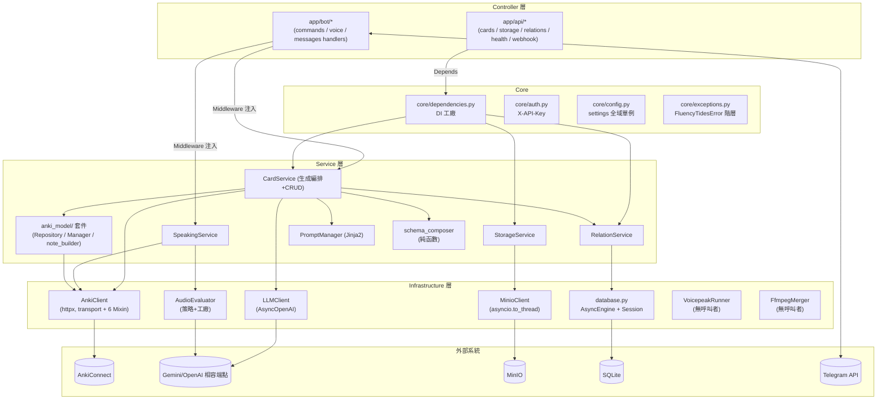
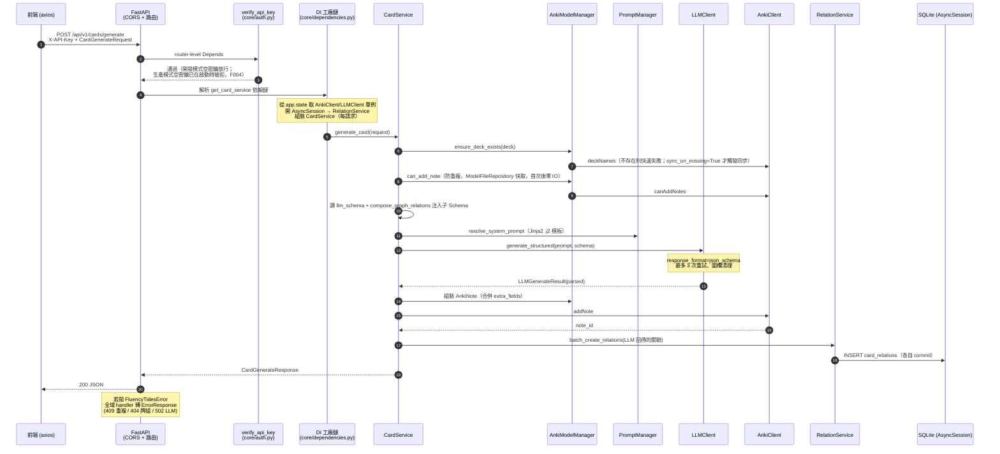
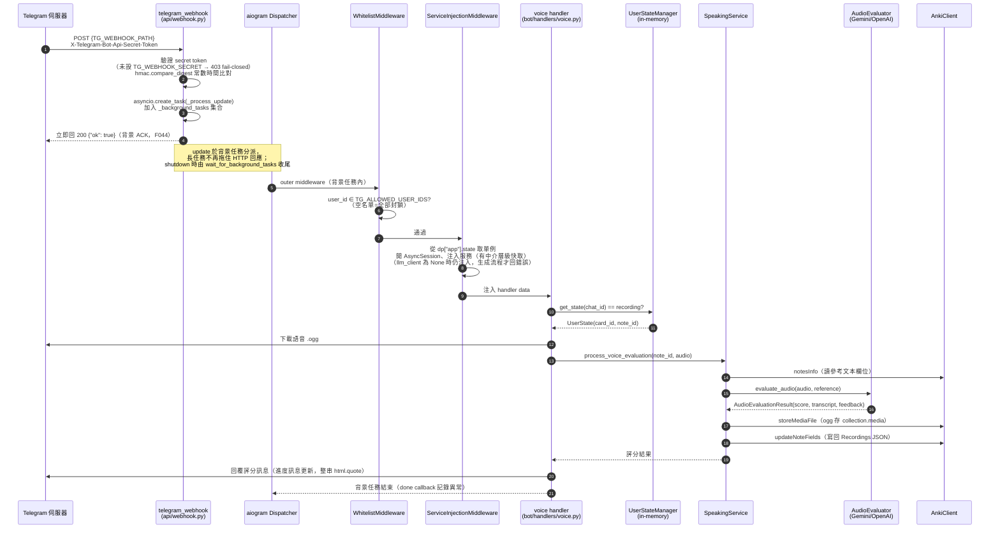
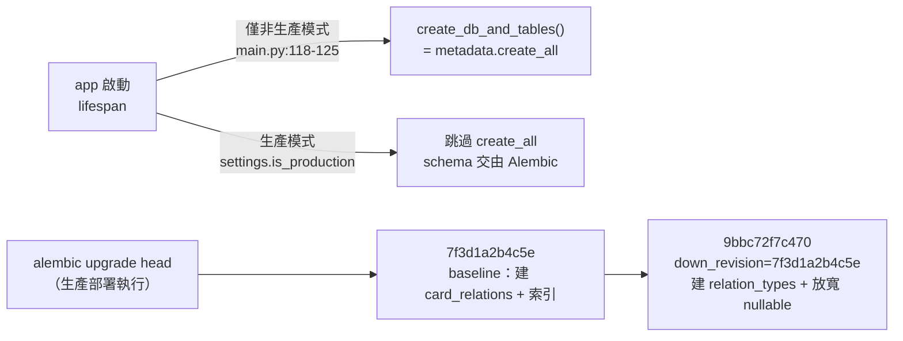
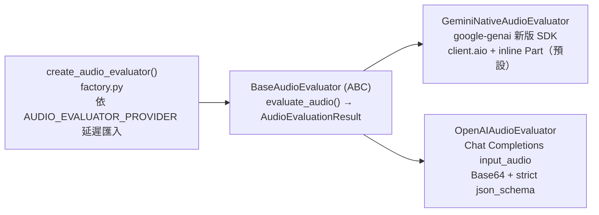

# 後端架構文檔（Backend Architecture）

> 產生日期：2026-07-07（由 Claude Code 全項目審查產生）
> 最後更新：2026-07-09（第三輪：結構與測試現狀同步，見 [12_Implementation_Log.md](12_Implementation_Log.md)）

本文檔描述 FluencyTides 後端（`backend/`）的**實際代碼現狀**，而非理想設計。內容涵蓋分層架構與 Clean Architecture 原則的實際落差、各層職責與主要模組、兩條完整的請求生命週期（Web API 與 Telegram Webhook）、資料模型與遷移現狀、五個外部整合的封裝方式，以及本次全項目審查中確認的架構弱點清單（附 finding id 與代碼位置）。所有論斷均以審查資料為基礎並經代碼核實。

---

## 1. 分層架構說明

### 1.1 目錄與分層總覽

後端採「Controller → Service → Infrastructure」三層架構，全部位於 `backend/app/` 下：

| 層 | 目錄 | 職責 | 每層的實例生命週期 |
|---|---|---|---|
| Controller（Web） | `app/api/` | FastAPI Router：接收 Pydantic 請求、委託 Service、回傳 Pydantic 回應 | 無狀態函數 |
| Controller（Bot） | `app/bot/` | aiogram 3 Router/Handler、Middleware、Deep Link 解析、in-memory 狀態機 | Dispatcher 為進程級單例 |
| Service | `app/services/` | 業務邏輯：卡片生成編排、關聯 CRUD、儲存封裝、Prompt 管理 | **每請求（或每 update）建立** |
| Infrastructure | `app/infrastructure/` | 外部系統客戶端：AnkiConnect、LLM、MinIO、資料庫、語音評分、VOICEPEAK、FFmpeg | **lifespan 單例**（DB session 除外） |
| Schemas | `app/schemas/` | 跨層 Pydantic v2 合約（請求/回應 DTO、AnkiConnect 協定模型） | 無狀態 |
| Core | `app/core/` | 設定（pydantic-settings）、認證、依賴注入工廠、業務異常階層 | `settings` 為模組級全域 |

#### 後端目錄樹（2026-07-09 現狀，經三輪重構後定型）

下列為 `backend/` 的實際結構與各節點職責。第三輪已刪除 `backend/{api,core,models,services,utils}/` 與 `backend/app/domain/` 六個空殼 scaffold（F115），並落地 `backend/tests/`（48 個 pytest）與 `alembic/versions/` 的 baseline 遷移。

```text
backend/
├── app/
│   ├── main.py                     # FastAPI 組裝 + lifespan（startup 建 AnkiClient/ModelFileRepository 單例、
│   │                               #   Bot 降級啟動、生產跳過 create_all；shutdown 先等背景任務再釋放資源）
│   ├── api/                        # Controller（Web）：無狀態 Router，只做參數傳遞與委託
│   │   ├── cards.py                #   /api/v1/cards：生成/CRUD/模型檔/牌組
│   │   ├── relations.py            #   /api/v1/relations：知識圖譜關聯 CRUD + /graph + /sync
│   │   ├── storage.py              #   /api/v1/storage：媒體上傳/列表/預簽名/刪除
│   │   ├── health.py              #   /api/health：無認證存活探針
│   │   └── webhook.py              #   Telegram webhook：驗證 secret → 背景 ACK（第二輪改）
│   ├── bot/                        # Controller（Bot）：aiogram 3 寄生於同一進程
│   │   ├── dispatcher.py           #   create_bot（token 驗證）+ setup_dispatcher（註冊 router/middleware）
│   │   ├── dependencies.py         #   WhitelistMiddleware + ServiceInjectionMiddleware（服務注入 + 快取）
│   │   ├── state.py                #   UserStateManager：進程內 dict 狀態機（單 worker）
│   │   ├── handlers/               #   commands / messages / voice 三個 Router
│   │   └── utils/deep_link_parser.py  # /start payload → DeepLinkAction 子類
│   ├── core/                       # 橫切關注點
│   │   ├── config.py               #   Settings + get_settings + ENVIRONMENT/is_production + CORS_ORIGINS
│   │   ├── auth.py                 #   X-API-Key（fail-closed）
│   │   ├── dependencies.py         #   DI 工廠（含 get_llm_client / get_llm_client_optional）
│   │   └── exceptions.py           #   FluencyTidesError 體系（基類 + 10 個子類）
│   ├── schemas/                    # 跨層 Pydantic v2 合約（第三輪刪多個死 schema）
│   │   ├── anki.py card.py common.py relation.py speaking.py
│   │   ├── storage.py storage_api.py voice.py llm.py deep_link.py
│   ├── services/                   # 業務邏輯（每請求/每 update 建立）
│   │   ├── card_service.py         #   生成編排 + 卡片 CRUD
│   │   ├── speaking_service.py     #   語音評估全流程（第一輪自 CardService 拆出）
│   │   ├── schema_composer.py      #   compose_graph_relations 純函數
│   │   ├── relation_service.py     #   關聯 CRUD + get_graph_data + sync 防護 + N+1 消除
│   │   ├── prompt_manager.py       #   Jinja2 System Prompt 載入
│   │   ├── storage_service.py      #   MinioClient 業務封裝
│   │   ├── anki_model/             #   {manager, repository, note_builder}.py（第一輪自 617 行拆的三職責套件）
│   │   ├── anki_model_manager.py   #   24 行相容 shim（re-export anki_model 套件）
│   │   └── prompts/*.j2            #   5 個 System Prompt 模板
│   ├── infrastructure/             # 外部系統客戶端（lifespan 單例，DB session 除外）
│   │   ├── anki/                   #   client.py（組合類）+ transport.py + 6 領域 Mixin + utils.py（查詢跳脫）
│   │   ├── audio_evaluator/        #   base(Template Method) + factory + gemini/openai_client + prompts
│   │   ├── database/               #   database.py + models.py（CardRelation/RelationType）+ conventions.py
│   │   ├── llm/client.py           #   AsyncOpenAI + 重試分類 + strip_markdown_fences
│   │   ├── storage/minio_client.py #   同步 minio SDK 以 asyncio.to_thread 包裝
│   │   ├── ffmpeg/ffmpeg_merger.py #   未接線（F042）
│   │   └── voice/voicepeak_runner.py  # 未接線（F042）
│   └── anki_models/*.json          # 9 個 Anki 模型定義（json + front/back html + css）
├── alembic/
│   ├── env.py                      # async 模式，URL 由 Settings 注入
│   └── versions/                   # 7f3d1a2b4c5e（baseline）→ 9bbc72f7c470（relation_types）
├── tests/                          # 第三輪新增：conftest + 7 個 test_*.py（48 個 pytest）
└── scripts/                        # _bootstrap.py + 3 支匯入/維運腳本
```



Web API 與 Telegram Bot **共用同一層 Service**——這是本專案分層設計最成功的部分：`bot/handlers/messages.py` 與 `api/cards.py` 都透過 `CardService.generate_card` 完成卡片生成，業務邏輯不重複。

### 1.2 依賴注入的兩套機制

| 面向 | Web API | Telegram Bot |
|---|---|---|
| 入口 | `core/dependencies.py` 的 `Depends()` 工廠鏈 | `bot/dependencies.py` 的 `ServiceInjectionMiddleware` |
| Infrastructure 取得 | `request.app.state.*`（`core/dependencies.py:54-96`） | `dp["app"]` 取回 FastAPI app 再讀 `app.state` |
| DB session | `get_async_session` FastAPI 生成器（re-export 為 `get_db_session`，`core/dependencies.py:51`） | 每個 update 以 `async_session_factory` 手動開一個 session |
| Service 組裝 | 每請求由 `get_card_service` 等工廠建立（`core/dependencies.py:151-179`） | 每個 update 在 middleware 內手動 `CardService(...)` 實例化 |

### 1.3 與 Clean Architecture 的實際落差

專案在 `core/dependencies.py:11-12` 明文宣告「Controller 層永遠不直接觸碰 Infrastructure」，實際遵守情況：

| 原則 | 遵守情況 | 例外/落差 |
|---|---|---|
| Controller 零業務邏輯 | cards、storage、relations 路由均遵守 | 原 `relations.py` GET /graph 直接操作 AnkiClient 的偏離（F022）**已於 2026-07-08 修復**：邏輯下沉至 `RelationService.get_graph_data(anki_client, deck_name)`，Controller 只留參數傳遞 |
| Service 不直接開連線、不讀環境變數 | 全層遵守 | 無 |
| Infrastructure 錯誤統一包裝為自訂例外 | AnkiConnectError / MinioStorageError / LLMServiceError 均到位 | VoicepeakRunner / FfmpegMerger 採「回傳 success=False 與拋例外」雙通道（F099） |
| 依賴反轉（介面抽象） | **未做**：Service 直接依賴具體類別（`CardService.__init__` 收 `AnkiClient` 具體型別），沒有 Protocol/ABC 抽象層 | 唯一的抽象是 `BaseAudioEvaluator` ABC（策略模式） |
| 統一 Unit of Work | **仍未抽出通用 UoW**：`RelationService` 每個方法自行 `commit`，交易邊界分散在 Service 方法內 | 批次寫入原子性已於第三輪補上（F083：`batch_create_relations` 改單次 flush + 單一交易 commit，失敗即 rollback），但仍是「方法內自管交易」而非跨 Service 的統一 UoW |
| 設定延遲注入 | **已於 2026-07-08 改善**（F021）：新增 `@lru_cache get_settings()` 標準 FastAPI 模式，測試可 `cache_clear()` 注入；模組層 `settings = get_settings()` 保留以維持既有 import 不變 | docstring 已改為如實描述 |

**（已解決）scaffold 殘留清除**：`backend/api`、`backend/core`、`backend/models`、`backend/services`、`backend/utils` 與 `backend/app/domain` 六個僅含空 `__init__.py` 的目錄（對應 README 描述、但從未實作的舊 Flask 架構），已於第三輪逐一 grep 證明零引用後**全部刪除**（F115）。真實模組 `backend/app/core`、`backend/app/services` 不受影響。目前不再有空殼目錄放大架構認知成本。

---

## 2. 各層職責與主要模組

### 2.1 Core 層（`app/core/`）

#### config.py — 設定管理

- pydantic-settings v2（`SettingsConfigDict`、`field_validator`、`model_validator`），從 `.env` 集中讀取 Anki/MinIO/LLM/Telegram/VOICEPEAK 全部環境變數，`extra="ignore"` 容忍未定義變數。
- 含 SQLite 路徑絕對化 validator、`tg_webhook_url` / `tg_allowed_users` 衍生 property、`setup_logging()` 全域日誌初始化。
- **2026-07-08 更新（F021 已修復）**：新增 `@lru_cache` 的 `get_settings()`（`config.py:403`）作為標準取得入口，測試可 `get_settings.cache_clear()` 後注入 mock 環境變數；模組層 `settings = get_settings()`（`config.py:419`）保留，全部既有 import 不變，docstring 已改為如實描述。`auth.py`、`database.py`、`dispatcher.py`、`webhook.py` 仍在 import 期取得同一快取實例。
- **2026-07-09 更新（第二輪 fail-closed 機制）**：新增 `ENVIRONMENT` 欄位（`config.py:74`，預設 `development`）與 `is_production` property（`ENVIRONMENT` 不分大小寫等於 `production` 時為 True，`config.py:91-98`）。核心是一支 `@model_validator(mode="after")` 的 `enforce_production_security`（`config.py:100-140`）：**僅在 `is_production` 為 True 時生效，開發模式（預設）完全不受影響**——
  - **F004**：生產模式 `API_SECRET_KEY` 為空 → `ValueError` 中止啟動（原本 fail-open 靜默放行全部 API）。
  - **F005**：生產模式已設 `tg_webhook_url` 但 `TG_WEBHOOK_SECRET` 為空 → `ValueError` 中止啟動。
  - **F020**：生產模式 MinIO 憑證未設只記 warning（不阻擋，因 MinIO 可能未使用，實際由 `MinioClient` 初始化時把關）。

  由於 `settings = get_settings()` 於 import 期實例化、`alembic/env.py` 也 import 它，生產環境跑遷移的容器若未帶 `API_SECRET_KEY` 會在 import 期即 `ValidationError` 中止——這是與 F036「生產 schema 只靠 Alembic」的已知張力（見 11 號文檔 §6），緩解方式為遷移步驟提供應用密鑰、或以 `ENVIRONMENT=development` 單獨執行遷移。
- **2026-07-09 新增設定項**：
  - `STORAGE_MAX_UPLOAD_MB`（`config.py:230`，預設 `50`）：媒體上傳 API 單檔大小上限（MB），超過回 413（F024）。
  - `MINIO_ACCESS_KEY` / `MINIO_SECRET_KEY` 預設由 `minioadmin` 改為 `None`（F020，無安全預設值）。
  - `TG_SPEAKING_MODEL_NAME`（`config.py:270`，預設 `Speaking_Coach_Dark`，第一輪已加，F104）：`/newcard` 建立口說卡片的 Anki 模型名。
  - **`CORS_ORIGINS`（第三輪新增，F019）**：允許的跨域來源清單，附 `@field_validator(mode="before")` 的 `_parse_cors_origins`，可接受逗號分隔字串、JSON 陣列或原生 list 三種輸入格式；`main.py` 的 CORSMiddleware 改從此設定讀取，取代原本硬編碼的 `localhost:5173`。跨域部署不再需要改程式碼。
- **2026-07-09 更新（第三輪，F066）**：`env_file` 改用絕對路徑（`Path(__file__).parents[2]/.env`），從任意 CWD 啟動或跑遷移都讀得到同一份 `.env`。

#### auth.py — API Key 認證

- `APIKeyHeader(X-API-Key)`（`backend/app/core/auth.py:27`）+ `Security` 實作 `verify_api_key`，由 cards/storage/relations 三個 router 以 router-level `dependencies=[Depends(verify_api_key)]` 統一掛載。
- **fail-closed（2026-07-09，F004）**：安全模型已從「缺密鑰即放行」改為條件式 fail-closed——`is_production` 為 True 時 `API_SECRET_KEY` 為空**在啟動階段**即被 `config.py` 的 `enforce_production_security` validator 拒絕（服務根本起不來）；開發模式（預設）維持原本的空密鑰放行以方便本地 Swagger UI。換言之，生產漏設密鑰不再是「靜默無認證」而是「拒絕啟動」。

#### dependencies.py — DI 中心

- 三個 Infrastructure getter 從 `app.state` 讀單例；五個 Service 工廠按請求組裝。`get_card_service` 是最深的依賴鏈：注入 AnkiClient、LLMClient、AnkiModelManager、PromptManager、RelationService（後者又注入 AsyncSession）。
- `_ANKI_MODELS_DIR`（`app/anki_models/`）與 `_PROMPTS_DIR`（`app/services/prompts/`）兩個資源目錄路徑在此定義。
- **LLM 依賴分寬鬆／嚴格兩版（2026-07-09，Bug 1 回歸修復）**：`get_llm_client`（`dependencies.py:88`）在 `LLMClient` 為 None 時 raise `ServiceUnavailableError`(503)（F006 統一契約），供真正需要 LLM 的鏈使用；但 `get_card_service` 改注入**寬鬆版 `get_llm_client_optional`（`dependencies.py:71`，None 時回 None 不 raise）**。原因：第二輪 F006 的 503 與第一輪「CardService 容忍 `llm=None`」設計直接衝突——LLM 未設定時連 `/cards/models`、`/cards/decks` 這類唯讀端點都被誤擋 503。改用寬鬆版後，唯讀操作在無 LLM 時照常運作，只有實際觸發生成才回錯誤。`get_minio_client`（`dependencies.py:120`）維持嚴格版 503。**runtime 實測 `/cards/models` 已由 503 恢復為 200**。

#### exceptions.py — 業務異常階層

- `FluencyTidesError` 基類攜帶 `error_code` / `status_code` / `message`，共 10 個子類：`DuplicateCardError`(409)、`DeckNotFoundError`(404)、`ModelFileNotFoundError`、`PromptTemplateNotFoundError`、`LLMServiceError`(502)、`AnkiServiceError`、`StorageServiceError`、`AuthenticationError`(401)，以及第二輪為統一契約新增的 **`ServiceUnavailableError`(503)**（LLM/MinIO 未配置時的降級回應，取代裸 AttributeError 500）與 **`AudioEvaluationError`**（語音評分/音訊轉碼失敗）。
- 由 `main.py` 的全域 exception handler 統一轉為 `ErrorResponse`（`schemas/common.py`）JSON——各路由因此完全不寫 try/except，只以 `responses={...}` 宣告 OpenAPI 文件。

### 2.2 API 層（`app/api/`）

| Router | 前綴/路徑 | 認證 | 端點 |
|---|---|---|---|
| cards.py | `/api/v1/cards` | X-API-Key | POST /generate、GET /models、GET /models/{file}、GET /decks、GET/PUT/DELETE /{note_id} |
| relations.py | `/api/v1/relations` | X-API-Key | GET /graph、POST /、GET /types、POST /delete、DELETE /by-note/{id}、POST /sync |
| storage.py | `/api/v1/storage` | X-API-Key | POST /upload、GET /files、GET /presign/{object:path}、DELETE /files/{object:path} |
| health.py | `/api/health` | 無（刻意） | GET / |
| webhook.py | `TG_WEBHOOK_PATH`（預設 `/api/webhook`） | Telegram secret token（可選） | POST |

已知問題：

- ~~**GET /cards/models 必然 500**~~（F001）：**✅ 已於 2026-07-08 修復**（第一輪修方法簽名，第二輪 runtime 實測回 200，見 §「依賴注入」Bug 1）。
- ~~webhook 端點在 `TG_WEBHOOK_SECRET` 未設定時完全無驗證~~（F005）：**✅ 已於 2026-07-09 改為 fail-closed**——`webhook.py:122` 無密鑰即回 403（不再放行），密鑰比對改 `hmac.compare_digest` 常數時間（F049），日誌不再輸出密鑰片段（F068）。
- 路由風格不一致（F075）、`response_model` 使用裸 dict（F072）。⏸ 未處理（屬破壞性變更，需與前端契約同步規劃）。

### 2.3 Schemas 層（`app/schemas/`）

純 Pydantic v2（`Field`、`ConfigDict`、`model_dump`），無 v1 遺留，按領域切分為 10 個模組。第三輪（F079–F082）已把先前標為死代碼的模型全數刪除，schemas 層現只保留有實際引用者：

| 模組 | 內容 | 備註 |
|---|---|---|
| common.py | **ErrorResponse**（全域 exception handler 的統一回應模型） | F078 已修復：自 card.py 移入，card.py re-export 平滑遷移 |
| card.py | CardGenerateRequest/Response、CardUpdateRequest | F077 已修復：CardUpdateRequest.fields 拒絕空字典（現回 422） |
| anki.py | AnkiConnect v6 協定模型（AnkiActionRequest/Response、AnkiNote、AnkiNoteInfo、AnkiModelInfo、AnkiDeckInfo、AnkiStoreMediaParams 等 9 類） | **F079 已修復**：createModel schema 群組（AnkiCardTemplate/AnkiModelPayload/AnkiCreateModelRequest）互相依賴且對外零引用，已刪除 |
| relation.py | CardRelationCreate/Read/Delete DTO，與 SQLModel Table 解耦 | **F080 已修復**：刪 RelationDef/CardRelationBatchDelete 與未用的 `Literal` import；F076 已修復：`relation_type`/`target_label` 加 `min_length=1` + validator 要求 source 至少一者有值（空值請求現回 422） |
| storage.py / storage_api.py | Infra 層（MinioUploadResult/MinioObjectInfo/MinioBucketPolicy）與 API 回應模型（StorageUpload/List/PresignedUrlResponse）刻意分離 | **F081 已修復**：刪 MinioPresignedUrlRequest 與未用的 `timedelta` import |
| speaking.py | RecordingItem、ReferenceAudioItem/ReferenceItem、NewCardPayload（TG /newcard）、AudioEvaluationResult | **F082 已修復**：刪與 ReferenceAudioItem 重複的 PromptAudioItem。服務 Bot 語音流程 |
| voice.py / llm.py / deep_link.py | VOICEPEAK/FFmpeg 請求與結果模型、LLMGenerateResult、DeepLinkAction（RecordAudio/DeleteEntry/GenerateCard 子類） | 服務 Infrastructure 與 Bot 層 |

### 2.4 Services 層（`app/services/`）

#### CardService（`card_service.py`，約 608 行，2026-07-08 拆分後）

業務中樞，職責收斂為「卡片 CRUD + 生成編排」。`generate_card` 已重構為編排骨架（~90 行含 docstring）+ 六個私有步驟方法（`_ensure_preconditions` / `_load_llm_schema` / `_resolve_system_prompt` / `_merge_and_extract` / `_submit` / `_create_relations_from_llm_data`，F031 已修復）；原本硬編碼的 30 行 Graph_Relations JSON Schema 字面量移至 `schema_composer.py` 的純函數 `compose_graph_relations`（深拷貝防止汙染快取 Schema）。底層 `AnkiConnectError` 在此層轉為語意化 `FluencyTidesError` 子類。另含卡片 RUD；`update_card` 新增 `primary_field_name: str = "Expression"` 參數消除硬編碼主欄位假設（F088）。Phase 1 遺留的死代碼 `generate_and_add_card` / `check_and_generate` 已刪除（F030）。

#### SpeakingService（`speaking_service.py`，2026-07-08 自 CardService 拆出）

語音評估全流程（原 `process_voice_evaluation`，與卡片生成零共用狀態）：讀 Anki 欄位（`_load_card_context`，以 `_CardContext` dataclass 承載中間狀態）→ AudioEvaluator 評分 → 音檔 base64 存入 `collection.media`（`_persist_recording`）→ 結果寫回 Recordings JSON 欄位。只依賴 AnkiClient 與呼叫時傳入的 evaluator，可獨立測試；`bot/dependencies.py` 與 `bot/handlers/voice.py` 注入鏈已同步改指向。

#### anki_model/ 套件（原 `anki_model_manager.py`，2026-07-08 拆分為三職責）

原 617 行三職責混合檔已拆為套件（`anki_model_manager.py` 保留為 24 行相容 re-export shim，5 處既有 import 路徑不變）：

- **`repository.py` — ModelFileRepository**：本地 `app/anki_models/*.json` 模型定義（9 個模型，各含 json + front/back html + css）的檔案 IO，不依賴 AnkiClient。`asyncio.to_thread` 讀取 + 實例級快取（首次之後零 IO，F028/F074 已修復）；`main.py` lifespan 建立 `app.state.model_repo` Singleton，`core/dependencies.py` 工廠優先取用。**注意**：檔案首次讀取後快取，執行期修改模型檔需重啟服務。
- **`note_builder.py`**：`build_note_from_llm_response` AnkiNote 組裝純函數。
- **`manager.py` — AnkiModelManager**：瘦身後只負責 AnkiConnect 前置檢查與提交。`ensure_deck_exists(deck_name, *, sync_on_missing=False)` 預設不再於牌組缺失時隱式觸發完整 AnkiWeb 同步，改為快速失敗（F027 已修復；`import_cards_from_json.py` 顯式傳 `sync_on_missing=True` 保留舊行為）。

#### RelationService（`relation_service.py`）

直接持有注入的 AsyncSession，以 SQLAlchemy 2.0 風格（`select()/delete()/update()` + `execute`）操作兩張表；每個方法自行 commit（無統一 UoW）。2026-07-08 更新：原 `/relations/graph` Controller 中的 Anki 查詢與卡片狀態提取整段下沉為 `RelationService.get_graph_data(anki_client, deck_name)`（AnkiClient 以方法參數傳入，DI 佈線零改動，F022 已修復）；與 `delete_relations_by_note_id` 完全重複的 `delete_relations_for_note` 已刪除（F029 已修復）。**2026-07-09 更新（階段 2 穩定性）**：`sync_with_anki` 開頭加空列表防護（`valid_note_ids` 為空即 return 0，杜絕清空整表，F002）；`relation_type` 統一正規化 + get_or_create 捕獲 `IntegrityError` 回退（F026）；關聯寫入失敗補 `session.rollback()` 不再連鎖失敗（F051）；graph 查詢的 deck 名以 `escape_anki_search_value` 跳脫（F085 等）。**第三輪效能修復**：`batch_create_relations` 消除 N+1——改為批次註冊類型 + 單次 `flush()` 取回自增 id + 單一交易 commit（取代逐筆 refresh），失敗即 `rollback` 後重拋（F083 原子性到位）；`sync_with_anki` 改在 Python 端比對孤兒、以每批 ≤900 的 IN 分批刪除，避開 SQLite 變數上限（3.32+ 為 32766，舊版 999）導致 /sync 崩潰（F084）。**F023 ✅ 已完成（2026-07-11，第四輪，見 [12_Implementation_Log.md](12_Implementation_Log.md) §9）**：graph 端點加**類別層級 TTL(30s) 圖譜快取** + 寫入路徑（新增/刪除關聯）**主動失效**，冷熱路徑一致（前輪僅完成邏輯下沉至 `get_graph_data`，快取殘餘此輪清零）。

#### StorageService（`storage_service.py`）

包裝 MinioClient：確保 bucket 存在、檔名規範化（日期+UUID）、上傳後產生預簽名 URL、列表與刪除。**尚未接入生卡流程**——目前僅由 `/api/v1/storage` 端點使用。第三輪修復：預簽名 URL 為 None 時拋 502 而非靜默回空字串（F073）；`ensure_bucket_exists` 捕捉 `BucketAlreadyExists` 使並發建立冪等（F092）。

#### PromptManager（`prompt_manager.py`）

Jinja2（`StrictUndefined`）從 `services/prompts/*.j2` 載入 System Prompt。注意 prompt 模板並非與模型檔完全一對一：`anki_models/` 有 9 個模型定義，`prompts/` 目前只有 5 個 `.j2` 模板（Contrast_Coach_Dark、Conversation_Coach_Dark、TOEIC_Coach_Dark、TOEIC_Coach_Dark_v2、Voice_Shadowing_Dark）——缺模板的模型無法走 LLM 生成流程。

### 2.5 Infrastructure 層（`app/infrastructure/`）

見第 5 節「外部整合」詳述。

### 2.6 Bot 層（`app/bot/`）

寄生於 FastAPI 進程：`main.py:166-220` 在 lifespan 中建 Bot 與 Dispatcher，依 `TG_WEBHOOK_DOMAIN` 二選一——設定時 `set_webhook` 並把 bot/dp 存入 `app.state`；未設定時 `asyncio.create_task(dp.start_polling(bot))` 背景 long polling。**2026-07-09 更新**：整段 Bot 啟動（含 `create_bot()` 的 token 格式驗證）包在 F018 降級 try 內（`main.py:166-241`）——token 格式錯或 Telegram 暫時故障一律降級 `bot=None`、其餘 API 照常啟動（Bug 3 回歸修復：`create_bot()` 原落在該 try 之外，token 錯會讓整個 API 拒絕啟動）。`set_webhook` 現為無條件呼叫（冪等），secret 輪換必重綁（F017）；polling task 掛 `add_done_callback` 記錄異常（F016）。

| 組件 | 位置 | 職責 |
|---|---|---|
| WhitelistMiddleware | `bot/dependencies.py:35` | outer update middleware，依 `TG_ALLOWED_USER_IDS` 白名單攔截；**空名單=封鎖所有人**（安全預設） |
| ServiceInjectionMiddleware | `bot/dependencies.py` | inner middleware，經 `dp["app"]` 取 `app.state` 單例注入服務。2026-07-08 更新（F046）：`llm_client=None` 時不再 raise 全滅，改為仍注入全部服務並在生成流程回覆友善錯誤；`AnkiModelManager` / `PromptManager` / `SpeakingService` 以 `anki_client` 為鍵做實例級快取，不再每 update 重建（`RelationService` 因綁定 DB session 維持逐 update 建立） |
| commands router | `bot/handlers/commands.py` | /start（Deep Link 分派 rec_/del_/gen_）、/help、/sync |
| fsm 套件 | `bot/handlers/fsm/` | **全面狀態機化**：包含 `vocabulary_fsm.py`, `speaking_fsm.py`, `expression_fsm.py`，負責所有卡片新增的互動問答流程。 |
| voice router | `bot/handlers/voice.py` | recording 狀態下下載 ogg → `SpeakingService.process_voice_evaluation`（2026-07-08 自 CardService 遷出） |
| messages router | `bot/handlers/messages.py` | **嚴格防呆兜底**：攔截無狀態的任意文字並直接拒絕，不再執行單字查閱。 |
| UserStateManager | `bot/state.py:53` | 進程內 dict 狀態機（chat_id → UserState，含過期），**僅單 worker 有效**（F101） |
| DeepLinkParser | `bot/utils/deep_link_parser.py` | /start payload 解析為 Pydantic DeepLinkAction 子類 |

aiogram 3 用法正確（Router、F filter、`outer_middleware`、`DefaultBotProperties(parse_mode=ParseMode.HTML)`），無 2.x 殘留。**2026-07-09 更新**：原三項已知風險本輪均已處理——
- **全域 HTML parse mode 的動態內容未跳脫**（F007 + Bug D/E）：使用者輸入、LLM 輸出、卡片欄位與 Anki `Prompt` 原文（含 `<br>`）插入 HTML 前一律 `html.quote()`（messages/commands 25 處 + voice 進度訊息整串），避免 `<`、`&` 觸發 `TelegramBadRequest` 中止流程。
- **webhook 同步等待長任務觸發 Telegram 重送**（F044）：webhook 改為背景 ACK（見 §3.2）。
- **/sync 在 Anki 空集合時清空關聯資料庫**（F002）：`sync_with_anki` 開頭加空列表防護，`valid_note_ids` 為空時記 warning 並 return 0，不再執行刪除。

另 voice 錄音狀態改原子消費（`pop_state`，F048），並發語音不再重複評分；狀態歸還前加 `has_state` 檢查避免覆蓋新狀態（Bug B/C）。

**2026-07-09 更新（第三輪 bot 修復）**：
- **F102**：`/newcard` 改用 aiogram `CommandObject.args` 取參數，正確處理群組中的 `/newcard@BotName` 形式。
- **F103**：Card_ID 加 `secrets.token_hex(3)` 後綴，同一秒內連續建卡不再撞 ID。
- **F047**：`messages.py` 的 `F.text` handler 攔截 `/` 開頭的未知指令並回提示，不再把它送進 LLM 生成垃圾卡片。
- **F045**：`voice.py` 在 `audio_evaluator` 未注入時給友善錯誤並直接 return（**不消費使用者錄音狀態**），不再 `TypeError` 崩潰。
- **F105（活代碼確認）**：`state.py` 的 `has_state` 經 grep 確認已被 F048/BugB 修復啟用（`voice.py:55`），改列為活代碼保留。

---

## 3. 請求生命週期

### 3.1 Web API 請求：POST /api/v1/cards/generate



生命週期要點：

1. **依賴解析階段**（步驟 4-5）：Infrastructure Client 是 lifespan 單例（`main.py:75-112`），Service 是每請求輕量物件；AsyncSession 由 FastAPI 依賴生成器管理，請求結束時關閉。
2. **錯誤路徑**：任何一步拋出的 `AnkiConnectError` 在 Service 層轉為語意化子類（如 `DuplicateCardError`），最終由 `main.py:223` 的全域 handler 轉為統一 `ErrorResponse` JSON——Controller 全程不含 try/except。
3. **交易邊界**：卡片已寫入 Anki 後關聯才寫 SQLite，兩者間無跨系統交易——關聯寫入失敗時 Anki 卡片不回滾。

### 3.2 Telegram Webhook 請求：語音評分（Workflow B）



生命週期要點：

1. **Polling 模式差異**：未設 `TG_WEBHOOK_DOMAIN` 時，webhook 端點不作用，改由背景 `dp.start_polling(bot)` 主動拉取，middleware 之後的流程完全相同。
2. **背景 ACK（2026-07-09，F044 + Bug A）**：webhook 驗證通過後以 `asyncio.create_task` 把 update 丟入背景並**立即回 200**（`webhook.py:151-155`），HTTP 回應不再等待數十秒的 AI 呼叫，杜絕 Telegram 逾時重送導致的重複處理。背景任務參照存入模組級 `_background_tasks` 集合防 GC；shutdown 時 `main.py` 於關閉 bot session／dispose engine **之前**先呼叫 `wait_for_background_tasks(timeout=30.0)`（`webhook.py:47`），給進行中的評分／生成有限時間收尾——否則已回 200 的 update 會被砍在半途而永久遺失。
3. **狀態機依賴單 worker**：`UserStateManager` 是進程內 dict，deep link 設定的 recording 狀態與後續語音訊息必須落在同一進程（F101）。
4. **DB session 生命週期**：middleware 為每個 update 開 session 並撐到 handler 結束。F046 的其餘部分已於 2026-07-08 修復：服務不再每 update 全套重建（實例級快取）、LLM 缺失時 Bot 不再全滅。

---

## 4. 資料模型與遷移

### 4.1 SQLModel 資料表

自有資料庫（預設 `sqlite+aiosqlite`）只存 Anki 無法高效處理的關聯資料，共兩張表（`backend/app/infrastructure/database/models.py`）：

**card_relations**（`models.py:31`）— 卡片間有向關聯

| 欄位 | 型別 | 約束 | 說明 |
|---|---|---|---|
| id | int | PK 自增 | 單一主鍵（MySQL 相容鐵律：禁止複合 PK） |
| source_note_id | int \| None | index | 起點 Anki Note ID；**無外鍵**（Anki 資料庫由 Anki 自管）；允許 NULL 表懸空節點 |
| target_note_id | int \| None | index | 終點 Note ID；NULL 表目標卡片尚未建立，依賴 target_label 補齊 |
| relation_type | str(50) | index | synonym / antonym / parent / collocation 等 |
| source_label / target_label | str(200) | — | 人類可讀標籤，圖譜渲染免反查 Anki |
| created_at | datetime | default_factory（UTC） | **第三輪 F037 改動**：由 `server_default=func.now()`（DB 層）改為 `default_factory=lambda: datetime.now(timezone.utc)`（應用層），欄位仍為 `sa_column + DateTime(timezone=True)`。原因：MySQL 的 `NOW()` 回傳 session 本地時間、SQLite 為 UTC，遷移到 MySQL 後 `created_at` 會靜默變本地時間，破壞前端/TG 依賴的 UTC 前提；改由 ORM insert 時明確寫入 UTC timezone-aware 值，跨資料庫語義一致 |

**relation_types**（`models.py:108`）— 關聯類型字典表：`id`（PK）、`name`（str(50)，unique+index）、`created_at`（同上）。

兩項為 MySQL 遷移預留的設計：

- `conventions.py`（`backend/app/infrastructure/database/conventions.py:26`）在任何 table model 定義前以 **monkeypatch 方式替換 `SQLModel.metadata`** 為帶 `ix/uq/ck/fk/pk` 顯式命名規範的 MetaData，確保跨方言 Alembic 約束名稱一致——但這依賴 import 順序，靠 `models.py:28` 的防禦性 import 維持（F093）。
- 所有 str 欄位一律指定 `max_length`（MySQL VARCHAR 索引必需）。

### 4.2 引擎與 Session

`backend/app/infrastructure/database/database.py`：

- `create_async_engine`（預設 `sqlite+aiosqlite:///...`，`pool_pre_ping=True`）+ `async_sessionmaker(expire_on_commit=False)`。
- `get_async_session` 供 FastAPI DI；Bot middleware 直接用 `async_session_factory`。
- 交易管理下放到 `RelationService`：每方法自行 commit，無統一 Unit of Work。

### 4.3 遷移現狀（2026-07-09 更新）：baseline 遷移已就緒，create_all 僅開發模式

第二輪（F009 + F036）補齊了遷移鏈並將 create_all 收斂到開發模式，Alembic 現在可在**全新環境**獨立重建 schema：



實際狀態：

| 項目 | 現狀 |
|---|---|
| Schema 建立 | **僅非生產模式** lifespan 啟動時 `create_all`（`main.py:118-125`，F036）；生產模式跳過，改由 Alembic 管理，消除 schema 雙軌漂移 |
| Alembic 設施 | 齊備：async 模式（`async_engine_from_config` + `run_sync`）、`render_as_batch=True`、URL 由 Pydantic Settings 在 `backend/alembic/env.py` 動態注入（`%` 已轉義 `%%` 防 ConfigParser 插值錯誤，F050） |
| 遷移鏈 | **兩支**：新增手寫 baseline `7f3d1a2b4c5e_baseline_create_card_relations.py`（`down_revision=None`，`create_table(card_relations)` + 索引），原 `9bbc72f7c470_add_relation_types_table.py` 的 `down_revision` 改指向 baseline（建 relation_types + 放寬 note_id nullable） |
| 全新環境獨立重建 | **可行**：`alembic upgrade head` 在空庫上依序建 `card_relations` → `relation_types` → `alembic_version` 三表；**已 runtime 實測通過**（見 11 號文檔 §1） |
| 部署整合 | 生產部署前應執行 `alembic upgrade head`（Docker CMD 與 CI 的整合步驟仍待補，屬階段 3） |

結論：Alembic 已從「留存但未啟用」轉為「全新環境可獨立 upgrade」的真正遷移設施，與 ADR 003「Alembic 全程追蹤」的承諾對齊。第三輪另修：`9bbc` 遷移原硬編碼的 SQLite 方言 `server_default`（`text('(CURRENT_TIMESTAMP)')`）改為方言中立的 `sa.func.now()`（F052，僅影響全新環境，既有 DB 不重跑）；`alembic/env.py` 刪除未用的 `import os`（F135）。已知張力：`env.py` import 期實例化 `settings`，生產模式跑遷移的環境須帶 `API_SECRET_KEY` 否則 fail-closed validator 會中止（見 §2.1 config 段與 11 號文檔 §6）。**遷移測試已沉澱**：`backend/tests/test_alembic.py` 以 subprocess 對臨時 SQLite 跑 `alembic upgrade head`，自動驗證三表建立（見 §7）。

另外，兩支匯入腳本在 `--db-url` 覆寫時的 `create_all` 引導區塊（F109）已於 2026-07-08 抽至共用 `backend/scripts/_bootstrap.py` 的 `build_session_factory()`，不再各自複製。

---

## 5. 外部整合

### 5.1 AnkiConnect — `infrastructure/anki/`（2026-07-08 拆分：transport + 6 Mixin）

原 933 行單檔 `client.py` 已拆分為：`transport.py`（`AnkiTransport`：`_invoke` / `_invoke_typed` / 日誌摘要 + `AnkiConnectError`）+ 六個領域 Mixin（`notes.py` 14 方法、`cards.py` 7 方法、`decks.py` 7 方法、`misc.py` 6 方法含 sync、`media.py` 5 方法、`models.py` 4 方法），`client.py` 縮為 60 行純組合類。**公開 API 完全不變**——全 repo 10 個呼叫點的 `from app.infrastructure.anki.client import AnkiClient, AnkiConnectError` 均不受影響。

| 面向 | 實作 |
|---|---|
| 協定 | AnkiConnect v6 JSON-RPC，完整 CRUD 封裝（牌組/筆記/卡片/媒體/模型/雜項） |
| 連線 | 單一 `httpx.AsyncClient` 連線池，支援 Cloudflare Access header（遠端 Anki）；lifespan 管理，shutdown 時 `close()`；scripts 自行建立並關閉 |
| 驗證 | 所有請求經 Pydantic `AnkiActionRequest/Response` 驗證；回應經 `_invoke_typed`（pydantic `TypeAdapter`）執行期驗證 |
| 錯誤 | 統一包成 `AnkiConnectError`，由 Service 層再轉語意化異常 |

2026-07-08 更新：

- **F134 已修復**：`_invoke_typed(action, result_type, **params)` 提供強型別回傳，原 25 處 `# type: ignore` 全數歸零，`mypy` 於該套件 0 錯誤；AnkiConnect 回傳 `null` 時從靜默 `TypeError` 變為明確 `ValidationError`。
- **F095 已修復**：DEBUG 日誌經 `_summarize_params()` 摘要——base64 `data` 欄位只輸出 `<N bytes>`，其他值超 200 字元截斷。
- **F096 ✅ 已完成（2026-07-11，第四輪，見 [12_Implementation_Log.md](12_Implementation_Log.md) §9）**：`can_add_notes` 簽名改為 `Sequence[AnkiNote | dict[str, object]]`（第二輪部分）；第四輪補齊——新增 **`AnkiCardInfo` 模型**、`get_cards_info` 改型別化回傳，消費端改型別化屬性存取（不再裸字典），並連帶修復 `anki_model/manager.py` 的 `isinstance(card, dict)` 回歸。
- **F094 已修復**：`_invoke` 支援 per-request timeout 覆寫，`sync()` 傳入 60 秒。

2026-07-09 更新：

- **錯誤契約補漏（Bug 2）**：`_invoke_typed` 的 `TypeAdapter(result_type).validate_python(raw)` 原本在 try 外，回應異形時會拋**裸 `pydantic.ValidationError`** 逃出「呼叫端只需捕捉 `AnkiConnectError`」契約（F035），導致 Service 層漏接回未處理 500。已包 try/except 統一轉為 `AnkiConnectError`（保留 `from e`，`transport.py:254-260`）。
- **Anki 查詢跳脫（F071/F085/F086/F112 + Bug E）**：新增 `infrastructure/anki/utils.py` 的 `escape_anki_search_value()`——先跳脫反斜線與雙引號再以雙引號包裹，使空白/冒號/萬用字元一律視為字面值。四處查詢拼接點（graph 查詢、語音查重、`Card_ID:` 查詢、腳本）全部收斂，杜絕使用者可控輸入改寫查詢語意（查詢注入）。**跳脫行為已 runtime 實測**（引號/反斜線正確跳脫）。`nid:{int}` 因參數為純整數無需跳脫。

### 5.2 MinIO — `infrastructure/storage/minio_client.py`

- 以 **`asyncio.to_thread()` 包裝同步 minio SDK 的全部操作**（bucket 建立/公開策略、上傳下載刪除列舉、presigned URL）——經審查確認無任何操作阻塞事件循環，是專案內同步 SDK async 適配的正確範例。
- 回傳 Pydantic 模型，錯誤統一 `MinioStorageError`；2026-07-09 補齊錯誤契約（F033/F034：擴大 except 範圍、`file_size` 修正）。
- lifespan 初始化失敗時降級為 `None` 不阻擋啟動（`main.py:139-146`）；2026-07-09 起 `get_minio_client` 為 None 時 raise `ServiceUnavailableError`(503)（F006 統一契約），不再以裸 AttributeError 500。憑證預設由 `minioadmin` 改為 `None`，`MinioClient` 初始化加明確 None 防護（F020）。
- 目前只服務 `/api/v1/storage`，尚未接入生卡流程。上傳端點 2026-07-09 加大小上限（`STORAGE_MAX_UPLOAD_MB`，超限 413）、副檔名/Content-Type 白名單（415）、prefix 正則（422）與客戶端檔名 `sanitize_filename()`（F024/F032）。

### 5.3 LLM（OpenAI 相容 / Gemini）— `infrastructure/llm/client.py`

- `AsyncOpenAI` 指向 OpenAI 相容端點（實務上為 Gemini 相容層），`response_format=json_schema` 強制結構化輸出，回傳 `LLMGenerateResult`（含原始文字、解析結果、重試次數）。
- 內建重試 + 模組級 `strip_markdown_fences` 圍欄清理（2026-07-08 統一，原三處重複實作收斂於此）。
- **F041 已於 2026-07-08 修復**：僅對 `RateLimitError` / `APIConnectionError` / `APITimeoutError` / 5xx 重試且改指數退避（2/4/8 秒）；401/400 等確定性錯誤立即包裝 `LLMServiceError` 拋出，不再盲目重試。

### 5.4 語音評分（Audio Evaluator）— `infrastructure/audio_evaluator/`

策略模式 + 工廠模式，是專案唯一的介面抽象層：



- lifespan 建立單例，由 Bot middleware 注入 voice handler，最終在 `SpeakingService.process_voice_evaluation` 呼叫；音檔來源為 Telegram 語音（固定 .ogg）。
- **F043 已於 2026-07-08 修復**：逐字重複的評分 Prompt 抽至共用 `audio_evaluator/prompts.py`；圍欄清理統一使用 `llm/client.py` 的 `strip_markdown_fences`；`BaseAudioEvaluator` 改為 Template Method——`evaluate_audio` 提供統一指數退避重試，子類只實作 `_evaluate_audio_once`。
- **F008 已於 2026-07-09 修復（OpenAI 音訊轉碼）**：OpenAI Chat Completions 的 `input_audio.format` 僅接受 `wav`/`mp3`，但 Telegram 語音固定 `.ogg`——原本走 OpenAI 供應商必然 400。`openai_client.py` 新增 `_transcode_to_wav()`：wav/mp3 直傳，ogg/opus 等經系統 `ffmpeg`（stdin/stdout pipe，不落地暫存）轉碼為 wav；找不到 ffmpeg、轉碼逾時（`asyncio.wait_for`）或非零退出皆轉為 `AudioEvaluationError`，不再送出非法 format。
- **F098（low）**：`response.choices[0]` 索引移入錯誤邊界。
- **F097 已於 2026-07-08 修復**：Gemini 改用 `response_schema=AudioEvaluationResult` + `response.parsed`（保留文字解析 fallback；因環境無法安裝 SDK 驗證，docstring 已註明）。

### 5.5 VOICEPEAK 與 FFmpeg — 未接線模組

| 模組 | 實作 | 現狀 |
|---|---|---|
| `infrastructure/voice/voicepeak_runner.py` | `asyncio.create_subprocess_exec` 呼叫 VOICEPEAK CLI，隔離環境變數防禦 iconv 崩潰 | **全庫無任何呼叫者**；docstring 提及的 CharacterManager 不存在 |
| `infrastructure/ffmpeg/ffmpeg_merger.py` | `filter_complex concat + aformat` 統一格式拼接 WAV 並插入句間靜音 | **全庫無任何呼叫者**（但 Dockerfile 已安裝 ffmpeg） |

兩者為舊專案重構後尚未接線的模組。**2026-07-09 更新（F039+F040）**：子程序呼叫已加 `asyncio.wait_for` 超時保護（VOICEPEAK 120s / ffmpeg 60s），逾時 kill 並回明確錯誤。殘留：錯誤回報雙通道（回傳 `success=False` 與拋例外並存）且 `except` 內 `raise` 未帶 `from`（F099，屬死模組暫緩）。

---

## 6. 已知架構弱點

以下彙整本次審查中與架構直接相關的 finding（severity 為審查評級；完整清單見審查報告）。**第三輪已解除「零測試」風險**：`backend/tests/` 落地 48 個 pytest（見 §7），F063 關閉，前兩輪的一次性 runtime 驗證已沉澱為可重複執行的自動化測試。狀態欄反映四輪重構後現狀（✅ 2026-07-08 見 [10_Implementation_Log.md](10_Implementation_Log.md)；✅ 2026-07-09 第二輪見 [11_Implementation_Log.md](11_Implementation_Log.md)、第三輪見 [12_Implementation_Log.md](12_Implementation_Log.md)；✅ 2026-07-11 第四輪見 [12_Implementation_Log.md](12_Implementation_Log.md) §9）。**四輪累計 141 條發現已修復 134 條**（第四輪把 F023 快取、F096 AnkiCardInfo 由部分升級為完全修復，並將 pytest/vitest 接入 CI），僅餘 F042（未接線的 VoicepeakRunner/FfmpegMerger，需產品決策）未處理，另 5 條暫緩、F105 保留為活代碼。§6.5 的認證類執行期缺陷已於第二輪修復。

### 6.1 分層與設計

| ID | 狀態 | 位置 | 問題 |
|---|---|---|---|
| F021 | ✅ 已修復（見 10 號文檔） | `backend/app/core/config.py` | 模組層級 `Settings()` 與 docstring 矛盾——已改 `@lru_cache get_settings()` 模式 |
| F022 | ✅ 已修復（見 10 號文檔） | `backend/app/api/relations.py` | GET /graph Controller 直接操作 AnkiClient——已下沉 `RelationService.get_graph_data` |
| F031 | ✅ 已修復（見 10 號文檔） | `backend/app/services/card_service.py` | `generate_card` 約 170 行、硬編碼 Schema 字面量——已拆為編排骨架 + 六步驟方法 + schema_composer |
| F029 | ✅ 已修復（見 10 號文檔） | `backend/app/services/relation_service.py` | `delete_relations_for_note` 重複實作——已刪除 |
| F046 | ✅ 已修復（見 10 號文檔） | `backend/app/bot/dependencies.py` | LLM 缺失時 Bot 全滅、每 update 重建全套服務——已改優雅降級 + 中介層快取 |
| F093 | ⏸ 未處理（遷移風險，暫緩） | `backend/app/infrastructure/database/conventions.py:26` | monkeypatch 替換 `SQLModel.metadata`，依賴 import 順序的全域副作用 |
| F043 | ✅ 已修復（見 10 號文檔） | `backend/app/infrastructure/audio_evaluator/` | Prompt/圍欄清理重複、重試未實作——已抽共用 prompts.py + Template Method 重試 |
| F088 | ✅ 已修復（見 10 號文檔） | `backend/app/services/card_service.py` | `update_card` 硬編碼主欄位——已加 `primary_field_name` 參數 |
| F104 | ✅ 已修復（見 10 號文檔） | `backend/app/bot/handlers/commands.py` | /newcard 硬編碼模型名——已改 `TG_SPEAKING_MODEL_NAME` 設定項 |
| F134 | ✅ 已修復（見 10 號文檔） | `backend/app/infrastructure/anki/` | 25 處 `type: ignore`——`_invoke_typed` 後全數歸零 |
| F096 | ✅ 已完成（2026-07-11，第四輪，見 [12_Implementation_Log.md](12_Implementation_Log.md) §9） | `backend/app/infrastructure/anki/` | `can_add_notes` 已改型別化簽名（第二輪）；第四輪補齊 `AnkiCardInfo` 模型、`get_cards_info` 型別化回傳與消費端型別化存取，並修 `anki_model/manager.py` isinstance 回歸 |
| F099 | 🔶 部分修復（2026-07-09 加超時，見 11 號文檔） | `backend/app/infrastructure/voice/voicepeak_runner.py:200` | 子程序已加 `asyncio.wait_for` 超時（F039/F040）；殘留錯誤回報雙通道（旗標與例外並存）、`raise` 缺 `from e`（死模組暫緩） |
| F078 | ✅ 已修復（見 10 號文檔） | `backend/app/schemas/common.py` | ErrorResponse 模組歸屬錯誤——已移至 schemas/common.py |
| F072 | ⏸ 未處理（破壞性變更，需與前端契約同步） | `backend/app/api/cards.py:99` | `response_model=dict[str, object]` 裸字典、PUT/DELETE 回應風格不一致 |
| F075 | ⏸ 未處理（破壞性變更，需與前端契約同步） | `backend/app/api/relations.py:66` | `POST /` 尾斜線（無尾斜線觸發 307）、以 POST 執行刪除與標準 DELETE 混用 |

### 6.2 隱藏副作用與行為風險

| ID | 狀態 | 位置 | 問題 |
|---|---|---|---|
| F027 | ✅ 已修復（見 10 號文檔） | `backend/app/services/anki_model/manager.py` | `ensure_deck_exists` 隱式觸發 AnkiWeb 同步——已改 `sync_on_missing=False` 預設快速失敗 |
| F041 | ✅ 已修復（見 10 號文檔） | `backend/app/infrastructure/llm/client.py` | 401/400 盲目重試——已改僅瞬時錯誤指數退避重試 |
| F101 | ⏸ 未處理（依風險評估暫緩） | `backend/app/bot/state.py:53` | in-memory 狀態僅單 worker 正確；`--workers N` 下錄音流程隨機失敗；過期狀態僅被動清理 |
| F076 | ✅ 已修復（見 10 號文檔） | `backend/app/schemas/relation.py` | CardRelationCreate 驗證過鬆——已加 min_length + validator，空值請求回 422 |
| F077 | ✅ 已修復（見 10 號文檔） | `backend/app/schemas/card.py` | CardUpdateRequest.fields 允許空字典——已拒絕，空更新回 422 |

### 6.3 效能

| ID | 狀態 | 位置 | 問題 |
|---|---|---|---|
| F023 | ✅ 已完成（2026-07-11，第四輪，見 [12_Implementation_Log.md](12_Implementation_Log.md) §9） | `backend/app/services/relation_service.py` | 邏輯已下沉 Service（前輪）；第四輪加**類別層級 TTL(30s) 圖譜快取** + 寫入路徑（新增/刪除關聯）**主動失效**，冷熱路徑一致，快取殘餘清零 |
| F028 | ✅ 已修復（見 10 號文檔） | `backend/app/services/anki_model/repository.py` | 同步檔案 I/O + 每請求全目錄重掃——已改 `asyncio.to_thread` + 實例級快取 |
| F074 | ✅ 已修復（見 10 號文檔） | `backend/app/api/cards.py` | async 端點阻塞磁碟 IO——隨 F028 async 化消除 |
| F083 | ✅ 已修復（見 12 號文檔） | `backend/app/services/relation_service.py` | 批次建立逐筆 refresh（N+1）+ 逐次 commit——已改批次註冊類型 + 單次 flush 取 id + 單一交易 commit（原子），失敗即 rollback |
| F084 | ✅ 已修復（見 12 號文檔） | `backend/app/services/relation_service.py` | `sync_with_anki` 巨量 IN 參數可能超 SQLite 變數上限——已改 Python 端比對孤兒 + 每批 ≤900 分批刪除 |
| F095 | ✅ 已修復（見 10 號文檔） | `backend/app/infrastructure/anki/transport.py` | DEBUG 日誌輸出整段 base64——已改 `_summarize_params()` 摘要 |
| F091 | ✅ 已修復（見 10 號文檔） | `backend/app/services/card_service.py` | 函數內 import——已上移模組頂部 |
| F128 | ✅ 已修復（見 12 號文檔） | `backend/Dockerfile` | 改 `COPY --chown=` 一步到位，移除 `chown -R`，映像層不再翻倍 |

### 6.4 腳本與工程一致性

| ID | 狀態 | 位置 | 問題 |
|---|---|---|---|
| F109 | ✅ 已修復（見 10 號文檔） | `backend/scripts/_bootstrap.py` | `--db-url` 引導區塊重複——已抽共用 `build_session_factory()` |
| F113 | ✅ 已修復（見 10 號文檔） | `backend/scripts/update_tg_bot_links.py` | `os.chdir + sys.path` hack——已移除，改 `python -m scripts.update_tg_bot_links` 執行 |
| F114 | ✅ 已修復（見 10 號文檔） | `backend/scripts/import_cards_from_json.py` | 被覆蓋的模組層 basicConfig——已刪除 |

### 6.5 未列入 finding 但需特別注意的執行期缺陷

- ~~**GET /api/v1/cards/models 必然 500**~~：**✅ 已修復（F001，第一輪修簽名 + 第二輪 runtime 實測回 200，另 Bug 1 修正 llm gate 誤擋）**。
- ~~**webhook 無密鑰即無認證**~~：**✅ 已於 2026-07-09 修復（F005）**——`TG_WEBHOOK_SECRET` 未設時 `webhook.py:122` 一律回 403（fail-closed），比對改 `hmac.compare_digest`（F049）。
- ~~**X-API-Key fail-open**~~：**✅ 已於 2026-07-09 改為條件式 fail-closed（F004）**——生產模式 `API_SECRET_KEY` 為空在啟動階段即被 config validator 拒絕；開發模式維持放行。
- ~~**CORS 寫死開發來源**~~：**✅ 已於第三輪修復（F019）**——新增 `CORS_ORIGINS` 設定項（支援逗號分隔/JSON 陣列/list 三種輸入，validator 解析），`main.py` 的 CORSMiddleware 改從 settings 讀取，任意跨域部署改設定即可，不再需要改程式碼（見 §2.1 config 段）。

---

## 7. 測試套件（`backend/tests/`，第三輪新增）

第三輪（F063）把前兩輪的一次性 runtime 驗證沉澱為 **48 個 pytest**，全綠。測試以 mock 驗證各層的介面契約與錯誤分類，不依賴真實 Anki/LLM/MinIO/Telegram 服務。

### 7.1 測試基礎設施

- **`conftest.py`**：整套測試的地基。關鍵在**時序**——`app.core.config.settings` 與 `database.engine` 都在 import 期即建立全域物件，因此 conftest 在**模組頂層**（早於任何 app import）就把 `DATABASE_URL` 指向臨時 SQLite、清掉認證/生產環境變數，避免測試意外連上真實服務。提供兩個 fixture：`anki_client_mock`（`AsyncMock` 模擬 AnkiClient，預設查詢回空集合）、`client`（FastAPI `TestClient`，於 `with` 區塊觸發完整 lifespan，並以 `dependency_overrides` 注入 mock）。
- 執行設定：`pytest.ini`（`asyncio_mode=auto`）+ `requirements-dev.txt`。

### 7.2 各測試模組與對應層

| 測試模組 | 對應層/finding | 涵蓋內容 |
|---|---|---|
| `test_api_smoke.py` | API 層（F001/Bug1） | lifespan 無真實服務可跑通；`/api/health`=200；`/api/v1/cards/models`=200（驗證 LLM 未配置時**不得**被 503 誤擋）；`/api/v1/relations/graph`=200（空圖譜）；OpenAPI schema 生成；未知路徑=404 |
| `test_config.py` | Core config（F004/F005） | 生產模式缺 `API_SECRET_KEY` → `ValidationError` 拒啟；已設 webhook URL 但缺 `TG_WEBHOOK_SECRET` → 拒啟；開發模式寬鬆；`is_production` 判定。全部以 `_env_file=None` 建構避免讀到專案 `.env` |
| `test_anki_escape.py` | Infrastructure anki/utils（F071/F085/F086/F112） | `escape_anki_search_value` 對反斜線/雙引號/空白/冒號/萬用字元的跳脫正確性（查詢注入防護） |
| `test_relation_sync.py` | Service relation（F002） | `sync_with_anki` 空列表防護：`valid_note_ids` 為空一律回 0 且不刪任何資料。以 in-memory SQLite（StaticPool）真實建表寫入後驅動 RelationService |
| `test_llm_client.py` | Infrastructure llm（F041） | `strip_markdown_fences` 圍欄清理；`_is_retryable_error` 分類（429/連線/逾時/5xx 可重試，401/400 不可重試） |
| `test_schema_composer.py` | Service schema_composer（F031） | `compose_graph_relations` 正確注入 Graph_Relations 欄位、加入 required、以深拷貝運作不汙染共用快取 Schema |
| `test_alembic.py` | Alembic（F009） | 以 subprocess 對臨時 SQLite 跑 `alembic upgrade head`，驗證 baseline 鏈建立 `card_relations`/`relation_types`/`alembic_version` 三表 |

### 7.3 限制與後續

- 無真實外部服務，測試驗證的是**端點可達性、狀態碼契約、錯誤分類與純函數行為**，非與外部系統的整合正確性（後者由 mock 回傳值模擬）。
- **CI 已接入測試 ✅ 已完成（2026-07-11，第四輪，見 [12_Implementation_Log.md](12_Implementation_Log.md) §9）**：第三輪時 pytest 與前端 vitest 已就緒但 CI job 尚未呼叫；第四輪已在 `.github/workflows/main.yml` 的 `backend-lint-test` 加 `pytest`（安裝 `requirements-dev.txt`）、`frontend-build` 加 `npm test`（vitest）+ eslint，並作為 docker 部署 job 的前置——測試失敗即擋下部署，測試防線正式生效。
