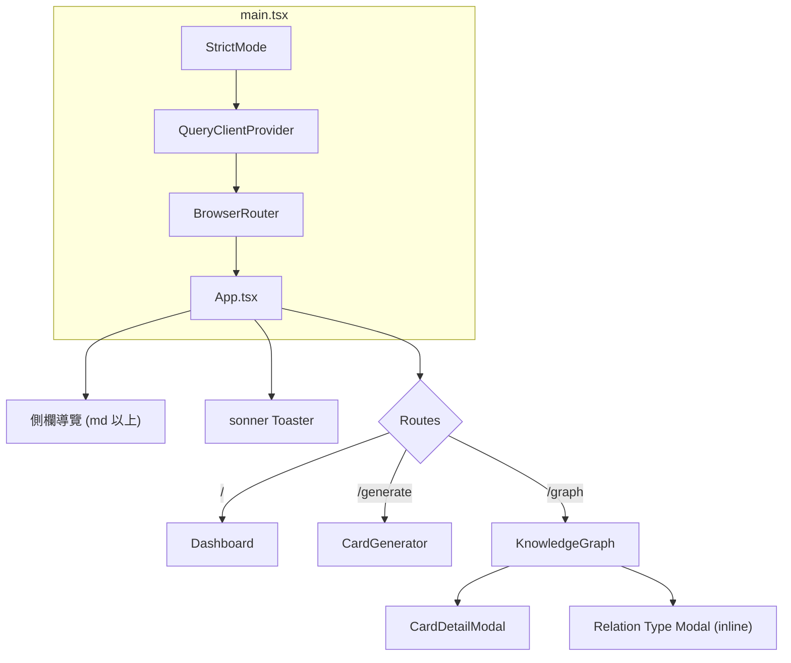
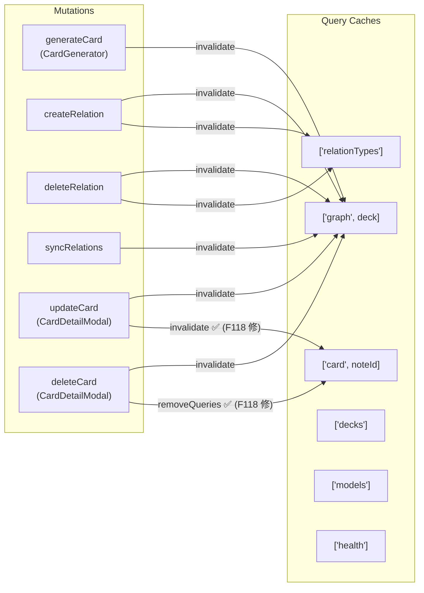
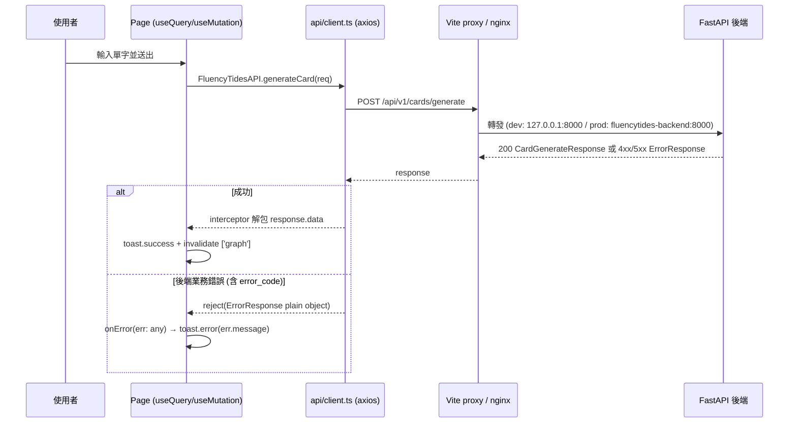
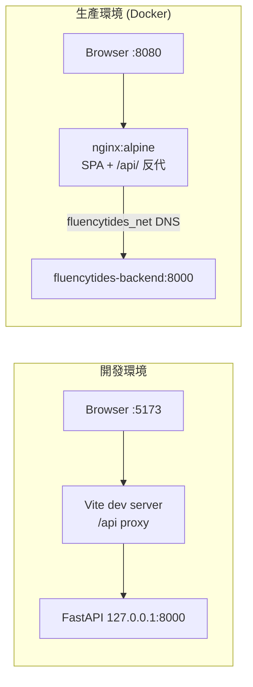

# FluencyTides 前端架構文檔

本文檔描述 FluencyTides 前端子系統（`frontend/`）的實際架構現狀，涵蓋技術棧、頁面與路由結構、API 客戶端與資料流、組件庫與樣式方案，以及本次全項目審查中確認的前端問題清單。所有論斷均基於當前代碼庫的實際內容，代碼位置以 `路徑:行號` 標註。

> 產生日期：2026-07-07（由 Claude Code 全項目審查產生）
> 最後更新：2026-07-09（第三輪：結構與測試現狀同步，見 [12_Implementation_Log.md](12_Implementation_Log.md)——新增 `eslint.config.js`（F054）、`vitest.config.ts` + `tests/` 11 測試（F126）、`public/favicon.svg`（F122），並修復 F053 / F055 / F056 / F116 / F119 / F121；目錄樹與已知問題章節已更新）
> 前次更新：2026-07-09（第二輪：階段 0-2 修復後同步，見 [11_Implementation_Log.md](11_Implementation_Log.md)——F010 / F011 / F118 及回歸 bug 前端 A 已修復，受影響章節已更新）

---

## 目錄

1. [技術棧](#1-技術棧)
2. [專案結構總覽](#2-專案結構總覽)
3. [頁面與路由結構](#3-頁面與路由結構)
4. [API 客戶端與資料流](#4-api-客戶端與資料流)
5. [組件庫與樣式方案](#5-組件庫與樣式方案)
6. [建置與部署](#6-建置與部署)
7. [已知前端問題](#7-已知前端問題)

---

## 1. 技術棧

前端是一個典型的 Vite + React SPA，透過 nginx（生產）或 Vite dev proxy（開發）與 FastAPI 後端的 `/api` 溝通。核心依賴如下（版本引自 `frontend/package.json`）：

| 類別 | 技術 | 版本宣告 | 備註 |
|------|------|----------|------|
| UI 框架 | React / React DOM | `^18.3.1` | package-lock 實際解析為 18.3.1（並非 React 19）；入口使用 `ReactDOM.createRoot`（`frontend/src/main.tsx:10`） |
| 建置工具 | Vite | `^6.0.3` | `@vitejs/plugin-react`；dev server port 5173 |
| 語言 | TypeScript | `~5.6.2` | `tsconfig.json` 開啟 strict 模式；原大量 `any` 繞過已於 2026-07-08 清零（見 [F057](#f057)） |
| 樣式 | Tailwind CSS | `^4.0.0` | v4 新架構：`@tailwindcss/vite` 插件 + `@theme inline`（`frontend/src/index.css:3`），無 `tailwind.config.js` |
| 組件模式 | shadcn/ui（手動拷貝） | — | `components.json` 存在；`src/components/ui/` 下僅五個手拷元件 |
| 伺服器狀態 | @tanstack/react-query | `^5.0.0` | v5 API（`isPending`、物件式參數）；QueryClient 使用全預設值（`frontend/src/main.tsx:8`） |
| HTTP 客戶端 | axios | `^1.7.2` | 單一 instance + response interceptor（`frontend/src/api/client.ts:14`） |
| 路由 | react-router-dom | `^6.20.0` | `BrowserRouter` + 三條扁平路由 |
| 圖譜視覺化 | react-force-graph-2d | `^1.25.4` | Canvas 力導向圖，KnowledgeGraph 頁面核心 |
| 通知 | sonner | `^1.4.0` | Toaster 掛載於佈局最外層；2026-07-08 起全站統一使用（原生 `alert()`/`confirm()` 已隨 [F117](#f117) 修復移除） |
| 圖示 | lucide-react | `^0.400.0` | |
| 工具 | clsx + tailwind-merge + class-variance-authority | — | 組成 shadcn 標準的 `cn()` 與 `cva` 變體模式 |
| Lint | ESLint 9 + typescript-eslint | `^9.17.0` | ✅ 第三輪補上 `eslint.config.js`（flat config），`npm run lint` 恢復可用（見 [F054](#f054)） |
| 測試 | Vitest + @testing-library | — | ✅ 第三輪建立：`vitest.config.ts` + `frontend/tests/` 共 11 個測試（見 [F126](#f126)） |

npm scripts（`frontend/package.json:6-12`）：

| script | 命令 | 現狀 |
|--------|------|------|
| `dev` | `vite` | 可用；✅ [F010](#f010) 已於 2026-07-09 修復——`vite.config.js/.d.ts` 已 `git rm`，載入正確的 `.ts` 設定 |
| `build` | `tsc -b && vite build` | 可用；✅ 2026-07-09 起 `tsconfig.node.json` 以產物導向 node_modules 快取解決 composite/noEmit 衝突，`tsc -b` 不再 emit `vite.config.js/.d.ts`（runtime 實測通過且無殘留產物） |
| `lint` | `eslint .` | ✅ 可用；第三輪新增 `eslint.config.js`（ESLint 9 flat config，[F054](#f054)），恢復 lint 防線 |
| `test` | `vitest run` | ✅ 第三輪新增；跑 `frontend/tests/` 共 11 個 vitest（[F126](#f126)） |
| `preview` | `vite preview` | 可用 |

---

## 2. 專案結構總覽

```
frontend/
├── index.html                  # SPA 入口 HTML；✅ favicon 已改指 /favicon.svg（F122 已修）
├── package.json                # 依賴與 scripts（dev/build/lint/test/preview）
├── vite.config.ts              # Vite 設定（port 5173、/api proxy、@ alias）；✅ F010 已修，不再有 .js/.d.ts 產物遮蔽
├── vitest.config.ts            # ✅ 第三輪新增：vitest 設定（jsdom 環境、testpaths 指向 tests/）
├── eslint.config.js            # ✅ 第三輪新增：ESLint 9 flat config，恢復 npm run lint（F054）
├── tsconfig.json / tsconfig.node.json  # TS 專案參照；✅ tsconfig.node.json 已解決 composite/noEmit 衝突
├── components.json             # shadcn/ui CLI 設定
├── nginx.conf                  # 生產 SPA 路由 + /api 反代（✅ 動態 DNS 解析 + proxy_read_timeout 300s，F014/F132）
├── Dockerfile                  # node:20-alpine 建置 + nginx:alpine 兩階段（✅ 已加 ARG/ENV 注入 VITE_*，F053）
├── docker-compose.yml          # 主機 8080→容器 80，加入 fluencytides_net
├── public/
│   └── favicon.svg             # ✅ 第三輪新增：潮汐主題 favicon，消除 /vite.svg 404（F122）
├── tests/                      # ✅ 第三輪新增：11 個 vitest（F126）
│   ├── apiError.test.ts        #   ApiError 封裝與 interceptor 錯誤映射
│   ├── useLocalStorage.test.ts #   functional update（F055 回歸鎖）+ 跨 tab 同步 + JSON.parse 防護
│   └── utils.test.ts           #   cn() 合併行為
└── src/
    ├── main.tsx                # createRoot + QueryClientProvider + BrowserRouter
    ├── App.tsx                 # 固定側欄佈局 + 三條路由 + 行動版漢堡選單 + catch-all 404 + Toaster
    ├── index.css               # Tailwind v4 @theme + shadcn HSL 變數（含 .dark）
    ├── vite-env.d.ts           # VITE_* 環境變數型別宣告
    ├── api/
    │   └── client.ts           # axios instance + FluencyTidesAPI 全部後端呼叫；含 ApiError 類（F124）
    ├── types/
    │   └── api.ts              # 手寫對齊後端 Pydantic 的介面；含 GraphNode/RuntimeGraphNode/RuntimeGraphLink（F057）
    ├── pages/
    │   ├── Dashboard.tsx       # 後端健康檢查儀表板（單一 useQuery ['health']）
    │   ├── CardGenerator.tsx   # LLM 卡片生成表單（decks/models 下拉 + generate mutation）
    │   └── KnowledgeGraph.tsx  # 力導向知識圖譜與關聯管理（459 行，全前端最複雜元件）
    ├── components/
    │   ├── CardDetailModal.tsx # 卡片欄位編輯/刪除 Modal（常駐渲染、react-query mutation）
    │   └── ui/                 # 手拷 shadcn/ui：button/card/input/select/skeleton/sonner（select 第一輪新增，F123）
    ├── hooks/
    │   └── useLocalStorage.ts  # localStorage 持久化 hook（✅ F055 已修 stale closure + JSON 防護）
    └── lib/
        └── utils.ts            # cn() = clsx + tailwind-merge
```

分層方向單一且清晰：**pages → api/client.ts → types/api.ts**，UI 元件（`components/ui/`）不觸碰資料層。沒有全域客戶端狀態管理（無 Redux/Zustand/Context store），所有伺服器狀態交給 react-query，少量 UI 偏好（圖譜字型、縮放閾值、選中牌組）以 `useLocalStorage` 持久化。測試位於獨立的 `frontend/tests/`（非與源碼同置），以 vitest + jsdom 執行。

---

## 3. 頁面與路由結構

### 3.1 掛載與佈局

入口 `frontend/src/main.tsx:10-18` 以 `ReactDOM.createRoot` 掛載，外層依序包 `React.StrictMode` → `QueryClientProvider`（`new QueryClient()` 未調整任何預設值，`main.tsx:8`）→ `BrowserRouter`。

`App.tsx` 提供固定佈局：左側 `w-64` 側欄（`hidden md:block`）+ 主內容區。行動版（<768px）header 自 2026-07-08 起加入漢堡選單（lucide `Menu`/`X`，含 `aria-label` / `aria-expanded`，點擊連結自動收合，導覽項抽為共用 `NavLinks` 元件）——[F120](#f120) 已修復，行動裝置可到達全部頁面。sonner 的 `<Toaster />` 掛在佈局最外層。

### 3.2 路由表

路由定義於 `frontend/src/App.tsx:60-64`，共三條，**無 catch-all fallback**（見 [F121](#f121)）：

| 路徑 | 頁面 | 側欄名稱 | 職責 |
|------|------|----------|------|
| `/` | `Dashboard` | Dashboard | 後端健康檢查狀態顯示 |
| `/generate` | `CardGenerator` | Card Generator | LLM 卡片生成表單 |
| `/graph` | `KnowledgeGraph` | Knowledge Graph | 力導向知識圖譜與關聯管理 |



### 3.3 Dashboard（`frontend/src/pages/Dashboard.tsx`，49 行）

最簡單的頁面：一個 `useQuery`（`queryKey: ['health']`、`retry: 1`，`Dashboard.tsx:7-11`）呼叫 `FluencyTidesAPI.checkHealth`（即 `GET /api/health`），依 `isLoading / isError / data` 三態渲染 Skeleton、紅色 Offline 指示或綠色狀態燈。頁面留有「More cards can be added here for stats」的擴充註解（`Dashboard.tsx:45`），目前只有 System Health 一張卡。

### 3.4 CardGenerator（`frontend/src/pages/CardGenerator.tsx`，133 行）

LLM 卡片生成表單。職責與資料流：

- 以兩個 `useQuery` 載入下拉選項：`['decks']` → `GET /cards/decks`、`['models']` → `GET /cards/models`（`CardGenerator.tsx:19-20`）。後端 `GET /cards/models` 原因 `CardService.list_available_models` 方法簽名損壞而必然 500，已於第二輪修復並 runtime 實測回 200（F001 + Bug 1，見 11 號文檔），模型下拉現可正常載入。
- 預設值來自建置期環境變數：`VITE_DEFAULT_DECK`（fallback `'Default'`）與 `VITE_DEFAULT_MODEL_FILE`（fallback `'TOEIC_Coach_Dark.json'`）（`CardGenerator.tsx:12-13`）。這兩個變數在 Docker 生產建置中永遠是 undefined（見 [F053](#f053)）。
- 送出時以 `useMutation` 呼叫 `POST /cards/generate`，成功後 toast 顯示 note_id、invalidate `['graph']` 快取並清空輸入（`CardGenerator.tsx:24-38`）。
- `mutation.isPending`（react-query v5 現行 API）驅動按鈕停用與底部的 LLM 生成進度卡片（`CardGenerator.tsx:118-129`）。
- ✅ **[F056](#f056) 已於第三輪修復**：原本 `primary_field_name` 對所有模型固定送 `'Expression'`、`model_name` 硬編碼 fallback `'TOEIC_Coach_Dark'`；現改為由選定 model 的 `fields[0]` 推導主欄位、`model_name` 取自 `AnkiModelInfo`，不再寫錯欄位或提交不存在的模型名。

### 3.5 KnowledgeGraph（`frontend/src/pages/KnowledgeGraph.tsx`，459 行）

全前端最大、最複雜的元件，基於 `react-force-graph-2d` 的 Canvas 力導向圖。功能拆解：

**資料查詢**（`KnowledgeGraph.tsx:51-69`）：

| queryKey | API | 用途 |
|----------|-----|------|
| `['decks']` | `GET /cards/decks` | 牌組篩選下拉 |
| `['relationTypes']` | `GET /relations/types` | 關聯類型清單（fallback `['synonym', 'collocation']`） |
| `['graph', selectedDeck]` | `GET /relations/graph?deck_name=...` | 圖譜節點與連線 |
| `['card', selectedNoteId]` | `GET /cards/{noteId}` | 點擊節點後的卡片詳情（`enabled: selectedNoteId !== null && !isLinkMode`） |

**資料整形**（`KnowledgeGraph.tsx:120-152`）：`formattedGraphData` useMemo 為每個節點依 `status`/`group` 上色（`getStatusColor`，`KnowledgeGraph.tsx:111-117`：learning 橘 / review 綠 / suspended 黃 / 新卡藍 / ghost 節點灰），並判定「同名反向連線」（畫成無箭頭雙向線）與「異名反向連線」（加 0.2 曲率避免重疊）。✅ **[F116](#f116) 已於第三輪修復**：原本對每條連線做兩次全量 `some()` 掃描（O(L²)、每次 refetch 全量重算），現改為先一次遍歷建 Map/Set 索引，降為 O(L)。`getStatusColor` 讀取的 `n.status` 欄位亦已隨 [F057](#f057) 補進 `types/api.ts` 的 `GraphNode` 介面（第一輪修復）。

**Canvas 自訂繪製**（`KnowledgeGraph.tsx:300-338`）：`nodeCanvasObject` 在節點下方繪製帶描邊的標籤文字，字型樣式（六種預設配色 `FONT_STYLES`）、字級倍率與「縮放到多少才顯示標籤」的閾值均可調，並經 `useLocalStorage` 持久化（`kg_fontStyleId` / `kg_fontSizeMultiplier` / `kg_textVisibilityThreshold`，`KnowledgeGraph.tsx:34-36`）。連線模式下被選為 source 的節點加畫藍色圈選框。

**力學參數調整**（`KnowledgeGraph.tsx:155-162`）：透過 `fgRef` 直接操作 d3 force（link distance 80、charge -300），避免節點擠在一起。

**連線模式（Link Mode）**（`KnowledgeGraph.tsx:40-45, 339-351`）：點擊「建立連線」按鈕進入模式後，依序點選 source 與 target 節點，彈出行內 Relation Type Modal（`KnowledgeGraph.tsx:369-449`）選擇既有關聯類型或輸入自訂類型，確認後 `POST /relations/` 建立關聯並 invalidate `['graph']` 與 `['relationTypes']`。

**關聯刪除**：點擊連線觸發 `window.confirm` 後 `POST /relations/delete`（`KnowledgeGraph.tsx:352-362`）。

**Anki 同步**：Sync 按鈕呼叫 `POST /relations/sync` 清理孤兒關聯（`KnowledgeGraph.tsx:100-109`）。

**卡片詳情**：非連線模式下點擊有 `note_id` 的節點，開啟常駐渲染的 `CardDetailModal`（`KnowledgeGraph.tsx:451-456`），可編輯欄位（`PUT /cards/{noteId}`）或刪除卡片（`DELETE /cards/{noteId}`）。Modal 以 `isOpen` 控制、關閉時僅 `return null` 而不 unmount（`frontend/src/components/CardDetailModal.tsx:52`）——此常駐渲染特性原本引發三個問題，第二輪均已修復：
- **[F011](#f011)（已修）**：`isDeleting` 手動 state 刪除成功後永不重置、鎖死後續 Modal 按鈕。改用 react-query v5 的 `deleteMutation.isPending`。
- **回歸 bug 前端 A（已修）**：`useEffect([cardDetail])` 在視窗重聚焦 refetch（`refetchOnWindowFocus: true`）時無條件覆寫表單，**清空使用者未儲存的編輯**。依賴改為 `[cardDetail?.note_id]`，只在切換卡片時才同步表單。
- **[F118](#f118) / 前端 B（已修）**：`['card', noteId]` 快取從不失效，刪除留殭屍、更新閃舊資料。update 成功後 invalidate、delete 成功後 removeQueries。

此頁面原本三個 mutation 全用原生 `alert()`、刪除確認用 `window.confirm`——2026-07-08 隨 [F117](#f117) 修復：`alert()` 全改 sonner toast，刪關聯確認改為圖譜底部的內嵌確認列（8 秒自動消失，timer 有 unmount 清理），不再凍結 force-graph 動畫。節點/連線的執行期欄位（x/y/color 等）改以 `RuntimeGraphNode` / `RuntimeGraphLink` 型別（`types/api.ts`）承載，`fgRef` 使用庫匯出的 `ForceGraphMethods`（[F057](#f057) 修復的一部分）。

---

## 4. API 客戶端與資料流

### 4.1 axios instance 與 interceptor

所有後端呼叫集中於 `frontend/src/api/client.ts` 的 `FluencyTidesAPI` 物件。核心設計：

- 單一 axios instance，`baseURL: '/api/v1'`（`client.ts:14-19`），路徑由 Vite proxy（開發）或 nginx（生產）轉發到後端，前端代碼不感知後端位址。
- Response interceptor（`client.ts:22-31`）做兩件事：
  1. **成功時直接回傳 `response.data`**——因此 `FluencyTidesAPI` 各方法可宣告 `Promise<業務型別>` 而非 `Promise<AxiosResponse>`，呼叫端拿到的就是解包後的 payload。
  2. **失敗時偵測後端統一錯誤格式**：若 `error.response.data.error_code` 存在（即後端 `FluencyTidesError` 全域 handler 產生的 `ErrorResponse`），reject 統一封裝的 **`ApiError extends Error`**（攜帶 `errorCode` / `status` / `details`，`client.ts:18`）——2026-07-08 隨 [F124](#f124) 修復，不再 reject plain object，各頁面 `onError` 得以使用正確的 `Error` 型別。
- `checkHealth` 亦改走共用 `apiClient`（以 `baseURL: '/api'` 覆寫呼叫 `/health`，`client.ts:102-103`），保持 interceptor 一致性（[F124](#f124) 修復的一部分）。

### 4.2 API 對照表

`FluencyTidesAPI` 的方法與後端路由一一對應（已與後端 `backend/app/api/` 各 router 核實）：

| 前端方法（client.ts 行號） | HTTP | 後端端點 | 使用頁面 |
|---|---|---|---|
| `generateCard`（:35） | POST | `/api/v1/cards/generate` | CardGenerator |
| `listModels`（:38） | GET | `/api/v1/cards/models` | CardGenerator |
| `listDecks`（:41） | GET | `/api/v1/cards/decks` | CardGenerator、KnowledgeGraph |
| `getCard`（:59） | GET | `/api/v1/cards/{noteId}` | KnowledgeGraph → CardDetailModal |
| `updateCard`（:62） | PUT | `/api/v1/cards/{noteId}` | CardDetailModal |
| `deleteCard`（:65） | DELETE | `/api/v1/cards/{noteId}` | CardDetailModal |
| `getKnowledgeGraph`（:44） | GET | `/api/v1/relations/graph` | KnowledgeGraph |
| `createRelation`（:47） | POST | `/api/v1/relations/` | KnowledgeGraph |
| `deleteRelation`（:50） | POST | `/api/v1/relations/delete` | KnowledgeGraph |
| `getRelationTypes`（:53） | GET | `/api/v1/relations/types` | KnowledgeGraph |
| `syncRelations`（:55） | POST | `/api/v1/relations/sync` | KnowledgeGraph |
| `checkHealth`（:69） | GET | `/api/health` | Dashboard |

值得注意的是：後端業務路由以 `X-API-Key` header 做 router-level 認證，但前端 `apiClient` **完全沒有設定該 header**——目前於**開發模式**可運作是因為後端 `API_SECRET_KEY` 未設定時認證直接放行。但 2026-07-09 起後端改條件式 fail-closed：**生產模式（`ENVIRONMENT=production`）強制設定 `API_SECRET_KEY`**（否則拒絕啟動），一旦啟用，前端所有未帶 `X-API-Key` 的 `/api/v1` 呼叫都會 401——前端目前尚未提供設定該 header 的機制，生產部署前需補上（例如經 nginx 注入或前端配置）。

### 4.3 型別對齊策略

`frontend/src/types/api.ts` 以手寫 interface 對齊後端 Pydantic 模型（`CardGenerateRequest`、`GraphData`、`CardDetail` 等）。型別傳遞靠 axios 泛型的 contextual inference：`apiClient.get('/cards/decks')` 被 `Promise<AnkiDeckInfo[]>` 的回傳型別註記約束。這是純手工契約，無 OpenAPI codegen，後端 schema 變動時前端不會有編譯期警告。原有的漂移實例（`GraphNode` 缺 `status` 欄位）已於 2026-07-08 隨 [F057](#f057) 修復補齊，並新增 `RuntimeGraphNode` / `RuntimeGraphLink` 承載 force-graph 執行期欄位（`types/api.ts:58, 79, 94`）。

### 4.4 react-query 用法與快取拓撲

- 全部採 v5 現行 API：物件式 `useQuery({ queryKey, queryFn, enabled, retry })`、`useMutation({ mutationFn, onSuccess, onError })`、`mutation.isPending`。
- QueryClient 為全預設值：`staleTime: 0`、`refetchOnWindowFocus: true`——切回視窗即 refetch；原本配合 [F116](#f116) 的 O(L²) 整形會在大圖譜下切窗卡頓，第三輪已將整形降為 O(L)、卡頓大幅緩解。
- 快取失效拓撲：



✅ **2026-07-09 修復（F118 / 前端 B）**：`updateCard` 成功後除 `['graph']` 外也 invalidate `['card', noteId]`、`deleteCard` 成功後 `removeQueries(['card', noteId])`（`CardDetailModal.tsx`），重開同一張卡不再先顯示舊資料、刪除後不留殭屍快取。

### 4.5 端到端資料流



---

## 5. 組件庫與樣式方案

### 5.1 Tailwind CSS v4

專案採 Tailwind v4 的新配置方式：無 `tailwind.config.js` / `postcss.config.js`，改由 `@tailwindcss/vite` 插件（`frontend/vite.config.ts:8`）驅動，主題定義完全在 CSS 內：

- `frontend/src/index.css:1` `@import "tailwindcss";`
- `index.css:3-37` `@theme inline` 區塊把 shadcn 慣例的 HSL CSS 變數（`--background`、`--primary`、`--radius` 等）映射為 Tailwind design token（`--color-background: hsl(var(--background))` 等），使 `bg-background`、`text-muted-foreground` 等 class 可用。
- `index.css:39-70` `:root` 定義淺色主題變數，`index.css:72` 起 `.dark` 定義深色變數。深色模式是 class-based（需在 html 上掛 `.dark`），但**代碼中沒有任何主題切換器**，各處僅零散使用 `dark:` variant class（如 `KnowledgeGraph.tsx:232, 288`）。

### 5.2 shadcn/ui 模式

`frontend/components.json` 存在（shadcn CLI 設定），`src/components/ui/` 下有六個手動拷貝的基礎元件：

| 元件 | 依賴 | 用途 |
|------|------|------|
| `button.tsx` | `@radix-ui/react-slot` + `class-variance-authority` | cva 變體（default/destructive/outline 等） |
| `card.tsx` | — | Card/CardHeader/CardTitle/CardContent/CardDescription |
| `input.tsx` | — | 文字輸入 |
| `skeleton.tsx` | — | 載入骨架 |
| `select.tsx` | `class-variance-authority` | 原生 select 包裝（cva + cn + forwardRef，2026-07-08 隨 [F123](#f123) 修復新增） |
| `sonner.tsx` | `sonner` | Toaster 包裝 |

`frontend/src/lib/utils.ts` 提供標準的 `cn()`（clsx + tailwind-merge）。

**未抽象的缺口**：~~專案沒有 `select.tsx`，四處原生 `<select>` 複製同一長串 className~~（✅ [F123](#f123) 已於 2026-07-08 修復：新增 `components/ui/select.tsx` 取代四處重複樣式）。仍沒有 `dialog.tsx` / `alert-dialog.tsx`——`CardDetailModal` 與 KnowledgeGraph 的 Relation Modal 仍是手寫 `fixed inset-0` overlay，但確認對話框已不再退回 `window.confirm`（✅ [F117](#f117) 已修復：改為二段式按鈕確認與內嵌確認列）。

### 5.3 通知方案（遷移已完成，2026-07-08）

sonner Toaster 全域掛載，CardGenerator 早已改用 `toast.success/error`；KnowledgeGraph 與 CardDetailModal 原本殘留的阻塞式 `alert()` / `confirm()` 已隨 [F117](#f117) 修復全數移除——alert 改 toast，刪除確認改為 CardDetailModal 的二段式按鈕（點擊變「確認刪除？」，5 秒自動復原）與 KnowledgeGraph 的圖譜底部內嵌確認列（8 秒自動消失），timer 均有 unmount 清理。全站通知風格統一。

---

## 6. 建置與部署

### 6.1 開發模式

`frontend/vite.config.ts:16-24`：dev server 固定 port 5173，`/api` 代理到 `http://127.0.0.1:8000`（`changeOrigin: true`）。後端 CORS 也只允許 `localhost:5173`。原 `vite.config.js` 遮蔽問題（[F010](#f010)）已於第二輪修復（產物 `git rm` + `tsconfig.node.json` 導向 node_modules 快取），現對 `vite.config.ts` 的修改（如 proxy target）會正確生效。

### 6.2 TypeScript 建置鏈

原本 `tsconfig.node.json:3` 設 `composite: true` 但沒有 `noEmit`，`build` script 的 `tsc -b` 對 composite 專案必定 emit，產出 `vite.config.js` 與 `vite.config.d.ts` 並被 commit，且 Vite 解析設定檔時 `.js` 優先於 `.ts`，形成設定遮蔽（[F010](#f010)）。✅ **第二輪已修復**：`git rm` 兩個產物、`tsconfig.node.json` 改以產物導向 node_modules 快取解決 composite/noEmit 衝突、`.gitignore` 補排除，`tsc -b` 不再殘留 `.js/.d.ts`。

### 6.3 生產建置與部署

`frontend/Dockerfile` 為兩階段：

1. `node:20-alpine`：`npm ci` → `COPY . .` → `npm run build`。✅ **[F053](#f053) 已於第三輪部分改善**：Dockerfile 已加 `ARG VITE_* → ENV`，`VITE_DEFAULT_DECK` / `VITE_DEFAULT_MODEL_FILE` 可於 build time 經 build-args 注入（CI 若未傳仍走硬編碼 fallback）。
2. `nginx:alpine`：以自訂 `nginx.conf` 取代預設設定，dist 複製到 `/usr/share/nginx/FluencyTides`，EXPOSE 80。

`frontend/nginx.conf` 職責：

- `location /`：SPA 路由，`try_files $uri $uri/ /index.html`（`nginx.conf:17`）。
- `location /api/`：`proxy_pass http://fluencytides-backend:8000;`（`nginx.conf:24`）靠 Docker 網路 `fluencytides_net` 的容器名 DNS 轉發，附帶 `X-Real-IP`/`X-Forwarded-*` header 與 `client_max_body_size 50M`。已知兩個問題：靜態容器名在 nginx 啟動時一次性解析（[F014](#f014)）、未調高 proxy timeout 導致 LLM 長請求可能 60 秒被切斷（[F132](#f132)）。

部署編排：`frontend/docker-compose.yml` 將主機 8080 映射到容器 80，與後端 compose 各自獨立、透過 external 網路 `fluencytides_net` 互通（但兩份 compose 都宣告 `external: true`，無人負責建立該網路——屬 DevOps 層問題，詳見 DevOps 文檔）。



---

## 7. 已知前端問題

以下彙整本次全項目審查中歸屬前端的全部 finding，依嚴重度排列。ID 對應審查資料庫，可供後續追蹤。

### 7.1 問題總覽

| ID | 嚴重度 | 類別 | 位置 | 摘要 |
|----|--------|------|------|------|
| F010 | high | config | `frontend/vite.config.js:1` | ✅ **已修復（2026-07-09）** 編譯產物 vite.config.js/.d.ts 被 commit 且遮蔽 vite.config.ts |
| F011 | high | bug | `frontend/src/components/CardDetailModal.tsx:42` | ✅ **已修復（2026-07-09）** isDeleting 刪除成功後永不重置，後續 Modal 按鈕全鎖死 |
| F014 | high | bug | `frontend/nginx.conf:24` | ✅ **已修復（2026-07-09）** proxy_pass 靜態容器名：後端未啟動時 nginx 崩潰、重建後 502 |
| F053 | medium | config | `frontend/Dockerfile:18` | ✅ **已於第三輪部分改善** Dockerfile 加 ARG/ENV，VITE_* 可經 build-args 注入（CI 未傳仍走 fallback） |
| F054 | medium | config | `frontend/package.json:9` | ✅ **已修復（2026-07-09）** 新增 eslint.config.js（flat config），npm run lint 恢復可用 |
| F055 | medium | bug | `frontend/src/hooks/useLocalStorage.ts:28` | ✅ **已修復（2026-07-09）** functional update 消除 stale closure、storage 事件 JSON.parse 加 try/catch |
| F056 | medium | bug | `frontend/src/pages/CardGenerator.tsx:51` | ✅ **已修復（2026-07-09）** primary_field_name 改由 fields[0] 推導、model_name 取自 modelInfo |
| F057 | medium | design | `frontend/src/pages/KnowledgeGraph.tsx:123` | ✅ **已修復（2026-07-08）** 17 處 any 架空 strict 模式；GraphNode 型別與實際資料不符 |
| F116 | low | performance | `frontend/src/pages/KnowledgeGraph.tsx:132` | ✅ **已修復（2026-07-09）** 反向連線檢查 O(L²)→O(L)（Map/Set 索引） |
| F117 | low | design | `frontend/src/pages/KnowledgeGraph.tsx:81` | ✅ **已修復（2026-07-08）** 已有 sonner 卻仍用阻塞式 alert()/confirm() |
| F118 | low | bug | `frontend/src/components/CardDetailModal.tsx:31` | ✅ **已修復（2026-07-09）** 更新/刪除後未 invalidate ['card', noteId] 快取；另修回歸 bug 前端 A（refetch 覆寫未儲存編輯） |
| F119 | low | bug | `frontend/src/pages/KnowledgeGraph.tsx:31` | ✅ **已修復（2026-07-09）** 記住的 deck 不在清單時 fallback 到 All Decks + 提示 |
| F120 | low | design | `frontend/src/App.tsx:23` | ✅ **已修復（2026-07-08）** 行動裝置無任何導覽入口 |
| F121 | low | bug | `frontend/src/App.tsx:60` | ✅ **已修復（2026-07-09）** 新增 `<Route path="*">` 404 頁，未知路徑不再空白 |
| F122 | low | config | `frontend/index.html:5` | ✅ **已修復（2026-07-09）** 新增 public/favicon.svg（潮汐主題），index.html 引用改正 |
| F123 | low | design | `frontend/src/pages/CardGenerator.tsx:76` | ✅ **已修復（2026-07-08）** select 樣式字串四處複製，缺共用 Select 元件 |
| F124 | low | design | `frontend/src/api/client.ts:22` | ✅ **已修復（2026-07-08）** interceptor reject 非 Error 物件；checkHealth 繞過共用 instance |
| F125 | low | dead-code | `frontend/src/App.tsx:6` | ✅ **已修復（2026-07-08）** 殘留 scaffold 註解 |
| F126 | low | test-gap | `frontend/package.json:6` | ✅ **已修復（2026-07-09）** 新增 vitest.config.ts + frontend/tests/ 11 個測試 |
| F132 | low | performance | `frontend/nginx.conf:22` | ✅ **已修復（2026-07-09）** /api/ 反代未調 timeout，LLM 長請求可能被 60 秒預設切斷（隨 F014 一併加 `proxy_read_timeout 300s`） |

### 7.2 High 級別詳述

<a id="f010"></a>**F010 — 編譯產物遮蔽 Vite 設定檔**（`frontend/vite.config.js:1`）✅ **已於 2026-07-09 修復**（`git rm` 兩個產物、`tsconfig.node.json` 以產物導向 node_modules 快取解決 composite/noEmit、`.gitignore` 封鎖；`tsc -b` runtime 實測不再殘留產物）

repo 中同時存在 `vite.config.ts`、`vite.config.js`、`vite.config.d.ts` 且三者皆被 commit。`.js` 是 `tsc -b` 的編譯輸出——根因是 `frontend/tsconfig.node.json:3` 設了 `composite: true` 但無 `noEmit`，composite 專案在 `tsc -b` 下必定 emit。Vite 的設定檔解析順序 `.js` 優先於 `.ts`，因此 `npm run dev` 載入的是舊的 `.js`，對 `vite.config.ts` 的任何修改（如改 proxy target）會被靜默忽略，形成極難除錯的設定漂移。`.gitignore` 也未排除這兩個檔案。**修復**：`git rm` 兩個產物、`tsconfig.node.json` 加 `noEmit: true`、`.gitignore` 補排除。

<a id="f011"></a>**F011 — isDeleting 永不重置導致 Modal 鎖死**（`frontend/src/components/CardDetailModal.tsx:42`）✅ **已於 2026-07-09 修復**（移除手動 `isDeleting` state，改用 `deleteMutation.isPending`）

`deleteMutation` 的 `onSuccess`（`CardDetailModal.tsx:42-45`）只 invalidate graph 並 `onClose()`，僅 `onError`（`:48`）有 `setIsDeleting(false)`。而 CardDetailModal 在 `KnowledgeGraph.tsx:451` 是常駐渲染——關閉只是 `return null`（`CardDetailModal.tsx:52`），元件不 unmount、state 保留。成功刪除一張卡後 `isDeleting` 永遠為 true，下次打開 Modal 時 Delete/Save/Cancel 全部 disabled（`:140, 146, 151`），只能靠 X 關閉，整頁重新整理前無法再編輯或刪除任何卡片。**修復**：移除手動 `isDeleting` state，直接用 `deleteMutation.isPending`。

<a id="f014"></a>**F014 — nginx 靜態上游解析**（`frontend/nginx.conf:24`）✅ **已於 2026-07-09 修復**（改 Docker 內建 DNS 動態解析：`resolver 127.0.0.11 valid=10s;` + 變數化 `proxy_pass`；另隨手加 `proxy_read_timeout 300s` 修 F132）

`proxy_pass http://fluencytides-backend:8000;` 的 hostname 在 nginx 載入設定時一次性解析：(1) 前後端是獨立 compose，若後端容器不存在，前端 nginx 直接以 `host not found in upstream` 崩潰並無限重啟；(2) 每次 CI push 後 Portainer 單獨重建後端容器拿到新 IP，nginx 快取的舊 IP 不會重新解析，所有 `/api/` 請求回 502 直到手動重啟前端容器。**修復**：改用 Docker 內建 DNS 動態解析（`resolver 127.0.0.11 valid=10s;` + 變數化的 `proxy_pass $backend_upstream;`）。

### 7.3 Medium 級別詳述

<a id="f053"></a>**F053 — VITE_* 變數生產建置失效**（`frontend/Dockerfile:18`）✅ **已於第三輪部分改善**（Dockerfile 加 `ARG VITE_* → ENV`，可經 build-args 注入）

`import.meta.env.VITE_*` 是建置期注入，原本 `.dockerignore` 排除 `.env/.env.*`、Dockerfile 的 `npm run build` 前無任何 `ARG`/`ENV`、CI 的 build-push-action 也沒傳 build-args，因此 `VITE_DEFAULT_DECK` 與 `VITE_DEFAULT_MODEL_FILE` 在生產映像中永遠 undefined，只走硬編碼 fallback。**第三輪修復**：Dockerfile 已加入 `ARG VITE_*` 並轉為 `ENV`，`VITE_DEFAULT_DECK` / `VITE_DEFAULT_MODEL_FILE` 可於 build time 由 build-args 注入（若 CI 未傳仍走 `CardGenerator.tsx:12-13` 與 `KnowledgeGraph.tsx:30` 的 fallback）。

<a id="f054"></a>**F054 — lint 不可執行**（`frontend/package.json:9`）✅ **已於 2026-07-09 修復**（新增 `frontend/eslint.config.js`，ESLint 9 flat config）

`"lint": "eslint ."` 且裝了 eslint 9、typescript-eslint、react-hooks/react-refresh plugin，但原本目錄中不存在 `eslint.config.*` 或 `.eslintrc*`，ESLint 9 預設只認 flat config，執行即報找不到設定檔，五個 lint 相關 devDependencies 形同死代碼。**第三輪修復**：新增 `frontend/eslint.config.js`（flat config，掛上 typescript-eslint 與 react-hooks/react-refresh 規則），`npm run lint` 恢復可用。

<a id="f055"></a>**F055 — useLocalStorage stale closure**（`frontend/src/hooks/useLocalStorage.ts:28`）✅ **已於 2026-07-09 修復**（functional update 消除 stale closure、storage 事件 JSON.parse 加 try/catch，並有 `tests/useLocalStorage.test.ts` 回歸鎖）

原本 `setValue` 對函式型參數以 render 閉包中的 `storedValue` 為基準而非 React 最新 state，`KnowledgeGraph.tsx:253, 262` 的縮放閾值 +/- 按鈕連續 functional update 時第二次基於過期值計算、遺失一次增減；另外 storage event handler 的 `JSON.parse(e.newValue)` 無 try/catch，其他分頁寫入非 JSON 值時拋未捕捉例外。**第三輪修復**：functional update 改以 React setter 的最新值為基準、`JSON.parse` 包 try/catch，並新增 `frontend/tests/useLocalStorage.test.ts` 驗證兩者。

<a id="f056"></a>**F056 — CardGenerator 硬編碼**（`frontend/src/pages/CardGenerator.tsx:51`）✅ **已於 2026-07-09 修復**（`primary_field_name` 改由選定 model 的 `fields[0]` 推導、`model_name` 取自 `AnkiModelInfo`）

原本 `handleSubmit` 對所有模型一律送出 `primary_field_name: 'Expression'`，但後端回傳的 `AnkiModelInfo` 明確包含 `fields: string[]`（`types/api.ts:31`）卻未被使用——模型主欄位不叫 Expression 時卡片會寫錯欄位；`model_name` fallback `'TOEIC_Coach_Dark'` 是作者個人牌組硬編碼。**第三輪修復**：`primary_field_name` 改用選定 model 的 `fields[0]`、`model_name` 直接取自 `modelInfo`，不再寫錯欄位或提交不存在的模型名。

<a id="f057"></a>**F057 — any 氾濫與型別不完整**（`frontend/src/pages/KnowledgeGraph.tsx:123`）

> ✅ **已修復（2026-07-08）**：全部 `any` 清零——`GraphNode` 補上 `status`、新增 `RuntimeGraphNode` / `RuntimeGraphLink`、`fgRef` 改 `ForceGraphMethods`、`onError` 改 Error 型別，並抽出 `endpointId` / `endpointLabel` helper，詳見 [10_Implementation_Log.md](10_Implementation_Log.md)。

tsconfig 開了 strict，但 KnowledgeGraph.tsx 有 14 處 `any`（`fgRef:48`、`linkSourceNode:41`、nodes/links map `:123, 127`、`nodeCanvasObject:301`、`onLinkClick:352`、多處 `onError` 等），CardDetailModal 與 CardGenerator 的 `onError` 亦標 `any`，合計 17 處。部分根因是 `types/api.ts` 的 `GraphNode` 缺少實際使用的 `status` 欄位（`getStatusColor` 於 `KnowledgeGraph.tsx:125` 讀取 `n.status`）——型別定義檔自稱「與後端 Pydantic 嚴格對齊」（`types/api.ts:3`）但不完整。TanStack Query v5 的 `onError` 參數本身就是 `Error`，標 `any` 反而丟失型別。

### 7.4 Low 級別詳述

<a id="f116"></a>**F116 — O(L²) 反向連線檢查**（`KnowledgeGraph.tsx:132`）✅ **已於 2026-07-09 修復**：原本 `formattedGraphData` 對每條 link 執行兩次全量 `some()`（O(2L²)、每次 refetch 重跑、數千條關聯明顯卡頓）；第三輪改為先一次遍歷建 Map/Set 索引（key 為 `sourceId|targetId|label`），降為 O(L)。

<a id="f117"></a>**F117 — alert/confirm 未遷移至 sonner**（`KnowledgeGraph.tsx:81`）：✅ **已修復（2026-07-08）**：alert 全改 toast、confirm 改二段式確認與內嵌確認列，詳見 [10_Implementation_Log.md](10_Implementation_Log.md)。原記錄：KnowledgeGraph 六處 `alert`（`:81, 84, 93, 96, 104, 107`）與 `window.confirm`（`:355`）、CardDetailModal 兩處 `alert`（`:36, 47`）與 `confirm`（`:65`）。阻塞式對話框會凍結 force-graph 動畫，與已用 toast 的 CardGenerator 割裂。

<a id="f118"></a>**F118 — card 快取未失效**（`CardDetailModal.tsx:31`）：✅ **已於 2026-07-09 修復**——update 成功 invalidate `['card', noteId]`、delete 成功 `removeQueries`。原記錄：update/delete 的 `onSuccess` 只 invalidate `['graph']`，重開同一節點先吐舊資料、刪除後殘留。同輪另修回歸 bug 前端 A：`CardDetailModal` 的 `useEffect` 依賴由 `[cardDetail]` 改 `[cardDetail?.note_id]`，避免重聚焦 refetch 清空未儲存編輯。

<a id="f119"></a>**F119 — 過期 deck 選值**（`KnowledgeGraph.tsx:31`）✅ **已於 2026-07-09 修復**：原本 `selectedDeck` 持久化了牌組名稱但選項來自 API，牌組在 Anki 改名/刪除後受控 select 顯示空白、state 仍持過期值查詢；第三輪改為記住的 deck 不在清單時 fallback 到 All Decks 並提示。

<a id="f120"></a>**F120 — 行動版無導覽**（`App.tsx:23`）：✅ **已修復（2026-07-08）**：header 加漢堡選單（含 aria 屬性、自動收合），詳見 [10_Implementation_Log.md](10_Implementation_Log.md)。原記錄：側欄 `hidden md:block`，行動版 header（`:56-58`）僅標題無任何連結，手機使用者只能停留在 Dashboard。

<a id="f121"></a>**F121 — 無 catch-all 路由**（`App.tsx:60`）✅ **已於 2026-07-09 修復**：原本三條路由無 `path="*"` fallback，nginx try_files 把未知路徑交給 SPA 後主內容區一片空白；第三輪新增 `<Route path="*">` 404 頁。

<a id="f122"></a>**F122 — favicon 404**（`index.html:5`）✅ **已於 2026-07-09 修復**：原本保留 Vite 模板的 `/vite.svg` link 但 frontend/ 下無 `public/` 目錄、每次載入 404；第三輪新增 `frontend/public/favicon.svg`（潮汐主題）並改正 `index.html` 引用。

<a id="f123"></a>**F123 — select 樣式四處複製**（`CardGenerator.tsx:76`）：✅ **已修復（2026-07-08）**：新增 `components/ui/select.tsx`，詳見 [10_Implementation_Log.md](10_Implementation_Log.md)。原記錄：同一 className 字串出現在 `CardGenerator.tsx:76, 88` 與 `KnowledgeGraph.tsx:177, 389`，應抽出 `components/ui/select.tsx`。

<a id="f124"></a>**F124 — interceptor reject 非 Error**（`api/client.ts:22`）：✅ **已修復（2026-07-08）**：新增 `ApiError extends Error`，`checkHealth` 改走共用 `apiClient`，詳見 [10_Implementation_Log.md](10_Implementation_Log.md)。原記錄：reject plain object 喪失 stack trace 且與 react-query 的 `error: Error` 型別不符；`checkHealth`（`:69-70`）用全域 axios 繞過 interceptor。建議封裝 `ApiError extends Error`。

<a id="f125"></a>**F125 — 過期 scaffold 註解**（`App.tsx:6`）✅ **已於 2026-07-08 修復**：`// Pages (will create these next)` 註解已移除。

<a id="f126"></a>**F126 — 零測試**（`package.json:6`）✅ **已於 2026-07-09 修復**：原本無 test script、無 vitest/@testing-library、無任何 `*.test.*`。第三輪新增 `vitest.config.ts`（jsdom）、`package.json` `test` script（`vitest run`）與 `frontend/tests/` 3 個測試檔共 11 個案例——涵蓋 `cn()`（utils）、`ApiError` 封裝與 interceptor 錯誤映射（apiError）、`useLocalStorage` 序列化 / functional update / 跨 tab（含 F055 回歸驗證）——並接入 CI 作為前置關卡。formattedGraphData 連線判定、CardDetailModal mutation 流程等仍待補測。

<a id="f132"></a>**F132 — 反代 timeout 未調**（`nginx.conf:22`）：`location /api/` 未設 `proxy_read_timeout`/`proxy_send_timeout`（預設 60s），LLM 卡片生成與語音評分等長請求超時後 nginx 回 504 斷開，即使後端仍在處理。

### 7.5 建議修復優先序

截至第三輪，本文所列前端 finding **已全數修復或部分改善**，無遺留待辦：

1. ~~**立即**：F010（設定遮蔽）、F011（核心 CRUD 流程實質不可用）、F014（生產可用性）~~（✅ 均已修復）。
2. ~~**短期**：F054（恢復 lint 防線）、F057（消 any、補 GraphNode 型別）、F056（移除硬編碼欄位名）、F055（stale closure）、F118（快取正確性）~~（✅ 均已修復）。
3. ~~**中期**：F126（建立 vitest 測試基線）、F116（O(L²)→O(L)）、F119（過期 deck）、F121（catch-all）、F122（favicon）、F132（反代 timeout）、F117 / F123（UI 一致性）~~（✅ 均已修復）；F053（生產環境 VITE_* 注入）第三輪已加 Dockerfile ARG/ENV 部分改善，CI 傳入 build-args 為後續增益項。

---

## 相關文檔

- 後端架構與 API 契約：見 `docs/` 下對應後端文檔（本前端的 `types/api.ts` 手寫契約以後端 `backend/app/schemas/` 為準）。
- 部署編排與 CI/CD 全貌：見 DevOps 文檔（本文僅涵蓋前端 Dockerfile 與 nginx.conf 的前端視角）。
