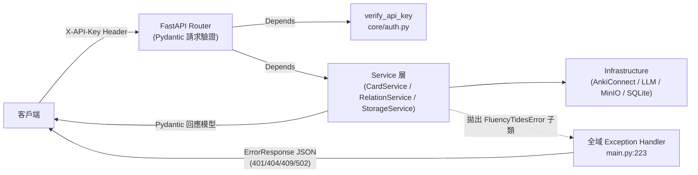

# FluencyTides API 參考文檔

本文檔完整記錄 FluencyTides 後端（FastAPI，版本 `0.2.0`）目前實際對外暴露的所有 HTTP 端點，包括方法、路徑、認證方式、請求參數、Body Schema、回應結構與錯誤情況。所有內容均逐一比對 `backend/app/api/` 下的五個路由檔（`cards.py`、`relations.py`、`storage.py`、`health.py`、`webhook.py`）、`backend/app/main.py` 的路由註冊與 `backend/app/core/auth.py` 的認證實作，**以代碼現狀為準**——包括已知會導致 500 錯誤的缺陷端點，也如實記錄。

產生日期：2026-07-07（由 Claude Code 全項目審查產生）
最後更新：2026-07-09（第二輪：階段 0-2 修復後同步，見 [11_Implementation_Log.md](11_Implementation_Log.md)）

---

## 目錄

1. [基本資訊與路由掛載](#1-基本資訊與路由掛載)
2. [認證機制](#2-認證機制)
3. [統一錯誤回應格式](#3-統一錯誤回應格式)
4. [端點總覽](#4-端點總覽)
5. [Health 端點](#5-health-端點)
6. [Cards 端點](#6-cards-端點)
7. [Relations 端點](#7-relations-端點)
8. [Storage 端點](#8-storage-端點)
9. [Telegram Webhook 端點](#9-telegram-webhook-端點)
10. [Schema 附錄](#10-schema-附錄)
11. [已知問題與注意事項](#11-已知問題與注意事項)

---

## 1. 基本資訊與路由掛載

FastAPI 應用實例定義於 `backend/app/main.py:192`，`title="FluencyTides API"`、`version="0.2.0"`。路由掛載集中於 `backend/app/main.py:276-284`：

| Router 檔案 | 掛載前綴 | 實際路徑前綴 | 認證 |
|---|---|---|---|
| `backend/app/api/health.py` | `/api` | `/api/health` | 無 |
| `backend/app/api/cards.py` | `/api/v1` | `/api/v1/cards` | X-API-Key（router 層級） |
| `backend/app/api/storage.py` | `/api/v1` | `/api/v1/storage` | X-API-Key（router 層級） |
| `backend/app/api/relations.py` | `/api/v1` | `/api/v1/relations` | X-API-Key（router 層級） |
| `backend/app/api/webhook.py` | 無前綴 | 由環境變數 `TG_WEBHOOK_PATH` 決定（預設 `/api/webhook`） | Telegram Secret Token（未設即 403，2026-07-09 fail-closed） |

另有一個不列入 OpenAPI schema 的根路徑端點 `GET /`（`backend/app/main.py:287-294`），回傳 `{"message": "Welcome to FluencyTides API v0.2.0"}`。

### CORS

CORS 中介層（`backend/app/main.py:262-268`）寫死只允許兩個開發用來源：`http://localhost:5173` 與 `http://127.0.0.1:5173`，`allow_credentials=True`，方法與 Header 全開。生產環境前端經 nginx 同源反向代理 `/api/`（`frontend/nginx.conf`），因此不受此限制影響。

### 全域異常處理

`backend/app/main.py:223-255` 註冊了 `FluencyTidesError` 的全域 exception handler：所有繼承自 `FluencyTidesError`（`backend/app/core/exceptions.py:17`）的業務異常，會被轉換為統一的 `ErrorResponse` JSON，HTTP 狀態碼取自異常類別的 `status_code` 屬性。各路由的 Controller 函數本身**不含任何 try/except**，僅以裝飾器的 `responses={...}` 宣告文件用途的錯誤碼。



---

## 2. 認證機制

實作於 `backend/app/core/auth.py`。

- **方式**：HTTP Header `X-API-Key`，透過 `fastapi.security.APIKeyHeader`（`auto_error=False`，`backend/app/core/auth.py:27-31`）+ `Security` 依賴注入實現。
- **掛載點**：`verify_api_key`（`backend/app/core/auth.py:34-72`）以 **router 層級** `dependencies=[Depends(verify_api_key)]` 掛載於 cards（`backend/app/api/cards.py:32-36`）、relations（`backend/app/api/relations.py:21-25`）、storage（`backend/app/api/storage.py:31-35`）三個 Router，因此這三個 Router 下的**每一個端點**都受保護。
- **金鑰來源**：環境變數 `API_SECRET_KEY`（`backend/app/core/config.py:74-77`，預設 `None`）。
- **驗證邏輯**（依代碼順序）：
  1. 若 `API_SECRET_KEY` **未設定或為空**：**條件式 fail-closed（2026-07-09，F004）**——生產模式（`ENVIRONMENT=production`）下此情況根本無法啟動：`config.py` 的 `enforce_production_security` validator 會在啟動階段拋 `ValueError` 中止；只有**開發模式**才維持原本「記 warning 後直接放行、回傳 `"dev-mode-no-auth"`」的行為以方便本地 Swagger UI。換言之生產漏設密鑰不再是靜默無認證，而是拒絕啟動。
  2. 請求未攜帶 `X-API-Key` Header：拋出 `AuthenticationError` → HTTP 401，`error_code: "AUTHENTICATION_FAILED"`（`backend/app/core/auth.py:60-64`）。
  3. Header 值與 `API_SECRET_KEY` 不符：同樣拋出 `AuthenticationError` → HTTP 401（`backend/app/core/auth.py:66-69`）。
- **不受此認證保護的端點**：`GET /`（根路徑）、`GET /api/health`（刻意開放給監控系統）、Telegram Webhook 端點（改用 Telegram Secret Token 機制，見[第 9 節](#9-telegram-webhook-端點)）。

認證失敗回應範例：

```json
{
  "error_code": "AUTHENTICATION_FAILED",
  "message": "認證失敗：請在 X-API-Key Header 中提供有效的 API Key。",
  "details": null
}
```

---

## 3. 統一錯誤回應格式

所有業務錯誤均回傳 `ErrorResponse`（2026-07-08 起定義移至 `backend/app/schemas/common.py`，`card.py` 保留 re-export 平滑遷移，F078）：

| 欄位 | 型別 | 說明 |
|---|---|---|
| `error_code` | `str` | 機器可讀錯誤代碼（如 `DUPLICATE_CARD`） |
| `message` | `str` | 人類可讀錯誤訊息 |
| `details` | `str \| null` | 除錯用額外細節（目前全域 handler 從不填入，恆為 `null`，見 `backend/app/main.py:247-250`） |

錯誤代碼與 HTTP 狀態碼的完整對映（來源：`backend/app/core/exceptions.py`）：

| error_code | HTTP 狀態碼 | 異常類別 | 觸發情境 |
|---|---|---|---|
| `INTERNAL_ERROR` | 500 | `FluencyTidesError` 基類（`exceptions.py:17-39`） | 未細分的業務錯誤 |
| `DUPLICATE_CARD` | 409 | `DuplicateCardError`（`exceptions.py:42-49`） | 目標牌組中已存在相同主欄位的卡片 |
| `DECK_NOT_FOUND` | 404 | `DeckNotFoundError`（`exceptions.py:52-59`） | 指定的 Anki 牌組不存在 |
| `MODEL_FILE_NOT_FOUND` | 404 | `ModelFileNotFoundError`（`exceptions.py:62-69`） | `anki_models/` 下找不到模型定義 JSON |
| `CARD_NOT_FOUND` | 404 | `CardNotFoundError`（`card_service.py:49-59`，2026-07-09 新增） | note_id 在 Anki 集合中不存在（get/update/delete cards） |
| `PROMPT_TEMPLATE_NOT_FOUND` | 404 | `PromptTemplateNotFoundError`（`exceptions.py:72-79`） | 找不到對應的 Jinja2 Prompt 模板 |
| `LLM_SERVICE_ERROR` | 502 | `LLMServiceError`（`exceptions.py:82-89`） | LLM 請求失敗、回傳空內容或解析失敗 |
| `ANKI_SERVICE_ERROR` | 502 | `AnkiServiceError`（`exceptions.py:92-99`） | AnkiConnect 請求失敗（含找不到筆記） |
| `STORAGE_SERVICE_ERROR` | 502 | `StorageServiceError`（`exceptions.py:102-109`） | MinIO 操作失敗 |
| `AUTHENTICATION_FAILED` | 401 | `AuthenticationError`（`exceptions.py:112-119`） | API Key 未提供或無效 |

> 更新（2026-07-09，Bug 4 / F025）：找不到卡片（note_id 不存在）時，`get_card` / `update_card` / `delete_card` 現在都先以 `find_notes("nid:{id}")` 確認存在、不存在即拋 `CardNotFoundError` → **HTTP 404**（`CARD_NOT_FOUND`），與路由裝飾器宣告一致。原本 get 回 502、update/delete 回 502 或靜默 200 的行為已修正。詳見[第 11 節](#11-已知問題與注意事項)。

此外，任何請求 Body 不符 Pydantic Schema 時，由 FastAPI 內建機制回傳 **422 Unprocessable Entity**（格式為 FastAPI 預設的 `detail` 陣列，不是 `ErrorResponse`）。

---

## 4. 端點總覽

| # | 方法 | 路徑 | 用途 | 認證 | 定義位置 |
|---|---|---|---|---|---|
| 1 | GET | `/` | 歡迎訊息（不列入 OpenAPI） | 無 | `main.py:287` |
| 2 | GET | `/api/health` | 健康檢查 | 無 | `health.py:5` |
| 3 | POST | `/api/v1/cards/generate` | LLM 生成卡片並寫入 Anki | X-API-Key | `cards.py:39` |
| 4 | GET | `/api/v1/cards/models` | 列出可用 Anki 模型（原必然 500 的缺陷已修復，2026-07-09 runtime 實測回 **200**，見 §11） | X-API-Key | `cards.py:77` |
| 5 | GET | `/api/v1/cards/models/{model_file_name}` | 取得模型完整定義 JSON | X-API-Key | `cards.py:97` |
| 6 | GET | `/api/v1/cards/decks` | 列出 Anki 牌組 | X-API-Key | `cards.py:122` |
| 7 | GET | `/api/v1/cards/{note_id}` | 取得單一卡片詳情 | X-API-Key | `cards.py:149` |
| 8 | PUT | `/api/v1/cards/{note_id}` | 更新卡片欄位 | X-API-Key | `cards.py:167` |
| 9 | DELETE | `/api/v1/cards/{note_id}` | 刪除卡片並連動清理關聯 | X-API-Key | `cards.py:187` |
| 10 | GET | `/api/v1/relations/graph` | 取得知識圖譜資料 | X-API-Key | `relations.py:28` |
| 11 | POST | `/api/v1/relations/` | 手動建立卡片關聯 | X-API-Key | `relations.py:66` |
| 12 | GET | `/api/v1/relations/types` | 列出所有關聯類型 | X-API-Key | `relations.py:88` |
| 13 | POST | `/api/v1/relations/delete` | 刪除指定關聯（含反向） | X-API-Key | `relations.py:101` |
| 14 | DELETE | `/api/v1/relations/by-note/{note_id}` | 清除某卡片的所有關聯 | X-API-Key | `relations.py:115` |
| 15 | POST | `/api/v1/relations/sync` | 同步清理孤兒關聯 | X-API-Key | `relations.py:138` |
| 16 | POST | `/api/v1/storage/upload` | 上傳媒體檔案至 MinIO | X-API-Key | `storage.py:38` |
| 17 | GET | `/api/v1/storage/files` | 列出儲存桶內檔案 | X-API-Key | `storage.py:77` |
| 18 | GET | `/api/v1/storage/presign/{object_name:path}` | 取得預簽名下載 URL | X-API-Key | `storage.py:109` |
| 19 | DELETE | `/api/v1/storage/files/{object_name:path}` | 刪除媒體檔案 | X-API-Key | `storage.py:149` |
| 20 | POST | `{TG_WEBHOOK_PATH}`（預設 `/api/webhook`） | 接收 Telegram 更新（背景 ACK） | Telegram Secret Token（**必要，未設即 403**） | `webhook.py:91` |

---

## 5. Health 端點

### GET /api/health

- **定義**：`backend/app/api/health.py:5-10`；以 `prefix="/api"` 掛載於 `backend/app/main.py:276`。
- **用途**：確認 API 進程存活，供監控系統與前端 Dashboard 輪詢。
- **認證**：無（刻意不掛 `verify_api_key`）。
- **請求參數**：無。
- **回應**（200）：

```json
{"status": "ok"}
```

注意：此端點只確認 FastAPI 進程本身在運行，**不檢查** AnkiConnect、LLM、MinIO 或資料庫的連通性。

---

## 6. Cards 端點

Router 定義於 `backend/app/api/cards.py:32-36`（`prefix="/cards"`、`tags=["Cards"]`、router 級 API Key 認證）。所有端點的依賴 `CardService` 由 `core/dependencies.py` 的 `get_card_service` 按請求組裝。

### 6.1 POST /api/v1/cards/generate

- **定義**：`backend/app/api/cards.py:39-74`
- **用途**：輸入單字或句子，經 LLM 結構化生成卡片內容並寫入 Anki。完整流程：牌組檢查 → 防重複 → LLM 結構化生成 → 組裝 Note → 提交至 Anki → 將 LLM 回傳的 `Graph_Relations` 寫入 SQLite 關聯資料庫。
- **請求 Body**：`CardGenerateRequest`（見 [§10.1](#101-cardgeneraterequest)）

```json
{
  "user_input": "ubiquitous",
  "deck_name": "TOEIC::Vocabulary",
  "model_file_name": "TOEIC_Coach_Dark.json",
  "model_name": "TOEIC_Coach_Dark",
  "system_prompt": null,
  "primary_field_name": "Expression",
  "tags": ["toeic"],
  "extra_fields": null
}
```

- **成功回應**（200）：`CardGenerateResponse`

```json
{
  "note_id": 1712345678901,
  "deck_name": "TOEIC::Vocabulary",
  "model_name": "TOEIC_Coach_Dark",
  "message": "卡片生成成功"
}
```

- **錯誤情況**（宣告於 `cards.py:42-47`）：

| 狀態碼 | error_code | 情境 |
|---|---|---|
| 401 | `AUTHENTICATION_FAILED` | API Key 認證失敗 |
| 404 | `DECK_NOT_FOUND` / `MODEL_FILE_NOT_FOUND` / `PROMPT_TEMPLATE_NOT_FOUND` | 牌組、模型定義檔或 Prompt 模板不存在 |
| 409 | `DUPLICATE_CARD` | 主欄位相同的卡片已存在 |
| 502 | `LLM_SERVICE_ERROR` / `ANKI_SERVICE_ERROR` | LLM 或 AnkiConnect 服務異常 |
| 422 | —（FastAPI 預設格式） | 請求 Body 缺少必填欄位或格式錯誤 |

### 6.2 GET /api/v1/cards/models

- **定義**：`backend/app/api/cards.py:77-94`
- **用途**：掃描本地 `anki_models/` 目錄，回傳所有可用模型定義的摘要。
- **請求參數**：無。
- **回應**（200）：`list[AnkiModelInfo]`（見 [§10.4](#104-ankimodelinfo--ankideckinfo)）。
- **歷史缺陷（F001 + Bug 1，✅ 已修復）**：此端點曾因 `CardService.list_available_models` 的 `def` 簽名遺失而必然 500（`AttributeError`）；第一輪恢復方法簽名後，第二輪又發現 F006 的 LLM 503 gate 誤擋此唯讀端點，改注入寬鬆版 `get_llm_client_optional` 後解除。**2026-07-09 以 `TestClient` runtime 實測回 200（回 9 個模型），為此端點首次真實環境佐證**（見 11 號文檔 §1）。

### 6.3 GET /api/v1/cards/models/{model_file_name}

- **定義**：`backend/app/api/cards.py:97-119`
- **用途**：回傳指定模型定義檔的完整 JSON 內容（含欄位定義與 `llm_schema`）。
- **路徑參數**：

| 參數 | 型別 | 說明 |
|---|---|---|
| `model_file_name` | `str` | JSON 檔名，如 `TOEIC_Coach_Dark.json` |

- **成功回應**（200）：`dict[str, object]`——模型定義檔的原始 JSON 字典（結構依各模型檔而異，無固定 Schema）。
- **錯誤情況**：404 `MODEL_FILE_NOT_FOUND`（檔案不存在，由 `CardService.get_model_detail` 將 `FileNotFoundError`/`ValueError` 包裝而來，`backend/app/services/card_service.py:511-514`）；401 認證失敗。

### 6.4 GET /api/v1/cards/decks

- **定義**：`backend/app/api/cards.py:122-142`
- **用途**：透過 AnkiConnect 取得所有牌組的名稱與 ID。**需要 Anki Desktop（含 AnkiConnect 插件）運行中**。
- **請求參數**：無。
- **成功回應**（200）：`list[AnkiDeckInfo]`

```json
[
  {"deck_name": "Default", "deck_id": 1},
  {"deck_name": "TOEIC::Vocabulary", "deck_id": 1712000000000}
]
```

- **錯誤情況**：502 `ANKI_SERVICE_ERROR`（AnkiConnect 無法連線或回傳錯誤，`backend/app/services/card_service.py:533-536`）；401 認證失敗。

### 6.5 GET /api/v1/cards/{note_id}

- **定義**：`backend/app/api/cards.py:149-164`
- **用途**：以筆記 ID 向 Anki 查詢卡片欄位內容與標籤。
- **路徑參數**：

| 參數 | 型別 | 說明 |
|---|---|---|
| `note_id` | `int` | Anki 筆記 ID |

- **成功回應**（200）：`dict[str, object]`，實際結構由 `CardService.get_card` 組裝（`backend/app/services/card_service.py:299-304`），欄位已從 AnkiConnect 的 `{"value": ..., "order": ...}` 格式簡化為純字串：

```json
{
  "note_id": 1712345678901,
  "model_name": "TOEIC_Coach_Dark",
  "tags": ["toeic"],
  "fields": {
    "Expression": "ubiquitous",
    "Meaning": "無所不在的"
  }
}
```

- **錯誤情況**：**404 `CARD_NOT_FOUND`**（找不到筆記；2026-07-09 起 `get_card` 先 `find_notes("nid:{id}")` 確認存在，不存在拋 `CardNotFoundError`，與路由裝飾器宣告一致，F025）；AnkiConnect 連線失敗為 502 `ANKI_SERVICE_ERROR`；401 認證失敗。

### 6.6 PUT /api/v1/cards/{note_id}

- **定義**：`backend/app/api/cards.py:167-184`
- **用途**：更新卡片欄位。若更新內容包含主欄位（預設 `Expression`），後端會同步更新 SQLite 關聯表中的 `source_label`。2026-07-08 更新（F088）：Service 層 `CardService.update_card` 新增 `primary_field_name: str = "Expression"` 參數消除硬編碼主欄位假設；API 端點目前未傳此參數（採預設值），**對外請求/回應形狀不變**。
- **路徑參數**：`note_id: int`。
- **請求 Body**：`CardUpdateRequest`

```json
{
  "fields": {"Expression": "apple", "Meaning": "蘋果"}
}
```

- **成功回應**（200）：

```json
{"message": "卡片更新成功"}
```

- **錯誤情況**：**404 `CARD_NOT_FOUND`**（2026-07-09 起 `update_card` 先 `find_notes("nid:{id}")` 確認存在，不存在回 404，Bug 4 / F025——原本回 502 與宣告不符）；502 `ANKI_SERVICE_ERROR`（其他更新失敗）；422 Body 格式錯誤——**2026-07-08 起 `fields` 為空字典也回 422**（F077，原本靜默接受空更新並回報成功）；401 認證失敗。

### 6.7 DELETE /api/v1/cards/{note_id}

- **定義**：`backend/app/api/cards.py:187-203`
- **用途**：從 Anki 刪除該筆記，並連動刪除關聯資料庫中所有以該筆記為起點或終點的知識圖譜連線（`backend/app/services/card_service.py:346-353`）。
- **路徑參數**：`note_id: int`。
- **成功回應**（200）：

```json
{"message": "卡片刪除成功"}
```

- **錯誤情況**：**404 `CARD_NOT_FOUND`**（2026-07-09 起 `delete_card` 先確認筆記存在，不存在回 404，Bug 4 / F025——原本 AnkiConnect `deleteNotes` 對不存在 note_id 靜默成功回 200，放棄該冪等語意以對齊端點宣告）；502 `ANKI_SERVICE_ERROR`；401 認證失敗。

---

## 7. Relations 端點

Router 定義於 `backend/app/api/relations.py`（`prefix="/relations"`、`tags=["Relations"]`、router 級 API Key 認證）。2026-07-08 更新（F022）：原 `GET /graph` 在 Controller 內直接呼叫 `AnkiClient` 的分層偏離已修復，邏輯下沉至 `RelationService.get_graph_data(anki_client, deck_name)`，Controller 只留參數傳遞。

### 7.1 GET /api/v1/relations/graph

- **定義**：`backend/app/api/relations.py:28-63`
- **用途**：取得知識圖譜資料（節點 + 連線），供前端 `react-force-graph-2d` 渲染。`RelationService.get_graph_data` 向 Anki 查詢筆記（`deck:"{deck_name}"` 或 `deck:*`）與對應卡片狀態，再與 SQLite 關聯紀錄合成（2026-07-08 起邏輯位於 Service 層）。
- **Query 參數**：

| 參數 | 型別 | 必填 | 說明 |
|---|---|---|---|
| `deck_name` | `str \| null` | 否 | 篩選特定牌組；未提供時查詢所有牌組（`deck:*`） |

- **成功回應**（200）：`{"nodes": [...], "links": [...]}`。節點與連線的實際欄位由 `RelationService.get_graph_data` 組裝（`backend/app/services/relation_service.py:264-390`）：

Anki 實體節點（`relation_service.py:326-335`）：

```json
{
  "id": "ubiquitous",
  "group": 1,
  "val": 20,
  "label": "ubiquitous",
  "translation": "無所不在的",
  "pos": "adj.",
  "note_id": 1712345678901,
  "status": "review"
}
```

`status` 依 Anki 卡片 queue 值判定：`new` / `learning` / `review` / `suspended`（`relation_service.py:290-305`）。懸空/幽靈節點（目標單字尚未建卡）只有 `id`、`group`（synonym=2、collocation=3、其他=4）、`val: 10`、`note_id`（可為 `null`），部分含 `label`（`relation_service.py:355-374`）。

連線（`relation_service.py:377-384`）：

```json
{
  "source": "ubiquitous",
  "target": "omnipresent",
  "label": "Synonym",
  "relation_id": 42
}
```

- **錯誤情況**：502 `ANKI_SERVICE_ERROR`——2026-07-08 起 `AnkiConnectError` 已在 Service 層統一包裝為 `AnkiServiceError`，Anki 不可用時回統一 `ErrorResponse` 格式，不再以裸 500 露出（見 §11 第 5 條）；401 認證失敗。

### 7.2 POST /api/v1/relations/

- **定義**：`backend/app/api/relations.py:66-85`
- **用途**：手動新增一筆有向關聯。允許 `target_note_id` 為 `null`，代表建立「懸空關係」（目標單字尚未建卡）。
- **請求 Body**：`CardRelationCreate`（見 [§10.5](#105-relation-dto)）

```json
{
  "source_note_id": 1712345678901,
  "target_note_id": null,
  "relation_type": "synonym",
  "source_label": "ubiquitous",
  "target_label": "omnipresent"
}
```

- **成功回應**（200）：`CardRelationRead`

```json
{
  "id": 42,
  "source_note_id": 1712345678901,
  "target_note_id": null,
  "relation_type": "synonym",
  "source_label": "ubiquitous",
  "target_label": "omnipresent",
  "created_at": "2026-07-07T08:00:00Z"
}
```

- **錯誤情況**：422 Body 格式錯誤——2026-07-08 起驗證強化（F076）：`relation_type` 與 `target_label` 要求 `min_length=1`，且 `source_note_id` / `source_label` 至少一者有值，原本靜默接受的空值請求現在回 422；401 認證失敗。

### 7.3 GET /api/v1/relations/types

- **定義**：`backend/app/api/relations.py:88-98`
- **用途**：取得系統中已註冊的所有關聯類型名稱，供前端下拉選單使用（資料來源為 `relation_types` 字典表）。
- **請求參數**：無。
- **成功回應**（200）：`list[str]`，例如 `["synonym", "antonym", "collocation", "parent"]`。
- **錯誤情況**：401 認證失敗。

### 7.4 POST /api/v1/relations/delete

- **定義**：`backend/app/api/relations.py:101-112`
- **用途**：精準刪除兩個節點之間指定類型的關係。實作上以 label 比對並**同時刪除 A→B 與 B→A 兩個方向**的紀錄（`backend/app/services/relation_service.py:239-255`）。使用 POST 而非 DELETE 是因為需要 Body。
- **請求 Body**：`CardRelationDelete`

```json
{
  "source_label": "ubiquitous",
  "target_label": "omnipresent",
  "relation_type": "synonym"
}
```

- **成功回應**（200）：

```json
{"deleted_count": 2}
```

- **錯誤情況**：422 Body 格式錯誤；401 認證失敗。找不到符合的關聯不算錯誤，回傳 `{"deleted_count": 0}`。

### 7.5 DELETE /api/v1/relations/by-note/{note_id}

- **定義**：`backend/app/api/relations.py:115-135`
- **用途**：清除資料庫中所有與指定 Anki 筆記相關的關聯（無論該筆記是起點還是終點）。設計用於 Anki 端卡片被刪除後的死連結清理。
- **路徑參數**：`note_id: int`。
- **成功回應**（200）：`{"deleted_count": 2}`。
- **錯誤情況**：401 認證失敗。

### 7.6 POST /api/v1/relations/sync

- **定義**：`backend/app/api/relations.py:138-167`
- **用途**：向 Anki 查詢目前所有存在的筆記 ID（搜尋式 `deck:*`），刪除資料庫中已不存在於 Anki 的孤兒關聯。
- **請求參數**：無（無 Body）。
- **成功回應**（200）：`{"deleted_count": 5}`。
- **錯誤情況**：502 `ANKI_SERVICE_ERROR`（宣告於 `relations.py:141-143`）；401 認證失敗。
- **注意（2026-07-09 已修，F002）**：原本若 Anki 集合為空（`find_notes("deck:*")` 回傳空列表），`sync_with_anki` 會把**所有**關聯視為孤兒而清空整個關聯資料庫。現在 `sync_with_anki` 開頭加空列表防護：`valid_note_ids` 為空時記 warning 並 return 0（不執行任何刪除），杜絕「一句 /sync 清空整表」的不可逆資料遺失。

---

## 8. Storage 端點

Router 定義於 `backend/app/api/storage.py:31-35`（`prefix="/storage"`、`tags=["Storage"]`、router 級 API Key 認證）。定位為獨立的媒體存取 API（Phase 2），**尚未與卡片生成流程整合**（`storage.py:7`）。若 lifespan 啟動時 `MinioClient` 初始化失敗（`backend/app/main.py:139-146`），`app.state.minio_client` 為 `None`，2026-07-09 起 `get_minio_client` 對此回統一的 **503 `SERVICE_NOT_CONFIGURED`**（F006），不再以裸 AttributeError 500。

### 8.1 POST /api/v1/storage/upload

- **定義**：`backend/app/api/storage.py:38-74`
- **用途**：上傳檔案至 MinIO 儲存桶。Service 層會自動生成規範化物件名稱（日期 + UUID）並產生預簽名下載 URL。
- **請求格式**：`multipart/form-data`

| 參數 | 位置 | 型別 | 必填 | 說明 |
|---|---|---|---|---|
| `file` | form-data | `UploadFile` | 是 | 要上傳的媒體檔案 |
| `prefix` | query | `str` | 否（預設 `""`） | 物件名稱前綴，如 `voice/` |

- **成功回應**（200）：`StorageUploadResponse`

```json
{
  "object_name": "voice/20260707/a1b2c3d4-....ogg",
  "bucket_name": "fluencytides",
  "file_size_bytes": 48213,
  "presigned_url": "https://minio.example.com/fluencytides/voice/..."
}
```

若預簽名 URL 產生失敗，`presigned_url` 為空字串（`storage.py:73` 的 `result.presigned_url or ""`）。

- **上傳驗證（2026-07-09 新增，F024/F032）**：Service 前置以 `_validate_upload` 檢查——
  - **413 Payload Too Large**：分塊累計超過 `STORAGE_MAX_UPLOAD_MB`（預設 50 MB）。
  - **415 Unsupported Media Type**：副檔名或 `Content-Type` 不在白名單（僅接受音訊與圖片）。
  - **422 Unprocessable Entity**：`prefix` 不符正則（僅允許英數、底線、連字號與斜線，長度上限 64）。
  - 客戶端檔名經 `sanitize_filename()` 白名單過濾後才用於暫存檔與物件名。

  注意：413/415/422 由端點以 `HTTPException` 直接拋出（FastAPI 預設 `detail` 格式），非 `ErrorResponse`。
- **錯誤情況**：413/415/422（見上）；502 `STORAGE_SERVICE_ERROR`（MinIO 操作失敗）；422 缺少 `file`；401 認證失敗；若 `MinioClient` 未初始化則 503 `SERVICE_NOT_CONFIGURED`（F006）。

### 8.2 GET /api/v1/storage/files

- **定義**：`backend/app/api/storage.py:77-106`
- **用途**：列出預設儲存桶內的媒體檔案。
- **Query 參數**：

| 參數 | 型別 | 必填 | 說明 |
|---|---|---|---|
| `prefix` | `str \| null` | 否 | 物件名稱前綴過濾，如 `voice/20240101/` |

- **成功回應**（200）：`StorageListResponse`

```json
{
  "files": [
    {
      "object_name": "voice/20260707/a1b2c3d4-....ogg",
      "size_bytes": 48213,
      "last_modified": "2026-07-07T08:00:00+00:00",
      "content_type": "audio/ogg"
    }
  ],
  "total_count": 1
}
```

- **錯誤情況**：502 `STORAGE_SERVICE_ERROR`；401 認證失敗。

### 8.3 GET /api/v1/storage/presign/{object_name:path}

- **定義**：`backend/app/api/storage.py:109-146`
- **用途**：為指定物件產生有時效性的預簽名下載 URL。路徑參數使用 `:path` 轉換器，因此 `object_name` 可含 `/`（如 `voice/20260707/xxx.ogg`）。
- **參數**：

| 參數 | 位置 | 型別 | 必填 | 說明 |
|---|---|---|---|---|
| `object_name` | path | `str`（可含 `/`） | 是 | 物件名稱（含路徑前綴） |
| `expires_days` | query | `int`，`ge=1, le=7` | 否（預設 7） | URL 有效天數（MinIO 上限 7 天） |

- **成功回應**（200）：`StoragePresignedUrlResponse`

```json
{
  "object_name": "voice/20260707/a1b2c3d4-....ogg",
  "presigned_url": "https://minio.example.com/fluencytides/voice/...?X-Amz-...",
  "expires_days": 7
}
```

- **錯誤情況**：502 `STORAGE_SERVICE_ERROR`；422 `expires_days` 超出 1-7 範圍；401 認證失敗。

### 8.4 DELETE /api/v1/storage/files/{object_name:path}

- **定義**：`backend/app/api/storage.py:149-168`
- **用途**：刪除儲存桶內指定物件。此操作為**冪等**——刪除不存在的物件同樣視為成功。
- **路徑參數**：`object_name: str`（可含 `/`）。
- **成功回應**：**204 No Content**（無 Body，`storage.py:151` 明確設定 `status_code=204`）。這是全 API 唯一使用 204 的端點。
- **錯誤情況**：502 `STORAGE_SERVICE_ERROR`；401 認證失敗。

---

## 9. Telegram Webhook 端點

### POST {TG_WEBHOOK_PATH}（預設 `/api/webhook`）

- **定義**：`backend/app/api/webhook.py:91-155`；不帶前綴直接掛載（`backend/app/main.py:393`）。
- **路徑決定方式**：路徑在**模組 import 時**由 `settings.TG_WEBHOOK_PATH` 決定（`webhook.py:91`，預設值 `/api/webhook`，見 `backend/app/core/config.py:254-257`）。此端點僅在設定了 `TG_WEBHOOK_DOMAIN` 且 lifespan 成功呼叫 `bot.set_webhook`（`backend/app/main.py:173-211`）時才有實際作用；未設定時 Bot 走 Long Polling，此端點雖存在但回傳 `bot_disabled`。
- **用途**：接收 Telegram 伺服器推播的 Update JSON，轉為 aiogram `Update` 物件後**丟入背景任務**餵給 `app.state.dp`（Dispatcher）處理（2026-07-09 起改背景 ACK，見下）。
- **認證（2026-07-09，F005 fail-closed）**：**不受 X-API-Key 保護**，改以 Telegram 官方機制驗證。**未設定 `TG_WEBHOOK_SECRET` 時不再放行——一律回 403 `{"status": "unauthorized"}`**（`webhook.py:122-131`，開發模式額外輸出設定指引 warning，生產模式記 error）。已設定時比對 Header `X-Telegram-Bot-Api-Secret-Token`，且改用 `hmac.compare_digest` 常數時間比較（F049），日誌不再輸出任何密鑰片段（F068）。Bot 側 `WhitelistMiddleware` 使用者白名單為第二道防線。
- **請求 Body**：Telegram Bot API 的 [Update](https://core.telegram.org/bots/api#update) JSON（由 aiogram 的 `Update(**update_data)` 驗證）。
- **回應**：驗證通過後**立即回傳 HTTP 200**（背景 ACK，F044），驗證失敗回 **403**：

| 情境 | HTTP | 回應 Body | 代碼位置 |
|---|---|---|---|
| Bot 或 Dispatcher 未初始化（未設 token 或走 Polling 模式） | 200 | `{"status": "bot_disabled"}` | `webhook.py:116-119` |
| 未設 `TG_WEBHOOK_SECRET` 或 Secret Token 驗證失敗 | **403** | `{"status": "unauthorized"}` | `webhook.py:122-140` |
| 驗證通過、update 已丟入背景任務 | 200 | `{"ok": true}` | `webhook.py:151-155` |
| JSON 解析失敗 | 200 | `{"ok": false, "error": "invalid_update"}` | `webhook.py:142-148` |

- **背景 ACK（F044 + Bug A）**：驗證通過後以 `asyncio.create_task(_process_update(...))` 把 update 丟入背景並立即回 200（`webhook.py:151`），`dp.feed_update` **不再被 webhook 回應流程 `await`**——長耗時任務（語音評分、卡片生成）不會拖住 HTTP 回應，杜絕 Telegram 逾時重送造成的重複處理。背景任務參照存入模組級 `_background_tasks` 集合防 GC；shutdown 時 `main.py` 於關閉資源前先呼叫 `wait_for_background_tasks(timeout=30.0)` 讓進行中的任務收尾，避免已回 200 的 update 被砍在半途而永久遺失。

---

## 10. Schema 附錄

以下僅列出 REST API 實際使用的 Schema。所有模型均為 Pydantic v2。

### 10.1 CardGenerateRequest

定義：`backend/app/schemas/card.py:26-86`。

| 欄位 | 型別 | 必填 | 預設 | 約束 / 說明 |
|---|---|---|---|---|
| `user_input` | `str` | 是 | — | `min_length=1`；使用者輸入的原始文字 |
| `deck_name` | `str` | 是 | — | `min_length=1`；目標牌組，支援 `::` 巢狀 |
| `model_file_name` | `str` | 是 | — | `min_length=1`；模型定義 JSON 檔名 |
| `model_name` | `str` | 是 | — | `min_length=1`；Anki 筆記類型名稱 |
| `system_prompt` | `str \| null` | 否 | `null` | 為 `null` 時依 `model_name` 從 Jinja2 模板自動載入 |
| `primary_field_name` | `str` | 否 | `"Expression"` | 防重複檢查用的主欄位名 |
| `tags` | `list[str]` | 否 | `[]` | 附加標籤 |
| `extra_fields` | `dict[str, str] \| null` | 否 | `null` | 不經 LLM、直接合併進 Note 的固定欄位 |

### 10.2 CardGenerateResponse

定義：`backend/app/schemas/card.py:94-119`。

| 欄位 | 型別 | 說明 |
|---|---|---|
| `note_id` | `int` | Anki 回傳的筆記 ID |
| `deck_name` | `str` | 卡片所在牌組 |
| `model_name` | `str` | 使用的筆記類型 |
| `message` | `str` | 預設 `"卡片生成成功"` |

### 10.3 CardUpdateRequest

定義：`backend/app/schemas/card.py:127-137`。

| 欄位 | 型別 | 必填 | 說明 |
|---|---|---|---|
| `fields` | `dict[str, str]` | 是 | 要更新的欄位鍵值對；2026-07-08 起拒絕空字典（回 422，F077） |

### 10.4 AnkiModelInfo / AnkiDeckInfo

定義：`backend/app/schemas/anki.py:218-243`。

`AnkiModelInfo`：

| 欄位 | 型別 | 預設 | 說明 |
|---|---|---|---|
| `model_name` | `str` | — | 模型（筆記類型）名稱 |
| `model_file_name` | `str` | — | 對應 JSON 定義檔名（含 `.json`） |
| `fields` | `list[str]` | `[]` | 欄位名稱列表（依定義順序） |
| `has_llm_schema` | `bool` | `false` | 是否含 `llm_schema` |

`AnkiDeckInfo`：

| 欄位 | 型別 | 說明 |
|---|---|---|
| `deck_name` | `str` | 牌組名稱（支援 `::` 巢狀） |
| `deck_id` | `int` | 牌組唯一 ID |

### 10.5 Relation DTO

定義：`backend/app/schemas/relation.py`。

`CardRelationCreate`（`relation.py:17-33`）：

| 欄位 | 型別 | 必填 | 預設 | 約束 |
|---|---|---|---|---|
| `source_note_id` | `int \| null` | 否 | `null` | 與 `source_label` 至少一者有值（`model_validator`，2026-07-08 加入） |
| `target_note_id` | `int \| null` | 否 | `null` | `null` 代表懸空關係（Ghost Relation） |
| `relation_type` | `str` | 是 | — | `min_length=1, max_length=50`（2026-07-08 起拒絕空字串） |
| `source_label` | `str` | 否 | `""` | `max_length=200`；圖譜繪製用 |
| `target_label` | `str` | 是 | — | `min_length=1, max_length=200`（2026-07-08 起為必填非空） |

`CardRelationRead`（`relation.py:36-59`，`from_attributes=True`）：

| 欄位 | 型別 | 說明 |
|---|---|---|
| `id` | `int` | 資料庫主鍵 |
| `source_note_id` | `int \| null` | 起點 Note ID |
| `target_note_id` | `int \| null` | 終點 Note ID（`null` 為懸空節點） |
| `relation_type` | `str` | 關係類型 |
| `source_label` | `str` | 起點標籤 |
| `target_label` | `str` | 終點標籤 |
| `created_at` | `datetime` | 建立時間（UTC） |

`CardRelationDelete`（`relation.py:62-72`）：

| 欄位 | 型別 | 必填 | 約束 |
|---|---|---|---|
| `source_label` | `str` | 是 | `max_length=200` |
| `target_label` | `str` | 是 | `max_length=200` |
| `relation_type` | `str` | 是 | `max_length=50` |

> 同檔案中的 `CardRelationBatchDelete`（`relation.py:75-87`）與 `RelationDef`（`relation.py:90-108`）目前未被任何 API 端點使用（死代碼）。

### 10.6 Storage 回應模型

定義：`backend/app/schemas/storage_api.py`；`MinioObjectInfo` 來自 `backend/app/schemas/storage.py:55-80`。

`StorageUploadResponse`（`storage_api.py:20-46`）：

| 欄位 | 型別 | 約束 |
|---|---|---|
| `object_name` | `str` | — |
| `bucket_name` | `str` | — |
| `file_size_bytes` | `int` | `ge=0` |
| `presigned_url` | `str` | 產生失敗時為空字串 |

`StorageListResponse`（`storage_api.py:49-65`）：

| 欄位 | 型別 | 約束 |
|---|---|---|
| `files` | `list[MinioObjectInfo]` | 預設 `[]` |
| `total_count` | `int` | `ge=0` |

`MinioObjectInfo`：

| 欄位 | 型別 | 預設 | 說明 |
|---|---|---|---|
| `object_name` | `str` | — | 物件名稱（含路徑前綴） |
| `size_bytes` | `int` | `0`（`ge=0`） | 物件大小 |
| `last_modified` | `str \| null` | `null` | ISO 格式時間字串 |
| `content_type` | `str \| null` | `null` | MIME 類型 |

`StoragePresignedUrlResponse`（`storage_api.py:68-89`）：

| 欄位 | 型別 | 約束 |
|---|---|---|
| `object_name` | `str` | — |
| `presigned_url` | `str` | — |
| `expires_days` | `int` | `ge=1` |

---

## 11. 已知問題與注意事項

以下為審查中確認、與本參考文檔直接相關的 API 層缺陷，使用時需特別留意：

| # | 嚴重度 | 狀態 | 問題 | 位置 |
|---|---|---|---|---|
| 1 | 高 | ✅ 已修復（F001 + Bug 1；2026-07-09 runtime 實測回 200） | ~~`GET /api/v1/cards/models` 必然 500~~：方法簽名已恢復，且解除 llm 503 gate 誤擋 | `backend/app/services/card_service.py` |
| 2 | 高 | ✅ 已於 2026-07-09 修復（F004，見 11 號文檔） | ~~`API_SECRET_KEY` 未設定時所有受保護端點 fail-open~~：改條件式 fail-closed，生產模式空密鑰在啟動階段即被拒 | `backend/app/core/config.py`、`auth.py` |
| 3 | 高 | ✅ 已於 2026-07-09 修復（F005，見 11 號文檔） | ~~`TG_WEBHOOK_SECRET` 未設定時 Webhook 完全無認證~~：改 fail-closed，未設即 403；比對改 `hmac.compare_digest`（F049） | `backend/app/api/webhook.py:122` |
| 4 | 中 | ✅ 已於 2026-07-09 修復（Bug 4 / F025，見 11 號文檔） | ~~`GET`/`PUT`/`DELETE /cards/{note_id}` 對「筆記不存在」回 502 或靜默 200~~：三者均先確認存在，不存在回 404 `CARD_NOT_FOUND` | `backend/app/services/card_service.py` |
| 5 | 中 | ✅ 已於 2026-07-08 修復（F022，見 10 號文檔） | ~~`GET /relations/graph` 裸 500~~：邏輯已下沉 `RelationService.get_graph_data`，`AnkiConnectError` 統一包裝為 `AnkiServiceError`，Anki 不可用時回 502 統一 `ErrorResponse` 格式 | `backend/app/services/relation_service.py` |
| 6 | 中 | ✅ 已於 2026-07-09 修復（F002，見 11 號文檔） | ~~`POST /relations/sync` 在 Anki 空集合時會清空整個關聯資料庫~~：`sync_with_anki` 加空列表防護，空集合時 return 0 不刪除 | `backend/app/services/relation_service.py` |
| 7 | 低 | 🔶 部分改善（2026-07-09） | Webhook 驗證失敗現回 403（可從狀態碼判斷），但成功／解析失敗仍一律 200（避免 Telegram 重送），監控仍需解析 Body | `backend/app/api/webhook.py:131,148,155` |
| 8 | 低 | ⏸ 未處理 | OpenAPI tags 元資料只宣告了 Health/Cards/Storage 三組，缺 Relations 與 Telegram Webhook | `backend/app/main.py` |
| 9 | 低 | ⏸ 未處理 | CORS 白名單寫死 `localhost:5173`，如需其他來源的跨域直連需修改代碼 | `backend/app/main.py` |

2026-07-08 新增的對外行為變化（請求驗證強化，皆回 422）：

- `POST /relations/`：`CardRelationCreate` 的 `relation_type` / `target_label` 拒絕空字串，且 `source_note_id` 與 `source_label` 至少需提供一者（F076）。
- `PUT /cards/{note_id}`：`CardUpdateRequest.fields` 拒絕空字典（F077）。
- `CardService.update_card` 新增 `primary_field_name` 參數（預設 `"Expression"`）；API 端點未傳此參數，對外 API 形狀不變（F088）。

2026-07-09 新增的對外行為變化（第二輪，見 [11_Implementation_Log.md](11_Implementation_Log.md)）：

- `GET` / `PUT` / `DELETE /cards/{note_id}`：note_id 不存在改回 **404 `CARD_NOT_FOUND`**（原 get 回 502、update/delete 回 502 或靜默 200，Bug 4 / F025）。DELETE 因此**放棄「刪除不存在資源回成功」的冪等語意**。
- `POST /storage/upload`：新增 **413**（超過 `STORAGE_MAX_UPLOAD_MB`）、**415**（副檔名/Content-Type 不在白名單）、**422**（prefix 非法）三種以 `HTTPException` 回應（非 `ErrorResponse` 格式，F024）。
- Telegram Webhook：未設 `TG_WEBHOOK_SECRET` 或驗證失敗改回 **403**（原一律 200，F005）；驗證通過改**背景 ACK 立即回 200**（F044），HTTP 回應不再等待長任務。
- 認證：生產模式（`ENVIRONMENT=production`）缺 `API_SECRET_KEY` 由「靜默放行」改為「啟動階段拒絕」（fail-closed，F004）；開發模式不變。
- Storage 端點：`MinioClient` 未初始化時由裸 500 改回 **503 `SERVICE_NOT_CONFIGURED`**（F006）。
