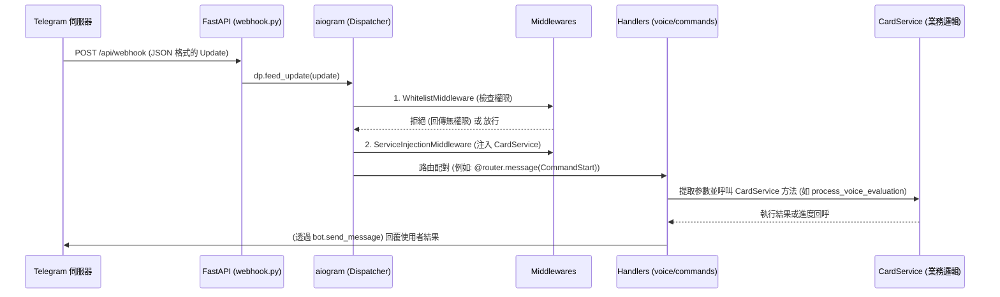

# Telegram Bot 整合與通訊指南 (Phase 3)

這份文件詳細說明了 FluencyTides 後端如何接收、解析並處理來自 Telegram 的訊息。整個流程設計嚴格遵守 **Clean Architecture** 與 **雙端 Controller 解耦** 禁令。

## 1. 系統資料流概觀 (Data Flow Overview)

當使用者在 Telegram 中傳送訊息或點擊 Deep Link 時，資料會經過以下層層關卡：

## 2. 接收入口 (Webhook Endpoint)

系統提供兩種接收 Telegram 訊息的模式，由 `.env` 的設定決定：

### A. Webhook 模式 (生產環境推薦)
- **設定**：需設定 `TG_WEBHOOK_DOMAIN` 與 `TG_WEBHOOK_PATH`。
- **註冊**：FastAPI 啟動時（`main.py` 的 `lifespan` 階段），會呼叫 `bot.set_webhook` 告訴 Telegram 我們的伺服器位址。
- **接收**：Telegram 官方會以 POST 方法向我們的 `app/api/webhook.py` 發送 `Update` JSON。FastAPI 收到後不進行業務處理，直接呼叫 `aiogram` 的 `dp.feed_update()`。

### B. Long Polling 模式 (開發環境推薦)
- **設定**：將 `TG_WEBHOOK_DOMAIN` 留空。
- **啟動**：在 `lifespan` 階段，系統會清除現有 Webhook，並在背景啟動 `dp.start_polling(bot)`，由系統主動去 Telegram 伺服器拉取最新訊息。

## 3. 分發與中介層 (aiogram Dispatcher & Middlewares)

為了保證 Controller 層的純潔性與安全性，我們善用 `aiogram` 的中介層功能（設定於 `app/bot/dispatcher.py`）：

1. **`WhitelistMiddleware`**：
   - 位於最外層（Outer Middleware）。
   - 負責比對使用者的 Telegram User ID 是否存在於 `.env` 的 `TG_ALLOWED_USER_IDS` 中。
   - 若無權限，直接攔截並回覆，絕不讓非法請求觸碰到核心業務。
2. **`ServiceInjectionMiddleware`**：
   - 位於內層（Inner Middleware）。
   - 負責從 FastAPI 的 `app.state` 中提取 `AnkiClient` 等資源，組裝成 `CardService` 並注入到 Handler 的參數中。
   - 這確保了所有 Handler 都能無狀態地呼叫共用業務邏輯。

## 4. Deep Link 解析 (Deep Link Parser)

Telegram 的 Deep Link 格式為 `https://t.me/<BOT_USERNAME>?start=<payload>`。當使用者點擊 Anki 上的按鈕跳轉至 Telegram 時，會觸發帶有 payload 的 `/start` 指令。

- **解析器**：`app/bot/utils/deep_link_parser.py`
- **資料傳輸物件 (DTO)**：`app/schemas/deep_link.py`

解析器會將亂碼或特定格式的字串（例如 `rec_12345`）安全地解析為 Pydantic Typed Models（例如 `RecordAudioAction(card_id=12345)`），並在出錯時提供友善的錯誤訊息。Handler 層只需要判斷 `Action` 的型別即可決定下一步。

## 5. 兩階段狀態管理 (State Management)

語音評分等任務需要使用者分兩次互動：
1. 點擊 Deep Link 啟動任務。
2. 傳送語音訊息。

我們透過 `app/bot/state.py` 實作了 In-Memory 的狀態機：
- **存儲**：當解析到 `RecordAudioAction` 時，將狀態寫入記憶體，並加上過期時間（預設 5 分鐘，由 `TG_STATE_EXPIRE_MINUTES` 控制）。
- **過期**：若使用者點擊按鈕後超過 5 分鐘才發送語音，系統會判定超時並拒絕處理。
- **消費**：語音發送完成後，狀態會被清除（Consume），避免重複觸發。

## 6. Handler 與 Service 的解耦 (Clean Architecture)

我們對所有的 Bot Handler 下達了嚴格的「雙端 Controller 禁令」。

以 `voice.py` 為例：
1. **不做業務判斷**：它不負責讀取 Anki、不負責呼叫 LLM 評分、不負責將結果寫回 JSON。
2. **只做介面溝通**：
   - 呼叫 `UserStateManager` 檢查狀態。
   - 呼叫 `bot.download()` 取得音訊二進位檔。
   - 呼叫 `card_service.process_voice_evaluation()`，並傳遞一個回呼函數（Callback）用來更新 Telegram 上顯示的「進度條（如 50%...）」。
   - 接收 Service 回傳的評分結果後，格式化為漂亮的 HTML 回傳給使用者。

這樣的設計保證了不管我們今天是透過 Telegram 還是未來的 Web 前端提交錄音，核心邏輯（`CardService`）都不需要修改一行程式碼。
