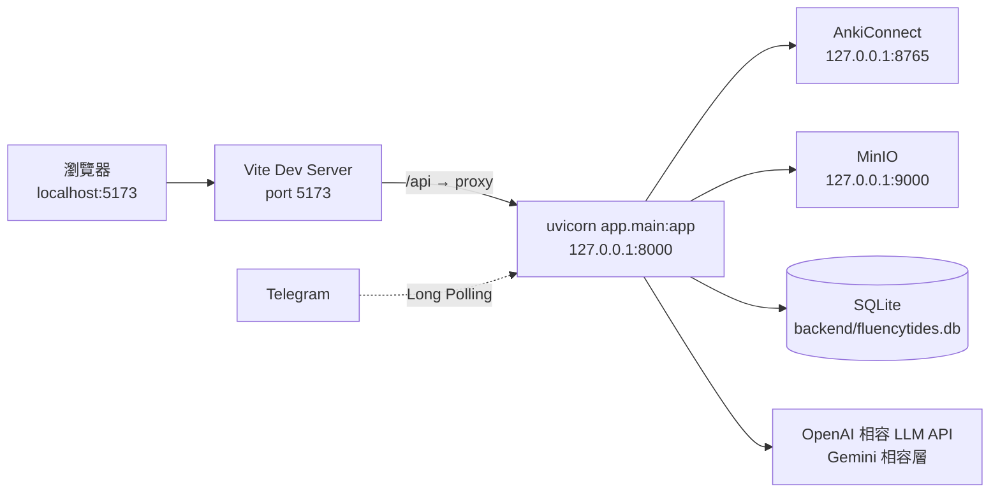
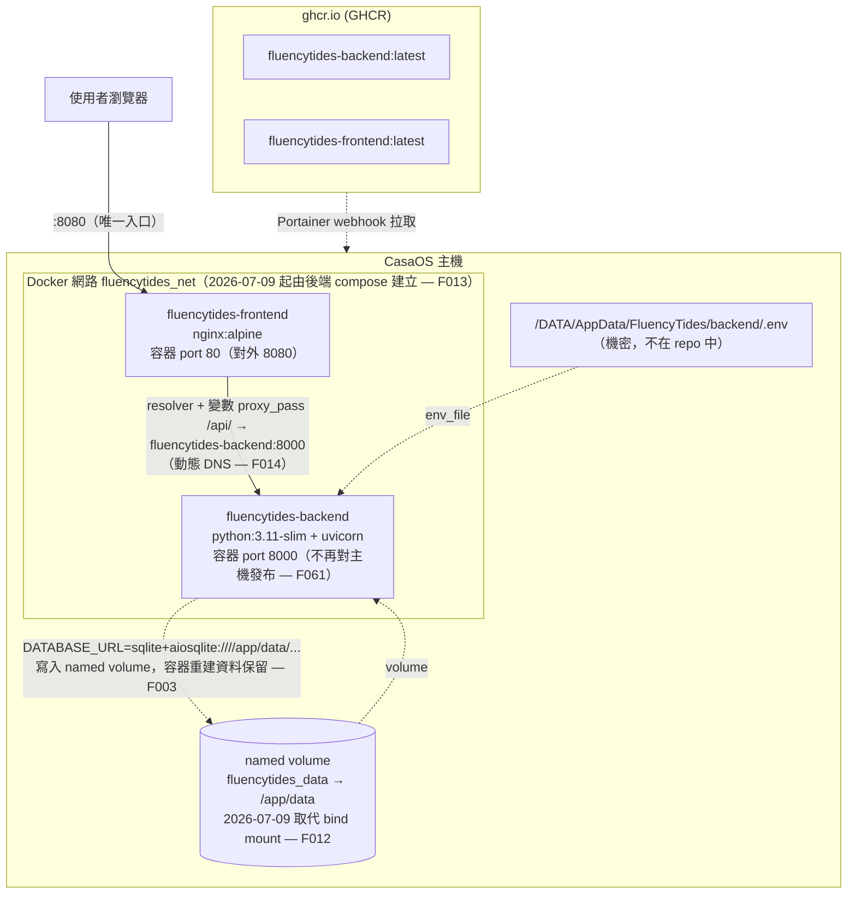
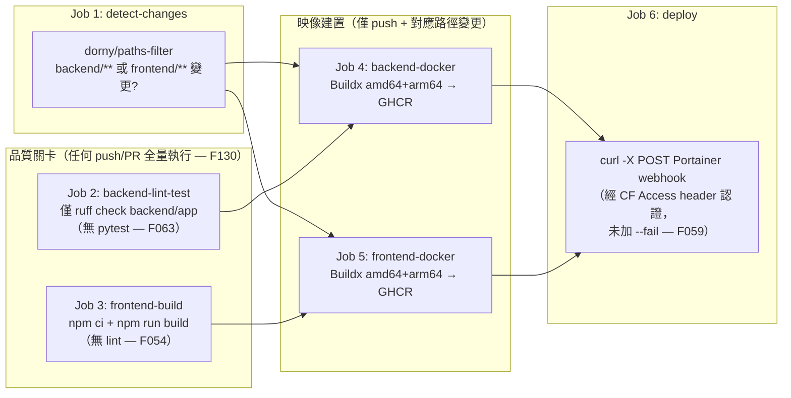

# 05. 部署與 DevOps 文檔

> 產生日期：2026-07-07（由 Claude Code 全項目審查產生）
> 最後更新：2026-07-09（第二輪：階段 0-2 修復後同步，見 [11_Implementation_Log.md](11_Implementation_Log.md)）

本文檔描述 FluencyTides 目前**實際存在**的開發啟動方式、Docker 部署架構、CI/CD 管線與環境變數配置，全部內容基於對 repo 內 Dockerfile、docker-compose、GitHub Actions workflow、`backend/app/core/config.py` 與 `.env.example` 的逐檔核實，並在最後彙整本次全項目審查發現的 DevOps 相關問題（含 finding id）。本文描述的是代碼現狀而非理想狀態——多個已知缺陷（如 SQLite 持久化失效、共用網路無人建立）會在對應章節直接標注。

---

## 目錄

1. [本地開發啟動方式](#1-本地開發啟動方式)
2. [Docker 部署架構](#2-docker-部署架構)
3. [CI/CD 現狀](#3-cicd-現狀)
4. [環境變數完整清單](#4-環境變數完整清單)
5. [DevOps 問題與建議](#5-devops-問題與建議)

---

## 1. 本地開發啟動方式

### 1.1 整體開發拓撲

本地開發採「前後端分離、Vite dev server 代理」模式：



- Vite 的 `/api` 代理設定在 `frontend/vite.config.ts:16-24`，target 為 `http://127.0.0.1:8000`。
- 後端 CORS 硬編碼允許 `http://localhost:5173` 與 `http://127.0.0.1:5173`（`backend/app/main.py:264`），因此本地開發即使不走代理、直接跨域呼叫 8000 埠也可行；但生產網域不在此清單內（見 [F019](#f019)）。
- 未設定 `TG_WEBHOOK_DOMAIN` 時，Telegram Bot 自動以 Long Polling 背景任務運行，本地開發無需公網網域。

### 1.2 後端啟動

```bash
cd backend
python -m venv .venv && source .venv/bin/activate   # Python 3.11（CI 與 Dockerfile 均為 3.11）
pip install -r requirements.txt
cp .env.example .env    # 依實際環境填寫，見第 4 節
uvicorn app.main:app --host 0.0.0.0 --port 8000 --reload
```

注意事項（均為代碼現狀，非慣例）：

| 事項 | 依據 |
|---|---|
| **必須在 `backend/` 目錄下啟動**。`Settings` 的 `env_file=".env"` 是相對 CWD 的路徑（`backend/app/core/config.py:61`），從 repo 根目錄啟動會靜默讀不到 `.env`、全部退回預設值（含跳過 API 認證）。 | [F066](#f066) |
| SQLite 路徑則不受 CWD 影響：`resolve_sqlite_path` validator（`backend/app/core/config.py:90-108`）會把 `sqlite+aiosqlite:///./xxx.db` 絕對化到 `backend/` 目錄下。 | 已核實 |
| 資料表建立 2026-07-09 起分模式：**非生產模式**（預設）lifespan 啟動時 `create_db_and_tables()` 自動建表（`backend/app/main.py:118-125`，本地開發免跑 alembic）；**生產模式**（`ENVIRONMENT=production`）跳過 create_all，schema 須先 `alembic upgrade head`（baseline `7f3d1a2b4c5e` 已就緒，可從空庫獨立重建，F009/F036）。 | 11 號文檔 §1 |
| `.env` 幾乎全部欄位可選：`TG_BOT_TOKEN` 未設時 Bot 停用、LLM/MinIO/AudioEvaluator 初始化失敗時降級為 `None` 不阻擋啟動（`backend/app/main.py` lifespan 的 try/except），只有 AnkiConnect 與資料庫是硬依賴。2026-07-08 起 LLM 未設定時 Bot 不再整體崩潰，改為生成功能單獨回覆錯誤（F046）。 | backend-core 審查、10 號文檔 |
| CLI 腳本一律以 `python -m` 從 `backend/` 目錄執行（如 `python -m scripts.update_tg_bot_links`）。2026-07-08 起 `update_tg_bot_links.py` 移除了模組層 `os.chdir + sys.path` hack，**不再支援直接以檔案路徑執行**，須改用 `python -m scripts.update_tg_bot_links`（F113）。 | 10 號文檔 §3 |

### 1.3 前端啟動

```bash
cd frontend
npm ci
cp .env.example .env    # 可選：僅含 VITE_DEFAULT_DECK / VITE_DEFAULT_MODEL_FILE 兩個預設值
npm run dev             # Vite dev server, port 5173
```

`frontend/package.json:6-11` 定義的 scripts：

| Script | 內容 | 現狀 |
|---|---|---|
| `dev` | `vite` | 正常，但**會優先載入被誤 commit 的 `vite.config.js` 而非 `vite.config.ts`**，對 `.ts` 設定檔的修改會被靜默忽略（見 [F010](#f010)） |
| `build` | `tsc -b && vite build` | 正常，兼作 CI 的型別檢查；但 `tsc -b` 對 composite 專案會 emit 出 `vite.config.js/.d.ts`，即是 F010 的根因 |
| `lint` | `eslint .` | **無法執行**：ESLint 9 需要 flat config，但 frontend 目錄不存在任何 `eslint.config.*` / `.eslintrc*`（見 [F054](#f054)） |
| `preview` | `vite preview` | 正常 |

### 1.4 本地 Docker 驗證（現狀：不可行）

repo 內的兩份 docker-compose 是為 CasaOS/Portainer 生產部署寫的，**在開發機無法直接 `docker compose up`**：

1. ~~`backend/docker-compose.yml` 的 `env_file` 硬編碼 CasaOS 主機絕對路徑 `/DATA/AppData/FluencyTides/backend/.env`，本機不存在此檔即啟動失敗~~（[F133](#f133) ✅ 已於 2026-07-09 第三輪修復：改為相對路徑 `./.env` + 註解說明 CasaOS 部署對應）。
2. ~~兩份 compose 的 `fluencytides_net` 均宣告 `external: true`，須先手動建立網路~~（[F013](#f013) 已於 2026-07-09 修復：改由後端 compose 建立，先啟動後端即可，不再需要手動 `docker network create`）。

---

## 2. Docker 部署架構

### 2.1 部署拓撲

部署面採「前後端**兩份完全獨立**的 compose stack」，透過一個 external Docker 網路互通，目標平台為 CasaOS（compose 內含 `x-casaos` 擴展區塊）搭配 Portainer 管理：



### 2.2 後端 stack（`backend/docker-compose.yml`）

| 配置項 | 實際內容（2026-07-09 更新） | 位置 |
|---|---|---|
| image | `ghcr.io/jacky917/fluencytides-backend:latest` | `backend/docker-compose.yml` |
| ports | **無**（8000 不再對主機發布，只在 `fluencytides_net` 內經 nginx 反代出口，F061） | `backend/docker-compose.yml` |
| env_file | `/DATA/AppData/FluencyTides/backend/.env`（CasaOS 絕對路徑） | `backend/docker-compose.yml` |
| environment | 僅 `TZ=Asia/Tokyo` | `backend/docker-compose.yml` |
| volumes | **named volume `fluencytides_data:/app/data`**（取代原 bind mount，繼承映像內 chown 過的 ownership，F012） | `backend/docker-compose.yml` |
| networks | `fluencytides_net`（**由本 compose 建立**：`networks: fluencytides_net: name: fluencytides_net`，不再 external，F013） | `backend/docker-compose.yml` |
| healthcheck | 於 **Dockerfile** 設 `HEALTHCHECK`（F062，見下） | `backend/Dockerfile:40` |
| x-casaos | 宣告支援 amd64/arm64/**arm**（CI 未建 arm — [F127](#f127)）；入口改 `index: /` + `port_map: "8080"` 指向前端（8000 移除後原 `/docs` 死連結已修正） | `backend/docker-compose.yml` |

**後端映像**（`backend/Dockerfile`）：基於 `python:3.11-slim`，安裝 `curl` 與 `ffmpeg`（ffmpeg 被 `app/infrastructure/ffmpeg/` 與 OpenAI 音訊轉碼 F008 使用），requirements 分層快取，`RUN useradd -m apiuser && mkdir -p /app/data && chown -R apiuser /app`（**F012：預先建立 `/app/data` 並 chown**，`Dockerfile:33`）以非 root `apiuser` 執行，CMD 為 `uvicorn app.main:app --host 0.0.0.0 --port 8000`。**2026-07-09 起已加 HEALTHCHECK**（`Dockerfile:40`，`curl -f http://localhost:8000/api/health`，F062）。殘留：仍無 `--forwarded-allow-ips`（F060）、Docker CMD 與 CI 仍無 `alembic upgrade` 整合步驟（見 3.2）。

**資料持久化已修復（F003 + F012 + F009）**：`.env.example:29` 的預設 `DATABASE_URL` 改為 `sqlite+aiosqlite:////app/data/fluencytides.db`（四斜線絕對路徑，指向掛載卷內）；compose 改用 named volume `fluencytides_data`（首次掛載繼承映像內 `/app/data` 的 apiuser ownership，非 root 有寫入權）。容器重建不再銷毀資料庫，也不再撞主機目錄權限。原「靜默資料遺失／啟動失敗」雙故障路徑均已消除。舊 bind mount 資料以 `docker cp` 搬入 named volume（compose 註解附繁中遷移步驟）。

**部署注意事項（2026-07-09 更新，見 11 號文檔）**：

- **資料庫遷移**：生產模式（`ENVIRONMENT=production`）已跳過 `create_all`（F036），schema 須先 `alembic upgrade head`——baseline 遷移 `7f3d1a2b4c5e` 已就緒，可從全新環境獨立 upgrade（見 §2.5）。
- **fail-closed 密鑰**：生產模式 `.env` 缺 `API_SECRET_KEY`（或啟用 Webhook 卻缺 `TG_WEBHOOK_SECRET`）會在啟動階段被 config validator 拒絕，服務起不來——這是刻意的安全預設，部署前務必於 `.env` 設妥。

**（第一輪）部署注意事項（2026-07-08，見 10 號文檔 §6）**：

- **模型檔快取**：`ModelFileRepository` 對 `app/anki_models/` 下的模型 JSON/HTML/CSS 檔案於首次讀取後做實例級快取，**執行期修改模型檔需重啟服務**才會生效。
- `ensure_deck_exists` 預設不再於牌組缺失時自動觸發 AnkiWeb 同步（改為快速失敗）；匯入腳本已顯式保留舊行為。
- 空值請求（空 `fields`、空 `relation_type`）從靜默接受變為 422；`/relations/graph` 遇 Anki 故障改回 502 統一錯誤格式。
- LLM 401/400 立即失敗不重試；AnkiConnect `sync()` 超時 30 → 60 秒。

### 2.3 前端 stack（`frontend/docker-compose.yml`）

| 配置項 | 實際內容 | 位置 |
|---|---|---|
| image | `ghcr.io/jacky917/fluencytides-frontend:latest` | `frontend/docker-compose.yml:4` |
| ports | `8080:80`（CasaOS 佔用 80，故對外 8080） | `frontend/docker-compose.yml:10` |
| volumes / env_file | 無（註解說明：環境變數在 build 階段已打包進 JS——但實際上 build 階段也沒注入，見 [F053](#f053)） | `frontend/docker-compose.yml:19-20` |
| networks | `fluencytides_net`（`external: true`） | `frontend/docker-compose.yml:49-51` |

**前端映像**（`frontend/Dockerfile`）：兩階段建置——`node:20-alpine` 執行 `npm ci && npm run build`，產物交給 `nginx:alpine`，靜態根目錄為 `/usr/share/nginx/FluencyTides`。builder stage **沒有任何 `ARG`/`ENV` 宣告**，且 `.dockerignore` 排除 `.env*`，因此 `VITE_*` 變數在生產映像中永遠是 `undefined`（[F053](#f053)）。

**Nginx 設定**（`frontend/nginx.conf`，2026-07-09 更新）：
- `location /`：SPA `try_files $uri $uri/ /index.html`，gzip 開啟。
- `location /api/`：**改用 Docker 內建 DNS 動態解析**（`resolver 127.0.0.11 valid=10s;` + `set $backend_upstream http://fluencytides-backend:8000;` + `proxy_pass $backend_upstream;`，`nginx.conf:33-35`），於「請求當下」才解析容器名——後端不存在時 nginx 仍能啟動、後端重建換 IP 後不再快取舊 IP 回 502（[F014](#f014) 已修）。並加 `proxy_read_timeout 300s`（`nginx.conf:44`）防 LLM 長請求 60 秒被切斷（[F132](#f132) 已修）；保留 `X-Real-IP`/`X-Forwarded-For` header 與 `client_max_body_size 50M`。

### 2.4 兩份 compose 的相互關係

兩者**唯一的耦合點**是 `fluencytides_net` 網路與 nginx 反代中的容器名 `fluencytides-backend`。關鍵事實（2026-07-09 更新）：

- **網路由後端 compose 建立**（`networks: fluencytides_net: name: fluencytides_net`，不再 external），前端維持 external 加入——**須先啟動後端再啟動前端**（後端 compose 頂部已附繁中啟動順序註解），[F013](#f013) 已修，不再需要手動 `docker network create`。
- 沒有 `depends_on`（跨 stack 本來也做不到）；nginx 改動態 DNS 解析後，後端未先起也不會讓前端 nginx 崩潰（[F014](#f014) 已修），只是 `/api/` 暫時 502 直到後端就緒。
- 前端更新走映像重建（`VITE_*` 為建置期注入），後端組態更新走主機 `.env` + 容器重啟，兩者生命週期完全獨立。

### 2.5 資料庫遷移（2026-07-09 更新）

第二輪把 schema 建立從「無條件 create_all」改為分模式，並補齊 Alembic 遷移鏈（F009 + F036），生產部署流程隨之改變：

- **生產部署：先 `alembic upgrade head`，不再靠 create_all**。`ENVIRONMENT=production` 時 lifespan 跳過 `create_db_and_tables()`，schema 完全交由 Alembic。遷移鏈現為 `7f3d1a2b4c5e`（baseline：`create_table(card_relations)` + 索引，`down_revision=None`）→ `9bbc72f7c470`（建 `relation_types` + 放寬 note_id nullable，`down_revision` 已改指向 baseline）。**全新環境 `alembic upgrade head` 可獨立建齊三表（`card_relations` / `relation_types` / `alembic_version`），已 runtime 實測通過**（見 11 號文檔 §1）。
- **開發模式**（預設）維持啟動時 `create_all` 自動建表，本地免跑 alembic。
- **已知張力**：`alembic/env.py` import 期實例化 `settings`，生產模式跑遷移的環境須帶 `API_SECRET_KEY`，否則 fail-closed validator 會在 import 期 `ValidationError` 中止；緩解方式為遷移步驟提供應用密鑰，或以 `ENVIRONMENT=development` 單獨執行遷移（見 11 號文檔 §6 遺留項）。
- **殘留**：Docker CMD 與 CI 仍未自動化 `alembic upgrade`（屬階段 3）；`9bbc` 遷移的 SQLite 方言 `server_default`（[F052](#f052)）仍待改為 `sa.func.now()`。

### 2.6 部署前 runtime 驗證（2026-07-09 新增）

第二輪首次建立 **Python 3.11 venv + 完整依賴** 做端到端 runtime 驗證（此前只有 `py_compile`）：透過 `TestClient` 驗證了 `app.main` 啟動生命週期、`GET /api/health`、`GET /api/v1/cards/models`（回 200／9 個模型）、`GET /api/v1/relations/graph`、OpenAPI schema 生成、Alembic baseline 遷移在全新 DB 套用、fail-closed validator（生產空密鑰被拒／開發放行）、Anki 查詢跳脫函數；前端 `npm install` + `tsc -b` 通過且無殘留產物。**強烈建議把這份驗證清單固化為 `backend/tests/` 的 pytest smoke test，並在 CI 設為 docker job 的前置 needs**（F063，尚未完成）。驗證過程也撈出 `greenlet` 未列於 requirements（見 §3.3）。

---

## 3. CI/CD 現狀

### 3.1 管線流程（`.github/workflows/main.yml`）

觸發條件：push / PR 到 `main`；同分支新 push 會取消進行中的 workflow（`concurrency`，`.github/workflows/main.yml:26-28`）。



各 job 實際內容（已逐行核實）：

| Job | 觸發條件 | 實際動作 | 位置 |
|---|---|---|---|
| `detect-changes` | 僅 push | `dorny/paths-filter@v3` 輸出 backend/frontend 變更旗標 | `.github/workflows/main.yml:39-55` |
| `backend-lint-test` | 所有 push/PR（未接 detect-changes） | Python 3.11 + 安裝 requirements + **只跑 `ruff check backend/app`** | `.github/workflows/main.yml:60-75` |
| `frontend-build` | 所有 push/PR（未接 detect-changes） | Node 20 + `npm ci` + `npm run build`（`tsc -b` 兼型別檢查） | `.github/workflows/main.yml:80-94` |
| `backend-docker` | push 且 backend 變更且 lint 通過 | Buildx 多架構（`linux/amd64,linux/arm64`）建置推送 `ghcr.io/jacky917/fluencytides-backend`（`latest` + commit SHA），GHA cache | `.github/workflows/main.yml:99-132` |
| `frontend-docker` | push 且 frontend 變更且 build 通過 | 同上，`fluencytides-frontend` | `.github/workflows/main.yml:137-168` |
| `deploy` | `always()` 且至少一個 docker job 成功 | 帶 `CF-Access-Client-Id/Secret` header `curl -X POST` 對應的 Portainer webhook（secrets：`PORTAINER_WEBHOOK_BACKEND/FRONTEND`），最後印出部署摘要 | `.github/workflows/main.yml:173-212` |

所需 GitHub Secrets：`PORTAINER_WEBHOOK_BACKEND`、`PORTAINER_WEBHOOK_FRONTEND`、`CF_ACCESS_CLIENT_ID`、`CF_ACCESS_CLIENT_SECRET`（`.github/workflows/main.yml:10-14`）。

### 3.2 管線缺什麼

| 缺口 | 說明 | Finding |
|---|---|---|
| **零自動化測試** | job 名為「Lint & 測試」但只有 ruff；全 repo 無 `tests/` 目錄、requirements 無 pytest。`card_service.py` 的 `list_available_models` 方法定義損壞（F001，已修）曾通過 CI 並自動部署到生產，正是此缺口的直接後果。2026-07-09 已用臨時 venv 做 runtime smoke（見下），但**尚未沉澱為 repo 內 pytest**，防護網仍缺 | [F063](#f063) |
| 部署結果不驗證 | deploy 的 curl 用 `-s -o /dev/null -w "%{http_code}"` 但無 `--fail`，Portainer 回 403/404/500 時 CI 依然綠燈 | [F059](#f059) |
| lint/build 未用變更過濾 | 只改 README 的 push 也會全量安裝 Python/Node 依賴跑 lint/build | [F130](#f130) |
| DB 遷移步驟未整合 | Docker CMD 與 CI 仍無 `alembic upgrade` 自動步驟；但 2026-07-09 起 baseline 遷移 `7f3d1a2b4c5e` 已就緒、生產模式不再靠 `create_all`（F036），部署管線應加入 `alembic upgrade head`（留意需帶 `API_SECRET_KEY` 以通過 fail-closed validator，或以 `ENVIRONMENT=development` 單獨執行遷移） | 見 2.2、2.5 節 |
| 前端 lint 缺席 | `npm run lint` 本身壞掉（無 ESLint 設定檔），CI 也未呼叫 | [F054](#f054) |
| 建置不可重現 | `backend/requirements.txt` 全部 `>=` 開放範圍無 lock，同一 commit 不同時間建出不同映像 | [F058](#f058) |
| build-args 未傳遞 | `docker/build-push-action` 未傳任何 `build-args`，`VITE_*` 生產失效 | [F053](#f053) |
| 註解與事實不符 | Job 4/5 註解寫「推送至 Docker Hub」實為 GHCR；image 前綴硬編碼 `jacky917`；platforms 註解宣稱與 x-casaos architectures 對齊但缺 arm | [F131](#f131)、[F127](#f127) |

### 3.3 依賴清單修正（2026-07-09）

第二輪的 runtime 驗證（§2.6）撈出一個真實缺漏：**`greenlet` 未列於 `backend/requirements.txt`**。`greenlet` 是 SQLAlchemy async engine 執行期的必要依賴（`begin`/`connect` 需要），通常隨其他套件被動安裝，但在乾淨環境或依賴樹變動時可能缺席而導致啟動崩潰。已顯式補上 `greenlet>=3.0.0`（附繁中註解）。**F058 已於第三輪修復**：全部依賴由開放的 `>=` 改為相容區間 `>=X,<Y`（0.x 取下一 minor、semver 取下一 major），建置可重現；如需鎖死到 patch 版可後續導入 pip-tools/uv lock。

---

## 4. 環境變數完整清單

以下對照 `backend/app/core/config.py`（Settings 類；經 `@lru_cache` 的 `get_settings()` 取得，模組層 `settings = get_settings()` 保留相容，`config.py:403,419`）與 `backend/.env.example`、`frontend/.env.example` 整理。「必填」欄反映**代碼實際行為**：Settings 所有欄位皆有預設值，但 2026-07-09 起**生產模式（`ENVIRONMENT=production`）的 `enforce_production_security` validator 會讓部分必填項在缺值時直接拒絕啟動**（fail-closed）；開發模式維持全部有預設、無啟動即崩潰的必填項。功能停用類以「功能必填」標注。

### 4.1 後端（`backend/.env` → `backend/app/core/config.py`）

#### 應用基礎

| 變數 | 用途 | 預設值 | 必填 | 定義位置 |
|---|---|---|---|---|
| `PROJECT_NAME` | FastAPI title | `FluencyTides` | 否 | `config.py:73` |
| `ENVIRONMENT` | 部署環境；**`production` 時啟用 fail-closed**（缺 `API_SECRET_KEY` / Webhook `TG_WEBHOOK_SECRET` 拒絕啟動），其他值為開發模式（2026-07-09 新增） | `development` | 生產部署務必設 `production` | `config.py:74`、`is_production` `config.py:91`、validator `config.py:100-140` |
| `LOG_LEVEL` | 全域日誌層級 | `INFO` | 否 | `config.py:82` |
| `API_SECRET_KEY` | X-API-Key 認證金鑰；開發模式空值跳過認證，**生產模式空值拒絕啟動（fail-closed，F004）** | `None` | 生產環境**啟動必填** | `config.py:86` |
| `DATABASE_URL` | SQLAlchemy async 連線 URL；`sqlite+aiosqlite:///./` 開頭時經 validator 絕對化到 backend/ 目錄 | `sqlite+aiosqlite:////app/data/fluencytides.db`（`.env.example`，指向掛載卷；`config.py` 欄位預設仍為 `///./fluencytides.db` 供本地開發） | 否（Docker 已對齊 named volume，F003 已修） | `config.py:145`、validator `config.py:153-171` |

#### AnkiConnect 與 Cloudflare Access

| 變數 | 用途 | 預設值 | 必填 | 定義位置 |
|---|---|---|---|---|
| `ANKI_CONNECT_URL` | AnkiConnect 端點 | `http://127.0.0.1:8765` | 功能必填（核心依賴） | `config.py:113` |
| `ANKI_CONNECT_API_KEY` | AnkiConnect 金鑰 | `None` | 否 | `config.py:117` |
| `CF_ACCESS_CLIENT_ID` | Cloudflare Access Client ID（遠端 AnkiConnect 穿透） | `None` | 否 | `config.py:125` |
| `CF_ACCESS_CLIENT_SECRET` | Cloudflare Access Client Secret | `None` | 否 | `config.py:129` |

#### MinIO 物件存儲

| 變數 | 用途 | 預設值 | 必填 | 定義位置 |
|---|---|---|---|---|
| `MINIO_HOST` | MinIO 主機 | `127.0.0.1` | 否（初始化失敗降級 None） | `config.py:200` |
| `MINIO_PORT` | MinIO 埠 | `9000` | 否 | `config.py:204` |
| `MINIO_ACCESS_KEY` | 存取金鑰；2026-07-09 起**無安全預設值**（原 `minioadmin` 改 `None`，F020） | `None` | MinIO 功能必填 | `config.py:208` |
| `MINIO_SECRET_KEY` | 秘密金鑰；同上（原 `minioadmin` 改 `None`，F020） | `None` | MinIO 功能必填 | `config.py:215` |
| `MINIO_SECURE` | 是否 HTTPS | `False` | 否 | `config.py:222` |
| `MINIO_DEFAULT_BUCKET` | 預設 bucket | `fluencytides-media` | 否 | `config.py:226` |
| `STORAGE_MAX_UPLOAD_MB` | 媒體上傳 API 單檔大小上限（MB），超過回 413（2026-07-09 新增，F024） | `50` | 否 | `config.py:230` |

#### Telegram Bot

| 變數 | 用途 | 預設值 | 必填 | 定義位置 |
|---|---|---|---|---|
| `TG_BOT_TOKEN` | Bot Token；未設定時整個 Bot 停用 | `None` | Bot 功能必填 | `config.py:165` |
| `TG_BOT_USERNAME` | Bot 使用者名稱，生成 Deep Link 用 | `""` | Deep Link 功能必填 | `config.py:169` |
| `TG_ALLOWED_USER_IDS` | 白名單 User ID（逗號分隔）；**空值 = 封鎖所有人**（安全預設） | `""` | Bot 功能必填 | `config.py:173`、property `config.py:215-234` |
| `TG_WEBHOOK_DOMAIN` | Webhook 網域；留空則走 Long Polling | `None` | 否 | `config.py:177`、property `config.py:206-213` |
| `TG_WEBHOOK_PATH` | Webhook 接收路徑 | `/api/webhook` | 否 | `config.py:181` |
| `TG_WEBHOOK_SECRET` | Webhook secret token；**未設定時 webhook 端點完全無驗證** | `None` | Webhook 模式功能必填 | `config.py:185` |
| `TG_DEFAULT_DECK` | Bot 生卡預設牌組 | `Default` | 否 | `config.py:189` |
| `TG_DEFAULT_MODEL_NAME` | Bot 生卡預設模型名 | `TOEIC_Coach_Dark` | 否 | `config.py:193` |
| `TG_SPEAKING_MODEL_NAME` | Bot `/newcard` 指令建立口說卡片時使用的 Anki 模型名稱（2026-07-08 新增，取代原硬編碼，F104） | `Speaking_Coach_Dark` | 否 | `config.py:201` |
| `TG_DEFAULT_MODEL_FILE` | Bot 生卡預設模型 JSON 檔名 | `TOEIC_Coach_Dark.json` | 否 | `config.py:205` |
| `TG_STATE_EXPIRE_MINUTES` | 錄音流程狀態過期時間（分鐘） | `5` | 否 | `config.py:209` |

#### LLM 與語音評分

| 變數 | 用途 | 預設值 | 必填 | 定義位置 |
|---|---|---|---|---|
| `LLM_API_KEY` | OpenAI 相容 API 金鑰（實務上為 Gemini） | `None` | 生卡功能必填 | `config.py:239` |
| `LLM_BASE_URL` | OpenAI 相容端點 URL | `None` | 生卡功能必填 | `config.py:243` |
| `LLM_MODEL_NAME` | LLM 模型名 | `gemini-2.0-flash` | 否 | `config.py:247` |
| `AUDIO_EVALUATOR_PROVIDER` | 語音評分供應商：`openai` / `gemini_native` | `gemini_native` | 否 | `config.py:255` |
| `GEMINI_NATIVE_API_KEY` | google-genai 原生 SDK 金鑰 | `None` | 語音評分功能必填（gemini_native 時） | `config.py:264` |
| `GEMINI_NATIVE_MODEL` | Gemini 原生模型名 | `gemini-2.5-flash` | 否 | `config.py:271` |

#### VOICEPEAK（目前無呼叫者，模組尚未接線）

| 變數 | 用途 | 預設值 | 必填 | 定義位置 |
|---|---|---|---|---|
| `VOICEPEAK_EXECUTABLE_PATH` | VOICEPEAK CLI 路徑 | `voicepeak` | 否 | `config.py:279` |
| `VOICEPEAK_DEFAULT_NARRATOR` | 預設旁白角色 | `Japanese Male Child` | 否 | `config.py:286` |
| `VOICEPEAK_CHARACTERS_CONFIG_PATH` | 角色設定 JSON 路徑 | `characters.json` | 否 | `config.py:290` |

> 注：`Settings` 設定 `extra="ignore"`（`config.py:63`），`.env` 中出現未定義變數不會報錯。`TZ=Asia/Tokyo` 由 compose 的 `environment` 注入，不經 Settings。

### 4.2 前端（`frontend/.env` → 建置期注入）

| 變數 | 用途 | 預設值（fallback） | 必填 | 備註 |
|---|---|---|---|---|
| `VITE_DEFAULT_DECK` | 卡片生成/圖譜預設牌組 | `CardGenerator.tsx:12` 的硬編碼 fallback | 否 | **Docker/CI 生產建置中永遠失效**，只有本地 dev 讀得到（[F053](#f053)） |
| `VITE_DEFAULT_MODEL_FILE` | 卡片生成預設模型 JSON 檔名 | `CardGenerator.tsx:13` 的硬編碼 fallback | 否 | 同上 |

---

## 5. DevOps 問題與建議

本節彙整全項目審查中歸類為 DevOps/部署範疇的 findings，按嚴重度排列。

> **狀態註記（2026-07-09 更新）**：第一輪聚焦模組拆分、DevOps 類 findings 全數 ⏸；**第二輪（階段 0-2，見 [11_Implementation_Log.md](11_Implementation_Log.md)）集中處理了部署層——F003 / F012 / F013 / F014 / F010 / F061 / F062 / F132 均已修復**（詳見 §2、下方逐項與嚴重度表狀態）。**第三輪（見 [12_Implementation_Log.md](12_Implementation_Log.md)）再處理了其餘 DevOps/config 類：F019/F052/F053/F054/F058/F059/F060/F066/F106/F122/F127/F128/F130/F131/F133 均已修復**（requirements 鎖版、CI curl `--fail`、`--proxy-headers`、`COPY --chown`、detect-changes 過濾、GHCR 動態 image 名、VITE build-arg、eslint flat config、favicon 等）。**pytest/vitest 接入 CI ✅ 已完成（2026-07-11，第四輪，見 [12_Implementation_Log.md](12_Implementation_Log.md) §9）**：已在 `.github/workflows/main.yml` 的 `backend-lint-test` 加 `pytest`（安裝 `requirements-dev.txt`）、`frontend-build` 加 `npm test`（vitest）+ eslint，並作為 docker 部署 job 前置——測試失敗即擋下部署。**DevOps 類已無遺留**。此外 Docker 部署拓撲（named volume 遷移、nginx 動態解析、fail-closed 啟動）與 Bot 錄音評分流程建議在具備服務的環境再人工走一次。

### 5.1 嚴重度總覽

| ID | 嚴重度 | 狀態 | 位置 | 一句話摘要 |
|---|---|---|---|---|
| F003 | critical | ✅ 2026-07-09 | `backend/docker-compose.yml` | 預設 SQLite 路徑不在掛載卷內，每次自動部署清空資料庫（改 named volume + 四斜線絕對路徑） |
| F012 | high | ✅ 2026-07-09 | `backend/Dockerfile:33` | 非 root 使用者對 /app/data 無寫入權（named volume 繼承映像 chown + Dockerfile 預建目錄） |
| F010 | high | ✅ 2026-07-09 | `frontend/vite.config.js` | 編譯產物 vite.config.js 被 commit 且遮蔽 vite.config.ts（git rm + noEmit 方案） |
| F013 | high | ✅ 2026-07-09 | `backend/docker-compose.yml` | 共用網路無人建立（改由後端 compose 建立，前端 external 加入） |
| F014 | high | ✅ 2026-07-09 | `frontend/nginx.conf:33` | proxy_pass 靜態容器名（改 resolver 127.0.0.11 + 變數 proxy_pass 動態解析） |
| F061 | medium | ✅ 2026-07-09 | `backend/docker-compose.yml` | 8000 埠直接映射主機（移除 ports，僅經 nginx 反代出口；CasaOS 入口改指前端 8080） |
| F062 | medium | ✅ 2026-07-09 | `backend/Dockerfile:40` | 無 HEALTHCHECK（已加 `curl -f /api/health`） |
| F132 | low | ✅ 2026-07-09 | `frontend/nginx.conf:44` | /api/ 代理未調 timeout（已加 `proxy_read_timeout 300s`） |
| F063 | medium | ⏸（已 runtime smoke，未固化 pytest） | `.github/workflows/main.yml` | 全專案後端零自動化測試，CI 只有 ruff |
| F059 | medium | ⏸ | `.github/workflows/main.yml` | 部署 curl 未加 --fail，部署失敗 CI 仍綠燈 |
| F060 | medium | ⏸ | `backend/Dockerfile` | uvicorn 缺 --forwarded-allow-ips，真實 IP 遺失 |
| F019 | medium | ⏸ | `backend/app/main.py:373` | CORS origins 寫死 localhost:5173 |
| F052 | medium | ⏸（F050 env.py 已修，此項仍待） | `backend/alembic/versions/9bbc72f7c470_...py` | 遷移硬編碼 SQLite 方言 server_default，違反 MySQL 相容鐵律 |
| F053 | medium | ⏸ | `frontend/Dockerfile:18` | VITE_* 在 Docker/CI 生產建置中永遠失效 |
| F054 | medium | ⏸ | `frontend/package.json:9` | npm run lint 無法執行（缺 ESLint flat config） |
| F058 | medium | ⏸（greenlet 已補，鎖版本未做） | `backend/requirements.txt` | 依賴全 >= 開放範圍無鎖版本，建置不可重現 |
| F066 | low | ⏸ | `backend/app/core/config.py:65` | env_file 相對 CWD，換目錄啟動即讀不到設定 |
| F106 | low | ⏸ | `backend/app/bot/handlers` | bot/handlers 與 bot/utils 缺 __init__.py |
| F122 | low | ⏸ | `frontend/index.html:5` | favicon 引用不存在的 /vite.svg，每次載入 404 |
| F127 | low | ⏸ | `backend/docker-compose.yml` | x-casaos 宣告 armv7 但 CI 只建 amd64/arm64 |
| F128 | low | ⏸ | `backend/Dockerfile:33` | COPY 後 chown -R 使映像層體積翻倍 |
| F130 | low | ⏸ | `.github/workflows/main.yml` | lint/build job 未用變更過濾，任何 push 全量執行 |
| F131 | low | ⏸ | `.github/workflows/main.yml` | 註解寫 Docker Hub 實為 GHCR，owner 硬編碼 |
| F133 | low | ⏸ | `backend/docker-compose.yml` | env_file 硬編碼 CasaOS 絕對路徑，其他環境不可用 |

### 5.2 資料持久化雙重故障（F003 + F012）— ✅ 已於 2026-07-09 修復

<a id="f003"></a><a id="f012"></a>
> **修復摘要（2026-07-09）**：`.env.example` 預設 `DATABASE_URL` 改為 `sqlite+aiosqlite:////app/data/fluencytides.db`（四斜線絕對路徑，指向掛載卷）；compose 改用 **named volume `fluencytides_data`**（首次掛載繼承映像內 `/app/data` 的 apiuser ownership）；`Dockerfile:33` 預先 `mkdir -p /app/data && chown -R apiuser /app`。兩條原故障路徑（靜默資料遺失／啟動失敗）均已消除，容器重建資料保留。以下為原問題分析（保留供背景參考）：

這兩個 finding 原本共同構成部署層最危險的組合，兩條可能的配置路徑結局分別是「靜默資料遺失」與「啟動即失敗」：

**路徑 A（repo 預設配置）— 靜默資料遺失（F003, critical）**
`backend/docker-compose.yml:20` 只掛載 `/DATA/AppData/FluencyTides/backend/data:/app/data`，但 `.env.example:22` 的 `DATABASE_URL=sqlite+aiosqlite:///./fluencytides.db` 經 `config.py:99-107` 的 `resolve_sqlite_path` 解析後落在容器內 `/app/fluencytides.db`——位於掛載卷**之外**的容器可寫層。由於 `/app` 已在 build 時 chown 給 apiuser，寫入成功、無任何錯誤，掛載形同虛設；CI 每次 push main 經 Portainer webhook 重建容器，可寫層銷毀，關聯圖譜資料庫全部遺失。

**路徑 B（手動修正 DATABASE_URL 指向 /app/data）— 啟動失敗（F012, high）**
`backend/Dockerfile:31-32` 以非 root 的 apiuser（UID 1000）執行，但映像內從未建立 `/app/data`；若主機目錄 `/DATA/AppData/FluencyTides/backend/data` 由 Docker 自動建立則屬 root:root，apiuser 無寫入權。lifespan startup 的 `create_db_and_tables()`（`backend/app/main.py:79`，無 try/except）因 Permission denied 使服務**啟動即失敗**。

**建議（需同時處理兩者）**：
1. 將 `.env.example` 與部署文件的預設改為 `sqlite+aiosqlite:////app/data/fluencytides.db`（四斜線絕對路徑，指向掛載卷）。
2. 部署文件要求先 `chown -R 1000:1000 /DATA/AppData/FluencyTides/backend/data`，或 compose 指定 `user:` 對齊主機 UID，或改用 named volume，或以 entrypoint 用 root 修正權限後降權（gosu/su-exec）。

### 5.3 部署可用性問題

<a id="f013"></a>**F013（high）— 共用網路無人建立** ✅ **已於 2026-07-09 修復**：改由**後端 compose 負責建立**（移除 external、宣告 `networks: fluencytides_net: name: fluencytides_net`），前端維持 external 加入，後端 compose 頂部附繁中啟動順序註解（先啟動後端）。原問題：兩份 compose 均宣告 `external: true`，任一份 `docker compose up` 都報 `network ... declared as external, but could not be found`，且無文件說明需先手動建立。

<a id="f014"></a>**F014（high）— nginx 靜態上游解析** ✅ **已於 2026-07-09 修復**：改用 Docker 內建 DNS 動態解析（`nginx.conf:33-35`），nginx 於「請求當下」才解析容器名——後端不存在時 nginx 仍能啟動、後端重建換 IP 後不再快取舊 IP 回 502；並隨手加 `proxy_read_timeout 300s`（F132）。因埠移除後 nginx 成為唯一入口，此風險被放大，故本輪一併處理。原問題：`proxy_pass http://fluencytides-backend:8000;` 在 nginx 載入設定時一次性解析容器名，(1) 後端不存在時 `host not found in upstream` 崩潰、(2) 後端重建換 IP 後所有 `/api/` 請求 502。修復採用的動態解析寫法：

```nginx
resolver 127.0.0.11 valid=10s;
set $backend_upstream http://fluencytides-backend:8000;
proxy_pass $backend_upstream;
```

<a id="f133"></a>**F133（low）— env_file 綁死 CasaOS 路徑**：`backend/docker-compose.yml:12` 硬編碼 `/DATA/AppData/FluencyTides/backend/.env`，開發機上 compose 配置無法本地驗證。建議改相對路徑 `./.env` 搭配部署工作目錄約定，或以 `docker-compose.override.yml` / profiles 區分本地與 CasaOS 部署。

<a id="f127"></a>**F127（low）— 架構宣告不對齊**：compose 的 `x-casaos.architectures` 含 `arm`（armv7，`backend/docker-compose.yml:42`），但 CI 的 platforms 只有 `linux/amd64,linux/arm64`（`.github/workflows/main.yml:132`，註解還聲稱已對齊）。armv7 裝置從 CasaOS 商店安裝會拉不到映像。建議從 compose 移除 arm，或 CI 增加 `linux/arm/v7`（注意 python:3.11-slim 與部分 wheel 在 armv7 的可用性）。

### 5.4 安全與可觀測性

<a id="f061"></a>**F061（medium）— 後端裸奔 8000 埠** ✅ **已於 2026-07-09 修復**：後端 compose 已**移除 `8000:8000` ports 映射**，8000 只在 `fluencytides_net` 內部經 nginx 反代出口（保留 `EXPOSE 8000` 供內部網路）；CasaOS WebUI 入口也從 `/docs:8000` 死連結改指前端 `/:8080`。並配合 fail-closed（F004）：生產模式 `API_SECRET_KEY` 為空直接拒絕啟動，杜絕「漏設密鑰即無認證裸奔」的盜刷 LLM 額度風險。原問題：`"8000:8000"` 直接暴露於主機網卡，配合認證預設放行即無認證開放。

<a id="f062"></a>**F062（medium）— 無 HEALTHCHECK** ✅ **已於 2026-07-09 修復**：`backend/Dockerfile:40` 已加入 HEALTHCHECK 指令：

```dockerfile
HEALTHCHECK --interval=30s --timeout=5s --retries=3 CMD curl -f http://localhost:8000/api/health || exit 1
```

原問題：映像雖已安裝 curl、`/api/health` 端點也存在，但無 HEALTHCHECK，`restart: unless-stopped` 偵測不到 uvicorn 卡死等假活狀態。

<a id="f060"></a>**F060（medium）— 真實 IP 遺失**：`backend/Dockerfile:38` 的 CMD 未設定 `--forwarded-allow-ips`。nginx（`frontend/nginx.conf:27-30`）特意傳遞 X-Real-IP/X-Forwarded-For，但 uvicorn 預設只信任來自 `127.0.0.1` 的 forwarded header，nginx 從 Docker 內網 IP 連入故 header 被忽略，後端日誌只見 nginx 內網 IP。注意 uvicorn CLI 的 `--proxy-headers` 預設即啟用，真正要加的是 `--forwarded-allow-ips`（限定前端容器網段或 `*`）。

<a id="f019"></a>**F019（medium）— CORS 寫死開發位址**：`backend/app/main.py:264` 硬編碼 `allow_origins=["http://localhost:5173", "http://127.0.0.1:5173"]`，生產前端網域必被瀏覽器 CORS 阻擋（目前靠 nginx 同源反代規避，一旦前端跨域直連即故障）。建議在 Settings 新增 `CORS_ORIGINS` 欄位由環境變數管理。

<a id="f066"></a>**F066（low）— env_file 相對 CWD**：`backend/app/core/config.py:61` 的 `env_file=".env"` 取決於啟動工作目錄，從 repo 根目錄或 scripts 目錄執行會靜默載入不到 `.env`、退回全部預設值（含跳過認證與 minioadmin 憑證）。建議以 `Path(__file__)` 推導絕對路徑，與 `DATABASE_URL` validator 的作法一致。

### 5.5 CI/CD 品質關卡

<a id="f063"></a>**F063（medium）— 零測試**：`.github/workflows/main.yml:60-75` 名為「後端 Lint & 測試」的 job 只跑 `ruff check backend/app`；backend/ 無 tests/ 目錄、requirements 無 pytest。映像通過 lint 即推 GHCR 並自動部署到生產，執行期邏輯錯誤（如曾導致端點必然 500 的 `list_available_models` 方法損壞，F001，已於 2026-07-08 修復）無任何攔截。建議建立 `backend/tests/`（pytest + pytest-asyncio），優先覆蓋 `generate_card` 成功/重複/牌組不存在路徑、`sync_with_anki` 空列表防護、全 API 端點 smoke test，並在 CI 將 pytest 設為 docker job 的前置 needs。

<a id="f059"></a>**F059（medium）— 部署失敗不告警**：`.github/workflows/main.yml:188-201` 的 deploy curl 未加 `--fail`，Cloudflare Access 403、webhook 404 或 Portainer 500 時 job 依然綠燈，容器實際未更新卻無告警。建議加 `-sf` 或檢查 `%{http_code}` 非 2xx 時 `exit 1`。

<a id="f058"></a>**F058（medium）— 建置不可重現**：`backend/requirements.txt` 全為開放下界（`fastapi>=0.100.0` 等），無上界無 lock 檔，每次 docker build 解析當下最新版本，上游 breaking release 會在無代碼變更下弄壞生產部署；前端有 package-lock.json + npm ci，後端無對應機制。建議用 pip-tools/uv/poetry 鎖定依賴樹，至少為主要框架加上界（如 `pydantic>=2.0,<3`）。

<a id="f130"></a>**F130（low）— 過濾結果未被 lint/build 使用**：`detect-changes` 的輸出只有 docker job 使用，`backend-lint-test` 與 `frontend-build` 無 needs 也無 if，只改文檔的 push 也全量執行。建議兩個 job 也接上變更旗標（注意 skip 會傳染到 docker job，需配合 `always()` 判斷）。

<a id="f131"></a>**F131（low）— 註解與硬編碼**：`.github/workflows/main.yml:97,135` 註解寫「推送至 Docker Hub」實為 GHCR；image 前綴硬編碼 `jacky917`，fork 或換 owner 後會推錯位置。建議改用 `ghcr.io/${{ github.repository_owner }}/...`。

### 5.6 前端建置鏈

<a id="f010"></a>**F010（high）— vite.config.js 遮蔽 vite.config.ts** ✅ **已於 2026-07-09 修復**：`git rm` 兩個編譯產物、`tsconfig.node.json` 以產物導向 node_modules 快取解決 composite/noEmit 衝突、`.gitignore` 封鎖；`tsc -b` runtime 實測通過且不再殘留 `vite.config.js/.d.ts`。原問題：`.js`（`tsc -b` 對 composite 專案的 emit 輸出）優先於 `.ts` 被 Vite 載入，對 `vite.config.ts` 的修改被靜默忽略。

<a id="f053"></a>**F053（medium）— VITE_* 生產失效**：Vite 的 `import.meta.env.VITE_*` 是建置期注入，但 `.dockerignore` 排除 `.env*`、`frontend/Dockerfile` 的 `npm run build`（`frontend/Dockerfile:18`）前無任何 ARG/ENV、CI 的 build-push-action 也沒傳 build-args，因此 `VITE_DEFAULT_DECK` / `VITE_DEFAULT_MODEL_FILE` 在生產映像中永遠 `undefined`，只走 `CardGenerator.tsx:12-13` 的硬編碼 fallback；且 `src/vite-env.d.ts` 把這兩個變數型別宣告為非 optional 的 `string`，與 runtime 不符。修復：builder stage 加 `ARG` + `ENV` 並由 CI 傳 build-args，或改為執行期配置（後端 config endpoint / nginx 注入 config.json），型別改 `string | undefined`。

<a id="f054"></a>**F054（medium）— lint 完全失效**：`frontend/package.json:9` 宣告 `"lint": "eslint ."` 且裝了 ESLint 9 + typescript-eslint + react-hooks/react-refresh plugin，但目錄中不存在任何 `eslint.config.*` / `.eslintrc*`。ESLint 9 只認 flat config，執行即報找不到設定檔；CI 也只跑 build 不跑 lint，五個 lint 相關 devDependencies 形同死代碼。修復：補上標準 create-vite 模板的 `eslint.config.js`，CI 的 frontend-build job 加 `npm run lint`。

<a id="f122"></a>**F122（low）— favicon 404**：`frontend/index.html:5` 保留 Vite 模板的 `/vite.svg` favicon link，但 frontend/ 下無 `public/` 目錄，每次頁面載入都 404。修復：新增 public/ 放自有 favicon 或移除 link。

### 5.7 其餘映像與遷移細節

<a id="f128"></a>**F128（low）— chown -R 層體積翻倍**：`backend/Dockerfile:31` 在 `COPY . .` 之後 `chown -R apiuser /app`，chown 在新層中複製所有被變更 metadata 的檔案，原始碼在映像中存兩份。修復：先建使用者，改用 `COPY --chown=apiuser:apiuser . .`。

<a id="f052"></a>**F052（medium）— 遷移硬編碼 SQLite 方言** ✅ **已修復（2026-07-09，第三輪）**：`backend/alembic/versions/9bbc72f7c470_add_relation_types_table.py` 原寫死 `server_default=sa.text('(CURRENT_TIMESTAMP)')`（SQLite 特有、在 MySQL 8.0.13 前直接失敗），已改為方言中立的 `sa.func.now()`，與 `models.py`、baseline 遷移一致，符合 MySQL 相容規範。同輪相關：baseline 遷移 `7f3d1a2b4c5e`（F009）補齊遷移鏈；`alembic/env.py` 的 `DATABASE_URL` 將 `%` 轉義為 `%%` 防 ConfigParser 插值錯誤（F050）。詳見 [12_Implementation_Log.md](12_Implementation_Log.md) §4。

<a id="f132"></a>**F132（low）— 代理 timeout 未調** ✅ **已於 2026-07-09 修復**（隨 F014 一併）：`frontend/nginx.conf:44` 已加 `proxy_read_timeout 300s`，LLM 卡片生成與 Gemini 語音評分等長耗時請求不再於 60 秒被 nginx 以 504 切斷。長期仍建議後端改非同步任務 + 輪詢。

<a id="f106"></a>**F106（low）— implicit namespace package**：`backend/app/bot/handlers/` 與 `backend/app/bot/utils/` 缺 `__init__.py`（上層 `app/bot/__init__.py` 存在），靠 PEP 420 可運作但與全案其他套件不一致，部分工具（setuptools find_packages、部分 linter/mypy 設定）會漏掃。修復：補上空 `__init__.py`。

### 5.8 建議處理順序

1. ~~**立即**：F003 + F012、F013、F061~~（✅ 均已於 2026-07-09 修復）。
2. ~~**短期**：F014、F010、F062~~（✅ 已修復）；F059（部署失敗告警）仍待。
3. **中期**：F063（把已完成的 runtime smoke 固化為 pytest 並設 CI 關卡）、F058（鎖依賴，greenlet 已補）、F053/F054（前端建置鏈）、F052（遷移方言修正）、F019/F060（CORS 外部化與代理 header）。
4. **順手清理**：F066、F106、F122、F127、F128、F130、F131、F133（F132 已修）。
