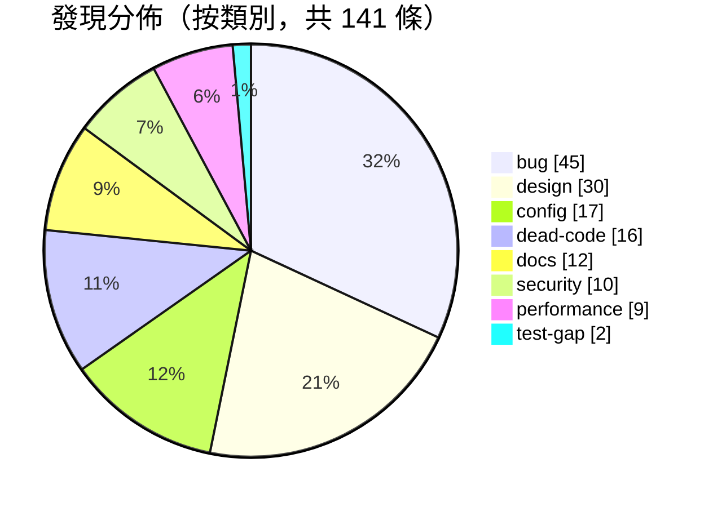
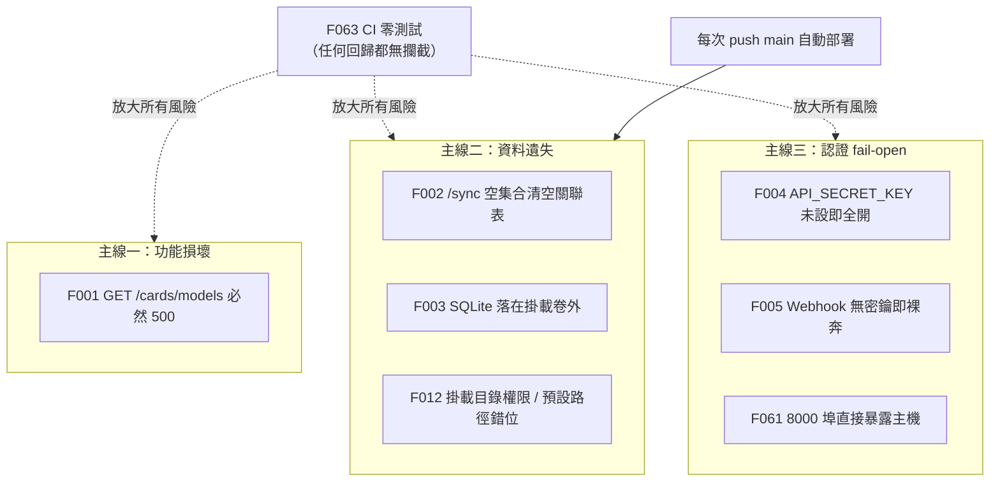

# FluencyTides 問題與風險清單（Issues and Risks）

> 產生日期：2026-07-07（由 Claude Code 全項目審查產生）
> 最後更新：2026-07-08（第一輪重構後同步，見 [10_Implementation_Log.md](10_Implementation_Log.md)）

本文檔是本次 FluencyTides 全項目審查的核心成果，逐條記錄審查中確認的缺陷、安全風險、設計偏離、效能隱患、配置陷阱與測試缺口。每條發現均標註檔案位置（`路徑:行號`）、問題描述（含代碼證據）、影響評估與修正建議，可直接作為後續修復工作的 backlog 來源。所有論斷均基於對實際代碼的逐檔審查與交叉驗證，描述的是**代碼現狀**而非理想狀態。

---

## 1. 審查方法

### 1.1 掃描維度

本次審查將專案切分為 11 個維度，由獨立的審查流程平行掃描，各自產出候選發現：

| # | 維度 | 覆蓋範圍 |
|---|------|----------|
| 1 | backend-core | `backend/app/main.py` 與 `backend/app/core/`（lifespan、設定、認證、DI、異常階層） |
| 2 | backend-api | `backend/app/api/` 五個 Router 與 `backend/app/schemas/` 全部 Pydantic 模型 |
| 3 | backend-services | `backend/app/services/`（CardService、RelationService、StorageService、AnkiModelManager、PromptManager） |
| 4 | backend-infra-data | `backend/app/infrastructure/` 的 database / anki / storage 三塊 |
| 5 | backend-infra-ai | `backend/app/infrastructure/` 的 llm / audio_evaluator / voice / ffmpeg 四塊 |
| 6 | backend-bot | `backend/app/bot/`（dispatcher、middleware、三個 handler router、狀態機、deep link）與 webhook 端點 |
| 7 | backend-scripts | `backend/scripts/` 三支 CLI 腳本與 `backend/alembic/` 遷移設施 |
| 8 | frontend | `frontend/src/` 全部（入口、路由、頁面、API client、hooks、型別）與 Vite/TS 建置設定 |
| 9 | devops | GitHub Actions workflow、兩份 docker-compose、前後端 Dockerfile、nginx.conf、依賴清單 |
| 10 | deprecated-sweep | 跨項目廢棄 API 與技術債掃描（框架用法、死代碼、型別紀律） |
| 11 | docs-consistency | README、docs/01-04、docs/adr/ 與實際代碼的一致性比對 |

### 1.2 對抗式驗證

所有候選發現在收錄前經過**對抗式驗證**（adversarial verification）：由獨立流程回到代碼中重新核實每條發現的觸發條件、機制描述與嚴重度是否成立。

- **被駁回的發現已從本清單剔除**，收錄的 finding id 不再重編號，以維持與審查記錄的可追溯性。
- **F032–F039 共 8 條因批次驗證代理失敗，未完成首輪對抗式驗證**，於文檔補完階段逐條回到代碼補驗（含對照實際安裝的 minio SDK 7.2.20 之 `ObjectWriteResult` 定義），8 條全數確認屬實，已按原始描述收錄於第 5 節。
- 三條發現（[F012](#f012核心問題屬實機制經驗證修正非-root-使用者與-app-data-掛載的權限資料持久化問題)、[F043](#f043評分-prompt-在兩個-evaluator-間逐字重複且缺少基底類承諾的共用重試)、[F060](#f060uvicorn-缺-forwarded-allow-ips-設定nginx-傳遞的真實-ip-被忽略)）在驗證中被確認**核心問題屬實但原始機制描述有誤**，本文已按驗證後的修正版本敘述。
- 多條發現由兩個以上維度獨立報告（如 F001、F002、F005、F049、F063、F115），交叉印證後合併為單條，並在描述中註明。

### 1.3 收錄範圍

- **bug / security / design / performance / config / test-gap** 六類發現：Critical / High / Medium 收錄為完整條目（第 3–5 節），Low 以精簡格式收錄（第 6 節）。
- **dead-code / deprecated** 類（16 條）：僅列 id 索引表（第 7 節），詳細內容見《07 號文檔：技術債與死代碼清理指南》。
- **docs** 類（12 條）：僅列 id 索引表（第 8 節），修正方向詳見各架構文檔的更新說明。

---

## 2. 統計總覽

全部經驗證收錄的發現共 **141 條**：Critical 3、High 12、Medium 50、Low 76。

### 修復進度（四輪累計 134/141 已修復）

**第一輪（2026-07-08）**：巨型模組拆分與設計偏離修正（詳見 [10_Implementation_Log.md](10_Implementation_Log.md)）已修復 **31 條**，另有 **2 條部分修復**（F023 邏輯下沉完成、快取未做；F096 `can_add_notes` 完成、`AnkiCardInfo` 未做）——此 2 條殘餘均已於第四輪（2026-07-11）補齊完成，並明確暫緩 5 條（F072、F075、F093、F099、F101）。

**第二輪（2026-07-09）**：階段 0（止血）、階段 1（安全加固）、階段 2（穩定性）修復 + 三方對抗式回歸審查 + 真實環境 runtime 驗證（詳見 [11_Implementation_Log.md](11_Implementation_Log.md)），本輪修復 **41 條原始發現**（標記涵蓋 F002–F014、F016–F018、F020、F024–F026、F032–F036、F039、F040、F044、F048–F051、F061、F067、F068、F071、F085、F086、F098、F112、F132，其中 F010/F011 為第一輪部分處理本輪完成/確認）+ 回歸審查另發現並修復 **10 個新 bug**（兩輪多代理修改交互產生，不在原始 141 之列）。

**第三輪（2026-07-09）**：階段 3（測試與 CI/CD）、階段 4（死代碼清理）、階段 6（文檔同步）及階段 1/2 剩餘的 bug/config/perf 項（詳見 [12_Implementation_Log.md](12_Implementation_Log.md)），本輪標記 **60 條**——其中 56 條為本輪解決（F015、F019、F037、F038、F045、F047、F052–F056、F058–F060、F063–F066、F069、F070、F073、F079–F084、F089、F090、F092、F100、F102、F103、F106–F108、F110、F115、F116、F119、F121、F122、F126–F131、F133、F135–F141），另 4 條（F062、F111、F118、F125）為前輪已完成本輪確認補標；里程碑為 F063 零測試風險解除（建立後端 48 + 前端 11 個自動化測試）。此外 **F105 由死代碼改判為活代碼**（`has_state` 已被上輪 F048/BugB 修復啟用）。

**第四輪（2026-07-11）**：收尾先前技術遺留項（詳見 [12_Implementation_Log.md](12_Implementation_Log.md) §9），將 F023、F096 兩條由部分修復升級為 **✅ 完全修復**（F023 補 TTL 快取 + 主動失效；F096 補 `AnkiCardInfo` 型別化），並完成 F063 最後一哩——把 pytest/vitest 接入 CI 作為 docker 部署前置；另完成第二輪遺留的 webhook `_persist_recording` best-effort 原子性（先算後存 + 失敗補償刪除孤兒 media + 重試冪等）。本輪 48 pytest 全綠 + e2e smoke 驗證通過。

**四輪合計已修復 134 / 141 條**（第一輪 31 + 第二輪 41 + 第三輪 60 + 第四輪將 F023/F096 2 條部分升級為完全修復），另 F105 保留為活代碼、**0 條部分修復**、5 條暫緩（F072、F075、F093、F099、F101）、1 條尚未處理（F042 零呼叫死模組）。核對：134 已修復 + 1（F105 活代碼）+ 5 暫緩 + 1 未處理（F042）= 141。各條目下方以 `✅ 已修復` / `⏸ 暫緩` 標注，並註明輪次（第一輪 2026-07-08、第二／三輪均 2026-07-09、第四輪 2026-07-11）。

### 2.1 按嚴重度

| 嚴重度 | 數量 | 佔比 | 說明 |
|--------|-----:|-----:|------|
| Critical | 3 | 2.1% | 功能完全損壞或必然造成資料遺失，須立即修復 |
| High | 12 | 8.5% | 安全 fail-open、主要功能在常見情境下損壞、部署必然失敗 |
| Medium | 50 | 35.5% | 特定條件下觸發的缺陷、明顯的設計偏離與配置風險 |
| Low | 76 | 53.9% | 邊界條件缺陷、代碼品質、一致性與可維護性問題 |
| **合計** | **141** | 100% | |

### 2.2 按類別 × 嚴重度矩陣

| 類別 | Critical | High | Medium | Low | 合計 |
|------|---------:|-----:|-------:|----:|-----:|
| bug | 2 | 7 | 21 | 15 | **45** |
| design | 0 | 0 | 9 | 21 | **30** |
| config | 1 | 2 | 8 | 6 | **17** |
| dead-code | 0 | 0 | 2 | 14 | **16** |
| docs | 0 | 1 | 2 | 9 | **12** |
| security | 0 | 2 | 5 | 3 | **10** |
| performance | 0 | 0 | 2 | 7 | **9** |
| test-gap | 0 | 0 | 1 | 1 | **2** |
| **合計** | **3** | **12** | **50** | **76** | **141** |



### 2.3 風險聚焦：三條必須立即處理的主線

綜觀全部發現，最高優先級的風險集中在三條主線上：



- **主線一（功能損壞）**：F001 使前端卡片生成頁面的模型下拉選單完全失效。**✅ 已於 2026-07-08 修復**（見 [10_Implementation_Log.md](10_Implementation_Log.md)）。
- **主線二（資料遺失）**：知識圖譜關聯**只存在 SQLite、無法從 Anki 重建**，而 F002（一句 `/sync` 清空全表）、F003 與 F012（資料庫檔案落在容器可寫層，每次自動部署即銷毀）從兩個方向威脅同一份不可再生資料。**✅ F002/F003/F012 已於 2026-07-09（第二輪）修復**（空列表防護 + 掛載卷路徑 + named volume，見 [11_Implementation_Log.md](11_Implementation_Log.md)）。
- **主線三（認證 fail-open）**：F004、F005 的共同模式是「密鑰未設定 → 靜默放行」而非「拒絕啟動」，配合 F061 的埠直接暴露，一個漏設的環境變數就使整個後端無認證開放。**✅ F004/F005/F061 已於 2026-07-09（第二輪）修復**（生產模式 fail-closed validator + 埠映射移除，見 [11_Implementation_Log.md](11_Implementation_Log.md)）。
- **放大器**：F063（後端零測試）意味著上述任何一類回歸都能無阻通過 CI 並自動部署到生產——F001 的方法定義整段損壞仍通過 CI 即是實例。**✅ F063 已完全修復**（2026-07-09 第三輪建立後端 48 + 前端 11 個自動化測試作為回歸防線，2026-07-11 第四輪將 pytest/vitest 接入 CI 作為 docker 部署前置，測試失敗即擋下部署，見 [12_Implementation_Log.md](12_Implementation_Log.md) §9）。

---

## 3. Critical

### F001｜list_available_models 方法定義遭破壞，GET /api/v1/cards/models 端點必然 500

> ✅ **已修復（2026-07-08）**：恢復 `def list_available_models(self)` 方法定義，將游離的 docstring 與 return 移入其中，端點恢復運作、前端模型下拉選單復活，詳見 [10_Implementation_Log.md](10_Implementation_Log.md)。

- **位置**：`backend/app/services/card_service.py:488`
- **類別**：bug（由 backend-api 與 backend-services 兩個維度獨立報告）

**問題描述**：`process_voice_evaluation` 結尾的 `except Exception as e: ... raise` 之後（488–495 行）殘留了一段游離的 docstring 與 `return self._model_manager.list_available_models()`——這原本是 `list_available_models` 方法的內容，但其 `def` 簽名行在插入 `process_voice_evaluation` 時被誤刪（git 歷史確認自 commit 8a4c272 起即已損壞）。現狀代碼如下：

```python
        except Exception as e:
            logger.error("語音評估流程失敗: %s", e)
            raise
        """列出所有可用的 Anki 模型定義。
        ...
        """
        return self._model_manager.list_available_models()
```

這段代碼位於 `raise` 之後永遠不可達，且 `CardService` 類別上已不存在 `list_available_models` 屬性。

**影響**：`backend/app/api/cards.py:94` 仍呼叫 `card_service.list_available_models()`，每次請求都拋 `AttributeError` 導致 HTTP 500；前端 `frontend/src/api/client.ts:39` 的模型下拉選單依賴此端點，**卡片生成頁面的模型選擇功能完全損壞**。此缺陷能存活至今，直接暴露了 CI 缺乏最基本 smoke test 的問題（見 [F063](#f063全專案後端零測試ci-lint--測試-job-只有-ruff)）。

**修正建議**：在 `process_voice_evaluation` 之後恢復類別層級方法定義 `def list_available_models(self) -> list[AnkiModelInfo]:`，將游離的 docstring 與 return 語句移入其中，並補上 GET /cards/models 的整合測試防止回歸。

---

### F002｜sync_with_anki 收到空列表時會清空整個關聯資料表（資料遺失）

> ✅ **已修復（2026-07-09，第二輪）**：`sync_with_anki` 開頭加空列表防護，`valid_note_ids` 為空時記 warning 並 return 0，杜絕一句 `/sync` 清空整個關聯表，詳見 [11_Implementation_Log.md](11_Implementation_Log.md)。

- **位置**：`backend/app/services/relation_service.py:143`
- **類別**：bug（由 backend-services 與 backend-bot 兩個維度獨立報告）

**問題描述**：delete 語句中當 `valid_note_ids` 為空列表時，SQLAlchemy 2.x 將 `.not_in([])` 展開為恆真條件，WHERE 退化為「source_note_id 非 NULL 或 target_note_id 非 NULL」，即刪除幾乎所有關聯紀錄。兩個呼叫端——`backend/app/api/relations.py:162`（POST /relations/sync）與 `backend/app/bot/handlers/commands.py:369`（Telegram `/sync` 指令）——都直接把 `find_notes("deck:*")` 的結果傳入，中間沒有任何空值防護。

**影響**：Anki 當下集合為空（新 profile、切換 profile、集合未載入、AnkiConnect 連到錯誤 profile）時，一句 `/sync` 就會把 SQLite 中**全部圖譜關聯永久刪除**，且無任何確認或備份。關聯資料只存在 SQLite、無法從 Anki 重建，屬不可回復的資料遺失。

**修正建議**：在 `sync_with_anki` 開頭加防護：`valid_note_ids` 為空時記 warning 並 return 0（或要求 `force` 旗標才允許全清）；`/sync` handler 也應提示「Anki 中查無卡片，已略過清理」。

---

### F003｜預設 SQLite 資料庫路徑不在掛載卷內，每次自動部署都會清空資料庫

> ✅ **已修復（2026-07-09，第二輪）**：`.env.example` 預設 `DATABASE_URL` 改指掛載卷內 `sqlite+aiosqlite:////app/data/fluencytides.db`，compose 改用 named volume，詳見 [11_Implementation_Log.md](11_Implementation_Log.md)。

- **位置**：`backend/docker-compose.yml:20`
- **類別**：config

**問題描述**：compose 只掛載 `/DATA/AppData/FluencyTides/backend/data:/app/data`，但 `.env.example` 的 `DATABASE_URL=sqlite+aiosqlite:///./fluencytides.db` 經 `backend/app/core/config.py` 的 `resolve_sqlite_path` validator 解析後落在容器內 `/app/fluencytides.db`——位於掛載卷之外的容器可寫層。

**影響**：CI 每次 push main 都經 Portainer webhook 重建容器（見 devops 流程），容器重建即銷毀可寫層，**資料庫全部遺失**。配合上述關聯資料不可重建的特性，這是一條「日常開發行為（push）→ 生產資料歸零」的必然路徑。與 [F012](#f012核心問題屬實機制經驗證修正非-root-使用者與-app-data-掛載的權限資料持久化問題) 互為表裡：預設路徑用不到掛載卷，改指掛載卷又會撞權限問題。

**修正建議**：將 `.env.example` 與部署文件預設改為 `sqlite+aiosqlite:////app/data/fluencytides.db`（指向掛載卷），或在 `config.py` 將 SQLite 預設目錄指向 `data/`，並在部署說明中標注資料庫路徑必須落在 volume 內。

---

## 4. High

### F004｜認證機制 fail-open：API_SECRET_KEY 未設定時所有受保護端點完全開放

> ✅ **已修復（2026-07-09，第二輪）**：新增 `ENVIRONMENT` 設定與 config validator，生產模式 `API_SECRET_KEY` 為空拒絕啟動、auth 無密鑰一律 403（開發模式行為不變），詳見 [11_Implementation_Log.md](11_Implementation_Log.md)。

- **位置**：`backend/app/core/auth.py:51`
- **類別**：security

**問題描述**：`verify_api_key` 開頭 `if not settings.API_SECRET_KEY:` 即記一行 warning 並 `return "dev-mode-no-auth"`；`config.py` 中 `API_SECRET_KEY` 預設為 `None`。此外 Settings 的 `extra="ignore"` 會靜默吞掉拼錯的環境變數名，漏設或打錯字都不會產生任何錯誤。

**影響**：生產環境只要漏設或打錯此環境變數，cards / storage / relations 全部路由即無認證開放，且應用照常啟動、僅在日誌留下一行 warning。配合 [F061](#f061後端-8000-埠直接映射到主機繞過-nginx且-api-認證預設關閉)（8000 埠直接暴露主機），等於整個後端（含 LLM 卡片生成）對區網甚至公網無認證開放，可被盜刷 LLM 額度。

**修正建議**：改為 fail-closed：新增 `ENVIRONMENT`/`DEBUG` 設定，僅明確標記為開發環境時才允許跳過認證；生產模式下 `API_SECRET_KEY` 為空應在 lifespan startup 直接 raise 拒絕啟動。

---

### F005｜TG_WEBHOOK_SECRET 未設定時 Webhook 端點完全無認證，可偽造 Telegram Update 冒充白名單使用者

> ✅ **已修復（2026-07-09，第二輪）**：config validator 於生產模式 webhook 已設但 secret 為空時拒絕啟動，webhook handler 無密鑰即回 403（原為放行），詳見 [11_Implementation_Log.md](11_Implementation_Log.md)。

- **位置**：`backend/app/api/webhook.py:30`
- **類別**：security（由 backend-core、backend-api、backend-bot 三個維度獨立報告）

**問題描述**：`webhook.py:30` 只有在 `if settings.TG_WEBHOOK_SECRET:` 時才驗證 `X-Telegram-Bot-Api-Secret-Token` header，而 `config.py` 預設為 `None`；`backend/app/main.py:134` 的 lifespan 也直接以 `secret_token=None` 呼叫 `set_webhook`，未強制要求 secret。此路由不受 `verify_api_key` 保護，路徑預設為可猜測的 `/api/webhook`。

**影響**：攻擊者可直接 POST 偽造的 Update JSON（含任意 `from.id`），**繞過 WhitelistMiddleware**——白名單依賴的 `event_from_user` 完全來自請求 body，攻擊者可自填白名單內的 user id——進而驅動 Bot 執行卡片生成、消耗 LLM 配額，或透過 `del_` deep link 刪除 Anki 卡片內的 JSON 欄位資料。

**修正建議**：webhook 模式（`tg_webhook_url` 已設）但 `TG_WEBHOOK_SECRET` 為空時，於啟動時拒絕啟動或自動產生隨機密鑰，禁止無密鑰對外提供 webhook；handler 中無 secret 設定時直接回 403 而非放行。另見 [F049](#f049webhook-secret-比對非常數時間日誌洩漏密鑰片段驗證失敗回-200) 的驗證實作細節問題。

---

### F006｜get_llm_client / get_minio_client 可能回傳 None，導致下游 AttributeError 500

> ✅ **已修復（2026-07-09，第二輪）**：`get_llm_client` / `get_minio_client` 為 None 時改拋 `ServiceUnavailableError`(503) 統一契約，並另補 `get_llm_client_optional` 供唯讀端點（回歸 Bug 1），詳見 [11_Implementation_Log.md](11_Implementation_Log.md)。

- **位置**：`backend/app/core/dependencies.py:81`
- **類別**：bug

**問題描述**：`main.py` lifespan 在初始化失敗時明確設定 `app.state.llm_client = None`、`app.state.minio_client = None`（刻意的降級容錯設計），但 `dependencies.py` 的兩個 DI 工廠未檢查 None，直接把 None 注入 CardService / StorageService；回傳型別註記 `-> LLMClient` 亦與實際不符。

**影響**：`LLM_API_KEY` 未設定時呼叫 `/api/v1/cards/generate`，會在 Service 層對 None 呼叫方法拋出原始 `AttributeError`——不是 `FluencyTidesError`，不會被全域 handler 捕獲，以裸 500 回應，違反 docs/03「不暴露原始 traceback」的驗收標準。

**修正建議**：在兩個工廠中檢查 None，為 None 時 raise 新的 `ServiceUnavailableError`（FluencyTidesError 子類，503 / SERVICE_NOT_CONFIGURED），讓全域 handler 回傳乾淨的 503 JSON。

---

### F007｜全 Bot 未對使用者輸入 / LLM 輸出做 HTML escaping，含特殊字元即發送失敗

> ✅ **已修復（2026-07-09，第二輪）**：Bot 全部動態內容插入 HTML 前 `html.quote()`（messages/commands 25 處 + voice 進度訊息，含回歸 Bug D），詳見 [11_Implementation_Log.md](11_Implementation_Log.md)。

- **位置**：`backend/app/bot/handlers/messages.py:64`
- **類別**：bug

**問題描述**：`create_bot()` 設定 `parse_mode=HTML`（`backend/app/bot/dispatcher.py:66`），但所有 handler 都把未跳脫的動態內容插進 HTML 訊息：`messages.py:64` 的使用者原文 word、`voice.py:138-140` 的 LLM transcript / feedback、`commands.py:74/223/320` 的 payload 與預覽。Telegram HTML parse mode 對未跳脫的 `<`、`&` 會回 400 "can't parse entities"。

**影響**：(1) 使用者傳「a < b」這類文字時，卡片其實**已建立成功**，但 `edit_text` 拋錯落入通用 except，向使用者誤報「系統發生異常」；(2) `voice.py` 的最終結果 `edit_text` 在 try 區塊之外，feedback 含 `<` 時評分結果已寫回 Anki，但使用者永遠收不到評分訊息，且 handler 以未處理例外收場。

**修正建議**：所有插入 HTML 訊息的動態內容一律以 aiogram 的 `html.quote()` 跳脫；`voice.py` 的最終 `edit_text` 納入 try/except。

---

### F008｜OpenAI input_audio format 傳入 'ogg'（非 API 支援值），OpenAI 供應商在主要使用場景下完全無法運作

> ✅ **已修復（2026-07-09，第二輪）**：OpenAI 音訊 wav/mp3 直傳、ogg/opus 經 ffmpeg 轉碼 wav（超時 kill + 明確錯誤），不再送非法 format，詳見 [11_Implementation_Log.md](11_Implementation_Log.md)。

- **位置**：`backend/app/infrastructure/audio_evaluator/openai_client.py:152`
- **類別**：bug

**問題描述**：代碼為 `"format": "ogg" if audio_filename.endswith(".ogg") else "wav"`。實際呼叫鏈中 `audio_filename` 由 `backend/app/bot/handlers/voice.py:87` 產生且固定為 `.ogg`（Telegram 語音為 OGG/Opus），因此走 OpenAI 供應商時永遠送出 `format='ogg'`——但 OpenAI Chat Completions 的 `input_audio.format` 僅接受 `'wav'` 與 `'mp3'`，會直接回 400。fallback 分支也把任何非 .ogg 檔一律誤標為 'wav'，且整條管線無轉檔步驟。

**影響**：`AUDIO_EVALUATOR_PROVIDER=openai` 時語音評分功能在其唯一的實際使用場景（Telegram 語音）下 100% 失敗。目前預設供應商為 Gemini，故屬「切換配置即壞」的地雷。

**修正建議**：送出前以既有 FFmpeg 基礎設施（`FfmpegMerger` 所在套件）將 OGG/Opus 轉碼為 wav/mp3，format 依實際轉碼結果設定；或建立副檔名→合法 format 的明確映射並對不支援格式拋錯。

---

### F009｜初始遷移 ALTER 一張任何遷移都沒建立的表，Alembic 在全新環境無法執行，與 ADR 003 承諾矛盾

> ✅ **已修復（2026-07-09，第二輪）**：新增 baseline 遷移 `7f3d1a2b4c5e`（手寫建 `card_relations` 表與索引），舊遷移 `down_revision` 改指向它，全新環境 `alembic upgrade head` 實測通過，詳見 [11_Implementation_Log.md](11_Implementation_Log.md)。

- **位置**：`backend/alembic/versions/9bbc72f7c470_add_relation_types_table.py:24`
- **類別**：bug（由 backend-scripts 與 docs-consistency 兩個維度獨立報告）

**問題描述**：全專案唯一的遷移（`down_revision=None`）在 `upgrade()` 開頭執行 `op.batch_alter_table('card_relations', ...)`，但 versions/ 下沒有任何遷移建立過 `card_relations` 表——該表實際由 app 啟動時的 `create_all` 建立（`backend/app/main.py:79`）。全新資料庫執行 `alembic upgrade head` 會直接因 `no such table: card_relations` 失敗。

**影響**：遷移鏈與 `create_all` 互相糾纏，兩者都無法獨立重建 schema：Alembic 需要 create_all 先跑過才能執行，create_all 又不會記錄 alembic_version。這與 ADR 003 宣稱的「採用 Alembic 從第一天開始追蹤所有 Schema 變更」「僅依賴 create_all() 是不可靠的」實質矛盾；Dockerfile CMD 只跑 uvicorn、CI 也沒有 `alembic upgrade` 步驟。未來遷移 MySQL 時（ADR 003 的明確目標）此問題會直接阻斷。

**修正建議**：補一支 baseline 初始遷移（autogenerate 出 card_relations 及索引），將本遷移的 `down_revision` 指向它；部署流程改為先跑 `alembic upgrade head`，`create_db_and_tables()` 僅限開發模式，並更新 ADR 003 如實記錄。

---

### F010｜編譯產物 vite.config.js / .d.ts 被 commit，且 Vite 會優先載入 .js 而遮蔽 vite.config.ts

> ✅ **已修復（2026-07-09，第二輪，第一輪部分處理本輪完成）**：`git rm` vite.config.js/.d.ts，`tsconfig.node.json` 解決 composite/noEmit 衝突（產物導向快取目錄），`.gitignore` 封鎖，`tsc -b` 通過且無殘留產物，詳見 [11_Implementation_Log.md](11_Implementation_Log.md)。

- **位置**：`frontend/vite.config.js:1`
- **類別**：config（由 frontend 與 deprecated-sweep 兩個維度獨立報告）

**問題描述**：repo 中同時存在 `vite.config.ts`、`vite.config.js`、`vite.config.d.ts` 且三者皆被 commit（`git ls-files` 確認）。`vite.config.js` 是 tsc 編譯輸出，根因是 `frontend/tsconfig.node.json` 設了 `composite: true` 但沒有 `noEmit`，而 build script 的 `tsc -b` 對 composite 專案必定 emit。Vite 的設定檔解析順序中 `vite.config.js` 優先於 `vite.config.ts`。

**影響**：`npm run dev` 實際載入的是舊的 `.js` 檔，對 `vite.config.ts` 的任何修改（如改 proxy target、加插件）會被**靜默忽略**，造成極難除錯的設定漂移——開發者看著 .ts 檔百思不解為何設定不生效。

**修正建議**：`git rm frontend/vite.config.js frontend/vite.config.d.ts`；`tsconfig.node.json` 加 `noEmit: true`（或依 TS 版本移除 composite）；在 `.gitignore` 加入這兩個檔案防止再次 commit。

---

### F011｜isDeleting 在刪除成功後永不重置，之後開啟的所有卡片 Modal 按鈕全部停用

> ✅ **已修復（2026-07-09，第二輪，第一輪部分處理本輪確認）**：在第一輪二段式刪除基礎上，確認 `isDeleting` 改用 `deleteMutation.isPending`，無殘留鎖死，詳見 [11_Implementation_Log.md](11_Implementation_Log.md)。

- **位置**：`frontend/src/components/CardDetailModal.tsx:42`
- **類別**：bug

**問題描述**：`deleteMutation` 的 `onSuccess` 只 invalidate graph 並 `onClose()`，僅 `onError` 有 `setIsDeleting(false)`。而 `CardDetailModal` 在 `frontend/src/pages/KnowledgeGraph.tsx:451` 是常駐渲染——「關閉」只是 `return null`，元件不 unmount，state 完整保留。

**影響**：成功刪除一張卡後 `isDeleting` 永遠為 true，下次打開 Modal 時 Delete / Save / Cancel 全部 disabled，只能靠 X 關閉；**之後無法再編輯或刪除任何卡片**，直到整頁重新整理。屬高頻操作路徑上的功能鎖死。

**修正建議**：移除手動的 `isDeleting` state，直接使用 `deleteMutation.isPending`（react-query v5 現成能力）；或至少在 `onSuccess`/`onSettled` 中重置。

---

### F012｜非 root 使用者與 /app/data 掛載的權限 / 資料持久化問題（核心問題屬實，機制經驗證修正）

> ✅ **已修復（2026-07-09，第二輪）**：compose 改用 named volume（繼承映像內 chown 過的 `/app/data` ownership），附繁中遷移註解（舊 bind mount 資料以 `docker cp` 搬移），詳見 [11_Implementation_Log.md](11_Implementation_Log.md)。

- **位置**：`backend/Dockerfile:31`
- **類別**：bug

**問題描述**（含對抗式驗證後的修正）：`backend/Dockerfile:31-32` 為 `RUN useradd -m apiuser && chown -R apiuser /app` 後 `USER apiuser` 降權執行；`backend/docker-compose.yml:20` 將主機目錄 bind mount 到 `/app/data`（註解明言用途是「將 SQLite 資料庫獨立放在一個資料夾中進行映射」）。Dockerfile 從未建立 `/app/data`（`COPY . .` 也不含 data/，repo 內無此目錄），掛載點目錄是 Docker 執行時才建立；若主機目錄由 Docker 自動建立則屬 root:root，apiuser（UID 1000）無寫入權。實際故障依部署端 `.env` 內容分兩種情況：

1. **部署端把 `DATABASE_URL` 指向 `/app/data`**（掛載設計的本意）：startup 的 `create_db_and_tables()`（`backend/app/main.py:79`，無 try/except）因 Permission denied 使**服務啟動即失敗**。
2. **沿用 repo 預設 `DATABASE_URL`**（`backend/app/core/config.py:83` 與 `.env.example:22` 均為 `./fluencytides.db`，經 `config.py:99-107` validator 解析為 `/app/fluencytides.db`）：`/app` 已被 chown 給 apiuser，寫入成功不報錯，但**完全繞過掛載目錄**——資料庫留在容器可寫層，容器重建即遺失，持久化設計形同虛設（即 F003 的路徑）。

全 repo grep 確認除 docker-compose.yml 外沒有任何程式碼引用 `/app/data`。

**影響**：兩條分支的結局都是生產部署啟動失敗或資料靜默遺失，掛載卷在任一情況下都沒有發揮作用。

**修正建議**：部署文件要求先 `chown -R 1000:1000` 主機目錄，或 compose 指定 `user:` 對齊主機 UID，或改用 named volume；亦可在 entrypoint 以 root 修正權限後降權（gosu/su-exec）。同時將預設 `DATABASE_URL` 對齊 `/app/data`（與 F003 一併修復）。

---

### F013｜共用網路兩邊都宣告 external:true，沒有任何一方建立它，compose up 必然失敗

> ✅ **已修復（2026-07-09，第二輪）**：共用網路改由後端建立（`name: fluencytides_net`、移除雙 external），前端保持 external，詳見 [11_Implementation_Log.md](11_Implementation_Log.md)。

- **位置**：`backend/docker-compose.yml:59`
- **類別**：config

**問題描述**：backend 與 frontend 的 compose 都宣告 `fluencytides_net: external: true`，兩份都假設網路已存在。任何一份 `docker compose up` 都會報 `network ... declared as external, but could not be found`，除非先手動 `docker network create fluencytides_net`——而 repo 內沒有任何文件或腳本說明此前置步驟。

**影響**：全新環境按 repo 內容部署必然失敗，且錯誤訊息不會指向缺失的手動步驟；部署知識只存在於原作者的操作記憶中。

**修正建議**：由後端 compose 負責建立網路（移除 external，宣告 `name: fluencytides_net`），前端保持 external；或提供部署腳本 / README 明確要求先建立網路。

---

### F014｜proxy_pass 使用靜態容器名：後端未啟動時 nginx 無法啟動、後端重建後 502

> ✅ **已修復（2026-07-09，第二輪，回歸審查一併處理）**：nginx 改用 Docker 內建 DNS（`resolver 127.0.0.11` + 變數 proxy_pass），後端重建後不再 502，詳見 [11_Implementation_Log.md](11_Implementation_Log.md)。

- **位置**：`frontend/nginx.conf:24`
- **類別**：bug

**問題描述**：`proxy_pass http://fluencytides-backend:8000;` 的 hostname 在 nginx 載入設定時一次性解析：(1) 前後端是獨立 compose，若後端容器不存在，前端 nginx 直接以 `host not found in upstream` 崩潰並無限重啟；(2) 每次 CI push 後 Portainer 單獨重建後端容器拿到新 IP，nginx 快取的舊 IP 不會重新解析。

**影響**：每次自動部署後端後，所有 `/api/` 請求回 502 直到手動重啟前端容器——與「push 即自動部署」的 CI 設計直接衝突，等於每次部署都需要人工介入。

**修正建議**：改用 Docker 內建 DNS 動態解析：

```nginx
resolver 127.0.0.11 valid=10s;
set $backend_upstream http://fluencytides-backend:8000;
proxy_pass $backend_upstream;
```

---

### F015｜README 整份描述不存在的 Flask/Redis/PostgreSQL 架構（docs 類，詳見文檔修正說明）

> ✅ **已修復（2026-07-09，第三輪）**：根 README 整份重寫，改為實際的 FastAPI + aiogram 3 + SQLModel/Alembic + MinIO + React/Vite 架構（含正確目錄結構、啟動方式、docs 索引），詳見 [12_Implementation_Log.md](12_Implementation_Log.md)。

- **位置**：`README.md:3`
- **類別**：docs

High 級別中唯一的 docs 類發現，因影響專案第一印象與新成員上手，特此保留摘要：README 全文描述從未實作的 Flask + Blueprints + Redis MQ + PostgreSQL + JWT/RBAC 架構，所列檔案無一存在，並直接牴觸 ADR 001「不用 MQ、不做 RBAC」的明文決策。應以 `docs/01_Architecture_and_Structure.md` 的實際結構為準整份重寫。其餘 docs 類發現見第 8 節索引。

---

## 5. Medium

> 本節收錄 Medium 級別中 bug / security / design / performance / config / test-gap 類共 46 條（另有 dead-code 類 F030、F042 見第 7 節索引，docs 類 F064、F065 見第 8 節索引）。其中 F032–F039 於文檔補完階段逐條補驗確認（見 1.2 節）。

### F016｜Polling task 異常無人觀察，且 shutdown 時 re-raise 會跳過資源清理

> ✅ **已修復（2026-07-09，第二輪）**：polling task `add_done_callback` 記錄異常，shutdown try/finally 確保資源清理，詳見 [11_Implementation_Log.md](11_Implementation_Log.md)。

- **位置**：`backend/app/main.py:155`｜**類別**：bug

**問題描述**：`polling_task` 建立後沒有 done callback；polling 崩潰時異常被靜默保留，API 繼續運行但 Bot 已死。shutdown 段 `await dp.stop_polling()` → `await polling_task` 在 polling 早已異常結束時會拋錯中斷 lifespan shutdown。

**影響**：其後的 `anki_client.close()` 與 `dispose_engine()`（179–183 行）永遠不執行，httpx 連線池與 DB 引擎未釋放；Bot 靜默死亡且無任何告警。

**修正建議**：為 polling_task 加 `add_done_callback` 記錄異常；shutdown 段包 try/except（或 `contextlib.suppress` + cancel），並用 try/finally 確保 close/dispose 一定執行。

### F017｜Webhook secret 只在 URL 變更時才重新綁定，輪換 secret 會使 Bot 靜默全掛

> ✅ **已修復（2026-07-09，第二輪）**：啟動時無條件 `set_webhook`（冪等），secret 輪換必重綁，詳見 [11_Implementation_Log.md](11_Implementation_Log.md)。

- **位置**：`backend/app/main.py:126`｜**類別**：bug

**問題描述**：只有 `webhook_info.url != settings.tg_webhook_url` 時才呼叫 `set_webhook`。若 URL 不變、只更改或新增 `TG_WEBHOOK_SECRET`，Telegram 端仍用舊 secret 發送，而 webhook 端點用新 secret 比對。

**影響**：所有更新被拒——Bot 完全失效，且啟動日誌還顯示綁定成功，故障排查方向會被誤導。

**修正建議**：無條件在啟動時呼叫 `set_webhook`（對相同參數冪等），或至少在 secret 變更時強制重綁。

### F018｜Telegram Bot 啟動流程未包 try/except，Telegram API 暫時故障會阻止整個後端啟動

> ✅ **已修復（2026-07-09，第二輪）**：Bot 啟動包 try/except，失敗降級 `bot=None` 不阻其餘 API（`create_bot()` 亦一併移入降級範圍，回歸 Bug 3），詳見 [11_Implementation_Log.md](11_Implementation_Log.md)。

- **位置**：`backend/app/main.py:125`｜**類別**：bug

**問題描述**：LLMClient、MinioClient、AudioEvaluator 初始化都刻意用 try/except 包裹容錯，但 Bot 區塊的 `get_webhook_info`/`set_webhook`/`delete_webhook` 未做任何錯誤處理，與同函數其他組件的容錯設計自相矛盾。

**影響**：Telegram API 網路不通或暫時 5xx 時異常從 lifespan startup 傳播，整個 FastAPI（含與 Telegram 完全無關的端點）都無法啟動。

**修正建議**：將 Bot webhook/polling 啟動流程包進 try/except，失敗時記 error 並將 `app.state.bot` 設為 None，不影響其餘 API 啟動。

### F019｜CORS allow_origins 寫死 localhost:5173，未由設定管理

> ✅ **已修復（2026-07-09，第三輪）**：config.py 新增 `CORS_ORIGINS`（支援逗號分隔／JSON 陣列／list 三種輸入的 validator），main.py 改從 settings 讀取，詳見 [12_Implementation_Log.md](12_Implementation_Log.md)。

- **位置**：`backend/app/main.py:264`｜**類別**：config

**問題描述**：CORSMiddleware 的 origins 硬編碼為 Vite 開發伺服器位址；`config.py` 已有完整 pydantic-settings 機制卻未涵蓋此項。

**影響**：生產環境前端若以不同網域直連後端會被瀏覽器 CORS 阻擋，只能改代碼重新部署（目前因 nginx 同源反代而未爆發，屬架構變更即觸發的隱患）。

**修正建議**：在 Settings 新增 `CORS_ORIGINS` 欄位（逗號分隔或 JSON list 加 validator），`main.py` 從 settings 讀取。

### F020｜MinIO 憑證預設值與 .env.example 均為 minioadmin/minioadmin，範例 HOST 又指向 127.0.0.1

> ✅ **已修復（2026-07-09，第二輪）**：MinIO 憑證預設改 None，minio_client 初始化加明確 None 防護，詳見 [11_Implementation_Log.md](11_Implementation_Log.md)。

- **位置**：`backend/app/core/config.py:145`｜**類別**：security（由 backend-core 與 devops 兩個維度獨立報告）

**問題描述**：`MINIO_ACCESS_KEY`/`MINIO_SECRET_KEY` 預設皆為 `"minioadmin"`（眾所周知的出廠管理員憑證），漏設環境變數時應用靜默以弱憑證運作；`.env.example:50` 也照抄相同弱憑證。另外範例的 `MINIO_HOST=127.0.0.1` 與 `ANKI_CONNECT_URL=http://127.0.0.1:8765` 在容器內指向容器自身。

**影響**：照範例上線即弱憑證部署，掩蓋配置錯誤；Docker 部署照填範例值必然連線失敗且無提示。

**修正建議**：兩欄位預設值改為 None（缺值時 MinioClient 初始化拋明確錯誤）；`.env.example` 改為明顯佔位符並註明 Docker 部署時 HOST 應填容器名或主機 IP。

### F021｜模組層級 `settings = Settings()` 與文件宣稱的延遲初始化矛盾，import 副作用大

> ✅ **已修復（2026-07-08）**：新增 `@lru_cache get_settings()`（測試可 `cache_clear()`），模組層 `settings = get_settings()` 保持既有 import 不變，docstring 改為如實描述，詳見 [10_Implementation_Log.md](10_Implementation_Log.md)。

- **位置**：`backend/app/core/config.py:327`｜**類別**：design

**問題描述**：模組 docstring 宣稱「移除全域實例化」「延遲初始化讓測試可注入 mock」，但檔案結尾就是 `settings = Settings()`——import 時即實例化並讀取 .env。auth、database、dispatcher、webhook 的路由路徑等都在 import 期綁死此實例。

**影響**：測試無法以環境變數以外的方式注入設定；未來新增必填欄位會回到「import 即 ValidationError」的脆弱狀態。

**修正建議**：改用 `@lru_cache def get_settings()` 的標準 FastAPI 模式並以 Depends 注入；至少修正 docstring 使其與實際一致。

### F022｜get_graph_data Controller 內含業務邏輯，違反專案自訂的 Clean Architecture 原則

> ✅ **已修復（2026-07-08）**：Anki 查詢與卡片狀態提取整段下沉至 `RelationService.get_graph_data`，Controller 只留參數傳遞，`AnkiConnectError` 統一包裝為 `AnkiServiceError`（502），詳見 [10_Implementation_Log.md](10_Implementation_Log.md)。

- **位置**：`backend/app/api/relations.py:49`｜**類別**：design

**問題描述**：模組 docstring 宣告「所有業務邏輯委託給 RelationService」，但 `get_graph_data` 端點直接操作 AnkiClient 並實作編排邏輯（拼 query、find_notes、取每個 note 第一張卡判斷狀態、get_cards_info），與 `dependencies.py` 的「Controller 層永遠不直接觸碰 Infrastructure」直接矛盾。

**影響**：分層破口——此端點的邏輯無法被 Bot 或腳本重用，也繞過 Service 層的錯誤語意化。

**修正建議**：將 Anki 查詢與卡片狀態提取邏輯下沉至 RelationService，Controller 僅保留參數傳遞。

### F023｜GET /relations/graph 每次請求全量掃描 Anki 收藏

> ✅ **已完成（2026-07-11，第四輪）**：查詢邏輯已下沉至 `RelationService.get_graph_data`（見 F022），第四輪補齊殘餘快取——`RelationService` 加類別層級 TTL(30s) 圖譜快取，寫入路徑（新增/刪除關聯）主動失效快取，冷熱路徑一致。第一輪的「快取/增量優化未做」殘餘至此清零，詳見 [12_Implementation_Log.md](12_Implementation_Log.md) §9。

- **位置**：`backend/app/api/relations.py:49`｜**類別**：performance

**問題描述**：實作是 `deck:*` 撈全部筆記 ID → `get_notes_info` 取全部筆記完整欄位（含 HTML）→ `get_cards_info` 取全部卡片狀態，無快取或分頁。

**影響**：對數千張卡的收藏，每次開啟知識圖譜頁面都透過 AnkiConnect 傳輸整個收藏內容，延遲與記憶體隨收藏大小線性增長。

**修正建議**：限制 notesInfo 只取需要欄位、加伺服器端快取（以 collection 修改時間為 key），或先從 SQLite 關聯表取節點、僅對涉及的 note_id 批次查 Anki。

### F024｜上傳端點無檔案大小與類型限制，整檔讀入記憶體

> ✅ **已修復（2026-07-09，第二輪）**：上傳端點加大小上限（`STORAGE_MAX_UPLOAD_MB=50`，分塊累計超限 413）、副檔名/Content-Type 白名單（415）、prefix 正則（422），詳見 [11_Implementation_Log.md](11_Implementation_Log.md)。

- **位置**：`backend/app/api/storage.py:48`｜**類別**：security

**問題描述**：`upload_file` 對檔案大小、Content-Type、prefix 均無驗證；下游以 `await file.read()` 一次性將整檔讀入記憶體再寫暫存檔。

**影響**：持有 API Key 者（或 `API_SECRET_KEY` 未設定時的任何人，見 F004）上傳超大檔即可耗盡記憶體造成 DoS；prefix 亦可寫入任意物件路徑前綴。

**修正建議**：API 層加檔案大小上限（分塊累計超限回 413）、白名單 Content-Type/副檔名檢查，並以正則限制 prefix 格式。

### F025｜get_card 的「找不到筆記」判斷是死路徑，實際會以 Pydantic ValidationError 500 收場

> ✅ **已修復（2026-07-09，第二輪）**：`get_card` 先 `find_notes` 確認存在，回真正的 404（update/delete 對不存在 note 亦補存在性檢查回 404，回歸 Bug 4），詳見 [11_Implementation_Log.md](11_Implementation_Log.md)。

- **位置**：`backend/app/services/card_service.py:290`｜**類別**：bug

**問題描述**：以 `if not notes:` 判斷不存在，但 AnkiConnect 的 notesInfo 對不存在 ID 回傳「空物件佔位」而非空列表，infrastructure 層 `[AnkiNoteInfo(**item) for item in result]`（`backend/app/infrastructure/anki/client.py:457`）會先因缺必填欄位拋 pydantic ValidationError；該例外不是 AnkiConnectError，不會被捕獲。

**影響**：查詢不存在的 note_id 以未處理例外 500 回應，使用者永遠看不到語意化的「找不到筆記」404。

**修正建議**：查詢前先用 find_notes 確認存在，或在 infrastructure 層過濾空 dict，並在 get_card 中捕獲 ValidationError 轉為 AnkiServiceError。

### F026｜relation_type 正規化不一致：類型表存小寫、關聯表存原始大小寫，且 check-then-insert 有競態

> ✅ **已修復（2026-07-09，第二輪）**：relation_type 統一正規化 + get_or_create 捕獲 IntegrityError 回退，詳見 [11_Implementation_Log.md](11_Implementation_Log.md)。

- **位置**：`backend/app/services/relation_service.py:212`｜**類別**：bug

**問題描述**：`get_or_create_relation_type` 將 name `strip().lower()` 後寫入 RelationType，但建立 CardRelation 時保留原始字串。LLM 回傳 `"Synonym"` 時類型表登記 `"synonym"`、關聯表存 `"Synonym"`。另外先 SELECT 再 INSERT 在併發下會拋未處理的 IntegrityError（unique 約束）。

**影響**：`get_graph_data` 的大小寫敏感比對失效（節點分組錯誤）、`delete_relation_by_nodes` 可能刪不到目標關聯；併發建立同名類型時請求以 500 失敗。

**修正建議**：寫入 CardRelation 前做相同正規化（可放在 CardRelationCreate 的 field_validator）；get_or_create 捕獲 IntegrityError 回退查詢或改用 ON CONFLICT DO NOTHING。

### F027｜ensure_deck_exists 在牌組不存在時自動觸發完整 AnkiWeb 同步

> ✅ **已修復（2026-07-08）**：改為 `sync_on_missing=False` 預設快速失敗，`import_cards_from_json.py` 顯式傳 `True` 保留原行為，詳見 [10_Implementation_Log.md](10_Implementation_Log.md)。

- **位置**：`backend/app/services/anki_model_manager.py:336`｜**類別**：design

**問題描述**：使用者打錯牌組名稱時，每次生卡請求都會在失敗前先觸發一次完整的 AnkiWeb 網路同步——隱藏在「存在性檢查」中的重大副作用，呼叫端完全無從得知也無法跳過。

**影響**：可能耗時數十秒且實際改動本地集合資料；一個 typo 就觸發網路同步屬預期外行為。

**修正建議**：改為可選參數（`sync_on_missing=False`），或直接 create_deck / 回傳明確的 DeckNotFoundError 讓呼叫端決定；至少在 API 文件揭露此副作用。

### F028｜async 方法內執行阻塞式檔案 I/O，can_add_note 每次請求全目錄重掃

> ✅ **已修復（2026-07-08）**：`can_add_note` 改為單模型 `asyncio.to_thread` 讀取＋實例級快取（首次後零 IO），`import_model_from_files` 四處同步 `open()` 全部 async 化（隨 anki_model/ 套件拆分完成），詳見 [10_Implementation_Log.md](10_Implementation_Log.md)。

- **位置**：`backend/app/services/anki_model_manager.py:382`｜**類別**：performance（由 backend-services 與 deprecated-sweep 兩個維度獨立報告）

**問題描述**：async `can_add_note` 內呼叫 `list_available_models()`，以同步 `open()`+`json.load` 逐一解析 anki_models/ 下**所有** JSON 檔，只為找出單一模型的欄位清單；async `import_model_from_files` 內也有四次同步 open()（465、486–491 行），`get_model_schema`/`get_model_fields` 同為被 async 路徑呼叫的同步阻塞讀檔。

**影響**：每次卡片生成請求都在事件迴圈上執行阻塞 I/O；模型定義檔執行期不變，重複掃描純屬浪費。

**修正建議**：改用 `get_model_fields` 精準讀單一檔並以 lru_cache / 實例快取；確需檔案 I/O 處以 `asyncio.to_thread` 包裝（或 aiofiles），或改查 AnkiConnect 的 modelFieldNames。

### F029｜delete_relations_by_note_id 與 delete_relations_for_note 是完全重複的實作

> ✅ **已修復（2026-07-08）**：刪除 `delete_relations_for_note`，`card_service.py` 呼叫端同步改用 `delete_relations_by_note_id`（grep 確認零殘留），詳見 [10_Implementation_Log.md](10_Implementation_Log.md)。

- **位置**：`backend/app/services/relation_service.py:162`｜**類別**：design

**問題描述**：兩方法的 delete 語句一字不差，僅 docstring 與 log 文字不同。API 層用前者（`relations.py:134`）、`CardService.delete_card` 用後者（`card_service.py:351`），屬複製貼上殘留。

**影響**：未來修改容易只改到一份，造成 API 與 Bot 兩條路徑行為分歧。

**修正建議**：保留 `delete_relations_by_note_id`，刪除另一個並更新 `card_service.py:351` 的呼叫。

### F031｜generate_card 過長（~170 行）且 Graph_Relations Schema 注入硬編碼在流程中，CardService 呈上帝類別趨勢

> ✅ **已修復（2026-07-08）**：`generate_card` 拆為編排骨架＋六個私有步驟方法，Schema 注入移至 `schema_composer.py` 純函數，`process_voice_evaluation` 整體獨立為 `SpeakingService`（card_service.py 763 → 568 行），詳見 [10_Implementation_Log.md](10_Implementation_Log.md)。

- **位置**：`backend/app/services/card_service.py:101`｜**類別**：design

**問題描述**：`generate_card` 一個方法完成牌組檢查、防重複、讀 Schema、動態注入 30 行 Graph_Relations JSON Schema 字面量（176–192 行）、Prompt 解析、LLM 呼叫、extra_fields 合併、提交、寫關聯等九個步驟；`process_voice_evaluation` 亦達 127 行且被誤放在「查詢輔助方法」區段。CardService 整體 763 行。

**影響**：單方法職責過多，難以測試與修改；F001 的方法簽名損壞正是在此巨型類別中發生而未被察覺。

**修正建議**：抽出 `_inject_graph_relations_schema`、`_parse_speaking_fields`、`_persist_recording` 等私有方法；語音評估流程可獨立為 SpeakingService。

### F032｜客戶端檔名未消毒即用於暫存檔 suffix 與 MinIO 物件名，且暫存寫檔為阻塞 I/O

> ✅ **已修復（2026-07-09，第二輪）**：客戶端檔名 `sanitize_filename()` 白名單過濾後才用於暫存檔與物件名，詳見 [11_Implementation_Log.md](11_Implementation_Log.md)。

- **位置**：`backend/app/services/storage_service.py:100`｜**類別**：security（補驗確認）

**問題描述**：`original_filename` 直接來自上傳客戶端（`file.filename`），未經任何消毒即拼入暫存檔 suffix（`suffix=f"_{original_filename}"`，100–102 行）與 MinIO 物件名 `object_name`（89 行）。檔名含路徑分隔符（如 `a/b.wav`）時 tempfile 建檔直接拋 OSError——此例外非 MinioStorageError，不會被 134 行的 except 捕獲。此外整檔載入記憶體後 `tmp.write(content)` 與 `os.unlink` 都是 async 函數中的同步阻塞 I/O，`tempfile`/`os` 也是函數內 import（97–98 行）。

**影響**：惡意或異常檔名使上傳端點以未處理例外 500 收場並洩漏內部路徑；大音檔上傳時暫存寫檔會卡住事件迴圈。

**修正建議**：用 `Path(filename).name` 取 basename 並過濾非法字元；暫存寫/刪檔用 `asyncio.to_thread` 包裝（或讓 MinioClient 直接吃 bytes/stream）；tempfile/os import 移到模組頂部。

### F033｜upload_file 回傳的 file_size_bytes 永遠為 0（ObjectWriteResult 沒有 size 屬性）

> ✅ **已修復（2026-07-09，第二輪）**：file_size 改取實際大小（與 F034/F035 的 MinIO/Anki 錯誤契約補齊一併處理），詳見 [11_Implementation_Log.md](11_Implementation_Log.md)。

- **位置**：`backend/app/infrastructure/storage/minio_client.py:260`｜**類別**：bug（補驗確認）

**問題描述**：`_sync_upload` 中 `return result.size if hasattr(result, "size") else 0`——補驗時對照實際安裝的 minio SDK 7.2.20，`ObjectWriteResult` 是 frozen dataclass，欄位只有 bucket_name / object_name / version_id / etag / http_headers / last_modified / location，**沒有 size**，`hasattr` 恆為 False、恆回傳 0。

**影響**：此值一路流出到 API 回應（`storage.py:72`）與日誌（永遠印 0 bytes），docstring 宣稱回傳實際大小與事實不符，客戶端無法據此驗證上傳完整性。

**修正建議**：改用 `os.path.getsize(file_path)` 或 `stat_object` 取實際大小，移除永遠為 False 的 hasattr 分支。

### F034｜所有 MinIO 操作僅捕捉 S3Error，連線失敗與檔案錯誤會繞過 MinioStorageError 錯誤契約

> ✅ **已修復（2026-07-09，第二輪）**：MinIO 操作 except 鏈末端補兜底，連線/檔案錯誤統一包成 MinioStorageError，詳見 [11_Implementation_Log.md](11_Implementation_Log.md)。

- **位置**：`backend/app/infrastructure/storage/minio_client.py:276`｜**類別**：bug（補驗確認）

**問題描述**：各方法只有 `except S3Error`，但伺服器無法連線時拋的是 urllib3 MaxRetryError、`fput_object` 對不存在的本機檔拋 FileNotFoundError，皆不會被包成 MinioStorageError。Service 層只捕捉 MinioStorageError（`storage_service.py:134`），此外 `set_bucket_public_read` 又用 `except Exception`（218 行），全模組捕捉寬度不一致。

**影響**：最常見的故障（MinIO 未啟動）會以原始例外冒泡成未處理 500，繞過統一錯誤機制。

**修正建議**：在 except 鏈末端加 `except Exception as err:`（或至少 urllib3.exceptions.HTTPError 與 OSError）統一包成 MinioStorageError 並保留 `from err`。

### F035｜_invoke 的例外捕捉不完整，部分 httpx 錯誤與 JSON 解析錯誤會繞過 AnkiConnectError 契約

> ✅ **已修復（2026-07-09，第二輪）**：`_invoke` 補 `httpx.HTTPError` 兜底、`response.json()` 與模型驗證納入 try（`_invoke_typed` 的 `TypeAdapter` 驗證亦納入錯誤邊界，回歸 Bug 2），詳見 [11_Implementation_Log.md](11_Implementation_Log.md)。

- **位置**：`backend/app/infrastructure/anki/client.py:157`｜**類別**：bug（補驗確認）

**問題描述**：只捕捉 ConnectError / TimeoutException / HTTPStatusError（163–176 行）；ReadError、WriteError、RemoteProtocolError 等 TransportError 子類（Cloudflare 隧道場景常見）不在其中，且 `AnkiActionResponse(**response.json())`（179 行）位於 try 之外，回應非 JSON 時拋的 JSONDecodeError 也未捕捉。此外三處 `raise AnkiConnectError` 都缺 `from e`（ruff B904）。

**影響**：呼叫端只捕捉 AnkiConnectError，洩漏的原始例外變成未處理 500，錯誤邊界合約失效。

**修正建議**：補上 `except httpx.HTTPError as e:` 兜底包成 AnkiConnectError；`response.json()` 與模型驗證納入 try 或捕捉 ValueError/ValidationError；所有 re-raise 加 `from e`。

### F036｜每次啟動無條件執行 create_all，部署流程又從不執行 alembic，schema 雙軌漂移

> ✅ **已修復（2026-07-09，第二輪）**：`create_db_and_tables` 僅非生產模式執行（生產走 Alembic），消除 schema 雙軌漂移，詳見 [11_Implementation_Log.md](11_Implementation_Log.md)。

- **位置**：`backend/app/infrastructure/database/database.py:69`｜**類別**：config（由 backend-infra-data 與 devops 兩個維度獨立報告；補驗確認）

**問題描述**：`create_db_and_tables` 無條件 `run_sync(SQLModel.metadata.create_all)`，docstring 自己寫明「生產環境應透過 Alembic migration 管理 schema」但無任何環境判斷。Dockerfile CMD 只啟動 uvicorn、compose 與 CI 都沒有遷移步驟。

**影響**：create_all 建出的新庫沒有 alembic_version 戳記，之後跑 `upgrade head` 會因表已存在失敗；反之既有庫的 model 增加欄位時 create_all 不會 ALTER，生產 schema 靜默落後直到查詢炸掉。與 [F009](#f009初始遷移-alter-一張任何遷移都沒建立的表alembic-在全新環境無法執行與-adr-003-承諾矛盾) 互為表裡。

**修正建議**：容器 entrypoint 先執行 `alembic upgrade head` 再啟動 uvicorn；create_all 以 Settings 旗標僅限開發環境啟用（建表後 stamp head），讓 alembic 成為唯一 schema 來源。

### F037｜created_at 的 server_default=func.now() 在 SQLite 與 MySQL 的時區語義不一致，與宣稱的 UTC 保證矛盾

> ✅ **已修復（2026-07-09，第三輪）**：`created_at` 改 `default_factory=lambda: datetime.now(timezone.utc)`（應用層 UTC），消除 SQLite/MySQL 時區語義不一致，詳見 [12_Implementation_Log.md](12_Implementation_Log.md)。

- **位置**：`backend/app/infrastructure/database/models.py:100`｜**類別**：bug（補驗確認）

**問題描述**：註解宣稱「在 SQLite 與 MySQL 上行為完全一致」「使用 UTC 時間戳」，實際 SQLite 的 CURRENT_TIMESTAMP 固定 UTC（且無時區型別），MySQL 的 NOW() 回傳 session time_zone（預設伺服器本地時區）。`relation_types.created_at`（134–141 行）同樣受影響。

**影響**：依規劃遷到 MySQL 後 created_at 會靜默變成本地時間，破壞前端 / TG 依賴的 UTC 前提。

**修正建議**：改為應用層明確寫入 UTC（`default_factory=lambda: datetime.now(timezone.utc)`），或 MySQL 連線強制 `time_zone='+00:00'`，並修正誤導性註解。

### F038｜OpenAIAudioEvaluator 未驗證 LLM_BASE_URL，misconfiguration 時會把非 OpenAI 的 API Key 送往 api.openai.com

> ✅ **已修復（2026-07-09，第三輪）**：`openai_client.py` 比照 LLMClient 檢查 `LLM_BASE_URL`，未設定即拋錯，避免非 OpenAI 金鑰誤送 api.openai.com，詳見 [12_Implementation_Log.md](12_Implementation_Log.md)。

- **位置**：`backend/app/infrastructure/audio_evaluator/openai_client.py:109`｜**類別**：config（補驗確認）

**問題描述**：`__init__` 只檢查 `LLM_API_KEY` 即建構 AsyncOpenAI（104–112 行）；`LLM_BASE_URL` 未設定（預設 None）時 SDK fallback 到官方端點，而 config.py 明確描述 LLM_API_KEY 為「OpenAI 相容 API 金鑰（例如 Gemini API Key）」，等於配置缺漏時把 Gemini 金鑰靜默送給第三方。補驗確認同套件的 LLMClient（`llm/client.py:69-70`）有做此檢查並拋 LLMServiceError，兩者行為不一致。

**影響**：憑證外洩風險與難以察覺的錯誤端點呼叫。

**修正建議**：比照 LLMClient 在 `__init__` 同時檢查 LLM_BASE_URL，未設定時拋 LLMServiceError。

### F039｜VOICEPEAK 子程序無 timeout，CLI 掛死時協程將永久阻塞

> ✅ **已修復（2026-07-09，第二輪）**：VOICEPEAK 子程序 `asyncio.wait_for`(120s) 超時保護（逾時 kill + wait），詳見 [11_Implementation_Log.md](11_Implementation_Log.md)。

- **位置**：`backend/app/infrastructure/voice/voicepeak_runner.py:173`｜**類別**：bug（補驗確認）

**問題描述**：`await process.communicate()` 沒有逾時控制。docstring 承認合成可能耗時數十秒，若 CLI 因授權彈窗或 I/O 卡住不退出，此 await 永不返回。

**影響**：呼叫方請求永久懸掛且子程序不被清理（該模組目前無呼叫者——見 F042——與 F040 同屬接線後即生效的地雷）。

**修正建議**：以 `asyncio.wait_for` 包裝，逾時後 `process.kill()` + `await process.wait()` 再拋 VoicepeakSynthesisError；timeout 值加入 Settings。

### F040｜FFmpeg 子程序無 timeout，異常輸入可能導致協程永久阻塞

> ✅ **已修復（2026-07-09，第二輪）**：ffmpeg 子程序 `asyncio.wait_for`(60s) 超時保護（逾時 kill + wait），詳見 [11_Implementation_Log.md](11_Implementation_Log.md)。

- **位置**：`backend/app/infrastructure/ffmpeg/ffmpeg_merger.py:162`｜**類別**：bug

**問題描述**：`await process.communicate()` 沒有逾時控制。FFmpeg 遇到損壞的 WAV 或 filter graph 異常時可能長時間不退出。

**影響**：await 無限期等待且子程序不會被 kill，協程與子程序雙雙洩漏（目前該模組無呼叫者——見 F042——屬接線後即生效的地雷）。

**修正建議**：`asyncio.wait_for` 加逾時、逾時後 kill + wait，拋 FfmpegMergeError；voicepeak_runner 同型問題一併修正。

### F041｜LLM 重試策略對所有例外一視同仁：401/400 等不可重試錯誤也會盲目重試 3 次

> ✅ **已修復（2026-07-08）**：僅對 `RateLimitError` / `APIConnectionError` / `APITimeoutError` / 5xx 重試且改指數退避（2/4/8s），401/400 立即包裝 `LLMServiceError` 拋出，詳見 [10_Implementation_Log.md](10_Implementation_Log.md)。

- **位置**：`backend/app/infrastructure/llm/client.py:144`｜**類別**：design

**問題描述**：`except Exception` 捕捉所有錯誤後一律 sleep 固定 2 秒再重試。AsyncOpenAI 未設 timeout（沿用預設 600 秒）；JSONDecodeError 分支在 temperature=0.0 下重送相同請求，大概率得到相同壞輸出。

**影響**：對 AuthenticationError、BadRequestError 這類確定性錯誤重試 3 次純屬浪費並延遲錯誤浮現；單次卡住可拖住生成流程近 10 分鐘。

**修正建議**：僅對 RateLimitError、APIConnectionError、APITimeoutError 與 5xx 重試並改指數退避；401/400 立即包裝為 LLMServiceError 拋出；AsyncOpenAI 建構時明確設定 timeout 與 max_retries=0。

### F043｜評分 Prompt 在兩個 evaluator 間逐字重複，且缺少基底類承諾的共用重試

> ✅ **已修復（2026-07-08）**：評分 Prompt 抽至 `audio_evaluator/prompts.py`、圍欄清理統一為 `strip_markdown_fences`，`BaseAudioEvaluator` 改 Template Method 提供統一指數退避重試（子類只實作 `_evaluate_audio_once`），詳見 [10_Implementation_Log.md](10_Implementation_Log.md)。

- **位置**：`backend/app/infrastructure/audio_evaluator/gemini_client.py:29`｜**類別**：design

**問題描述**（含對抗式驗證後的修正）：`gemini_client.py:53-65` 與 `openai_client.py:71-82` 的 `_build_evaluation_prompt` 幾乎逐字相同；圍欄清理邏輯在 `gemini_client.py:168-173` 與 `llm/client.py:223-229` 重複兩處（原始報告稱三處，經驗證 `openai_client.py` 直接 `json.loads(content)` 未做圍欄清理，實為兩處）。`base.py:9` 明言「未來可能在基底類中增加共用邏輯（如重試、快取）」，但兩個 evaluator 目前都是單發呼叫、無重試，與 LLMClient 的 3 次重試不一致。

**影響**：修改評分規則必須同步多處，極易漂移；語音評分是最常遇到瞬時錯誤的長請求，反而沒有重試保護。

**修正建議**：將 prompt 建構與圍欄清理抽到共用模組，並在 BaseAudioEvaluator 以 template method 提供統一重試包裝。

### F044｜Webhook 同步等待 feed_update 完成，長任務會觸發 Telegram 重送造成重複處理

> ✅ **已修復（2026-07-09，第二輪）**：webhook 改背景 ACK（`asyncio.create_task` + 立即回 200），長任務不再觸發 Telegram 重送；並匯出 `wait_for_background_tasks` 供 shutdown 前等待，避免砍半評分（回歸 Bug A），詳見 [11_Implementation_Log.md](11_Implementation_Log.md)。

- **位置**：`backend/app/api/webhook.py:47`｜**類別**：bug

**問題描述**：`await dp.feed_update(...)` 等整條 handler 管線跑完才回 200，而文字訊息會呼叫 LLM 生成卡片、語音會下載音檔＋評分＋寫回 Anki，動輒數十秒。Telegram 對 webhook 逾時視為失敗會重送同一 update。

**影響**：同一訊息被處理兩次（兩次 LLM 呼叫）；防重複檢查在第一次未提交前擋不住並發的第二次，可能產生重複卡片或錄音紀錄。

**修正建議**：收到 update 後立即回 200，feed_update 丟到背景（`asyncio.create_task` + 集中錯誤記錄），並可加 update_id 去重。

### F045｜audio_evaluator 為條件式注入，未初始化時 handler 以 TypeError 崩潰且使用者無任何回饋

> ✅ **已修復（2026-07-09，第三輪）**：voice.py 於 audio_evaluator 未注入時給友善錯誤並 return（不消費使用者狀態），不再 TypeError 崩潰，詳見 [12_Implementation_Log.md](12_Implementation_Log.md)。

- **位置**：`backend/app/bot/handlers/voice.py:37`｜**類別**：bug

**問題描述**：handler 簽名硬性要求 `audio_evaluator: BaseAudioEvaluator`，但 ServiceInjectionMiddleware 只在存在時才注入（`dependencies.py:139-141`），而 `main.py` 允許 `app.state.audio_evaluator = None`。

**影響**：使用者在 recording 狀態傳語音時 aiogram 呼叫 handler 因缺參數拋 TypeError，dispatcher 無 error handler，使用者收不到任何訊息，錄音狀態也不被清除。

**修正建議**：middleware 一律注入（可為 None），handler 型別改為 `BaseAudioEvaluator | None` 並在開頭檢查，None 時回覆「語音評分服務未啟用」。

### F046｜ServiceInjectionMiddleware 在 LLM client 缺失時讓整個 Bot 全滅，且每個 update 都建立全套服務與 DB session

> ✅ **已修復（2026-07-08）**：`llm_client=None` 時仍注入全部服務（需要 LLM 的流程改拋 `LLMServiceError` 回覆友善錯誤），並以 `anki_client` 為鍵做中介層實例級服務快取（`RelationService` 因綁定 DB session 維持逐 Update 建立），詳見 [10_Implementation_Log.md](10_Implementation_Log.md)。

- **位置**：`backend/app/bot/dependencies.py:107`｜**類別**：design

**問題描述**：`llm_client` 為 None（main.py 中的合法降級狀態）時 middleware 直接 raise RuntimeError，且它全域註冊在 `dp.update` 上。另外每個 update 都實例化 AnkiModelManager、PromptManager、RelationService、CardService，並把 DB session 生命週期撐到整個 handler 結束（含數十秒的 LLM / 語音呼叫）。

**影響**：連不需要 LLM 的 `/help`、`/start`、`/sync` 也全部無回應；session 被長時間閒置佔用。

**修正建議**：llm_client 為 None 時仍注入（card_service 設 None 或延遲建立），由需要 LLM 的 handler 自行回覆友善錯誤；或改為 lazy factory，僅在 handler 真正取用時才建 session 與服務。

### F047｜未知指令會落入 F.text handler 被當成單字送去 LLM 生成卡片

> ✅ **已修復（2026-07-09，第三輪）**：messages.py 的 `F.text` handler 攔截 `/` 開頭的未知指令，回提示而非送 LLM 生成垃圾卡片，詳見 [12_Implementation_Log.md](12_Implementation_Log.md)。

- **位置**：`backend/app/bot/handlers/messages.py:23`｜**類別**：bug

**問題描述**：`@router.message(F.text)` 匹配所有文字訊息，包含未被 commands router 攔截的指令。

**影響**：使用者誤打 `/hlep` 或任何未定義指令時，會以指令字串為 user_input 呼叫 generate_card，白白消耗一次 LLM 呼叫並在 Anki 建立垃圾卡片。

**修正建議**：filter 排除指令（如 `~F.text.startswith("/")`），並加 fallback handler 回覆「未知指令，請用 /help」。

### F048｜錄音狀態非原子消費：並發語音訊息造成重複評分與 Recordings 欄位 lost update

> ✅ **已修復（2026-07-09，第二輪）**：錄音狀態原子消費（`pop_state`），並發語音不再重複評分/lost update（歸還前 `has_state` 檢查、reply 納入狀態保護，回歸 Bug B/C），詳見 [11_Implementation_Log.md](11_Implementation_Log.md)。

- **位置**：`backend/app/bot/handlers/voice.py:51`｜**類別**：bug

**問題描述**：讀取狀態後要到整條評分管線跑完才 `clear_state`（121 行）。aiogram 對每個 update 各開 task 並發處理，使用者連續傳兩段語音時兩個 handler 都讀到同一 recording 狀態並同時執行；`process_voice_evaluation` 內部是「讀 Recordings JSON → insert(0) → 整欄覆寫」的 read-modify-write（`card_service.py:422-475`）。

**影響**：並發時後寫者覆蓋先寫者，一筆錄音結果遺失；同一段錄音可能被評分兩次（雙倍 LLM 花費）。

**修正建議**：開始處理前先 pop / 清除狀態（原子消費），第二則語音直接提示「已有處理中的錄音任務」；或以 chat_id 為鍵加 `asyncio.Lock` 序列化。

### F049｜Webhook secret 比對非常數時間、日誌洩漏密鑰片段、驗證失敗回 200

> ✅ **已修復（2026-07-09，第二輪）**：webhook secret 比對改 `hmac.compare_digest`（常數時間），移除日誌密鑰片段，詳見 [11_Implementation_Log.md](11_Implementation_Log.md)。

- **位置**：`backend/app/api/webhook.py:32`｜**類別**：security（由 backend-core、backend-api、backend-bot 三個維度獨立報告）

**問題描述**：`secret_header != settings.TG_WEBHOOK_SECRET` 為一般字串比較（非常數時間）；驗證失敗時記錄 `{secret[:3]}***{secret[-3:]}`（`main.py:131` 綁定時也以同樣方式記錄），對短密鑰等於洩漏大半內容至日誌，且記錄攻擊者可控的 header 片段有日誌注入風險；驗證失敗回 `{"status": "unauthorized"}`（HTTP 200），Telegram 視為投遞成功不重試；第 54 行 `return {"ok": False, "error": str(e)}` 把內部例外字串回傳給未經驗證的呼叫方。

**影響**：配置錯誤時更新被靜默丟棄且難以發現；密鑰片段進日誌；內部錯誤細節外洩，違反「不暴露原始 traceback」原則。

**修正建議**：改用 `secrets.compare_digest`；日誌只記「驗證失敗」與來源 IP、不含任何密鑰字元（main.py 的遮罩寫法一併修正為只記長度）；失敗回 403（Telegram 官方建議）；例外回應不含 `str(e)`，細節僅寫伺服器日誌。

### F050｜DATABASE_URL 含 % 字元時 set_main_option 會觸發 ConfigParser 插值錯誤

> ✅ **已修復（2026-07-09，第二輪）**：alembic env.py 的 DATABASE_URL `%` 轉義為 `%%`，避免 ConfigParser 插值錯誤，詳見 [11_Implementation_Log.md](11_Implementation_Log.md)。

- **位置**：`backend/alembic/env.py:25`｜**類別**：bug

**問題描述**：`config.set_main_option("sqlalchemy.url", settings.DATABASE_URL)` 將 URL 原樣寫入 ConfigParser，之後讀取 section 時執行 % 插值。這是 Alembic 官方文件記載需自行跳脫的已知陷阱。

**影響**：專案以 MySQL 遷移為目標，一旦密碼含 URL 編碼字元（如 `p%40ss`），alembic 任何指令都拋 InterpolationSyntaxError。

**修正建議**：改為 `settings.DATABASE_URL.replace("%", "%%")`，或不經 config 直接以 `create_async_engine(settings.DATABASE_URL)` 建立 connectable。

### F051｜關聯寫入失敗後未 rollback 共用 session，後續所有卡片的關聯寫入連鎖失敗

> ✅ **已修復（2026-07-09，第二輪）**：關聯寫入失敗補 `session.rollback()`，不再連鎖失敗，詳見 [11_Implementation_Log.md](11_Implementation_Log.md)。

- **位置**：`backend/scripts/import_cards_from_json.py:84`｜**類別**：bug

**問題描述**：整個批次匯入共用一個 AsyncSession。`_extract_and_create_relations` 的 except 捕捉了 `batch_create_relations` 的 commit 失敗但沒有 rollback；SQLAlchemy 在 commit 失敗後 session 進入需 rollback 狀態。

**影響**：之後每張卡片呼叫 RelationService 都拋 PendingRollbackError，剩餘所有卡片的圖譜關聯靜默全數失敗（卡片本身仍匯入 Anki），資料不一致且難以察覺。

**修正建議**：在 except 分支中 `await session.rollback()`，確保單筆失敗不污染整批。

### F052｜遷移中硬編碼 SQLite 方言的 server_default，違反專案自訂的 MySQL 相容鐵律

> ✅ **已修復（2026-07-09，第三輪）**：9bbc 遷移的 `server_default` 由硬編碼 SQLite `text('(CURRENT_TIMESTAMP)')` 改為方言中立的 `sa.func.now()`，詳見 [12_Implementation_Log.md](12_Implementation_Log.md)。

- **位置**：`backend/alembic/versions/9bbc72f7c470_add_relation_types_table.py:35`｜**類別**：config

**問題描述**：遷移寫死 `server_default=sa.text('(CURRENT_TIMESTAMP)')`——autogenerate 從 SQLite 反射出的帶括號寫法。`models.py` 對應欄位用 `func.now()` 且 docstring 宣示「禁止 SQLite 特有語法」。

**影響**：MySQL 8.0.13 前不支援括號表達式預設值，之後版本語義也不同，此遷移在 MySQL 上會失敗或行為不一致，直接違反 ADR 003 的遷移目標。

**修正建議**：改為 `server_default=sa.func.now()`（渲染為各方言正確的 CURRENT_TIMESTAMP），與 models.py 一致。

### F053｜VITE_* 環境變數在 Docker/CI 生產建置中永遠失效，只會使用 hardcoded fallback

> ✅ **已修復（2026-07-09，第三輪）**：frontend/Dockerfile 加 `ARG VITE_* → ENV`，VITE_ 變數可在 build time 注入（不再只用 hardcoded fallback），詳見 [12_Implementation_Log.md](12_Implementation_Log.md)。

- **位置**：`frontend/Dockerfile:18`｜**類別**：config（由 frontend 與 devops 兩個維度獨立報告）

**問題描述**：Vite 的 `import.meta.env.VITE_*` 是建置期注入，但 `.dockerignore` 排除 `.env`/`.env.*`，Dockerfile 的 `npm run build` 前沒有任何 ARG/ENV 宣告，CI 的 build-push-action 也沒傳 build-args。`src/vite-env.d.ts` 又把這兩個變數宣告為非 optional 的 string，型別與 runtime 不符。

**影響**：`.env.example` 的 `VITE_DEFAULT_DECK` 與 `VITE_DEFAULT_MODEL_FILE` 在生產 image 中永遠 undefined，只走 `CardGenerator.tsx:12-13` 的 fallback；部署者以為改 env 就能配置，實際毫無作用。

**修正建議**：Dockerfile builder stage 加 `ARG VITE_DEFAULT_DECK / VITE_DEFAULT_MODEL_FILE` 並轉 ENV，CI 以 build-args 傳入；或改為執行期配置（後端 config endpoint 或 nginx 注入 config.json）；`vite-env.d.ts` 型別改為 `string | undefined`。

### F054｜npm run lint 無法執行：ESLint 9 需要 flat config，但 frontend 目錄完全沒有 eslint 設定檔

> ✅ **已修復（2026-07-09，第三輪）**：新建 `frontend/eslint.config.js`（ESLint 9 flat config），`npm run lint` 恢復可用，詳見 [12_Implementation_Log.md](12_Implementation_Log.md)。

- **位置**：`frontend/package.json:9`｜**類別**：config

**問題描述**：package.json 宣告 `"lint": "eslint ."` 且裝了 eslint 9、typescript-eslint、react-hooks/react-refresh plugin，但目錄中不存在 `eslint.config.*` 或 `.eslintrc*`。ESLint 9 預設只認 flat config。

**影響**：執行 lint 直接報找不到設定檔而失敗；CI 也只跑 `npm run build` 沒有 lint step，react-hooks 的 exhaustive-deps 等規則從未生效，五個 devDependencies 形同死代碼。

**修正建議**：補上 `eslint.config.js`（標準 create-vite 模板內容），並在 CI 的 frontend-build job 加入 `npm run lint`。

### F055｜useLocalStorage 的 functional update 使用 stale closure，跨 tab 同步的 JSON.parse 亦未防護

> ✅ **已修復（2026-07-09，第三輪）**：`useLocalStorage` 改在 updater 內以 `prev` 計算消除 stale closure、storage 事件 JSON.parse 加 try/catch，詳見 [12_Implementation_Log.md](12_Implementation_Log.md)。

- **位置**：`frontend/src/hooks/useLocalStorage.ts:28`｜**類別**：bug

**問題描述**：`setValue` 對函式型參數以 render 閉包中的 `storedValue` 為基準而非 React 最新 state。`KnowledgeGraph.tsx` 253/262 行正是以 functional update 呼叫。另外 storage event handler 的 `JSON.parse(e.newValue)` 沒有 try/catch。

**影響**：同一次 re-render 前連續觸發兩次更新時，第二次基於過期值計算，遺失一次增減且 localStorage 被寫入錯誤結果；其他分頁寫入非 JSON 值時拋出未捕捉例外。

**修正建議**：改為 `setStoredValue(prev => {...})` 在 updater 內計算並寫入 localStorage；storage event handler 包 try/catch。

### F056｜primary_field_name 硬編碼為 'Expression'、model_name fallback 硬編碼為 'TOEIC_Coach_Dark'

> ✅ **已修復（2026-07-09，第三輪）**：`primary_field_name` 由選定 model 的 `fields[0]` 推導、model_name 改用 modelInfo（不再硬編碼 Expression/TOEIC_Coach_Dark），詳見 [12_Implementation_Log.md](12_Implementation_Log.md)。

- **位置**：`frontend/src/pages/CardGenerator.tsx:51`｜**類別**：bug

**問題描述**：handleSubmit 對所有模型一律送出 `primary_field_name: 'Expression'`，但後端回傳的 AnkiModelInfo 明確包含 `fields: string[]` 卻未被使用；model_name 的 fallback `'TOEIC_Coach_Dark'` 是作者個人牌組硬編碼。

**影響**：模型主欄位不叫 Expression 時卡片會寫錯欄位或後端報錯；models 清單未載入完成就送出時會提交很可能不存在的模型名。

**修正建議**：primary_field_name 取自 `modelInfo?.fields[0]` 或後端主欄位定義；modelInfo 為 undefined 時 disable 送出按鈕而非退回硬編碼字串。

### F057｜前端大量使用 any（合計 17 處）架空 tsconfig strict 模式，且 GraphNode 型別與實際資料不符

> ✅ **已修復（2026-07-08）**：全部 `any` 清零——`GraphNode` 補上 `status` 欄位、新增 `RuntimeGraphNode` / `RuntimeGraphLink` 型別、`fgRef` 改用 `ForceGraphMethods`、onError 改用 Error 型別，詳見 [10_Implementation_Log.md](10_Implementation_Log.md)。

- **位置**：`frontend/src/pages/KnowledgeGraph.tsx:123`｜**類別**：design（由 frontend 與 deprecated-sweep 兩個維度獨立報告）

**問題描述**：tsconfig 開了 strict，但 KnowledgeGraph.tsx 有 14 處 any（fgRef、linkSourceNode、nodes/links map、nodeCanvasObject、onLinkClick、多處 onError 等），CardDetailModal.tsx 與 CardGenerator.tsx 的 onError 亦標 any。部分原因是 `types/api.ts` 的 GraphNode 缺少實際使用的 `status` 欄位（getStatusColor 讀取 `n.status`），型別定義自稱「與後端 Pydantic 嚴格對齊」但不完整。

**影響**：strict 模式對全前端最複雜的元件失效；TanStack Query v5 的 onError 參數本身就是 Error，標 any 反而丟失型別。

**修正建議**：GraphNode 補上 status 欄位，為 force-graph runtime 節點另定義擴充型別（含 x/y/color），fgRef 使用 ForceGraphMethods 型別，onError 用預設 Error 型別，移除全部 any。

### F058｜後端依賴全部使用 >= 開放範圍，無鎖版本機制，建置不可重現

> ✅ **已修復（2026-07-09，第三輪）**：requirements.txt 全部 `>=` 改為相容區間 `>=X,<Y`（0.x 取下一 minor、semver 取下一 major），建置可重現，詳見 [12_Implementation_Log.md](12_Implementation_Log.md)。

- **位置**：`backend/requirements.txt:2`｜**類別**：config

**問題描述**：整份檔案全是開放下界（`fastapi>=0.100.0`、`pydantic>=2.0.0`、`aiogram>=3.4.0` 等），無上界也無 lock 檔。前端有 package-lock.json + npm ci，後端卻無對應機制。

**影響**：每次 CI docker build 都解析當下最新版本——同一 commit 不同時間建置得到不同映像；上游 breaking release 時生產部署會在無代碼變更下損壞。

**修正建議**：使用 pip-tools / uv lock / poetry 將依賴樹釘死到精確版本；至少為主要框架加上界（如 `pydantic>=2.0,<3`）。

### F059｜部署 webhook 的 curl 未加 --fail，部署失敗時 CI 仍顯示成功

> ✅ **已修復（2026-07-09，第三輪）**：CI 部署 webhook 的 curl 加 `--fail`（`-sf`），HTTP 錯誤使 step 失敗，詳見 [12_Implementation_Log.md](12_Implementation_Log.md)。

- **位置**：`.github/workflows/main.yml:188`｜**類別**：bug

**問題描述**：Deploy 步驟的 curl 對 HTTP 4xx/5xx 預設回傳 exit code 0。

**影響**：Cloudflare Access 拒絕（403）、webhook URL 失效（404）或 Portainer 內部錯誤（500）時 job 依然綠燈——實際容器沒有更新卻無任何告警。

**修正建議**：加上 `--fail`（`-sf`）讓非 2xx 使 step 失敗，或檢查 `%{http_code}` 非 2xx 時 exit 1。

### F060｜uvicorn 缺 --forwarded-allow-ips 設定，nginx 傳遞的真實 IP 被忽略

> ✅ **已修復（2026-07-09，第三輪）**：Dockerfile CMD 加 `--proxy-headers --forwarded-allow-ips=*`，nginx 傳的真實 IP 生效，詳見 [12_Implementation_Log.md](12_Implementation_Log.md)。

- **位置**：`backend/Dockerfile:38`｜**類別**：bug

**問題描述**（含對抗式驗證後的修正）：`nginx.conf:27-30` 設 X-Real-IP / X-Forwarded-For 並註解「後端 log 才看得到真實來源」，但後端確實看不到真實 IP。經驗證，uvicorn CLI 的 `--proxy-headers` 預設即為啟用（default=True），真正缺的是 `--forwarded-allow-ips`——預設僅信任 127.0.0.1，nginx 從 Docker 內網 IP 連入故 header 被忽略；只加 `--proxy-headers` 不會修復問題。

**影響**：`request.client` 與存取日誌只顯示 nginx 容器內網 IP，依 IP 的審計或限流失準，nginx 的 header 設定實際無效。

**修正建議**：CMD 加上 `--forwarded-allow-ips`（限定為前端容器網段，或內網環境下用 `*`）。

### F061｜後端 8000 埠直接映射到主機，繞過 nginx，且 API 認證預設關閉

> ✅ **已修復（2026-07-09，第二輪）**：compose 移除 `8000:8000` 埠映射，後端只經 nginx 反代出口，詳見 [11_Implementation_Log.md](11_Implementation_Log.md)。

- **位置**：`backend/docker-compose.yml:8`｜**類別**：security

**問題描述**：`ports: "8000:8000"` 將 FastAPI 直接暴露於主機網卡，而 nginx 已透過內部網路反代 `/api/`，此映射並非必要。

**影響**：配合 `API_SECRET_KEY` 預設 None 即跳過認證（F004），只要主機 .env 漏設此鍵，整個後端（含 LLM 卡片生成、/docs）就以無認證狀態對區網 / 公網開放，可被盜刷 LLM 額度。

**修正建議**：移除 ports 映射（僅保留 EXPOSE 供內部網路），外部流量一律經 nginx；確需直連至少綁 `127.0.0.1:8000:8000` 並在生產強制 API_SECRET_KEY 非空。

### F062｜無 HEALTHCHECK：curl 已安裝、/api/health 端點已存在，但映像與 compose 均未配置健康檢查

> ✅ **已修復（第二輪完成、2026-07-09 第三輪確認）**：Dockerfile HEALTHCHECK 已配置（curl /api/health），第三輪 grep 複核確認就緒，詳見 [12_Implementation_Log.md](12_Implementation_Log.md)。

- **位置**：`backend/Dockerfile:35`｜**類別**：config

**問題描述**：Dockerfile 特意安裝 curl，後端也掛載了 health_router，但沒有 HEALTHCHECK 指令，兩份 compose 也沒有 healthcheck 區塊。

**影響**：`restart: unless-stopped` 只能處理進程崩潰，無法偵測 uvicorn 卡死或 DB 連線失效等假活狀態；Portainer/CasaOS 也無法顯示健康狀態。

**修正建議**：backend/Dockerfile 加 `HEALTHCHECK --interval=30s --timeout=5s --retries=3 CMD curl -f http://localhost:8000/api/health || exit 1`；前端可用 `wget --spider`。

### F063｜全專案後端零測試：CI「Lint & 測試」job 只有 ruff

> ✅ **已修復（2026-07-09 第三輪建立基線、2026-07-11 第四輪 CI 接入）**：第三輪建立 `backend/tests/` pytest 套件（48 測試）+ `pytest.ini` + `requirements-dev.txt`，並補前端 vitest 基線（11 測試），零測試風險解除；第四輪完成最後一哩——`.github/workflows/main.yml` 的 backend-lint-test job 加 pytest 步驟（安裝 requirements-dev.txt，測試失敗即擋下 backend-docker 部署），frontend-build 加 vitest（npm test）+ eslint，pytest/vitest 已成為 docker 部署前置。詳見 [12_Implementation_Log.md](12_Implementation_Log.md) §9。

- **位置**：`.github/workflows/main.yml:73`｜**類別**：test-gap（由 backend-services、backend-infra-ai、devops 三個維度獨立報告）

**問題描述**：Job 註解為「後端 Lint & 測試」，實際只有 `ruff check backend/app`，沒有 pytest；backend/ 下不存在 tests/ 目錄，requirements.txt 也沒有 pytest。`card_service.py` 的 list_available_models 方法定義被整段誤刪仍能通過 CI（見 F001）正是缺乏最基本 smoke test 的直接後果。AI/媒體基礎設施層最適合測試的純函數（`FfmpegMerger._build_command` 的 filter_complex 索引計算、`LLMClient._strip_markdown_fences`、evaluator 的 `_build_evaluation_prompt`）也全靠人工驗證。

**影響**：映像通過 lint 即推 GHCR 並**自動部署到生產**，執行期邏輯錯誤無任何攔截——本清單中所有 bug 類發現的共同放大器。

**修正建議**：建立 backend/tests/ 與 pytest（含 pytest-asyncio），優先補 generate_card 成功/重複/牌組不存在路徑、sync_with_anki 空列表防護（F002）、所有 API 端點 smoke test（TestClient + mock）與純函數參數化測試，CI 加入 pytest 步驟作為 docker job 的前置 needs。

---

## 6. Low

> 本節收錄 Low 級別中 bug / security / design / performance / config / test-gap 類共 53 條，採精簡格式（另有 dead-code 類 14 條見第 7 節索引，docs 類 9 條見第 8 節索引）。**Low 級別發現未經對抗式逐條驗證，以下內容採信原始審查描述**；修復前建議先在對應位置快速核實現狀。

### F066｜env_file=".env" 為相對於 CWD 的路徑，換目錄啟動即讀不到設定

> ✅ **已修復（2026-07-09，第三輪）**：config.py 的 `env_file` 改用絕對路徑（`Path(__file__).parents[2]/.env`），換 CWD 啟動仍讀得到，詳見 [12_Implementation_Log.md](12_Implementation_Log.md)。

**位置**：`backend/app/core/config.py:61`｜**類別**：config

model_config 使用相對路徑 env_file，取決於啟動時的工作目錄；同檔案的 resolve_sqlite_path 已替 SQLite 路徑做了絕對化，但 .env 本身仍 CWD 相依。從 repo 根目錄或 scripts 目錄執行時會靜默載入不到 .env，回退到全部預設值（包含跳過認證、minioadmin 憑證）。應以 `Path(__file__)` 推導的絕對路徑指定 env_file，與 DATABASE_URL 的處理方式一致。

### F067｜lifespan startup 中途失敗時 AnkiClient 連線池不會被關閉

> ✅ **已修復（2026-07-09，第二輪）**：startup 中途失敗時 AnkiClient 連線池與 DB engine 確保關閉（實測失敗路徑觸發清理），詳見 [11_Implementation_Log.md](11_Implementation_Log.md)。

**位置**：`backend/app/main.py:79`｜**類別**：bug

anki_client 建立後緊接 create_db_and_tables 與未受保護的 Bot 啟動流程；任一步驟拋異常時 lifespan generator 尚未到達 yield，shutdown 段的 `anki_client.close()` 不會執行，httpx.AsyncClient 未關閉即隨進程終止。應將 yield 之前的流程包在 try/except，失敗時先 close 再 re-raise，或改用 AsyncExitStack 管理各 client 生命週期。

### F068｜API Key 比對未使用常數時間比較

> ✅ **已修復（2026-07-09，第二輪）**：API Key 比對改 `hmac.compare_digest`（常數時間），詳見 [11_Implementation_Log.md](11_Implementation_Log.md)。

**位置**：`backend/app/core/auth.py:66`｜**類別**：security

`if api_key != settings.API_SECRET_KEY:` 使用一般字串比較，理論上存在時序側信道風險；對內部 API 實際可利用性低，但修正成本極小。改用 `secrets.compare_digest(api_key, settings.API_SECRET_KEY)` 即可。

### F071｜deck_name 未跳脫即插入 Anki 搜尋語法（查詢注入）

> ✅ **已修復（2026-07-09，第二輪）**：新增 `escape_anki_search_value()`，deck_name 跳脫後才拼接 Anki 查詢（四處查詢點統一收斂），詳見 [11_Implementation_Log.md](11_Implementation_Log.md)。

**位置**：`backend/app/api/relations.py:49`｜**類別**：security

`query = f'deck:"{deck_name}"'` 將使用者提供的參數直接插入 Anki 搜尋字串，deck_name 含雙引號時可改寫查詢語意或使查詢失敗。因端點受 API Key 保護且僅影響讀取範圍，實際風險有限。應對 deck_name 跳脫雙引號，或先透過 deckNames 驗證牌組存在再拼接。

### F072｜response_model 使用裸 dict，且 PUT/DELETE 回應風格不一致

**位置**：`backend/app/api/cards.py:99`｜**類別**：design

> ⏸ **暫緩**：屬 API 回應風格的破壞性變更，需與前端 `types/api.ts` 契約同步規劃，留待後續輪次（見 [10_Implementation_Log.md](10_Implementation_Log.md) §6）。

cards.py:99/151 使用 `response_model=dict[str, object]`，與 schemas/card.py「嚴禁裸字典」準則矛盾，OpenAPI 無法呈現欄位結構；update_card/delete_card 回傳臨時字典且未宣告 response_model，relations.py:30 的 `dict[str, list[dict]]` 亦同。應定義 CardDetailResponse、GraphDataResponse，訊息類回應統一為 MessageResponse schema。

### F073｜presigned_url 為 None 時被靜默轉為空字串

> ✅ **已修復（2026-07-09，第三輪）**：storage.py 於 presigned_url 為 None 時拋 502 而非靜默回空字串，詳見 [12_Implementation_Log.md](12_Implementation_Log.md)。

**位置**：`backend/app/api/storage.py:73`｜**類別**：bug

`presigned_url=result.presigned_url or ""`——因 StorageUploadResponse.presigned_url 宣告為必填 str，當底層值為 None（表示未產生）時 API 回傳空字串，客戶端無法區分「成功但 URL 產生失敗」，拿空字串當 URL 會靜默失敗。應改為 `str | None` 如實傳遞，或在 URL 產生失敗時明確回報錯誤。

### F074｜async 端點中執行同步阻塞磁碟 IO

**位置**：`backend/app/api/cards.py:94`｜**類別**：performance

> ✅ **已修復（2026-07-08）**：底層檔案 IO 改 `asyncio.to_thread`＋實例級快取（隨 anki_model/ 套件拆分完成），事件迴圈阻塞消除，詳見 [10_Implementation_Log.md](10_Implementation_Log.md)。

list_models 與 get_model_detail 均為 async def 端點但呼叫同步 Service 方法，底層在事件迴圈執行緒上直接做阻塞磁碟 IO（anki_model_manager.py:595 的 open+json.load 與目錄掃描）。JSON 檔小影響有限，但屬 async 誤用模式。應將這兩個端點改為 def（FastAPI 自動放入 threadpool），或在 Service 層以 asyncio.to_thread 包裝。

### F075｜路由設計不一致：POST / 尾斜線與以 POST 執行刪除

**位置**：`backend/app/api/relations.py:66`｜**類別**：design

> ⏸ **暫緩**：屬 API 破壞性變更，需與前端契約同步規劃，留待後續輪次（見 [10_Implementation_Log.md](10_Implementation_Log.md) §6）。

`@router.post("/")` 產生尾斜線端點，無尾斜線呼叫觸發 307；`@router.post("/delete")` 以 POST 執行刪除，同檔又有標準 `@router.delete("/by-note/{note_id}")`，同一資源的刪除混用兩種動詞風格。應統一刪除語意（DELETE /relations 搭配 body 或 query），POST 建立端點改為不帶尾斜線，或全採 RPC 風格並在文件註明。

### F076｜CardRelationCreate 驗證過鬆：允許空 relation_type 與完全空白的關聯

**位置**：`backend/app/schemas/relation.py:31`｜**類別**：design

> ✅ **已修復（2026-07-08）**：`relation_type`/`target_label` 加 `min_length=1`＋`model_validator` 要求 source 至少一者有值（空值請求改回 422），詳見 [10_Implementation_Log.md](10_Implementation_Log.md)。

relation_type 只有 max_length 沒有 min_length，POST 傳 `{"relation_type": ""}` 即可通過驗證，寫入兩端 note_id 皆 None、標籤皆空的無意義關聯，並註冊一個空字串 RelationType 汙染 /relations/types 下拉選單。應為 relation_type 與 label 加 min_length=1，並加 model_validator 要求 source_note_id 與 source_label 至少一者有值。

### F077｜CardUpdateRequest.fields 允許空字典

**位置**：`backend/app/schemas/card.py:134`｜**類別**：design

> ✅ **已修復（2026-07-08）**：`fields` 拒絕空字典（改回 422），詳見 [10_Implementation_Log.md](10_Implementation_Log.md)。

fields 沒有非空約束，PUT 傳 `{"fields": {}}` 會通過驗證並對 AnkiConnect 發出空更新請求，回傳「卡片更新成功」但實際什麼都沒做。應加上 min_length=1 拒絕空字典，或在 Service 層對空 fields 回 400。

### F078｜ErrorResponse 定義在 card.py 但被全系統共用，模組歸屬錯誤

**位置**：`backend/app/schemas/card.py:145`｜**類別**：design

> ✅ **已修復（2026-07-08）**：`ErrorResponse` 移至新建 `schemas/common.py`，`card.py` re-export 平滑遷移，詳見 [10_Implementation_Log.md](10_Implementation_Log.md)。

ErrorResponse 是全專案統一錯誤格式，被 storage.py、relations.py、main.py 匯入，與「卡片」領域無關，造成不自然的依賴方向。應移至獨立模組（如 app/schemas/common.py），原位置暫時 re-export 平滑遷移。

### F083｜batch_create_relations 逐筆 refresh（N+1）且迴圈中逐次 commit，批次不具原子性

> ✅ **已修復（2026-07-09，第三輪）**：`batch_create_relations` 消除 N+1（批次註冊類型 + 單次 flush 取 id + 單一交易 commit），詳見 [12_Implementation_Log.md](12_Implementation_Log.md)。

**位置**：`backend/app/services/relation_service.py:97`｜**類別**：performance

每筆新關聯各發一次 SELECT refresh；每個新類型各自 commit，批次寫入被切成多個交易——後段失敗時前面已提交的 relation_types 留下部分狀態。應改用 `insert().returning()` 一次取回（或接受 created_at 由 DB 填而不逐筆 refresh），get_or_create 提供不 commit 的內部版本由批次統一最後 commit。

### F084｜sync_with_anki 用巨量 IN 參數，可能超過 SQLite 變數上限

> ✅ **已修復（2026-07-09，第三輪）**：`sync_with_anki` 改 Python 端比對孤兒 + 每批 ≤900 的 IN 刪除，避免超 SQLite 變數上限，詳見 [12_Implementation_Log.md](12_Implementation_Log.md)。

**位置**：`backend/app/services/relation_service.py:147`｜**類別**：performance

`not_in(valid_note_ids)` 將全集合 note_id（可達數萬）逐一綁定為 SQL 參數；SQLite 預設變數上限 999（3.32+ 為 32766），超過即拋 "too many SQL variables" 使 /sync 崩潰。應分批查詢現存關聯後在 Python 端比對孤兒 id 小批量刪除，或將 valid ids 寫入暫存表以 NOT EXISTS 處理。

### F085｜process_voice_evaluation 以未消毒的 card_id 拼接 Anki 搜尋查詢

> ✅ **已修復（2026-07-09，第二輪）**：`process_voice_evaluation` 與 commands.py 的 `Card_ID:` 查詢統一改用 `escape_anki_search_value()`（回歸 Bug E 一併補齊），詳見 [11_Implementation_Log.md](11_Implementation_Log.md)。

**位置**：`backend/app/services/card_service.py:393`｜**類別**：security

`find_notes(f"Card_ID:{card_id}")` 的 card_id 來自 Telegram deep link payload（使用者可控），含空白或 Anki 搜尋運算子的值會改變搜尋語意，可能把錄音與評分寫入錯誤筆記；受白名單限制，風險局限於授權使用者本人集合。應對 card_id 做格式白名單驗證（`^[A-Za-z0-9_\-]+$`）並在查詢中加引號。

### F086｜_lookup_duplicate_location 的搜尋字串未跳脫引號，且逐筆 get_cards_info 形成 N+1

> ✅ **已修復（2026-07-09，第二輪）**：`_lookup_duplicate_location` 搜尋字串經 `escape_anki_search_value()` 跳脫，詳見 [11_Implementation_Log.md](11_Implementation_Log.md)。

**位置**：`backend/app/services/anki_model_manager.py:273`｜**類別**：bug

欄位值含雙引號時查詢語法直接損壞（外層 except 兜底只會失去精確定位訊息）；迴圈中對每個筆記各呼叫一次 get_cards_info，重複命中時產生 N 次往返。應對 first_field_val 中的引號跳脫或改用欄位限定搜尋，並收集所有 card_id 後一次呼叫 get_cards_info。

### F087｜except 區塊內 raise ValueError 未使用 from 保留原始例外鏈

**位置**：`backend/app/services/anki_model_manager.py:120`｜**類別**：bug

> ✅ **已修復（2026-07-08）**：兩處補上 `raise ... from e` 異常鏈（隨 anki_model/ 套件拆分完成），詳見 [10_Implementation_Log.md](10_Implementation_Log.md)。

get_model_schema:120 與 import_model_from_files:483 在 `except json.JSONDecodeError` 內 raise ValueError 未寫 `from decode_error`（ruff B904），除錯時只有隱式例外鏈。兩處改為 `raise ValueError(...) from decode_error`。

### F088｜update_card 硬編碼假設主要欄位為 Expression

**位置**：`backend/app/services/card_service.py:326`｜**類別**：design

> ✅ **已修復（2026-07-08）**：`update_card` 新增 `primary_field_name: str = "Expression"` 參數消除硬編碼假設（預設值保持既有行為，呼叫端零改動），詳見 [10_Implementation_Log.md](10_Implementation_Log.md)。

`if "Expression" in fields:` 後才同步 update_source_label，註解自承此假設。對主要欄位不叫 Expression 的模型（如 Speaking_Coach 系列），改名後關聯表的 source_label 靜默失去同步，圖譜節點標籤與卡片內容分歧；CardGenerateRequest 已有 primary_field_name 概念卻未沿用。應讓 update_card 接受 primary_field_name 參數（或由模型定義檔查出主欄位）決定是否同步。

### F091｜服務層多處函數內 import，應移至模組頂部

**位置**：`backend/app/services/card_service.py:171`｜**類別**：design

> ✅ **已修復（2026-07-08）**：card_service.py 四處函數內 import（`copy`、`AnkiStoreMediaParams`、`RecordingItem`、`CardRelationCreate`）上移至模組頂部，詳見 [10_Implementation_Log.md](10_Implementation_Log.md)。

card_service.py 四處函數內 import（copy、AnkiStoreMediaParams、RecordingItem、CardRelationCreate）；storage_service.py 的 tempfile/os；relation_service.py 的 re。皆非為解循環依賴，增加呼叫開銷並模糊模組依賴面。統一移至各檔案頂部 import 區塊。

### F092｜ensure_bucket_exists 的 check-then-create 存在競態，並發時違反宣稱的冪等性

> ✅ **已修復（2026-07-09，第三輪）**：`ensure_bucket_exists` 捕捉 BucketAlreadyExists/BucketAlreadyOwnedByYou 使並發冪等，詳見 [12_Implementation_Log.md](12_Implementation_Log.md)。

**位置**：`backend/app/infrastructure/storage/minio_client.py:160`｜**類別**：bug

bucket_exists→make_bucket 非原子；每次上傳都呼叫此方法，兩個並發請求同時通過檢查時，後到的 make_bucket 拋 BucketAlreadyOwnedByYou 被包成 MinioStorageError，導致其中一個上傳失敗。應捕捉 make_bucket 的 S3Error，err.code 為 BucketAlreadyOwnedByYou/BucketAlreadyExists 時視為成功。

### F093｜以 monkeypatch 替換 SQLModel.metadata，依賴 import 順序的全域副作用

**位置**：`backend/app/infrastructure/database/conventions.py:26`｜**類別**：design

> ⏸ **暫緩**：metadata 遷移涉及 DB schema 風險，依風險評估暫緩（見 [10_Implementation_Log.md](10_Implementation_Log.md) §6）。

直接改寫第三方類別屬性且要求「必須在任何 table=True Model 定義之前執行」，靠防禦性 import 維持順序；未來有人在別的模組定義 table model 而未先 import conventions 時，該表落入舊 metadata，create_all 與 Alembic autogenerate 都掃不到。應改為定義帶 metadata 的共用基底類別供所有 table model 繼承，消除 import 順序耦合。

### F095｜_invoke 的 DEBUG 日誌會完整輸出 params，包含 storeMediaFile 的整段 base64 檔案內容

**位置**：`backend/app/infrastructure/anki/client.py:151`｜**類別**：performance

> ✅ **已修復（2026-07-08）**：DEBUG 日誌經 `_summarize_params()` 摘要——base64 `data` 欄位只輸出 `<N bytes>`、超長值截斷至 200 字元（隨 anki/ 套件拆分完成），詳見 [10_Implementation_Log.md](10_Implementation_Log.md)。

debug 日誌對 params 未做截斷：store_media_file 的 data 是整檔 base64 字串，add_note 欄位亦可能含大量 HTML，LOG_LEVEL=DEBUG 下單行日誌可達數 MB，拖慢事件迴圈並淹沒日誌。應對 params 做摘要輸出（只記 keys 或超長值截斷為 `<{len} bytes>`），特別排除 data 欄位。

### F096｜部分方法以裸字典作為輸入/輸出，違反專案宣示的強型別 Schema 政策

**位置**：`backend/app/infrastructure/anki/client.py:546`｜**類別**：design

> ✅ **已完成（2026-07-11，第四輪）**：第一輪 `can_add_notes` 簽名已改 `Sequence[AnkiNote | dict[str, object]]` 向後相容；第四輪補齊殘餘——新增 `AnkiCardInfo` 回應模型、`get_cards_info` 改為型別化回傳，消費端改型別化屬性存取（不再裸字典），連帶修復 `anki_model/manager.py` 的 `isinstance(card, dict)` 回歸。第一輪「`AnkiCardInfo` 未新增」殘餘至此清零，詳見 [12_Implementation_Log.md](12_Implementation_Log.md) §9。

schemas/anki.py 明訂「嚴禁裸字典」，但 can_add_notes 收 `list[dict[str, object]]`、get_cards_info 回傳 `list[dict]`、get_deck_config 回傳 dict、multi 進出皆裸字典，呼叫端失去欄位驗證保護。can_add_notes 應改收 `list[AnkiNote]`；為 cardsInfo/deckConfig 增補 Pydantic 回應模型，或在 docstring 標註為刻意的 raw passthrough 例外。

### F097｜Gemini 原生呼叫未使用 response_schema 強制結構化輸出，反而依賴手工清理與解析

**位置**：`backend/app/infrastructure/audio_evaluator/gemini_client.py:149`｜**類別**：design

> ✅ **已修復（2026-07-08）**：Gemini 改用 `response_schema=AudioEvaluationResult`＋`response.parsed`（保留文字解析 fallback，環境無法安裝 SDK 驗證已於 docstring 註明），詳見 [10_Implementation_Log.md](10_Implementation_Log.md)。

GenerateContentConfig 只指定 response_mime_type，未傳 response_schema；google-genai 新版 SDK 支援直接傳 Pydantic 模型由伺服端強制 schema 並以 response.parsed 取值，現行做法需手工圍欄清理 + json.loads，與 OpenAI 路徑的 strict json_schema 嚴格度不對等。應加入 `response_schema=AudioEvaluationResult`，改用 response.parsed，刪除手工清理與 json.loads。

### F098｜response.choices[0] 在 try 區塊之外，空 choices 時 IndexError 逸出 LLMServiceError 錯誤邊界

> ✅ **已修復（2026-07-09，第二輪）**：`response.choices[0]` 移入錯誤邊界（兩檔同步），詳見 [11_Implementation_Log.md](11_Implementation_Log.md)。

**位置**：`backend/app/infrastructure/llm/client.py:155`｜**類別**：bug

部分 OpenAI 相容供應商（含 Gemini 相容層在內容被安全過濾時）可能回傳空 choices，此時 IndexError 直接向上傳播——既不觸發重試也不被包成 LLMServiceError，違反模組 docstring 的錯誤邊界合約；openai_client.py:182 有同樣問題。存取 choices[0] 前應檢查 `if not response.choices:`，視同空內容走重試/拋 LLMServiceError，兩檔同步修正。

### F099｜錯誤回報採雙通道（回傳 success=False 與拋例外並存），且 except 內 raise 未帶 from

**位置**：`backend/app/infrastructure/voice/voicepeak_runner.py:200`｜**類別**：design

> ⏸ **暫緩**：涉及零呼叫者的死模組（F042）錯誤契約，依風險評估暫緩（見 [10_Implementation_Log.md](10_Implementation_Log.md) §6）。

synthesize 中 CLI 非零退出時回傳 success=False，但 FileNotFoundError/OSError 時改為拋例外，呼叫方必須同時檢查旗標又捕捉例外；FileNotFoundError 分支的 raise 缺 `from e`（B904）。ffmpeg_merger.py:186-189 有完全相同的兩個問題。應統一錯誤合約（所有失敗一律拋例外，result 只承載成功資訊，或全部以 result 回傳），except 分支補 from e，兩檔一併修正。

### F101｜In-memory 狀態僅在單一 worker 下正確，且過期狀態僅被動清理

**位置**：`backend/app/bot/state.py:53`｜**類別**：design

> ⏸ **暫緩**：涉及部署模式（單 worker 限制）與狀態持久化方案，依風險評估暫緩（見 [10_Implementation_Log.md](10_Implementation_Log.md) §6）。

user_state_manager 是 per-process singleton dict：目前單 worker 可用，但加上 `--workers N` 後 deep link 狀態與語音訊息可能落在不同 worker，錄音流程隨機失敗（polling 也會每 worker 各啟動一份導致 getUpdates 衝突）；過期狀態只在 get_state 時清除該 chat 項目，其他 chat 的過期項目永久殘留。應加運行期防呆（偵測多 worker 時警告/拒絕）並在部署文件標注只能單 worker，長期換 Redis 或 SQLite 持久化。

### F102｜/newcard 以字串 replace 取參數，無法處理 /newcard@BotName 形式

> ✅ **已修復（2026-07-09，第三輪）**：`/newcard` 改用 `CommandObject.args`，正確處理 `/newcard@BotName` 形式，詳見 [12_Implementation_Log.md](12_Implementation_Log.md)。

**位置**：`backend/app/bot/handlers/commands.py:245`｜**類別**：bug

`message.text.replace("/newcard", "", 1)` 在群組用 `/newcard@YourBot {json}` 形式時殘留 @YourBot，JSON 解析必然失敗；JSON 內容含 "/newcard" 字樣也會被誤刪一次。handler 簽名應加入 CommandObject（aiogram.filters），改用 command.args 取參數。

### F103｜Card_ID 以秒級時間戳生成，同秒內兩次 /newcard 會產生相同 ID

> ✅ **已修復（2026-07-09，第三輪）**：Card_ID 加 `secrets.token_hex(3)` 後綴，同秒不再撞 ID，詳見 [12_Implementation_Log.md](12_Implementation_Log.md)。

**位置**：`backend/app/bot/handlers/commands.py:275`｜**類別**：bug

card_id 用 `strftime("SC_%Y%m%d_%H%M%S")` 生成，是後續 rec_/del_ deep link 的查詢鍵（find_notes 只取第一筆）；同一秒建立兩張卡（如外部 Agent 批次呼叫）會撞 ID，之後的錄音/刪除作用到錯誤卡片。應在時間戳後附加短隨機碼（`secrets.token_hex(3)`）或使用 uuid4 片段。

### F104｜/newcard 硬編碼 modelName="Speaking_Coach_Dark"

**位置**：`backend/app/bot/handlers/commands.py:294`｜**類別**：design

> ✅ **已修復（2026-07-08）**：硬編碼模型名改為 `TG_SPEAKING_MODEL_NAME` 設定項，詳見 [10_Implementation_Log.md](10_Implementation_Log.md)。

模型名直接寫死在 AnkiNote 組裝中，而同專案其他預設值皆走 settings；欄位名清單也與此模型強耦合，換模型需改程式碼。應新增 TG_SPEAKING_MODEL_NAME 設定項由 settings 讀取。

### F106｜bot/handlers 與 bot/utils 缺少 __init__.py，依賴 implicit namespace package

> ✅ **已修復（2026-07-09，第三輪）**：新建 `bot/handlers/__init__.py`、`bot/utils/__init__.py`，改回全案一致的 regular package，詳見 [12_Implementation_Log.md](12_Implementation_Log.md)。

**位置**：`backend/app/bot/handlers`（目錄）｜**類別**：config

兩目錄均無 __init__.py 而上層 app/bot/__init__.py 存在；靠 PEP 420 可運作，但與專案其他套件不一致，部分工具（setuptools find_packages、部分 linter/mypy 設定）會漏掃這些目錄。各補上空的 __init__.py，維持全案一致的 regular package 結構。

### F107｜關聯階段拋例外時同一張卡片會同時計入 success 與 fail，且標籤超長未被內層捕捉

> ✅ **已修復（2026-07-09，第三輪）**：`import_cards_from_json.py` 關聯建構納入 try/except、label 超長截斷，卡片成功後的關聯錯誤不再使同卡重複計入 fail，詳見 [12_Implementation_Log.md](12_Implementation_Log.md)。

**位置**：`backend/scripts/import_cards_from_json.py:244`｜**類別**：bug

success_count += 1 先執行，之後 _extract_and_create_relations 拋例外會再 fail_count += 1，統計總數對不上；此路徑實際可觸發——source_label 取自 Prompt 欄位全文，超過 200 字元時 CardRelationCreate 建構（位於 try 之外）直接拋 ValidationError。應將 CardRelationCreate 建構納入 try 並截斷 label 至 200 字元，success 之後的關聯錯誤改用獨立的 relation_fail 計數。

### F108｜JSON 陣列元素未驗證為 dict，混入字串會讓整批匯入中途崩潰

> ✅ **已修復（2026-07-09，第三輪）**：JSON 陣列元素驗證為 dict，混入非 dict 跳過 + warning，不再整批崩潰，詳見 [12_Implementation_Log.md](12_Implementation_Log.md)。

**位置**：`backend/scripts/import_cards_from_json.py:160`｜**類別**：bug

只驗證最外層是 list，迴圈內直接呼叫 note_data.get 且不在任何 try/except 內；陣列混入字串或數字時 AttributeError 讓 asyncio.run 整個中止，已處理成功的統計也不輸出。迴圈開頭加 `if not isinstance(note_data, dict): fail_count += 1; continue`。

### F109｜--db-url 引導區塊在兩支匯入腳本間整段複製貼上

**位置**：`backend/scripts/import_cards_from_json.py:124`｜**類別**：design

> ✅ **已修復（2026-07-08）**：重複的 `--db-url` 引導抽至新建 `scripts/_bootstrap.py` 的 `build_session_factory()`，兩腳本共用，詳見 [10_Implementation_Log.md](10_Implementation_Log.md)。

與 import_cards_with_llm.py:85-101 逐行相同的 12 行區塊（create_async_engine → create_all → async_sessionmaker，連防禦性 import 都相同），未來修改需同步兩處，極易漏改。應抽出共用函數（如 scripts/_bootstrap.py 的 make_session_factory），兩腳本共用並統一 logging 設定。

### F110｜--db-url 模式下自建的 async engine 從未 dispose

> ✅ **已修復（2026-07-09，第三輪）**：`--db-url` 自建 engine 於 finally `dispose()`（預設共享 engine 由旗標守衛不誤 dispose），詳見 [12_Implementation_Log.md](12_Implementation_Log.md)。

**位置**：`backend/scripts/import_cards_from_json.py:131`｜**類別**：bug

custom_engine 沒有對應的 dispose()，finally 只關閉 anki_client；import_cards_with_llm.py:92 同樣問題。asyncio.run 收尾時連線池未釋放，常見產生 "Event loop is closed" / unclosed connection 警告，MySQL 下連線未乾淨關閉。engine 生命週期應納入 try/finally：`if custom_engine: await custom_engine.dispose()`。

### F112｜牌組名稱未跳脫即插入 Anki 搜尋語法，含引號的牌組名會使查詢失效

> ✅ **已修復（2026-07-09，第二輪）**：`update_tg_bot_links` 牌組名經 `escape_anki_search_value()` 跳脫，詳見 [11_Implementation_Log.md](11_Implementation_Log.md)。

**位置**：`backend/scripts/update_tg_bot_links.py:67`｜**類別**：bug

`query = f'"deck:{deck_name}"'` 直接把 CLI 參數插進搜尋字串：牌組名含雙引號會破壞查詢語法；含 *、_ 等萬用字元會意外匹配其他牌組的筆記並被批次改寫 TG_Bot 欄位。應依 Anki 搜尋規則跳脫特殊字元，或先用 get_deck_names() 驗證牌組存在再查詢。

### F113｜模組層級 os.chdir + sys.path.append 的載入 hack，與其他腳本執行方式不一致

**位置**：`backend/scripts/update_tg_bot_links.py:26`｜**類別**：design

> ✅ **已修復（2026-07-08）**：移除 `os.chdir + sys.path` hack，改以 `python -m scripts.update_tg_bot_links` 執行，詳見 [10_Implementation_Log.md](10_Implementation_Log.md)。

import 階段執行 sys.path.append 與 os.chdir，靠改變全域工作目錄讓 pydantic-settings 找到 .env；另外兩支腳本採 `python -m scripts.xxx` 且無此 hack，三支腳本執行方式不統一，os.chdir 作為 import 副作用會影響之後所有相對路徑操作。應統一改用 python -m 執行並移除 chdir/sys.path hack（配合 F066 的 env_file 絕對路徑處理）。

### F114｜logging 被設定兩次：模組層 basicConfig 隨即被 setup_logging 整組移除

**位置**：`backend/scripts/import_cards_from_json.py:30`｜**類別**：design

> ✅ **已修復（2026-07-08）**：刪除被覆蓋的模組層 `basicConfig`（隨腳本整併完成），詳見 [10_Implementation_Log.md](10_Implementation_Log.md)。

模組頂部 basicConfig 之後 __main__ 又呼叫 settings.setup_logging()，後者移除既有 handlers 再掛上不同格式的 handler，使 basicConfig 成為死設定；import_cards_with_llm.py 相同結構，update_tg_bot_links.py 則只有 basicConfig，三支腳本日誌格式不一致。腳本應統一只呼叫 settings.setup_logging()（或只用 basicConfig），刪除被覆蓋的那組。

### F116｜反向連線檢查為 O(L²)，每次 graph 資料變動都全量重算

> ✅ **已修復（2026-07-09，第三輪）**：KnowledgeGraph 反向連線檢查 O(L²)→O(L)（改用 Map/Set 索引），詳見 [12_Implementation_Log.md](12_Implementation_Log.md)。

**位置**：`frontend/src/pages/KnowledgeGraph.tsx:132`｜**類別**：performance

formattedGraphData 的 useMemo 中對每條 link 執行兩次全量 some() 掃描，連線數 L 時複雜度 O(2L²)，每次 refetch（含 refetchOnWindowFocus）都重跑，數千條關聯時會明顯卡頓。應先一次遍歷建立 Set/Map（key 為 sourceId|targetId|label），再對每條 link 做 O(1) 查詢，降為 O(L)。

### F117｜已整合 sonner toast 但 KnowledgeGraph/CardDetailModal 仍用阻塞式 alert()/confirm()

**位置**：`frontend/src/pages/KnowledgeGraph.tsx:81`｜**類別**：design

> ✅ **已修復（2026-07-08）**：`alert()` 全改 sonner toast；`confirm()` 改非阻塞確認（CardDetailModal 二段式刪除按鈕、KnowledgeGraph 內嵌確認列，timer 均有 unmount 清理），詳見 [10_Implementation_Log.md](10_Implementation_Log.md)。

App.tsx 已掛載 Toaster、CardGenerator 已正確使用 toast，但 KnowledgeGraph 的 mutation 全用原生 alert（81/84/93/96/104/107 行）與 window.confirm（355 行），CardDetailModal 亦有 alert（36/47 行）與 confirm（65 行）；阻塞式對話框會凍結 force-graph 動畫，UX 與其餘頁面割裂，屬未完成遷移的殘留（frontend 與 deprecated-sweep 均報告）。alert 統一改為 sonner toast，confirm 改為非阻塞確認 dialog（可用 shadcn/ui alert-dialog）。

### F118｜更新/刪除卡片後未 invalidate ['card', noteId] 快取，重開同一張卡片會先顯示舊資料

> ✅ **已修復（前輪回歸修復已完成、2026-07-09 第三輪確認）**：card 快取失效已於前輪回歸修復處理，第三輪複核確認無殘留，詳見 [12_Implementation_Log.md](12_Implementation_Log.md)。

**位置**：`frontend/src/components/CardDetailModal.tsx:31`｜**類別**：bug

updateMutation 的 onSuccess 只 invalidate ['graph']，沒有 invalidate ['card', selectedNoteId]；重新點開同一節點時 react-query 先回吐編輯前欄位，待背景 refetch 才更新，刪除後該 noteId 的快取也殘留。update/delete 的 onSuccess 應加上 invalidateQueries(['card', note_id])（刪除可改 removeQueries）。

### F119｜localStorage/env 記住的 deck 若已不存在於選項中，受控 select 顯示空白且 state 保持過期值

> ✅ **已修復（2026-07-09，第三輪）**：記住的 deck 不在清單時 fallback 到 All Decks + 提示，不再顯示空白／持有過期值，詳見 [12_Implementation_Log.md](12_Implementation_Log.md)。

**位置**：`frontend/src/pages/KnowledgeGraph.tsx:31`｜**類別**：bug

selectedDeck 持久化了牌組名稱，但選項來自 API；牌組在 Anki 中改名/刪除後，受控 select 比對不到 option 而顯示空白，state 仍持有過期名稱用於查詢。CardGenerator.tsx 的 deck/model select 有同樣問題，送出時會使用畫面上看不到的值。decks/models 載入後應檢查目前選值是否在清單中，不存在時 reset 為第一項（或 'All Decks'）。

### F120｜行動裝置上完全沒有導覽入口，Card Generator 與 Knowledge Graph 無法到達

**位置**：`frontend/src/App.tsx:23`｜**類別**：design

> ✅ **已修復（2026-07-08）**：行動版 header 加漢堡選單（含 aria-label / aria-expanded，點連結自動收合，無新增依賴），詳見 [10_Implementation_Log.md](10_Implementation_Log.md)。

側欄在 <768px 隱藏（hidden md:block），行動版 header 只有標題，沒有漢堡選單或任何導覽連結，手機使用者只能停留在 Dashboard，除非手動輸入 URL。應在行動版 header 加漢堡選單/Drawer，或提供底部 tab 導覽。

### F121｜Routes 沒有 catch-all，未知路徑渲染完全空白的主內容區

> ✅ **已修復（2026-07-09，第三輪）**：App.tsx 加 `<Route path="*">` 404 頁，未知路徑不再空白，詳見 [12_Implementation_Log.md](12_Implementation_Log.md)。

**位置**：`frontend/src/App.tsx:60`｜**類別**：bug

路由只有三條，無 `path="*"` fallback；nginx 的 try_files 把所有未知路徑交給 SPA，結果側欄正常但主區域一片空白、無任何提示。加上 `<Route path="*" element={<NotFound />} />` 或 `<Navigate to="/" replace />`。

### F122｜favicon 引用不存在的 /vite.svg（無 public/ 目錄），每次載入都 404

> ✅ **已修復（2026-07-09，第三輪）**：新建 `public/favicon.svg`（潮汐主題），index.html 引用改正，消除 404，詳見 [12_Implementation_Log.md](12_Implementation_Log.md)。

**位置**：`frontend/index.html:5`｜**類別**：config

index.html 保留 Vite 模板的 favicon link，但 frontend/ 下沒有 public/ 目錄，vite.svg 不存在，開發與生產環境每次頁面載入都產生一次 404。新增 public/ 放入自有 favicon，或移除該 link 標籤。

### F123｜同一長串 select 樣式字串在四處複製貼上，缺少共用 Select 元件

**位置**：`frontend/src/pages/CardGenerator.tsx:76`｜**類別**：design

> ✅ **已修復（2026-07-08）**：新建 `components/ui/select.tsx`（cva + cn + forwardRef，遵循既有 shadcn 慣例）取代四處重複樣式字串，詳見 [10_Implementation_Log.md](10_Implementation_Log.md)。

相同 className 字串一字不差出現在 CardGenerator.tsx 76/88 行與 KnowledgeGraph.tsx 177/389 行的四個原生 select 上；專案已採 shadcn/ui 結構卻未抽出 Select 元件，樣式調整需改四處。應抽出 components/ui/select.tsx（原生 select 包裝或 shadcn Select）統一取代。

### F124｜response interceptor reject 非 Error 物件，且 checkHealth 繞過共用 instance

**位置**：`frontend/src/api/client.ts:22`｜**類別**：design

> ✅ **已修復（2026-07-08）**：新增 `class ApiError extends Error`（errorCode / status / details），interceptor 統一 reject 真正的 Error；`checkHealth` 改走共用 `apiClient`，詳見 [10_Implementation_Log.md](10_Implementation_Log.md)。

interceptor reject 的是 plain object（{error_code, message, details}）而非 Error 實例，喪失 stack trace 且與 react-query v5 的 `error: Error` 型別不符，迫使呼叫端寫 `onError: (err: any)`；checkHealth 使用全域 axios 而非 apiClient，繞過統一錯誤處理。應封裝 `ApiError extends Error`（攜帶 error_code/details）後 reject，health 改在 apiClient 上以 baseURL:'' 的絕對路徑呼叫保持 interceptor 一致。

### F126｜前端完全沒有測試：無 test script、無任何測試框架

> ✅ **已修復（2026-07-09，第三輪）**：前端 vitest 基線 + `vitest.config.ts` + `package.json` test script + 11 個測試（cn / ApiError / useLocalStorage 含 F055 stale closure 驗證），詳見 [12_Implementation_Log.md](12_Implementation_Log.md)。

**位置**：`frontend/package.json:6`｜**類別**：test-gap

scripts 無 test，devDependencies 無 vitest/jest/@testing-library，src/ 下無任何 *.test.*/*.spec.* 檔案；useLocalStorage 的序列化與跨 tab 同步、KnowledgeGraph 的反向連線判定、CardDetailModal 的欄位編輯流程皆無迴歸保護，CI 的 frontend-build 也只做 type check + build。應引入 vitest + @testing-library/react，優先為上述三處補測試並在 CI 加 test step。

### F127｜x-casaos 宣告支援 arm (armv7)，但 CI 只建置 amd64/arm64

> ✅ **已修復（2026-07-09，第三輪）**：x-casaos 移除 armv7 宣告，與 CI 的 amd64/arm64 對齊，詳見 [12_Implementation_Log.md](12_Implementation_Log.md)。

**位置**：`backend/docker-compose.yml:42`｜**類別**：config

兩份 compose 都宣告 architectures 含 arm，但 CI 的 platforms 只有 linux/amd64,linux/arm64（註解還寫「與 x-casaos.architectures 對齊」，實際未對齊），armv7 裝置從 CasaOS 商店安裝時拉不到對應映像。從 compose 移除 arm，或在 CI 增加 linux/arm/v7（注意 python:3.11-slim 與部分 wheel 在 armv7 的可用性）。

### F128｜COPY 後再 chown -R 使映像層體積翻倍

> ✅ **已修復（2026-07-09，第三輪）**：Dockerfile 改 `COPY --chown=` 一步到位，移除 `chown -R`，映像層不再翻倍，詳見 [12_Implementation_Log.md](12_Implementation_Log.md)。

**位置**：`backend/Dockerfile:31`｜**類別**：performance

COPY . . 之後執行 chown -R，chown 在新映像層中複製所有被變更 metadata 的檔案，導致整個專案原始碼在映像中存兩份，拖慢拉取與部署。應先建立使用者，再用 `COPY --chown=apiuser:apiuser . .` 一步完成，刪除 chown -R 層。

### F130｜lint/build job 未使用 detect-changes 的過濾結果，任何 push 都全量執行

> ✅ **已修復（2026-07-09，第三輪）**：CI lint/build job 加 `needs: detect-changes` + `if` 條件（PR 一律全跑、push 僅相關路徑變更才跑），詳見 [12_Implementation_Log.md](12_Implementation_Log.md)。

**位置**：`.github/workflows/main.yml:60`｜**類別**：config

detect-changes 產出變更旗標，但 backend-lint-test 與 frontend-build 沒有 needs 也沒有 if 條件，只有 docker job 使用過濾；只改 README 的 push 也會安裝完整 Python/Node 依賴並跑 lint/build。應讓兩個 job 也 needs: detect-changes 並以 if 條件跳過無關執行（注意 skip 傳染到 docker job，需配合 always() 判斷）。

### F132｜/api/ 反向代理未調整 timeout，LLM 生成等長請求可能被 60 秒預設值切斷

> ✅ **已修復（2026-07-09，第二輪，回歸審查一併處理）**：nginx `/api/` 加 `proxy_read_timeout 300s`（與 F014 同批）防 LLM 長請求 504，詳見 [11_Implementation_Log.md](11_Implementation_Log.md)。

**位置**：`frontend/nginx.conf:22`｜**類別**：performance

location /api/ 未設 proxy_read_timeout/proxy_send_timeout（預設 60s）；LLM 卡片生成與 Gemini 語音評分屬長耗時請求，超過 60 秒 nginx 回 504 並斷開，即使後端仍在處理。應增加 proxy_read_timeout/proxy_send_timeout 300s（依 LLM 最長回應調整），並考慮後端改為非同步任務+輪詢根本消除長連線。

### F133｜env_file 硬編碼 CasaOS 絕對路徑，compose 檔在其他環境無法直接使用

> ✅ **已修復（2026-07-09，第三輪）**：compose env_file 硬編碼 CasaOS 絕對路徑改 `./.env` + 註解，其他環境可直接使用，詳見 [12_Implementation_Log.md](12_Implementation_Log.md)。

**位置**：`backend/docker-compose.yml:12`｜**類別**：config

`env_file: - /DATA/AppData/FluencyTides/backend/.env` 綁死 CasaOS 主機目錄結構，在開發機執行 docker compose up 會因檔案不存在直接失敗，本地驗證 compose 配置不可能。應改用相對路徑 ./.env 搭配部署工作目錄約定，或以 docker-compose.override.yml / profiles 區分本地與 CasaOS 部署。

### F134｜AnkiClient 以 25 處 `# type: ignore[arg-type]` 壓制型別檢查

**位置**：`backend/app/infrastructure/anki/client.py:208`｜**類別**：design

> ✅ **已修復（2026-07-08）**：新增 `AnkiTransport._invoke_typed`（pydantic `TypeAdapter` 執行期驗證），25 處 `# type: ignore` 全數歸零，mypy 於該套件 0 錯誤（隨 anki/ 套件拆分完成），詳見 [10_Implementation_Log.md](10_Implementation_Log.md)。

_invoke() 回傳弱型別的 resp.result，導致所有公開方法都以 type: ignore 收尾（全檔共 25 處）；系統性壓制讓 mypy 對 AnkiConnect 回應結構完全失去檢查能力，result 為 None 時 list(result) 會在執行期拋 TypeError 而非在型別層被攔截。應將 _invoke 改為泛型輔助方法（`_invoke_typed(action, model) -> T`），或以 TypeAdapter/cast 加執行期 None 檢查集中處理回應驗證，移除逐行 type: ignore。

---

## 7. Dead-code / Deprecated 索引

> 以下 16 條 dead-code / deprecated 類發現（含 Medium 級別的 F030、F042，其餘為 Low）僅列索引，逐條分析與清理步驟詳見《07_Deprecated_and_Dead_Code.md》。

| id | 位置 | 標題 |
|----|------|------|
| F030（Medium） | `backend/app/services/card_service.py:642` | Phase 1 遺留方法 generate_and_add_card 與 check_and_generate 無任何呼叫端 ✅ **已修復（2026-07-08）**：兩方法已刪除（~120 行），見 [10_Implementation_Log.md](10_Implementation_Log.md) |
| F042（Medium） | `backend/app/infrastructure/voice/voicepeak_runner.py:66` | VoicepeakRunner 與 FfmpegMerger 是零呼叫者的未接線模組 |
| F069 | `backend/app/core/dependencies.py:36` | dependencies.py 中的 logger 定義後從未使用 ✅ **已修復（2026-07-09，第三輪）**：刪除未用的 module-level logger，見 [12_Implementation_Log.md](12_Implementation_Log.md) |
| F079 | `backend/app/schemas/anki.py:178` | 模型建立相關 schema 群（AnkiCardTemplate/AnkiModelPayload/AnkiCreateModelRequest）未被任何代碼使用 ✅ **已修復（2026-07-09，第三輪）**：三個互相依賴、對外零引用的 schema 全數刪除，見 [12_Implementation_Log.md](12_Implementation_Log.md) |
| F080 | `backend/app/schemas/relation.py:90` | RelationDef 與 CardRelationBatchDelete 未被任何代碼引用 ✅ **已修復（2026-07-09，第三輪）**：兩者 + 連帶未用的 `Literal` import 一併刪除，見 [12_Implementation_Log.md](12_Implementation_Log.md) |
| F081 | `backend/app/schemas/storage.py:87` | MinioPresignedUrlRequest 未被使用 ✅ **已修復（2026-07-09，第三輪）**：刪除該 schema + 未用的 `timedelta` import，見 [12_Implementation_Log.md](12_Implementation_Log.md) |
| F082 | `backend/app/schemas/speaking.py:16` | PromptAudioItem 未被使用且與 ReferenceAudioItem 完全重複 ✅ **已修復（2026-07-09，第三輪）**：刪除重複的 PromptAudioItem，見 [12_Implementation_Log.md](12_Implementation_Log.md) |
| F089 | `backend/app/services/relation_service.py:287` | clean_html 中對 `<br>`/`<div>` 的 replace 是死操作，HTML entity 處理也不完整 ✅ **已修復（2026-07-09，第三輪）**：`clean_html` 改為 regex 去標籤 + `html.unescape` 完整還原實體，見 [12_Implementation_Log.md](12_Implementation_Log.md) |
| F090 | `backend/app/services/prompt_manager.py:131` | PromptManager.has_template 與 list_templates 無任何呼叫端 ✅ **已修復（2026-07-09，第三輪）**：兩個零呼叫端方法刪除，見 [12_Implementation_Log.md](12_Implementation_Log.md) |
| F094 | `backend/app/infrastructure/anki/client.py:82` | SYNC_TIMEOUT 常數從未被使用，sync() 實際仍用 30 秒預設超時 ✅ **已修復（2026-07-08）**：改為真正使用——`_invoke` 支援 per-request timeout，`sync()` 傳 60 秒，見 [10_Implementation_Log.md](10_Implementation_Log.md) |
| F105 | `backend/app/bot/state.py:105` | UserStateManager.has_state 無任何呼叫者 ✅ **保留為活代碼（2026-07-09，第三輪）**：grep 確認 has_state 已被上輪 F048/BugB 修復啟用（voice.py:55），改列為活代碼、非死代碼，見 [12_Implementation_Log.md](12_Implementation_Log.md) |
| F111 | `backend/scripts/import_cards_with_llm.py:97` | else 分支內重複 import 已在模組頂部匯入的 settings ✅ **已修復（前輪 F109 抽取 _bootstrap.py 時已消除、2026-07-09 第三輪確認）**：grep 確認無殘留，見 [12_Implementation_Log.md](12_Implementation_Log.md) |
| F115 | `backend/api/__init__.py:1` | backend 根目錄五個空殼 scaffold 套件與 app/domain 空目錄無任何引用 ✅ **已修復（2026-07-09，第三輪）**：刪除 6 個空殼 scaffold（`backend/{api,core,models,services,utils}/` + `app/domain/`），真實模組不受影響，見 [12_Implementation_Log.md](12_Implementation_Log.md) |
| F125 | `frontend/src/App.tsx:6` | 殘留 scaffold 註解 ✅ **已修復（前輪已清、2026-07-09 第三輪確認）**：App.tsx scaffold 註解確認無殘留，見 [12_Implementation_Log.md](12_Implementation_Log.md) |
| F129 | `.vscode/settings.json:1` | .vscode/settings.json 是空物件，卻被 .gitignore 特意保留追蹤 ✅ **已修復（2026-07-09，第三輪）**：從空物件填入專案級設定（Python interpreter、pytest、ruler、files.exclude 等），見 [12_Implementation_Log.md](12_Implementation_Log.md) |
| F135 | `backend/alembic/env.py:2` | alembic/env.py 含未使用的 import os ✅ **已修復（2026-07-09，第三輪）**：刪除 `alembic/env.py` 未用的 `import os`，見 [12_Implementation_Log.md](12_Implementation_Log.md) |

---

## 8. Docs 類索引

> 以下 12 條 docs 類發現（含 High 級別的 F015、Medium 級別的 F064、F065，其餘為 Low）僅列索引，修正方向見各架構文檔的更新說明與《09 號文檔：行動計劃》。

| id | 位置 | 標題 |
|----|------|------|
| F015（High） | `README.md:3` | README 整份描述不存在的 Flask/Redis/PostgreSQL 架構，與實際 FastAPI 專案完全脫節 |
| F064（Medium） | `docs/02_Project_Roadmap_and_Progress.md:26` | Roadmap 標記完成的「CI/CD (Linting & 基礎單元測試)」實際上不存在任何測試 ✅ **已修復（2026-07-09，第三輪）**：測試落地後 docs/02 測試條目更新為「已建立」（後端 48 + 前端 11），見 [12_Implementation_Log.md](12_Implementation_Log.md) |
| F065（Medium） | `docs/01_Architecture_and_Structure.md:166` | docs/01 後端目錄樹過時：遺漏多個實際存在的模組、列出不存在的 tests/ ✅ **已修復（2026-07-09，第三輪）**：docs/01 目錄樹對齊實際結構，並於測試建立後補上 `backend/tests/` 樹，見 [12_Implementation_Log.md](12_Implementation_Log.md) |
| F070 | `backend/app/main.py:201` | openapi_tags 與模組 docstring 缺少已掛載的 Relations 與 Telegram Webhook 標籤 ✅ **已修復（2026-07-09，第三輪）**：main.py openapi_tags 補 Relations 與 Telegram Webhook 兩組，見 [12_Implementation_Log.md](12_Implementation_Log.md) |
| F100 | `backend/app/infrastructure/ffmpeg/ffmpeg_merger.py:175` | segment_count 實際值與 schema 文件語意矛盾（未含靜音段） ✅ **已修復（2026-07-09，第三輪）**：`segment_count` 改為與實際 concat 一致（含靜音段），見 [12_Implementation_Log.md](12_Implementation_Log.md) |
| F131 | `.github/workflows/main.yml:97` | workflow 註解寫「推送至 Docker Hub」，實際推送目標是 GHCR，且 image 名稱硬編碼 jacky917 ✅ **已修復（2026-07-09，第三輪）**：CI 註解 Docker Hub → GHCR，image 名改 `${{ github.repository_owner }}` 動態取得，見 [12_Implementation_Log.md](12_Implementation_Log.md) |
| F136 | `docs/01_Architecture_and_Structure.md:234` | docs/01 前端目錄樹停留在 Phase 1 狀態，遺漏 pages/、api/、types/、hooks/ 等主要目錄 ✅ **已修復（2026-07-09，第三輪）**：docs/01 前端目錄樹對齊實際結構，見 [12_Implementation_Log.md](12_Implementation_Log.md) |
| F137 | `docs/01_Architecture_and_Structure.md:182` | 目錄樹宣稱 domain/ 為「[DDD] 領域模型」，實際是空殼目錄 ✅ **已修復（2026-07-09，第三輪）**：docs/01 標 domain/ 為空殼（該目錄本輪並已刪除，見 F115），見 [12_Implementation_Log.md](12_Implementation_Log.md) |
| F138 | `docs/01_Architecture_and_Structure.md:42` | 容器圖標示資料庫為「PostgreSQL / SQLite」，與 ADR 003 及代碼的 MySQL 遷移方向矛盾 ✅ **已修復（2026-07-09，第三輪）**：容器圖 DB 改 SQLite→MySQL 對齊 ADR 003，見 [12_Implementation_Log.md](12_Implementation_Log.md) |
| F139 | `docs/02_Project_Roadmap_and_Progress.md:10` | Roadmap 引用不存在的 old/ 目錄作為遷移來源 ✅ **已修復（2026-07-09，第三輪）**：docs/02 移除不存在的 `old/` 引用，見 [12_Implementation_Log.md](12_Implementation_Log.md) |
| F140 | `docs/01_Architecture_and_Structure.md:247` | CI/CD 註解「(Ruff Lint + TS Build)」低估了實際 pipeline 的範圍 ✅ **已修復（2026-07-09，第三輪）**：docs/01 CI/CD 描述補全實際 pipeline 範圍，見 [12_Implementation_Log.md](12_Implementation_Log.md) |
| F141 | `docs/adr/002-phase2-api-design-decisions.md:14` | ADR 002 宣稱關閉時「統一釋放」所有 Infrastructure Client 資源，實際 LLMClient 從未關閉 ✅ **已修復（2026-07-09，第三輪）**：ADR 002 補「實作現狀」說明（關閉階段只釋放 AnkiClient + DB engine，LLMClient 從未關閉），見 [12_Implementation_Log.md](12_Implementation_Log.md) |
