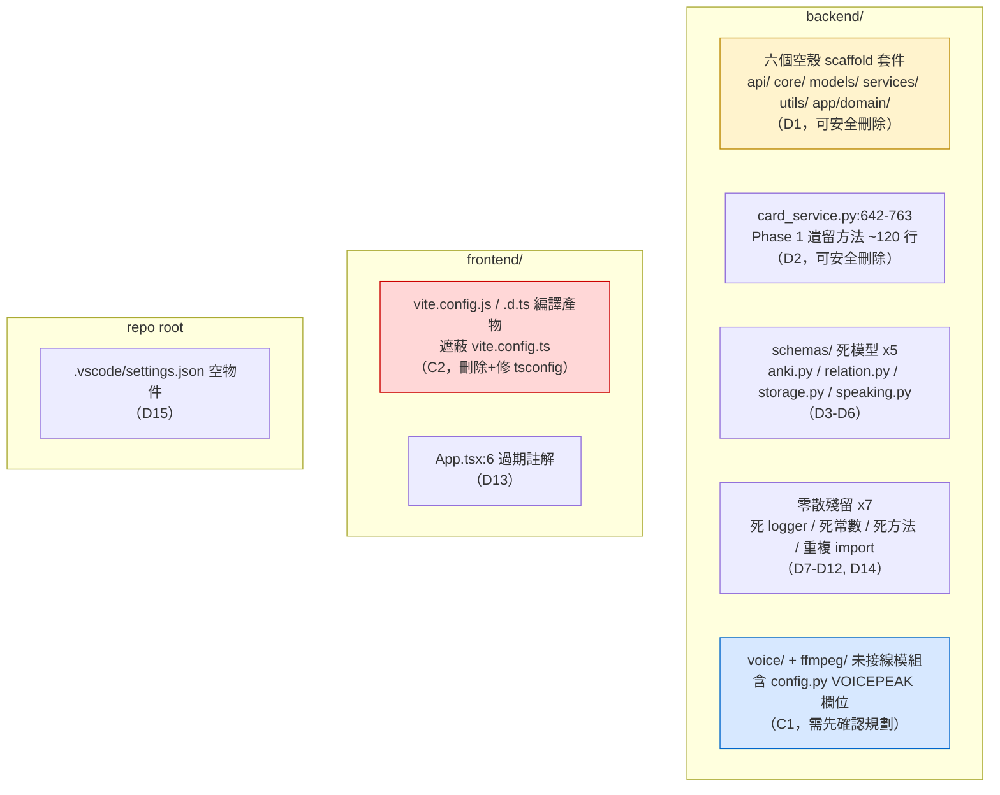

# 廢棄方法與死代碼清單

產生日期：2026-07-07（由 Claude Code 全項目審查產生）
最後更新：2026-07-09（第二輪同步，見 [11_Implementation_Log.md](11_Implementation_Log.md)）

> 📌 **第二輪（2026-07-09）補記**：本輪聚焦階段 0–2 的止血、安全加固與穩定性修復，**未主要處理死代碼**，本清單既有結論（D1–D15、C1–C3）維持有效。兩點與本輪相關的註記：
> 1. **新增查詢跳脫工具函數**（F071/F085/F086/F112 修法引入的 `escape_anki_search_value`）是**新增的活代碼**、非死代碼，不影響本清單。
> 2. **C1（FfmpegMerger 去留）**：本輪已實作 F008，語音評分主路徑開始使用 ffmpeg 轉碼（ogg/opus→wav），佐證「語音合成/處理是有意圖的功能」；C1 的「先確認再刪」判斷維持——刪除前務必確認未與 F008 的轉碼路徑相衝突。

本文檔記錄 FluencyTides 全項目廢棄 API 掃描與死代碼盤點的結果，涵蓋後端（FastAPI / SQLModel / aiogram）、前端（Vite / React / TypeScript）與 DevOps 配置。掃描結論可先概括為一句話：**代碼基底整體相當現代化，未發現任何 critical / high 級別的廢棄 API 用法；實際技術債集中在 scaffold 殘留、建置產物污染、型別紀律鬆動與未完成的遷移四類。** 本文先給出廢棄 / 不良模式總覽，再逐類詳述並附前後對比代碼，最後列出完整死代碼清單與清理優先級建議。所有論斷均已在代碼中逐一核實，引用位置採 `路徑:行號` 格式。

---

## 目錄

1. [廢棄 API 掃描總覽](#1-廢棄-api-掃描總覽)
2. [殘留不良模式詳述（附前後對比）](#2-殘留不良模式詳述附前後對比)
3. [死代碼清單](#3-死代碼清單)
4. [清理優先級建議](#4-清理優先級建議)

---

## 1. 廢棄 API 掃描總覽

### 1.1 已確認「不存在」的過時模式（健康項）

以下是本次掃描逐一檢查、**確認全 repo 均無殘留**的常見廢棄用法。列出此表的目的：一是佐證「無 critical 廢棄 API」的結論，二是作為日後 code review 的檢查基準——新代碼不應引入表中任何一項。

| 廢棄模式 | 現行寫法（本項目實際採用） | 佐證位置 |
|---|---|---|
| FastAPI `@app.on_event("startup"/"shutdown")` | `lifespan` asynccontextmanager | `backend/app/main.py` |
| Pydantic v1：`.dict()` / `.parse_obj()` / `class Config` / `orm_mode` / `@validator` | v2：`model_dump()`、`model_config = ConfigDict(...)`、`SettingsConfigDict`、`@field_validator` | `backend/app/core/config.py`、`backend/app/schemas/` 全部 |
| `datetime.utcnow()`（naive UTC） | `datetime.now(tz=timezone.utc)` 或 DB 端 `server_default=func.now()` + `DateTime(timezone=True)` | `backend/app/infrastructure/database/models.py` |
| SQLAlchemy 1.x 風格 Query API | 2.0 風格 `select()` / `delete()` / `update()` + `AsyncSession.execute` | `backend/app/services/relation_service.py` |
| aiogram 2.x（`executor`、裝飾器直掛 dispatcher） | aiogram 3：`Router`、`F` 過濾器、`DefaultBotProperties(parse_mode=...)`、`outer_middleware` | `backend/app/bot/dispatcher.py` |
| 同步 SDK 阻塞事件循環（`requests`、直呼同步 minio、`os.system`） | `httpx.AsyncClient`、`asyncio.to_thread()` 包 minio SDK、`asyncio.create_subprocess_exec` 跑 FFmpeg/VOICEPEAK | `backend/app/infrastructure/anki/client.py`、`backend/app/infrastructure/storage/minio_client.py` |
| `asyncio.get_event_loop()` 舊式取 loop | 全部經 `asyncio.create_task` / `asyncio.run` | `backend/app/main.py`、`backend/scripts/` |
| `ReactDOM.render` / `componentWillMount` / `defaultProps` | React 18 `createRoot`，函數式元件 + hooks | `frontend/src/main.tsx` |
| React Query v4 `isLoading` 舊語意 | v5 `isPending` | `frontend/src/pages/CardGenerator.tsx` 等 |
| `@ts-ignore`、殘留 `console.log`、`TODO/FIXME` | 無（但見 1.2 的 `any` 與 `type: ignore` 問題） | — |

LLM SDK 呼叫方式亦為現行 API：`openai` 走 `AsyncOpenAI` + `chat.completions` + `response_format=json_schema`（`backend/app/infrastructure/llm/client.py`），Gemini 走新版 `google-genai` SDK 的 `client.aio.models.generate_content`（`backend/app/infrastructure/audio_evaluator/gemini_client.py`），無舊版 `google.generativeai` 殘留。

### 1.2 殘留的「準廢棄 / 不良模式」總覽表

這些不是框架層面的廢棄 API，而是**項目自身已決定遷移但未完成**、或**架空了既有工具鏈**的模式，性質等同於廢棄用法，應以相同紀律清除。

| # | 模式 | 出現位置 | 替代方案 | 嚴重度 |
|---|---|---|---|---|
| P1 | 被 commit 的編譯產物遮蔽源碼設定檔 | `frontend/vite.config.js`、`frontend/vite.config.d.ts`（均在 git 追蹤中） | 刪除產物、`.gitignore` 排除、修正 `frontend/tsconfig.node.json:3` 的 `composite` 設定 | **高** |
| P2 | `alert()` / `confirm()` 原生對話框（已引入 sonner 卻未遷移完） | `frontend/src/pages/KnowledgeGraph.tsx:81,84,93,96,104,107,355`；`frontend/src/components/CardDetailModal.tsx:36,47,65` | sonner `toast` + 自訂確認 UI | 中 |
| P3 | async 函數內同步檔案 IO `open()` | `backend/app/services/anki_model_manager.py:98,139,465,486-490,538,595` | `asyncio.to_thread(...)` 或 `anyio.Path` | 中 |
| P4 | `any` 架空 TypeScript strict mode（全前端 17 處，最集中於圖譜頁 11 處） | `frontend/src/pages/KnowledgeGraph.tsx` 等 | 補齊 `types/api.ts` 對應介面、react-force-graph 泛型 | 中 |
| P5 | `# type: ignore` 系統性壓制（25 處） | `backend/app/infrastructure/anki/client.py` | `_invoke` 改回傳 `Any` 前先以 TypeVar / overload 收斂，或以 Pydantic 模型收窄各方法回傳 | 低 |
| P6 | ESLint 9 已裝但無 flat config，lint script 全然失效 | `frontend/package.json:9`（`"lint": "eslint ."`）；`frontend/` 下不存在 `eslint.config.js` 亦無 `.eslintrc*` | 補 `eslint.config.js`（flat config） | 中 |

---

## 2. 殘留不良模式詳述（附前後對比）

### 2.1 P1：`vite.config.js` / `vite.config.d.ts` 編譯產物污染（最優先）

**為何是問題**：`frontend/tsconfig.node.json:3` 設定 `"composite": true` 且 `include` 僅含 `vite.config.ts`，導致 `tsc -b`（即 `npm run build` 的第一步）將 `vite.config.ts` 編譯輸出 `vite.config.js` 與 `vite.config.d.ts`，且兩檔已被 commit（`git ls-files` 可確認）。Vite 解析設定檔時 **`.js` 優先於 `.ts`**，因此日後任何對 `vite.config.ts` 的修改（例如改代理目標、加插件）都會被過期的 `vite.config.js` 靜默遮蔽——這是一顆已上膛的設定陷阱。

**現狀（錯誤）**：

```jsonc
// frontend/tsconfig.node.json（現狀）
{
  "compilerOptions": {
    "composite": true,   // ← 觸發 emit，產出 vite.config.js/.d.ts
    ...
  },
  "include": ["vite.config.ts"]
}
```

**應改為**：

```jsonc
// frontend/tsconfig.node.json（建議）
{
  "compilerOptions": {
    "composite": true,
    "noEmit": true,      // 或改用 emitDeclarationOnly + 輸出到 gitignore 目錄
    ...
  },
  "include": ["vite.config.ts"]
}
```

並執行：

```bash
git rm frontend/vite.config.js frontend/vite.config.d.ts
echo -e "vite.config.js\nvite.config.d.ts" >> frontend/.gitignore
```

> 注意：若 `tsc -b` 因 `composite` 專案要求 emit 而報錯，可將 vite.config 的型別檢查改為 `tsc --noEmit -p tsconfig.node.json` 單獨執行，總之**產物不得落地進版控**。

### 2.2 P2：`alert()` / `confirm()` 與 sonner toast 混用（未完成的遷移）

**為何是問題**：項目已在 `frontend/src/App.tsx` 掛載 sonner `<Toaster />`，`CardGenerator.tsx` 也已全面使用 `toast`；但 `KnowledgeGraph.tsx` 與 `CardDetailModal.tsx` 仍用瀏覽器原生 `alert()` / `confirm()`。原生對話框會**同步阻塞主執行緒**（Canvas 力導向圖動畫直接凍結）、無法主題化、在部分嵌入式 WebView 中被禁用，且與既有 toast 體驗割裂。這是典型「遷移做一半」的準廢棄模式。

**現狀（`frontend/src/pages/KnowledgeGraph.tsx:81`）**：

```tsx
onSuccess: () => {
  alert('關聯建立成功！')
  ...
},
onError: (err: any) => {
  alert(`建立關聯失敗: ${err.message || '未知錯誤'}`)
}
```

**應改為（與 CardGenerator.tsx 一致的現行寫法）**：

```tsx
import { toast } from 'sonner'

onSuccess: () => {
  toast.success('關聯建立成功！')
  ...
},
onError: (err: ApiError) => {
  toast.error(`建立關聯失敗: ${err.message || '未知錯誤'}`)
}
```

全部出現位置（共 10 處）：

| 檔案 | 行號 | 呼叫 |
|---|---|---|
| `frontend/src/pages/KnowledgeGraph.tsx` | 81, 84, 93, 96, 104, 107 | `alert()` |
| `frontend/src/pages/KnowledgeGraph.tsx` | 355 | `window.confirm()`（刪除關聯確認） |
| `frontend/src/components/CardDetailModal.tsx` | 36, 47 | `alert()` |
| `frontend/src/components/CardDetailModal.tsx` | 65 | `confirm()`（刪除卡片確認） |

`confirm()` 兩處需要替換成非阻塞確認 UI（如 Modal 內二段式確認或 sonner 的 action toast），不能單純換成 toast。

### 2.3 P3：async 函數內的同步 `open()`

**為何是問題**：`AnkiModelManager` 的方法均為 `async def`，但讀取 `anki_models/*.json` 與模板 HTML/CSS 時直接用同步 `open()`（`backend/app/services/anki_model_manager.py:98,139,465,486,488,490,538,595`）。在事件循環內做同步磁碟 IO 會阻塞所有並發請求——本項目同一進程還寄生著 Telegram Bot 的 update 處理，阻塞影響面比一般 Web 應用更大。檔案雖小（數 KB），但這與項目其他處嚴守的 async 紀律（minio 用 `asyncio.to_thread`、子程序用 `create_subprocess_exec`）不一致。

**現狀（`backend/app/services/anki_model_manager.py:98`）**：

```python
with open(file_path, "r", encoding="utf-8") as f:
    model_def = json.load(f)
```

**應改為**：

```python
def _read_json(path: Path) -> dict:
    with open(path, "r", encoding="utf-8") as f:
        return json.load(f)

model_def = await asyncio.to_thread(_read_json, file_path)
```

### 2.4 P4 / P5：型別紀律——前端 `any` 與後端 `type: ignore`

兩者本質相同：**開了 strict 檢查又系統性繞過**，讓型別系統名存實亡。

- **前端**：`frontend/src/pages/KnowledgeGraph.tsx` 集中 11 處 `: any` / `as any`（全前端共 17 處），多為 react-force-graph-2d 的 node/link 回呼參數與 mutation error。`frontend/src/types/api.ts` 已有 `GraphData` 等手寫介面，應延伸定義 `GraphNode` / `GraphLink` 並在回呼簽名使用；error 應統一為後端 `ErrorResponse` 對應的 `ApiError` 介面。
- **後端**：`backend/app/infrastructure/anki/client.py` 有 25 處 `# type: ignore`，根因是 `_invoke` 回傳弱型別（AnkiConnect `result` 欄位為任意 JSON）。現行修法不是逐處壓制，而是讓 `_invoke` 顯式回傳 `Any`（`Any` 可自由賦給具體型別，不需 ignore），或在各公開方法出口以 Pydantic `TypeAdapter` 收窄：

```python
# 現狀（每個呼叫點都要壓制）
result: list[str] = await self._invoke("deckNames")  # type: ignore[assignment]

# 建議
raw = await self._invoke("deckNames")            # _invoke() -> Any
result = TypeAdapter(list[str]).validate_python(raw)
```

### 2.5 P6：ESLint 9 缺 flat config

`frontend/package.json:9` 定義 `"lint": "eslint ."`，devDependencies 也裝了 `eslint@^9.17.0`、`typescript-eslint@^8.18.2`、`eslint-plugin-react-hooks`、`eslint-plugin-react-refresh`（`frontend/package.json:27-39`），但 `frontend/` 下**既無 `eslint.config.js`（ESLint 9 預設的 flat config）也無任何 `.eslintrc*`**。執行 `npm run lint` 會直接報「couldn't find an eslint.config」錯誤，整組 lint 工具鏈與 4 個相關 devDependencies 形同虛設。這也解釋了 2.2 / 2.4 的問題為何能長期存在——沒有任何 linter 在攔截。

修法：補上 Vite React 模板標配的 `eslint.config.js`（`typescript-eslint` flat preset + react-hooks + react-refresh），並考慮把 lint 加入 `.github/workflows/main.yml` 的 frontend job（目前只跑 `npm run build`）。

---

## 3. 死代碼清單

以下按「可安全刪除」與「需先確認」分組。**「可安全刪除」的判定標準**：全 repo grep 確認零引用、且刪除後不影響任何執行路徑與建置流程。

### 3.1 可安全刪除

| # | 項目 | 位置 | 說明與刪除理由 |
|---|---|---|---|
| D1 | 六個空殼 scaffold 套件 | `backend/api/`、`backend/core/`、`backend/models/`、`backend/services/`、`backend/utils/`、`backend/app/domain/` | 每個目錄僅含一個 0 byte `__init__.py`（已逐一 `ls` 核實）。全庫 grep 無任何 import 引用。這五個頂層目錄正好對應 README 所描述、從未實作的舊 Flask 分層，與 `backend/app/` 內同名子套件並存會誤導分層理解、有 shadow 同名套件風險，且被 `backend/Dockerfile` 的 `COPY . .` 打包進生產映像。**可安全刪除**（整批 `git rm -r`）。 |
| D2 | ✅ **已處理（2026-07-08，F030）**：兩方法已刪除（~120 行，隨 card_service.py 拆分完成，見 [10_Implementation_Log.md](10_Implementation_Log.md)）。原記錄：Phase 1 遺留卡片生成方法 | `backend/app/services/card_service.py:642`（`generate_and_add_card`）、`:710`（`check_and_generate`），至檔尾 763 行共約 120 行 | 註解標明「保留供內部測試使用」（`card_service.py:639`），但全 repo 無呼叫端且 backend 不存在 `tests/` 目錄。更關鍵的是：這兩個舊入口**繞過** `generate_card()` 的 Graph_Relations 注入、`extra_fields` 合併與語意化例外包裝（拋原始 `RuntimeError`/`ValueError` 而非 `FluencyTidesError` 子類），一旦被誤用會產出行為不一致的卡片並打穿全域錯誤處理。**可安全刪除**；日後測試應針對 `generate_card` 撰寫。 |
| D3 | Anki createModel schema 群 | `backend/app/schemas/anki.py:141`（`AnkiCardTemplate`）、`:158`（`AnkiModelPayload`）、`:178`（`AnkiCreateModelRequest`） | 三類別除定義外全 backend 零引用——實際的模型安裝流程（`AnkiModelManager`）走的是另一條路徑，未使用這組 schema。**可安全刪除**。附帶：`anki.py:66`、`:108`、`:151` 的 `ConfigDict(populate_by_name=True)` 在該模型無任何 `Field(alias=...)` 的情況下是無作用的殘留設定，可一併移除。 |
| D4 | 未使用的 relation schema | `backend/app/schemas/relation.py:75`（`CardRelationBatchDelete`）、`:90`（`RelationDef`） | schemas 套件外零引用；LLM 關聯建立（`CardService._create_relations_from_llm_data`）與批次刪除端點均未使用。**可安全刪除**（另一選項見 3.2 D14）。 |
| D5 | `MinioPresignedUrlRequest` | `backend/app/schemas/storage.py:87` | 零引用；`MinioClient.get_presigned_url` 以個別參數接收，docstring 宣稱的 expires 合法範圍驗證從未實際發生。**可安全刪除**。 |
| D6 | `PromptAudioItem` | `backend/app/schemas/speaking.py:16` | 零引用，且欄位定義（audio/speaker/avatar）與同檔 `ReferenceAudioItem`（`speaking.py:53`）一字不差。**可安全刪除**（保留 `ReferenceAudioItem` 即可）。 |
| D7 | `dependencies.py` 的無用 logger | `backend/app/core/dependencies.py:20`（`import logging`）、`:36`（`logger = logging.getLogger(__name__)`） | 整個模組無任何 `logger.` 呼叫點。**可安全刪除**兩行。 |
| D8 | `clean_html` 中的死操作 | `backend/app/services/relation_service.py:287` 附近（`get_graph_data` 內嵌函數） | `re.sub(r'<[^>]+>', '', ...)` 已移除**所有** HTML 標籤，其後鏈式 `.replace("<br>", "").replace("<div>", "").replace("</div>", "")` 三個呼叫永遠不會命中，是純粹的死操作。同時 entity 解碼只處理 `&quot;` 與 `&nbsp;`，`&amp;`/`&lt;`/`&gt;`/`&#39;` 未解碼，圖譜節點的 translation/pos 會殘留原始 entity。**可安全刪除死 replace**；建議整段改用標準庫 `html.unescape()`，`import re` 移至模組頂部，並將工具函數提升為模組層級以便測試。 |
| D9 | `PromptManager` 未用方法 | `backend/app/services/prompt_manager.py:131`（`has_template`）、`:143`（`list_templates`） | 全 repo 零引用，`CardService` 只用 `render()`。**可安全刪除**；若日後要做「列出可用模板」的 API 再重新加回並配測試。 |
| D10 | ✅ **已處理（2026-07-08，F094）**：採本欄建議的「保留意圖」做法而非刪除——`_invoke` 已支援 per-request timeout 覆寫，`sync()` 傳入 60 秒（同步操作確實常超過預設 30 秒，見 [10_Implementation_Log.md](10_Implementation_Log.md)）。原記錄：`SYNC_TIMEOUT` 死常數 | `backend/app/infrastructure/anki/client.py:82` | `SYNC_TIMEOUT = 60.0` 全 repo 僅此一處定義、零引用；`sync()` 實際仍走 `DEFAULT_TIMEOUT = 30.0`（`client.py:79`）。首次同步或大量媒體同步超過 30 秒時會拋 `AnkiConnectError`，與常數的設計意圖相悖。~~可安全刪除常數~~；若要保留意圖，正確做法是給 `_invoke` 增加 per-request timeout 覆寫參數並讓 `sync()` 傳入（**已採此方案**）。 |
| D11 | `UserStateManager.has_state` | `backend/app/bot/state.py:105` | 除定義處外全 backend 零引用——`voice.py` 直接以 `get_state()` 的回傳判斷狀態。保留一個無人使用的查詢 API，日後容易與 `get_state` 的過期清理行為悄悄失同步。**可安全刪除**。 |
| D12 | 重複 import settings | `backend/scripts/import_cards_with_llm.py:97` | 模組頂部 `:27` 已有 `from app.core.config import settings`，`:97` 在 `else` 分支內重複 import（對照腳本 `import_cards_from_json.py` 的同一分支就沒有這行），屬複製貼上殘留。**可安全刪除**該行。 |
| D13 | 過期 scaffold 註解 | `frontend/src/App.tsx:6` | `// Pages (will create these next)`——三個頁面早已建立完成，註解與事實不符。**可安全刪除**。 |
| D14 | `alembic/env.py` 未用 import | `backend/alembic/env.py:2` | `import os` 全檔零使用；資料庫 URL 已改由 Pydantic `settings` 注入（`env.py:15`），這是舊式「讀環境變數」寫法的殘留。**可安全刪除**。 |
| D15 | 空的 `.vscode/settings.json` | `.vscode/settings.json:1` | 檔案完整內容只有 `{}`，卻被 `.gitignore` 以 `.vscode/*` + `!.vscode/settings.json` 特意納入版控。追蹤空檔無意義。**可安全刪除**（`.gitignore` 白名單規則可保留，供日後真有共享設定時使用）。 |

### 3.2 需先確認

| # | 項目 | 位置 | 判斷與理由 |
|---|---|---|---|
| C1 | `VoicepeakRunner` 與 `FfmpegMerger` 未接線模組 | `backend/app/infrastructure/voice/voicepeak_runner.py`、`backend/app/infrastructure/ffmpeg/ffmpeg_merger.py` | **需先確認產品規劃**。兩類別全 backend 零外部呼叫者（已 grep 核實），docstring 宣稱的上層 `CharacterManager` 在整個 codebase 不存在，屬舊專案（old/VOICEPEAK）重構後尚未接線的殘留。但代碼品質不差（async subprocess、環境變數隔離防 iconv 崩潰），且 `backend/Dockerfile` 特意安裝了 ffmpeg、`backend/app/schemas/voice.py` 為其準備了完整模型——顯示語音合成是有意圖的功能。**若語音合成屬近期規劃**：補上 Service 層（含 CharacterManager）與呼叫端並加測試；**否則**：移除或移至 feature branch，並連帶清理 `backend/app/core/config.py:279-292` 無人讀取的 `VOICEPEAK_EXECUTABLE_PATH` / `VOICEPEAK_DEFAULT_NARRATOR` / `VOICEPEAK_CHARACTERS_CONFIG_PATH` 三個設定欄位，以及 Dockerfile 的 ffmpeg 安裝與 `schemas/voice.py`。 |
| C2 | `vite.config.js` / `vite.config.d.ts` | `frontend/vite.config.js`、`frontend/vite.config.d.ts` | **刪除本身安全，但必須連同建置設定一起修**（見 2.1）。只 `git rm` 而不改 `tsconfig.node.json` 的話，下一次 `npm run build` 會再度產出並可能再度被 commit。刪檔 + `noEmit` + `.gitignore` 三件事需在同一 commit 完成。 |
| C3 | relation schema 的「刪 vs 用」抉擇 | `backend/app/schemas/relation.py:90`（`RelationDef`） | 直接刪除是安全的（見 D4），但另一個更符合項目準則（「所有跨層資料經 Pydantic 驗證」）的選項是**反過來啟用它**：`CardService._create_relations_from_llm_data` 目前以裸 dict 消費 LLM 回傳的 relations 陣列，改以 `list[RelationDef]` 驗證可攔截 LLM 輸出畸形資料。二擇一，不要維持現狀。 |

### 3.3 死代碼分佈概覽



---

## 4. 清理優先級建議

按「風險 × 修復成本」排序，建議依序處理；P0–P2 均為小 diff，可各自獨立成 commit。

| 優先級 | 項目 | 理由 | 預估工作量 |
|---|---|---|---|
| **P0** | C2 / P1：刪除 `vite.config.js`/`.d.ts` + 修 `tsconfig.node.json` + `.gitignore` | 唯一具「主動傷害性」的一項：過期 `.js` 會靜默遮蔽對 `vite.config.ts` 的任何未來修改，且每次 build 都會再生。 | < 30 分鐘 |
| **P1** | D1：整批刪除六個空殼 scaffold 套件 | 零風險、一條 `git rm -r` 指令；消除分層誤導與套件 shadow 風險，映像也少打包無用檔案。 | < 10 分鐘 |
| **P1** | D2：刪除 `card_service.py` Phase 1 遺留方法 | 這 120 行是「行為不一致的替代入口」，繞過 Graph_Relations 與統一例外，被誤用的後果最實質。 | < 30 分鐘 |
| ~~**P2**~~ ✅ 已完成 | ~~P6：補 ESLint flat config 並接入 CI~~ → ESLint flat config（`eslint.config.js`，第三輪 F054）與 CI 接入（`frontend-build` 加 `npm test` + eslint，2026-07-11 第四輪，見 [12_Implementation_Log.md](12_Implementation_Log.md) §9）**均已完成**。 | 它是其餘前端問題（P2/P4/D13）長期存在的根因；先恢復 linter 再清理，事半功倍。 | ✅ 完成 |
| **P2** | D3–D12, D14, D15：其餘零散死代碼一次掃清 | 全部零引用、零風險，適合合併為單一「chore: remove dead code」commit；D8 順手換 `html.unescape()`。 | 1–2 小時 |
| **P3** | P2：`alert()`/`confirm()` → sonner / 確認 UI（10 處） | 使用者可感知的體驗問題，但不影響正確性；`confirm` 兩處需要設計非阻塞確認流程。 | 2–4 小時 |
| **P3** | P3：`anki_model_manager.py` 同步 `open()` → `asyncio.to_thread` | 影響為尾延遲而非正確性；檔案小、頻率低，但與 Bot 同進程放大了影響面。 | 1 小時 |
| **P4** | C1：VOICEPEAK / FFmpeg 模組去留決策 | 需要產品層面的決定，不是純技術清理；決定前先在 roadmap（docs/02）記錄狀態，避免下一次審查再次全量分析。 | 決策 + 0.5–2 天 |
| **P4** | P4 / P5：型別紀律修復（前端 `any` x17、後端 `type: ignore` x25） | 改善可維護性的長尾工程；建議與 ESLint 落地（P2）配套，用 `no-explicit-any` 規則凍結存量、阻止增量。 | 分批進行 |

### 附註：與其他文檔的關聯

- 空殼 scaffold 套件（D1）與 README.md 描述的舊 Flask 架構同源——README 的整份重寫屬文檔一致性範疇，見 docs-consistency 相關文檔。
- 本清單不含功能性 bug（如 `CardService.list_available_models` 簽名損壞導致 `GET /cards/models` 500、CardDetailModal `isDeleting` 狀態殘留等），該類問題屬缺陷追蹤範疇，僅在其位置與本清單項目重疊時（D2 同檔）順帶提及。
- 全 repo（前後端）目前**沒有任何測試**，因此本清單所有「零引用」判斷均基於靜態 grep 而非測試覆蓋；執行刪除後建議至少手動走一次 `docs/03_Acceptance_Criteria.md` 的驗收路徑。
