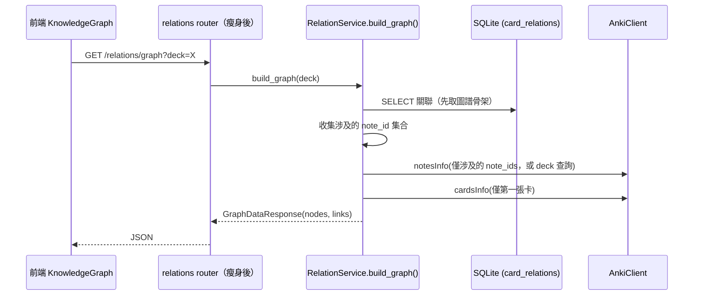

# 08. 重構與重寫建議（Refactor Recommendations）

本文檔基於對 FluencyTides 全項目的代碼審查，針對值得重寫或重構的部分給出具體、可執行的方案。內容涵蓋三個巨型模組的拆分邊界與目標結構、各類設計與效能問題的重構方案、以及從零建立測試體系的策略。每項建議均標註工作量估計（S：半天內 / M：1–3 天 / L：一週以上）、主要風險與前置條件。所有論斷基於實際代碼現狀（引用格式為 `路徑:行號`），而非理想化描述。

> 產生日期：2026-07-07（由 Claude Code 全項目審查產生）
> 最後更新：2026-07-08（第一輪重構後同步，見 [10_Implementation_Log.md](10_Implementation_Log.md)）

---

## 目錄

1. [總覽與優先級](#1-總覽與優先級)
2. [巨型模組拆分](#2-巨型模組拆分)
3. [設計類問題重構方案](#3-設計類問題重構方案)
4. [測試策略（從零到一）](#4-測試策略從零到一)
5. [建議實施路線圖](#5-建議實施路線圖)

---

## 1. 總覽與優先級

FluencyTides 的代碼基底整體現代化程度高（FastAPI lifespan、Pydantic v2、SQLAlchemy 2.0、aiogram 3、React 18 + react-query v5，無廢棄 API 殘留），重構的目標不是「翻新技術棧」，而是解決三類結構性問題：

| 問題類別 | 代表 | 影響 |
|---|---|---|
| **巨型模組** | `anki/client.py`（933 行）、`card_service.py`（763 行）、`anki_model_manager.py`（617 行） | 修改成本高、`card_service.py:485-495` 已出現「方法定義被誤刪而無人察覺」的實際事故 |
| **設計偏離** | Controller 越權操作 Infrastructure、隱藏副作用、交易邊界分散、重複實作 | 行為不可預期、修改容易漏改 |
| ~~**零測試**~~ ✅ 第三輪已解除、第四輪 CI 接入 | ~~後端無 `tests/` 目錄、`requirements.txt` 無 pytest；前端無 test script~~ → 已建 48 pytest + 11 vitest（見 §4）；**CI 接入 ✅ 已完成（2026-07-11，第四輪，見 [12_Implementation_Log.md](12_Implementation_Log.md) §9）** | 損壞代碼可通過 CI 直接部署到生產 → 測試已能攔截，且第四輪已接入 CI（pytest/vitest 為 docker 部署前置） |

重構優先級總表（詳細方案見各章節）：

| 優先級 | 項目 | 工作量 | 章節 |
|---|---|---|---|
| P0 | 建立 pytest 測試基座 + 修復 `list_available_models` 損壞方法 | M | §4、§2.2 |
| P0 | LLM 重試策略修正（timeout / 不可重試錯誤） | S | §3.4 |
| P1 | CardService 拆分（含 SpeakingService 抽出、刪除死代碼） | M | §2.2 |
| P1 | 知識圖譜路徑重構（Controller 下沉 + 全量掃描優化） | M | §3.2 |
| P1 | 設定管理改 `get_settings()` + Bot middleware 懶初始化 | M | §3.1 |
| P2 | AnkiModelManager 拆分（含檔案 IO 快取化） | M | §2.3 |
| P2 | AnkiClient 拆分 + `_invoke` 泛型化 | L | §2.1 |
| P2 | RelationService 交易邊界統一 + 重複方法合併 | S | §3.5 |
| P3 | Schema 強化、前端型別修復、腳本去重等小項 | S×N | §3.6–§3.8 |

---

## 2. 巨型模組拆分

### 2.1 `backend/app/infrastructure/anki/client.py`（933 行）

> ✅ **已實施（2026-07-08）**：按本方案完成「傳輸層 + 六個領域 Mixin」拆分（client.py 933 → 60 行），`_invoke_typed`（TypeAdapter）落地、25 處 `# type: ignore` 歸零，F095 日誌摘要一併完成。與方案的差異：`can_add_notes` 採 `Sequence[AnkiNote | dict[str, object]]` Union 向後相容而非純 `list[AnkiNote]`；`get_cards_info` 的 `AnkiCardInfo` 回應模型當時**未新增**（呼叫端同輪次並行重構，留待下一輪）——**✅ 已於第四輪補齊（2026-07-11，見 [12_Implementation_Log.md](12_Implementation_Log.md) §9）：新增 `AnkiCardInfo` 模型、`get_cards_info` 型別化回傳、消費端型別化存取，並連帶修 `anki_model/manager.py` isinstance 回歸**；前置條件的完整測試未建立，改以 mypy + respx 冒煙測試驗證。詳見 [10_Implementation_Log.md](10_Implementation_Log.md) §2.2。

**現狀分析**：`AnkiClient` 是單一巨型類別，內部已用註解區塊自我劃分為七段——核心 `_invoke`（`client.py:126-188`）、牌組操作（`client.py:194-303`）、筆記操作（`client.py:309-563`）、卡片操作（`client.py:569-679`）、媒體操作（`client.py:685-763`）、模型操作（`client.py:769-845`）、雜項操作（`client.py:851-933`）。這些註解區塊本身就是天然的拆分邊界。

該檔案的根本問題不只是長度，而是 `_invoke()` 回傳弱型別 `object`（`client.py:126`），導致每個公開方法都以 `# type: ignore[arg-type]` 收尾（全檔 25 處，如 `client.py:208`、`client.py:224`、`client.py:337`），mypy 對 AnkiConnect 回應結構完全失去檢查能力——`result` 為 `None` 時 `list(result)` 會在執行期拋 `TypeError` 而非在型別層被攔截（F134）。

**目標結構**：按現有註解區塊拆為「傳輸層 + 領域 Mixin」的組合：

```
backend/app/infrastructure/anki/
├── __init__.py          # re-export AnkiClient、AnkiConnectError（呼叫端 import 不變）
├── transport.py         # AnkiTransport：__init__/close/_invoke/_invoke_typed + AnkiConnectError
├── decks.py             # DeckActionsMixin（原 194-303 行：get_deck_names 等 7 個方法）
├── notes.py             # NoteActionsMixin（原 309-563 行：add_note、find_notes、tags 等 13 個方法）
├── cards.py             # CardActionsMixin（原 569-679 行：find_cards、suspend 等 7 個方法）
├── media.py             # MediaActionsMixin（原 685-763 行：store_media_file 等 5 個方法）
├── models.py            # ModelActionsMixin（原 769-845 行：get_model_names、create_model 等）
├── misc.py              # MiscActionsMixin（原 851-933 行：sync、multi、gui_browse 等）
└── client.py            # class AnkiClient(DeckActionsMixin, NoteActionsMixin, ..., AnkiTransport)
```

選擇 Mixin 組合而非「子客戶端物件」（`client.decks.get_names()` 風格）的理由：全專案已有大量 `anki_client.get_deck_names()` 形式的呼叫點（CardService、AnkiModelManager、relations router、bot handlers、三支 scripts），Mixin 方案保持公開 API 完全不變，拆分是純檔案搬移，風險最低。

**同步進行 `_invoke` 泛型化**（消除 25 處 type: ignore）：

```python
# transport.py
from typing import TypeVar
from pydantic import TypeAdapter

T = TypeVar("T")

class AnkiTransport:
    async def _invoke(self, action: str, **params: object) -> object:
        ...  # 現有實作不變

    async def _invoke_typed(
        self, action: str, result_type: type[T], **params: object
    ) -> T:
        """呼叫 _invoke 並以 TypeAdapter 做執行期驗證 + 靜態型別收斂。"""
        raw = await self._invoke(action, **params)
        return TypeAdapter(result_type).validate_python(raw)
```

各方法改寫為 `return await self._invoke_typed("deckNames", list[str])`，同時獲得執行期 `None` 防護（AnkiConnect 回傳 `null` 時拋出明確的 ValidationError 而非 `TypeError`）。順帶處理 F095：`_invoke` 的 DEBUG 日誌（`client.py:151-155`）對 `params` 做摘要輸出（超過 200 字元的值截斷為 `<{len} bytes>`，`data` 欄位一律不輸出），避免 `storeMediaFile` 的整段 base64 進日誌。

另依 F096，`can_add_notes`（`client.py:546`）改收 `list[AnkiNote]`，`get_cards_info`（`client.py:584`）補 Pydantic 回應模型 `AnkiCardInfo`（`relation_service.get_graph_data` 目前以 `c.get("note")`、`c.get("queue")` 裸取欄位，`relation_service.py:292-294`，正是最需要模型保護的呼叫端）。

| 項目 | 標註 |
|---|---|
| 工作量 | **L**（拆檔本身 M，但 `_invoke_typed` 改造涉及全部 ~40 個方法與其呼叫端） |
| 風險 | 中。Mixin 拆分為純搬移、風險低；`_invoke_typed` 引入執行期驗證後，過去「靜默通過」的異常回應會開始拋錯（這是期望行為，但需要測試覆蓋確認） |
| 前置條件 | §4 的 AnkiClient 單元測試先行（以 respx mock httpx），否則無法驗證拆分後行為等價 |

### 2.2 `backend/app/services/card_service.py`（763 行）

> ✅ **已實施（2026-07-08）**：F001 損壞方法已修復、~120 行死代碼已刪除、`generate_card` 按方案骨架拆為六個私有步驟方法、Schema 注入移至 `schema_composer.py`、`SpeakingService` 抽出（含 `_load_card_context` / `_persist_recording`，另以 `_CardContext` dataclass 承載中間狀態）、F088 / F091 一併完成，Bot 注入鏈同步改指向新服務。card_service.py 763 → 568 行（方案預估 ~300 行，實際保留較多 docstring 與編排）。詳見 [10_Implementation_Log.md](10_Implementation_Log.md) §2.1。

**現狀分析**：CardService 是典型的上帝類別趨勢（F031），且含一處**已確認的損壞代碼**：

1. **損壞的方法定義**（最高優先）：`card_service.py:485-495` 中，`process_voice_evaluation` 的 `except` 區塊 `raise` 之後，直接跟著一段孤立的 docstring 與 `return self._model_manager.list_available_models()`——`def list_available_models(self):` 這一行方法簽名被整段誤刪。後果是 `cards.py:94` 的 `card_service.list_available_models()` 呼叫必然 `AttributeError`，`GET /api/v1/cards/models` 端點 500。而該 `return` 語句寄生在 `process_voice_evaluation` 尾部永不可達。
2. **generate_card 過長**（`card_service.py:101-269`，約 170 行）：單一方法完成牌組檢查、防重複、讀 Schema、動態注入 30 行 Graph_Relations JSON Schema 字面量（`card_service.py:176-192`）、Prompt 解析、LLM 呼叫、extra_fields 合併、提交、寫關聯等九個步驟。
3. **職責混雜**：語音評估流程 `process_voice_evaluation`（`card_service.py:361-487`，127 行）被誤放在「查詢輔助方法」區段，且與卡片生成毫無共用狀態——它只用到 `_anki_client` 與外部傳入的 `audio_evaluator`。
4. **死代碼**：Phase 1 遺留的 `generate_and_add_card`（`card_service.py:642-708`）與 `check_and_generate`（`card_service.py:710-763`）經全庫 grep 確認**無任何外部呼叫者**（僅 `check_and_generate` 內部呼叫 `generate_and_add_card`），共約 120 行可直接刪除。
5. **函數內 import**（F091）：`card_service.py:171`（copy）、`card_service.py:446`（AnkiStoreMediaParams）、`card_service.py:457`（RecordingItem）、`card_service.py:559`（CardRelationCreate），皆非循環依賴所需，應上移至模組頂部。

**目標結構**：

```
backend/app/services/
├── card_service.py            # 瘦身後的 CardService：generate_card 編排 + RUD
│                              #   （約 300 行：generate_card 拆為多個私有步驟方法）
├── speaking_service.py        # SpeakingService：process_voice_evaluation 全流程
│                              #   （依賴 AnkiClient + BaseAudioEvaluator，建構子注入）
├── schema_composer.py         # GraphRelationsSchemaComposer：Graph_Relations 注入邏輯
│                              #   （純函數，30 行 JSON Schema 字面量移出流程代碼）
└── （anki_model_manager.py、prompt_manager.py、relation_service.py 見各自章節）
```

拆分後的 `generate_card` 編排骨架：

```python
async def generate_card(self, request: CardGenerateRequest) -> CardGenerateResponse:
    await self._ensure_preconditions(request)          # Step 1-2: 牌組 + 防重複
    schema = self._load_llm_schema(request)            # Step 3: 讀檔 + compose_graph_relations(schema)
    system_prompt = self._resolve_system_prompt(request.system_prompt, request.model_name)
    llm_result = await self._llm_client.generate_structured_data(...)
    merged, relations = self._merge_and_extract(llm_result, request)  # Step 6-7
    note_id = await self._submit(merged, request)      # Step 8: 組裝 + 提交 + 例外語意化
    await self._create_relations_from_llm_data(note_id, request.user_input, relations)
    return CardGenerateResponse(...)
```

`SpeakingService` 的建構子只收 `anki_client`，`evaluate_audio` 所需的 evaluator 維持呼叫時傳入（與現行 bot middleware 注入方式相容），Bot 端 `voice.py` handler 與 `bot/dependencies.py` 的注入改指向新服務。內部再拆三個私有方法：`_load_card_context`（讀 Prompt/References/Recordings 欄位並解析 JSON，`card_service.py:392-428`）、`_persist_recording`（存媒體 + 組 RecordingItem + 寫回欄位，`card_service.py:443-475`）、主流程只剩編排。

順帶處理 F088：`update_card`（`card_service.py:308-333`）硬編碼 `if "Expression" in fields` 判斷主欄位。重構時讓 `update_card` 增加 `primary_field_name: str = "Expression"` 參數（`CardGenerateRequest` 已有此概念），由 API 層傳入或從模型定義檔查出，消除對 Speaking_Coach 系列模型的靜默失效。

| 項目 | 標註 |
|---|---|
| 工作量 | **M**（修復損壞方法 + 刪死代碼為 S；SpeakingService 抽出與 generate_card 拆步驟為 M） |
| 風險 | 低–中。損壞方法修復是純增益；SpeakingService 抽出需同步修改 `bot/dependencies.py` 與 `bot/handlers/voice.py` 的注入鏈，Bot 端無測試，需人工驗證錄音流程 |
| 前置條件 | 修復 `list_available_models` 應**立即**進行，不等重構；其餘拆分建議在 §4 的 generate_card 測試就位後執行 |

### 2.3 `backend/app/services/anki_model_manager.py`（617 行）

> ✅ **已實施（2026-07-08）**：按本方案拆為 `anki_model/` 套件（repository / note_builder / manager），`anki_model_manager.py` 保留為 24 行相容 shim；`ModelFileRepository` 快取＋async 化落地（F028 / F074 消除），並依方案建議改為 lifespan Singleton（`app.state.model_repo`，工廠拿不到時退回自建以相容 Bot 與 scripts）；F027 / F087 一併完成。行為變化：模型檔首次讀取後快取，執行期修改需重啟服務（已標注於模組 docstring）。詳見 [10_Implementation_Log.md](10_Implementation_Log.md) §2.3。

**現狀分析**：AnkiModelManager 實際混合了三種完全不同的職責，且各自的依賴不同：

| 職責 | 方法 | 依賴 |
|---|---|---|
| 本地模型檔案倉儲（純檔案 IO） | `get_model_schema`（`anki_model_manager.py:73-120`）、`get_model_fields`（122-149）、`list_available_models`（520-569）、`get_model_detail`（571-603） | 只依賴 `_model_dir`，**不需要 AnkiClient** |
| AnkiNote 組裝（純轉換） | `create_note_from_llm_response`（155-208） | 無外部依賴，可為純函數 |
| AnkiConnect 前置檢查與提交 | `submit_note`（214-253）、`_lookup_duplicate_location`（255-309）、`ensure_deck_exists`（315-348）、`can_add_note`（354-416）、`import_model_from_files`（422-514）、`sync_to_ankiweb`（609-617） | 依賴 AnkiClient |

其中檔案 IO 職責含兩個具體缺陷（F028）：

- `can_add_note` 為了補齊空欄位，在 `anki_model_manager.py:382-383` 呼叫 `list_available_models()` 同步掃描**整個目錄**的所有 JSON 檔，只為找出單一模型的欄位清單——每次卡片生成請求都在事件迴圈上執行阻塞 IO；
- `import_model_from_files` 內有四處同步 `open()`（`anki_model_manager.py:465`、`486-491`）。

**目標結構**：

```
backend/app/services/anki_model/
├── __init__.py              # re-export，維持 from app.services.anki_model_manager import ... 相容
├── repository.py            # ModelFileRepository：所有本地 JSON/HTML/CSS 讀取
│                            #   - 以實例級 dict 快取（模型檔執行期不變）
│                            #   - 讀檔統一走 asyncio.to_thread 或提供 sync/async 雙介面
├── note_builder.py          # build_note_from_llm_response()：模組級純函數
└── manager.py               # AnkiModelManager：只保留 AnkiConnect 相關方法，
                             #   建構子注入 AnkiClient + ModelFileRepository
```

`ModelFileRepository` 的快取設計（同時解決 F028 與 F074）：

```python
class ModelFileRepository:
    def __init__(self, model_dir: Path) -> None:
        self._model_dir = model_dir
        self._cache: dict[str, dict[str, object]] = {}   # 檔名 -> 解析後 JSON

    async def get_fields(self, model_name: str) -> list[str]:
        """精準讀單一模型的 inOrderFields（取代 can_add_note 的全目錄掃描）。"""
        data = await self._load(f"{model_name}.json")
        ...

    async def _load(self, file_name: str) -> dict[str, object]:
        if file_name not in self._cache:
            self._cache[file_name] = await asyncio.to_thread(self._read_json, file_name)
        return self._cache[file_name]
```

`can_add_note`（`anki_model_manager.py:354-416`）改為 `await self._repo.get_fields(model_name)`，把「全目錄掃描 + 同步 IO」變成「單檔讀取 + 首次之後零 IO」。API 層的 `cards.py:94`、`cards.py:119` 兩個 async 端點（F074）在 repository 全面 async 化之後自然消除阻塞。

由於 `dependencies.py` 與 `bot/dependencies.py` 均以 `AnkiModelManager(anki_client)` 逐請求實例化，快取要有效，`ModelFileRepository` 應改為 **lifespan 建立的 Singleton**（掛 `app.state.model_repo`），與 AnkiClient 同生命週期——這也順勢把「每請求 new 一個 manager」的無謂開銷降下來。

| 項目 | 標註 |
|---|---|
| 工作量 | **M** |
| 風險 | 中。快取引入「改模型檔需重啟服務」的行為變化（現狀每次重讀），需在文檔標明；`ensure_deck_exists` 的行為變更見 §3.3，建議與本項一起做 |
| 前置條件 | `core/dependencies.py` 與 `bot/dependencies.py` 的注入鏈同步修改；scripts（`import_cards_from_json.py`、`import_cards_with_llm.py`）也直接使用 AnkiModelManager，需一併驗證 |

---

## 3. 設計類問題重構方案

### 3.1 設定管理與依賴注入（F021、F046）

> ✅ **已實施（2026-07-08）**：F021 完成第一階段（`@lru_cache get_settings()` + 模組層別名，既有 import 不變）。F046 完成，但與方案的差異：未採 lazy factory，改為「`llm_client=None` 時仍注入全部服務＋以 `anki_client` 為鍵的中介層實例級服務快取」（`RelationService` 因綁定 DB session 維持逐 Update 建立），session 佔用時間問題未按方案縮短。詳見 [10_Implementation_Log.md](10_Implementation_Log.md) §2.1、§3。

**F021 — 模組層級 `settings = Settings()`**（`backend/app/core/config.py:327`）：docstring 宣稱延遲初始化，實際 import 時即實例化並讀取 .env，所有模組（auth、database、dispatcher、webhook 路由路徑）在 import 期綁死此實例，測試無法注入 mock 設定，未來新增必填欄位會回到「import 即 ValidationError」。

**方案**：改用標準 FastAPI 模式：

```python
# core/config.py
from functools import lru_cache

@lru_cache
def get_settings() -> Settings:
    return Settings()
```

遷移策略分兩階段：第一階段保留 `settings = get_settings()` 模組級別名（現有 ~20 處 `from app.core.config import settings` 不用改），僅讓**測試**能以 `get_settings.cache_clear()` + 環境變數重建設定；第二階段逐模組改為函數內取用或 `Depends(get_settings)`。特別注意兩處 import 期消費者：`webhook.py` 的路由路徑（`TG_WEBHOOK_PATH` 在 import 時決定）與 `database.py` 的 engine 建立——這兩處是完整遷移的難點，可接受長期停在第一階段。

- 工作量：**S**（第一階段）/ **M**（完整遷移）
- 風險：低（第一階段行為完全等價）
- 前置條件：無

**F046 — Bot ServiceInjectionMiddleware 全滅式失敗 + 每 update 全套服務**（`backend/app/bot/dependencies.py:107`）：`llm_client` 為 None（`main.py` 中的合法降級狀態）時 middleware 直接 `raise RuntimeError`，且註冊在 `dp.update` 全域層——連 `/help`、`/sync` 也全部無回應。且每個 update 都實例化 AnkiModelManager、PromptManager、RelationService、CardService，DB session 生命週期撐到 handler 結束（含數十秒的 LLM/語音呼叫）。

**方案**：

1. `llm_client is None` 時不再 raise，改注入 `card_service=None`；`messages.py` handler 開頭檢查 `if card_service is None: await message.answer("LLM 服務未啟用...")`。
2. 服務注入改 lazy factory：middleware 只注入輕量 callable，handler 真正取用時才建 session 與服務：

```python
# dependencies.py（middleware 內）
data["make_card_service"] = lambda session: CardService(
    anki_client=anki_client, llm_client=llm_client, ...
)
data["session_factory"] = async_session_factory
```

handler 端以 `async with session_factory() as session:` 包住真正需要 DB 的區段，session 佔用時間從「整個 handler」縮短到「實際 DB 操作」。

- 工作量：**M**（三個 handler router 都要調整取用方式）
- 風險：中。Bot 端無測試，需人工回歸 /start、/newcard、語音、文字生卡四條流程
- 前置條件：無；若與 §2.2 SpeakingService 抽出同時進行可一次改完注入鏈

### 3.2 知識圖譜路徑：Controller 越權 + 全量掃描（F022、F023）

> 🔶 **部分實施（2026-07-08）**：步驟 1（邏輯下沉至 `RelationService.get_graph_data(anki_client, deck_name)`，Controller 只留參數傳遞，`AnkiConnectError` 統一包裝 502）已完成；步驟 2–4 中，**TTL 快取（F023）✅ 已於第四輪完成（2026-07-11，見 [12_Implementation_Log.md](12_Implementation_Log.md) §9）**：類別層級 TTL(30s) 圖譜快取 + 寫入路徑主動失效；其餘（資料流反轉、F072 的 `GraphDataResponse`）仍**未實施**，留待下一輪。詳見 [10_Implementation_Log.md](10_Implementation_Log.md) §3。

`GET /relations/graph`（`backend/app/api/relations.py:49`）有兩個疊加的問題：

1. **Controller 直接操作 AnkiClient**：拼 Anki query、`find_notes`、`get_notes_info`、`get_cards_info` 的編排邏輯全部寫在路由函數內，違反專案自訂的「Controller 零業務邏輯」原則（`dependencies.py` 明言 Controller 不觸碰 Infrastructure）。
2. **每次請求全量掃描**：`deck:*` 撈全部筆記 ID → 全部筆記完整欄位（含 HTML）→ 全部卡片狀態。數千張卡的收藏下，每次打開圖譜頁面都透過 AnkiConnect 傳輸整個收藏，延遲與記憶體線性增長，且前端 react-query 預設 `refetchOnWindowFocus` 會反覆觸發。

**方案**（一次重構解決兩者）：



具體步驟：

1. 將 `relations.py:49` 端點內的 Anki 查詢與狀態提取邏輯整體下沉為 `RelationService.build_graph(deck_name)`，Controller 只剩參數傳遞——`get_graph_data`（`relation_service.py:264-389`）已經接受 `notes_info`/`cards_info` 參數，下沉是把「取得這兩個參數」的邏輯也搬進 Service。
2. 反轉資料流：先從 SQLite 取關聯（圖譜骨架），再**僅對涉及的 note_id** 批次呼叫 `notesInfo`；孤立節點（有卡無關聯）若需顯示，改用 `findNotes(deck:X)` + 分頁，而非無條件全量。
3. 加最小快取：以 AnkiConnect 無 collection mtime API 的現實下，可用簡單 TTL（如 30 秒）的 in-process 快取，配合前端把 `refetchOnWindowFocus` 關掉（`main.tsx` 的 QueryClient 目前用預設值）。
4. 同時處理 F072：`relations.py:30` 的 `response_model=dict[str, list[dict]]` 改為明確的 `GraphDataResponse` schema（見 §3.6）。

- 工作量：**M**
- 風險：中。`get_graph_data` 混有 HTML 清洗與節點分組展示邏輯（`relation_service.py:284-287`、`368`），搬移時保持輸出結構逐欄位一致，前端 `KnowledgeGraph.tsx` 依賴 `id/group/val/label/translation/pos/note_id/status` 全部欄位
- 前置條件：建議先為現行端點寫一個「輸出快照」整合測試（mock AnkiClient），確保重構前後 JSON 等價

### 3.3 Anki 前置檢查的隱藏副作用（F027）

> ✅ **已實施（2026-07-08）**：按本方案落地 `sync_on_missing=False` 預設快速失敗，`import_cards_from_json.py` 顯式傳 `True` 保留原行為，詳見 [10_Implementation_Log.md](10_Implementation_Log.md) §2.3。

`ensure_deck_exists`（`backend/app/services/anki_model_manager.py:315-348`）在牌組不存在時**自動觸發完整 AnkiWeb 同步**（`anki_model_manager.py:336` 的 `await self._anki_client.sync()`）再重查。使用者打錯牌組名稱時，每次生卡請求都會在失敗前先執行一次可能耗時數十秒、且實際改動本地集合的網路同步——副作用完全隱藏在「存在性檢查」的名字之下。

**方案**：

```python
async def ensure_deck_exists(
    self, deck_name: str, *, sync_on_missing: bool = False
) -> None:
    decks = await self._anki_client.get_deck_names()
    if deck_name in decks:
        return
    if sync_on_missing:
        await self._anki_client.sync()
        if deck_name in await self._anki_client.get_deck_names():
            return
    raise DeckNotFoundError(f"牌組 '{deck_name}' 不存在")
```

預設 `False`，讓 `CardService.generate_card` 的呼叫（`card_service.py:144`）快速失敗回 404；若「同步後牌組會出現」是真實使用場景（多裝置建牌組），由呼叫端顯式開啟，並在 API 文檔揭露此行為。順帶把例外從 `RuntimeError` 改為直接拋 `DeckNotFoundError`，省去 `card_service.py:145-146` 的字串轉包。

- 工作量：**S**
- 風險：低，但屬**行為變更**：依賴「打錯牌組名會觸發同步」隱式行為的工作流會改變，需在 CHANGELOG 標注
- 前置條件：無

### 3.4 LLM 與語音評分的韌性（F041、F043）

> ✅ **已實施（2026-07-08）**：F041 按方案完成（僅瞬時錯誤重試＋指數退避 2/4/8s，401/400 立即拋 `LLMServiceError`）；F043 完成——Prompt 抽至 `audio_evaluator/prompts.py`、圍欄清理統一為 `llm/client.py` 模組級 `strip_markdown_fences`、`BaseAudioEvaluator` Template Method（子類實作 `_evaluate_audio_once`），F097 的 `response_schema` 一併採納（保留文字解析 fallback，環境無法安裝 SDK 驗證已於 docstring 註明）。詳見 [10_Implementation_Log.md](10_Implementation_Log.md) §3。

**F041 — 重試策略對所有例外一視同仁**（`backend/app/infrastructure/llm/client.py:144`）：`except Exception` 捕捉一切後固定 sleep 2 秒重試 3 次（`client.py:144-153`）。三個具體缺陷：

- `AuthenticationError`（401）、`BadRequestError`（400）等確定性錯誤重試純屬浪費並延遲錯誤浮現；
- `AsyncOpenAI` 未設 timeout（預設 600 秒），單次卡住可拖住生成流程近 10 分鐘；
- JSONDecodeError 分支（`client.py:193-204`）在 `temperature=0.0` 下重送**相同請求**，大概率得到相同壞輸出。

**方案**：

```python
from openai import (
    APIConnectionError, APITimeoutError, AsyncOpenAI,
    InternalServerError, RateLimitError,
)

RETRYABLE = (RateLimitError, APIConnectionError, APITimeoutError, InternalServerError)

self._client = AsyncOpenAI(
    base_url=..., api_key=...,
    timeout=90.0,       # 依實測生成時長調整
    max_retries=0,      # 重試由我們自己控制，避免雙重重試
)

# 迴圈內：
except RETRYABLE as e:
    if attempt == self.MAX_RETRIES:
        raise LLMServiceError(...) from e
    await asyncio.sleep(self.RETRY_DELAY_SECONDS * (2 ** (attempt - 1)))  # 指數退避
except Exception as e:          # 401/400 等：不重試，立即語意化拋出
    raise LLMServiceError(f"LLM API 不可重試錯誤: {e}") from e
```

JSONDecodeError 分支重試時可在 user prompt 附加一行「上次輸出非合法 JSON，請只輸出 JSON」以打破確定性。

- 工作量：**S**
- 風險：低
- 前置條件：無；建議搭配 `_strip_markdown_fences` 的參數化測試（見 §4）

**F043 — 評分 Prompt 重複與 evaluator 無重試**：`gemini_client.py:53-65` 與 `openai_client.py:71-82` 的 `_build_evaluation_prompt` 幾乎逐字相同；圍欄清理在 `gemini_client.py:168-173` 與 `llm/client.py:223-229` 兩處重複（openai evaluator 直接 `json.loads`，無此邏輯）。`base.py:9` 承諾「未來在基底類增加共用重試」但兩個 evaluator 均單發呼叫——語音評分恰是最常遇瞬時錯誤的長請求。

**方案**：在 `BaseAudioEvaluator` 落實 template method：

```python
# base.py
class BaseAudioEvaluator(ABC):
    MAX_RETRIES = 3

    async def evaluate_audio(self, ...) -> AudioEvaluationResult:
        """公開入口：統一重試包裝（僅捕捉瞬時錯誤）。"""
        for attempt in range(1, self.MAX_RETRIES + 1):
            try:
                return await self._evaluate_once(...)
            except TransientEvaluationError:
                if attempt == self.MAX_RETRIES:
                    raise
                await asyncio.sleep(2 ** attempt)

    @abstractmethod
    async def _evaluate_once(self, ...) -> AudioEvaluationResult: ...

    @staticmethod
    def build_evaluation_prompt(prompt_text, reference_answers) -> str:
        ...  # 兩實作共用的 prompt，單一事實來源
```

圍欄清理抽到 `infrastructure/common/json_cleanup.py`（或直接 import `LLMClient._strip_markdown_fences` 改為模組級函數），Gemini 路徑同時採納 F097：`GenerateContentConfig` 加 `response_schema=AudioEvaluationResult` 並改用 `response.parsed`，圍欄清理與 `json.loads` 在該路徑可整段刪除。

- 工作量：**M**
- 風險：低–中（Gemini `response.parsed` 行為需以真實 API 驗證一次）
- 前置條件：無

### 3.5 資料層：交易邊界、重複方法與 SQL 限制（F029、F083、F084、F093）

> 🔶 **部分實施（2026-07-08）→ ✅ 大部分完成（2026-07-09，第三輪）**：F029 第一輪完成（`delete_relations_for_note` 已刪除、呼叫端同步更新）；**F083（N+1 消除：批次註冊類型 + 單次 flush 取 id + 單一交易 commit）、F084（改 Python 端比對孤兒 + 每批 ≤900 的 IN 刪除）已於第三輪完成**（詳見 [12_Implementation_Log.md](12_Implementation_Log.md) §4）；F093 ⏸ 依風險評估暫緩。

**F029 — 完全重複的刪除方法**：`delete_relations_by_note_id`（`relation_service.py:103-128`）與 `delete_relations_for_note`（`relation_service.py:162-181`）的 delete 語句一字不差。保留前者，刪除後者，更新唯一呼叫點 `card_service.py:351`。
工作量 **S** / 風險極低 / 無前置。

**F083 — 批次寫入非原子 + N+1 refresh**（`relation_service.py:70-101`）：`batch_create_relations` 對每筆新關聯各發一次 SELECT refresh（`relation_service.py:97-98`）；`get_or_create_relation_type` 在迴圈中逐次 commit（`relation_service.py:212-224`），批次被切成多個交易，後段失敗時前面已提交的 relation_types 留下部分狀態。

**方案**：

```python
async def batch_create_relations(self, requests) -> list[CardRelationRead]:
    if not requests:
        return []
    for rt in {r.relation_type for r in requests}:
        await self._ensure_relation_type(rt)      # 內部版本：只 add，不 commit
    relations = [CardRelation(**r.model_dump()) for r in requests]
    self._db_session.add_all(relations)
    await self._db_session.commit()               # 單一交易邊界
    # 不逐筆 refresh：id 在 commit 後已由 identity map 回填（SQLite/MySQL 皆然），
    # created_at 若呼叫端不需要精確值，直接省略 refresh；需要則改 insert().returning()
    return [CardRelationRead.model_validate(rel) for rel in relations]
```

長期方向：RelationService 每個方法自行 commit 的模式（全檔 7 處 commit）應收斂為「Service 方法只 flush，commit 由請求邊界（FastAPI dependency 的 session 生成器 / Bot middleware）統一執行」，即標準 Unit of Work。這是 **M** 級改動，涉及 `get_async_session` 與 `bot/dependencies.py` 的 session 管理，建議在測試就位後做。

**F084 — sync_with_anki 的 IN 參數上限**（`relation_service.py:130-160`）：`not_in(valid_note_ids)` 將全集合 note_id（可達數萬）逐一綁定為 SQL 參數，超過 SQLite 變數上限（預設 999，3.32+ 為 32766）即拋 `too many SQL variables`。

**方案**：反轉為「查出 DB 中所有 distinct note_id（關聯表行數遠小於 Anki 集合）→ Python 端 set 差集求孤兒 → 分批（每批 500）刪除」：

```python
async def sync_with_anki(self, valid_note_ids: list[int]) -> int:
    valid = set(valid_note_ids)
    rows = await self._db_session.execute(
        select(CardRelation.id, CardRelation.source_note_id, CardRelation.target_note_id)
    )
    orphan_ids = [
        rid for rid, src, tgt in rows
        if (src is not None and src not in valid) or (tgt is not None and tgt not in valid)
    ]
    for chunk in itertools.batched(orphan_ids, 500):
        await self._db_session.execute(delete(CardRelation).where(CardRelation.id.in_(chunk)))
    await self._db_session.commit()
    return len(orphan_ids)
```

同時修復 backend-bot 審查指出的邊界：`valid_note_ids` 為空列表時（Anki 空集合或查詢失敗）應直接返回 0 而非清空整張關聯表。
工作量 **S** / 風險低 / 無前置。

**F093 — conventions.py 的 metadata monkeypatch**（`backend/app/infrastructure/database/conventions.py:26`）：直接替換 `SQLModel.metadata` 且依賴「必須在任何 table model 定義前 import」的順序約定。**方案**：定義共用基底類：

```python
# conventions.py
class BaseTableModel(SQLModel, metadata=MetaData(naming_convention=NAMING_CONVENTION)):
    pass
```

`models.py` 的兩張表改繼承 `BaseTableModel`，消除 import 順序耦合。需同步確認 `alembic/env.py` 的 `target_metadata` 改指向 `BaseTableModel.metadata`。
工作量 **S** / 風險低（表結構不變，僅 metadata 掛載方式變）/ 前置：改完後跑一次 `alembic revision --autogenerate` 確認產出空遷移。

### 3.6 Schema 與 API 介面強化（F072、F075–F078、F096、F104）

> 🔶 **部分實施（2026-07-08）**：F076、F077、F078、F104 已按下表方案完成；F096 **✅ 已於第四輪補齊（2026-07-11，見 [12_Implementation_Log.md](12_Implementation_Log.md) §9）**：`can_add_notes` 型別化簽名（第二輪）＋第四輪新增 `AnkiCardInfo`、`get_cards_info` 型別化回傳與消費端型別化存取（並修 manager.py isinstance 回歸）；F072、F075 ⏸ 暫緩（API 破壞性變更，需與前端契約同步規劃）。詳見 [10_Implementation_Log.md](10_Implementation_Log.md) §3、§6。

這組問題共同點是「介面合約鬆散」，可打包為一個 PR：

| Finding | 位置 | 方案 | 工作量 |
|---|---|---|---|
| F072 | `cards.py:99/151`、`relations.py:30` | 定義 `CardDetailResponse`、`GraphDataResponse`、`MessageResponse` 取代 `dict[str, object]` 裸字典 response_model | S |
| F075 | `relations.py:66/134` | POST `/` 改無尾斜線；`POST /delete` 改 `DELETE /relations`（body 走 `Request body` 或改 query）；前端 `api/client.ts` 同步改路徑 | S |
| F076 | `schemas/relation.py:31` | `relation_type`、`label` 加 `min_length=1`；加 `model_validator` 要求 source 端 id/label 至少一者有值 | S |
| F077 | `schemas/card.py:134` | `CardUpdateRequest.fields` 加 `min_length=1` | S |
| F078 | `schemas/card.py:145` | `ErrorResponse` 移至 `app/schemas/common.py`，原位置 re-export 平滑遷移 | S |
| F096 | `anki/client.py:546` 等 | 併入 §2.1 的 `_invoke_typed` 改造 | — |
| F104 | `bot/handlers/commands.py:294` | 新增 `TG_SPEAKING_MODEL_NAME` 設定項，`/newcard` 的 modelName 與欄位清單改由 settings + 模型定義檔驅動 | S |

- 風險：F075 是**對外介面變更**，需與前端同一 PR 內完成並人工驗證圖譜頁的建立/刪除關聯；F076/F077 會讓過去可通過的空請求開始 422，屬期望行為。
- 前置條件：F072 依賴 §3.2 的 `GraphDataResponse` 欄位定稿。

### 3.7 前端重構（F057、F116、F117、F120、F123、F124）

> ✅ **已實施（2026-07-08）**：F124（`ApiError extends Error`，`checkHealth` 改走 `baseURL: '/api'` 的共用 `apiClient`）、F057（`any` 全數清零，`RuntimeGraphNode`/`RuntimeGraphLink`/`ForceGraphMethods` 按方案落地）、F117（差異：confirm 未用 shadcn alert-dialog，改為二段式按鈕確認與圖譜內嵌確認列；`isDeleting` 問題一併處理）、F120（漢堡選單）、F123（`components/ui/select.tsx`）均完成；**F116（O(L²) 反向連線檢查）已於第三輪改為 Map/Set 索引的 O(L)**（詳見 [12_Implementation_Log.md](12_Implementation_Log.md) §4）。詳見 [10_Implementation_Log.md](10_Implementation_Log.md) §4。

**F124 — API 錯誤模型（建議最先做，它解鎖 F057）**（`frontend/src/api/client.ts:22`）：interceptor reject 的是 plain object 而非 Error 實例，與 react-query v5 的 `error: Error` 型別不符，迫使所有 `onError: (err: any)`。

```typescript
// api/client.ts
export class ApiError extends Error {
  constructor(
    public errorCode: string,
    message: string,
    public details?: unknown,
  ) { super(message); this.name = "ApiError"; }
}

apiClient.interceptors.response.use(
  (res) => res.data,
  (err) => {
    const data = err.response?.data;
    if (data?.error_code) return Promise.reject(new ApiError(data.error_code, data.message, data.details));
    return Promise.reject(err instanceof Error ? err : new Error(String(err)));
  },
);
```

`checkHealth` 改走 `apiClient.get("/../health")` 或在同 instance 上以絕對路徑呼叫，統一 interceptor。

**F057 — 消除 17 處 any**（`KnowledgeGraph.tsx:123` 等）：三步：(1) `types/api.ts` 的 `GraphNode` 補上 `status` 欄位（後端 `relation_service.py:334` 確實回傳）與 `translation/pos/val/group`；(2) 另定義 `type RuntimeGraphNode = GraphNode & NodeObject`（react-force-graph 的 runtime 擴充：x/y/color）；(3) `fgRef` 用 `ForceGraphMethods`，全部 `onError: (err: any)` 改 `(err: Error)`（ApiError 就位後可 `instanceof` 窄化取 errorCode）。

**F116 — O(L²) 反向連線檢查**（`KnowledgeGraph.tsx:132`）：`formattedGraphData` 的 useMemo 內對每條 link 執行兩次全量 `some()`。改為先一次遍歷建 `Set`（key 為 `${sourceId}|${targetId}|${label}`），再對每條 link 做 O(1) 查詢，總複雜度降為 O(L)。

**F117 — alert/confirm 遷移 sonner**：`KnowledgeGraph.tsx:81/84/93/96/104/107` 的 alert 與 `:355` 的 confirm、`CardDetailModal.tsx:36/47/65`。alert 一律改 `toast.error/success`；confirm 改 shadcn/ui `alert-dialog`（需新增該元件檔）。同時修復 frontend 審查指出的 `CardDetailModal` `isDeleting` 永不重置問題（刪除成功後元件僅 return null、state 殘留鎖死按鈕）——在 mutation `onSettled` 重置，或改為 `isOpen` 變化時重置全部本地 state。

**F120 — 行動版無導覽**（`App.tsx:23`）：側欄 `hidden md:block` 且 mobile header 無任何連結。最小方案：header 加漢堡按鈕 + 簡單 Drawer（或直接底部三 tab）。

**F123 — 四處重複的 select 樣式字串**（`CardGenerator.tsx:76/88`、`KnowledgeGraph.tsx:177/389`）：抽 `components/ui/select.tsx`（原生 select 包裝即可，不必引入 Radix Select）。

| 項目 | 工作量 | 風險 | 前置 |
|---|---|---|---|
| F124 ApiError | S | 低 | 無 |
| F057 型別修復 | M | 低（純型別，無執行期變化） | F124 |
| F116 O(L) 化 | S | 低 | 無 |
| F117 toast/dialog 遷移 | M | 低 | 需先加 alert-dialog 元件 |
| F120 行動導覽 | S | 低 | 無 |
| F123 Select 元件 | S | 低 | 無 |

### 3.8 腳本與基礎設施小項

> 🔶 **部分實施（2026-07-08）→ ✅ 大部分完成（2026-07-09）**：F091、F095（隨 §2.1/§2.2 拆分）與 F109（實際命名為 `scripts/_bootstrap.py` 的 `build_session_factory()`）、F113、F114 第一輪完成；vite.config.js/.d.ts 清理第二輪完成（F010）；**F128（`COPY --chown` 一步到位）、F132（nginx `/api/` proxy timeout 300s）、六個空殼 scaffold 目錄刪除（F115）已於第三輪完成**（詳見 [12_Implementation_Log.md](12_Implementation_Log.md) §2/§3）；F099、F101 ⏸ 暫緩。

| Finding | 位置 | 方案 | 工作量 | 風險 |
|---|---|---|---|---|
| F091 | `card_service.py:171/446/457/559` 等 | 函數內 import 統一上移模組頂部（隨 §2.2 一併處理） | S | 極低 |
| F095 | `anki/client.py:151` | DEBUG 日誌 params 摘要化（隨 §2.1 一併處理） | S | 極低 |
| F099 | `voicepeak_runner.py:200`、`ffmpeg_merger.py:186-189` | 統一錯誤合約：所有失敗一律拋例外、result 只承載成功資訊；except 補 `from e`。注意兩模組**目前無任何呼叫者**，若短期不接線，可考慮直接移出主樹 | S | 極低 |
| F101 | `bot/state.py:53` | 運行期防呆：啟動時偵測 `WEB_CONCURRENCY`/uvicorn workers > 1 即 log warning 或拒絕啟動 Bot；部署文檔標注單 worker 限制；長期換 Redis/SQLite 持久化 | S（防呆）/ L（持久化） | 低 |
| F109 | `scripts/import_cards_from_json.py:124`、`import_cards_with_llm.py:85-101` | 抽 `scripts/_bootstrap.py::make_session_factory(db_url)` 共用 | S | 極低 |
| F113 | `scripts/update_tg_bot_links.py:26` | 移除模組層 `os.chdir` + `sys.path.append`，統一 `python -m scripts.xxx` 執行；settings 的 env_file 用絕對路徑 | S | 低 |
| F114 | `import_cards_from_json.py:30` 等 | 三支腳本統一只呼叫 `settings.setup_logging()`，刪除被覆蓋的 basicConfig | S | 極低 |
| F128 | `backend/Dockerfile:31` | `COPY --chown=apiuser:apiuser . .` 取代 COPY 後 `chown -R`，消除映像層翻倍 | S | 極低 |
| F132 | `frontend/nginx.conf:22` | `location /api/` 加 `proxy_read_timeout 300s; proxy_send_timeout 300s;`；長期把 LLM 生成改非同步任務 + 輪詢 | S（timeout）/ L（非同步化） | 低 |

另建議一併清理（來自 backend-scripts 與 deprecated-sweep 審查）：backend 根目錄 `api/core/models/services/utils` 與 `app/domain` 六個僅含空 `__init__.py` 的 scaffold 殘留目錄（全庫 grep 無引用）、frontend 被 commit 的 `vite.config.js/.d.ts` 編譯產物（依 Vite 解析順序會遮蔽 `vite.config.ts`，應刪檔 + `.gitignore` + 修正 `tsconfig.node.json` 的 composite 設定）。兩者皆 **S**、零風險、無前置，適合作為重構的第一個熱身 PR。

---

## 4. 測試策略（從零到一）

> ⏳ **尚未實施（2026-07-08）→ ✅ 已實施（2026-07-09，第三輪）**：本章方案已於第三輪落地——`backend/tests/` 建立 **48 個 pytest**（conftest + 7 個 test_*.py：API smoke、fail-closed validator、Anki 跳脫、relation sync 空列表防護、LLM 圍欄/重試分類、schema composer、Alembic baseline 遷移），全數綠燈；`frontend/tests/` 建立 **11 個 vitest**（cn / ApiError / useLocalStorage），並補上 `eslint.config.js`（F054）。F063 零測試風險已解除。詳見 [12_Implementation_Log.md](12_Implementation_Log.md) §2。**CI 接入 ✅ 已完成（2026-07-11，第四輪，見 [12_Implementation_Log.md](12_Implementation_Log.md) §9）**：`.github/workflows/main.yml` 的 `backend-lint-test` 已加 `pytest`、`frontend-build` 已加 `npm test`（vitest）+ eslint，pytest/vitest 正式成為 docker 部署前置——測試失敗即擋下部署。下方章節描述的即為此測試基座的設計。

原始現狀（第三輪前）：後端無 `tests/` 目錄、`backend/requirements.txt` 無任何測試依賴、CI 的「後端 Lint & 測試」job 實際只有 `ruff check`（`.github/workflows/main.yml:73`）；前端無 test script、無測試框架（`frontend/package.json:6`）。`card_service.py:485-495` 的方法定義損壞能通過 CI 直接部署到生產，正是零測試的直接代價。**第三輪現狀**：`backend/tests/`（48 pytest，`requirements-dev.txt` + `pytest.ini`）與 `frontend/tests/`（11 vitest，`vitest.config.ts` + `eslint.config.js`）已建立並全數綠燈；下方章節即為此測試基座的設計說明。**CI 接入 ✅ 已完成（2026-07-11，第四輪，見 [12_Implementation_Log.md](12_Implementation_Log.md) §9）**：CI job 已呼叫這些測試（pytest/vitest 為 docker 部署前置，見章首 banner）。

### 4.1 框架選型

| 端 | 選型 | 理由 |
|---|---|---|
| 後端 | **pytest + pytest-asyncio + httpx（TestClient/ASGITransport）+ respx** | 全後端皆 async；respx 可在 httpx 層 mock AnkiConnect，讓 AnkiClient 測試不依賴真實 Anki；FastAPI 官方測試路徑 |
| 後端 DB | **aiosqlite in-memory**（`sqlite+aiosqlite:///:memory:`） | RelationService 直接持有 AsyncSession，用真實 in-memory DB 測比 mock session 可靠得多 |
| 前端 | **vitest + @testing-library/react + jsdom** | 與 Vite 6 原生整合，零額外建置配置 |

依賴管理：新增 `backend/requirements-dev.txt`（pytest、pytest-asyncio、respx、ruff），生產映像不裝。

### 4.2 優先覆蓋順序

按「回報率 = 邏輯密度 × 損壞後果」排序：

1. **CardService.generate_card**：成功路徑、DuplicateCardError、DeckNotFoundError、extra_fields 合併、Graph_Relations 提取與寫入（mock 全部依賴，純編排測試）。
2. **全部 API 端點 smoke test**：TestClient + 以 `app.dependency_overrides` 注入 mock service，每個端點至少一個 200 與一個錯誤碼斷言——**這一層足以攔截 F001 型的「方法不存在」事故**。
3. **純函數參數化測試**：`LLMClient._strip_markdown_fences`（`llm/client.py:209-231`）、`DeepLinkParser`（含 Card_ID 內含底線的容忍）、`AnkiModelManager.create_note_from_llm_response`（dict/list 欄位序列化）、`FfmpegMerger._build_command` 的 filter_complex 索引計算。
4. **RelationService（真實 in-memory DB）**：`batch_create_relations`（含雙向）、`sync_with_anki` 的空列表防護與孤兒清理、`delete_relation_by_nodes` 雙向刪除。
5. **AnkiClient（respx）**：`_invoke` 的錯誤包裝三分支（ConnectError/Timeout/API error 欄位）、`add_note` 回傳 null 的處理——這是 §2.1 拆分的安全網。
6. **前端**：`useLocalStorage`（序列化 + storage event 同步）、`formattedGraphData` 的反向連線判定（F116 改造前先鎖行為）、`CardDetailModal` 的 mutation 流程與 isDeleting 重置。

### 4.3 測試範例

**範例一：generate_card 防重複路徑**（`backend/tests/services/test_card_service.py`）：

```python
import pytest
from unittest.mock import AsyncMock, MagicMock

from app.core.exceptions import DuplicateCardError
from app.schemas.card import CardGenerateRequest
from app.services.card_service import CardService


@pytest.fixture
def card_service() -> CardService:
    model_manager = MagicMock()
    model_manager.ensure_deck_exists = AsyncMock()
    model_manager.can_add_note = AsyncMock(return_value=False)  # 模擬重複
    return CardService(
        anki_client=MagicMock(),
        llm_client=AsyncMock(),
        model_manager=model_manager,
        prompt_manager=MagicMock(),
        relation_service=AsyncMock(),
    )


@pytest.mark.asyncio
async def test_generate_card_duplicate_raises_and_skips_llm(card_service):
    request = CardGenerateRequest(
        user_input="apple",
        deck_name="English",
        model_name="TOEIC_Coach_Dark",
        model_file_name="TOEIC_Coach_Dark.json",
    )
    with pytest.raises(DuplicateCardError):
        await card_service.generate_card(request)

    # 關鍵斷言：偵測到重複後，昂貴的 LLM 呼叫絕不能發生
    card_service._llm_client.generate_structured_data.assert_not_awaited()
```

**範例二：API smoke test 攔截「方法不存在」型事故**（`backend/tests/api/test_cards_smoke.py`）：

```python
import pytest
from httpx import ASGITransport, AsyncClient
from unittest.mock import MagicMock

from app.main import app
from app.core.dependencies import get_card_service
from app.schemas.anki import AnkiModelInfo


@pytest.mark.asyncio
async def test_list_models_returns_200():
    mock_service = MagicMock()
    # 若 CardService 上根本沒有 list_available_models 方法（F001 事故），
    # 真實依賴組裝版本的整合測試會在此直接 AttributeError。
    mock_service.list_available_models.return_value = [
        AnkiModelInfo(
            model_name="TOEIC_Coach_Dark",
            model_file_name="TOEIC_Coach_Dark.json",
            fields=["Expression", "Meaning"],
            has_llm_schema=True,
        )
    ]
    app.dependency_overrides[get_card_service] = lambda: mock_service
    try:
        transport = ASGITransport(app=app)
        async with AsyncClient(transport=transport, base_url="http://test") as client:
            resp = await client.get("/api/v1/cards/models")
        assert resp.status_code == 200
        assert resp.json()[0]["model_name"] == "TOEIC_Coach_Dark"
    finally:
        app.dependency_overrides.clear()
```

注意：以 `app.main:app` 做整合測試需先處理 lifespan 對外部服務的依賴——lifespan 中 AnkiClient 建立不涉及網路 IO（僅建 httpx pool），LLM/MinIO/Evaluator 本就 try/except 容錯，Telegram Bot 在 `TG_BOT_TOKEN` 未設時停用，因此測試環境用一份最小 `.env`（或 monkeypatch settings）即可啟動。這也是 §3.1 F021 改 `get_settings()` 的直接受益場景。

### 4.4 CI 整合

`.github/workflows/main.yml` 的 backend-lint-test job 追加：

```yaml
      - name: Install dev dependencies
        run: pip install -r backend/requirements.txt -r backend/requirements-dev.txt
      - name: Run pytest
        run: pytest backend/tests -q
        env:
          DATABASE_URL: "sqlite+aiosqlite:///:memory:"
```

並確保 docker build job 的 `needs` 包含此 job（現有結構已如此，僅內容擴充）。前端 job 在 `npm run build` 前加 `npm run test -- --run`。

| 項目 | 標註 |
|---|---|
| 工作量 | **M**（基座 + 前兩層覆蓋）；後續各層可隨對應重構逐步補齊 |
| 風險 | 低。唯一陷阱是 lifespan 依賴，見上文 |
| 前置條件 | 無硬性前置；但 F021（get_settings）先行會顯著降低測試環境配置成本 |

---

## 5. 建議實施路線圖

```mermaid
gantt
    dateFormat  X
    axisFormat  %s
    section 第一批（止血）
    修復 list_available_models 損壞方法       :crit, a1, 0, 1
    LLM 重試策略 + timeout（F041）            :a2, 0, 1
    sync_with_anki 空列表防護 + 分批（F084）  :a3, 1, 2
    刪 scaffold 目錄 / vite.config.js 產物    :a4, 1, 2
    section 第二批（測試基座）
    pytest 基座 + API smoke + 純函數測試      :b1, 2, 5
    get_settings() 第一階段（F021）           :b2, 2, 3
    section 第三批（結構重構）
    CardService 拆分 + SpeakingService        :c1, 5, 8
    圖譜路徑重構（F022/F023）                 :c2, 5, 8
    AnkiModelManager 拆分 + 快取（F028）      :c3, 8, 11
    Bot middleware 懶初始化（F046）           :c4, 8, 10
    section 第四批（深度改造）
    AnkiClient 拆分 + _invoke_typed           :d1, 11, 16
    UoW 交易邊界統一                           :d2, 11, 13
    前端型別/ApiError/toast 遷移              :d3, 11, 14
```



批次原則：

1. **第一批（止血，全部 S 級）**：不動結構，只修「正在壞或即將壞」的東西。`list_available_models` 修復讓 `GET /cards/models` 恢復可用；F084 防止 /sync 在大集合下崩潰、空集合下清空關聯表。
2. **第二批（測試基座）**：所有後續結構性重構的安全網。smoke test 層一旦就位，第一批那類事故從此無法通過 CI。
3. **第三批（結構重構）**：CardService 與圖譜路徑是業務改動最頻繁的區域，優先拆；每項重構的 PR 必須同時帶上對應模組的測試。
4. **第四批（深度改造）**：AnkiClient 拆分觸及面最廣（Service、Bot、Scripts 三處呼叫端），放在測試覆蓋最完整的階段執行；UoW 統一與前端型別工程屬「做了長期受益、不做短期不炸」的投資項。

最後一個提醒：本專案的部署鏈是「push → CI → GHCR → Portainer 自動 redeploy」，**任何重構 PR 合併即進生產**。在第二批測試基座完成之前，第三、四批的結構重構不應開始；若必須提前，至少先在 CI 加上「應用能啟動 + /api/health 回 200」的最小 smoke gate。
